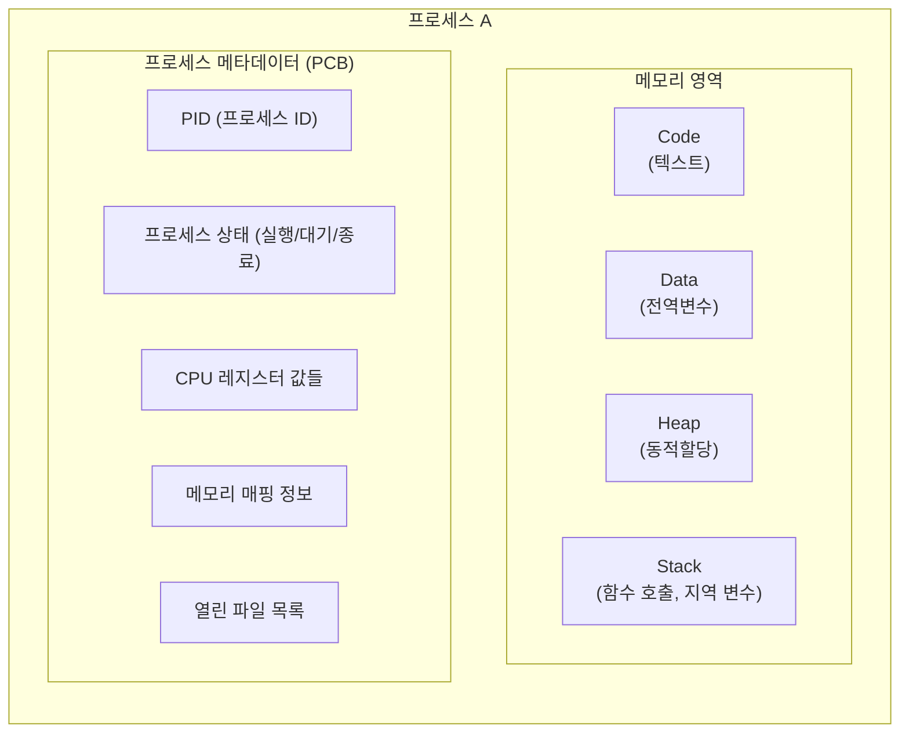
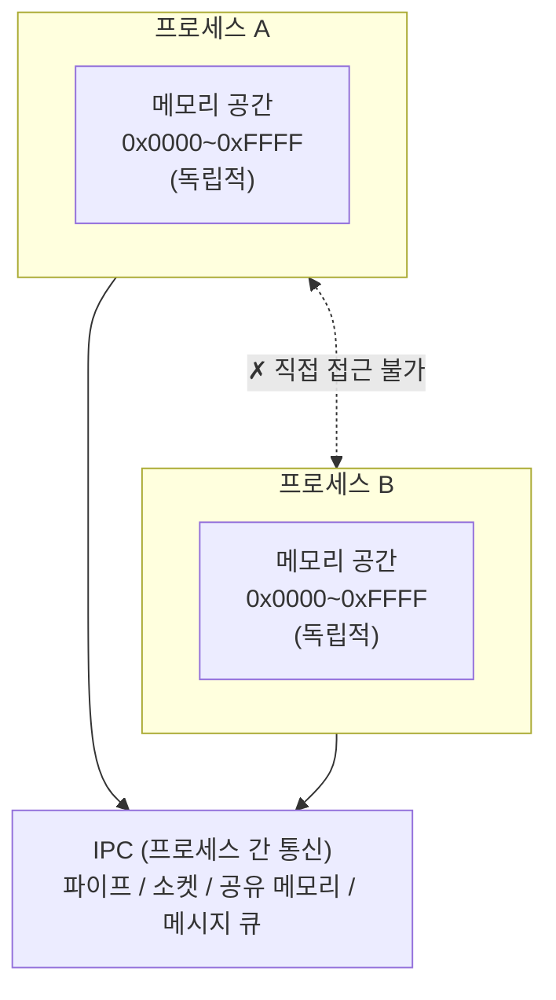
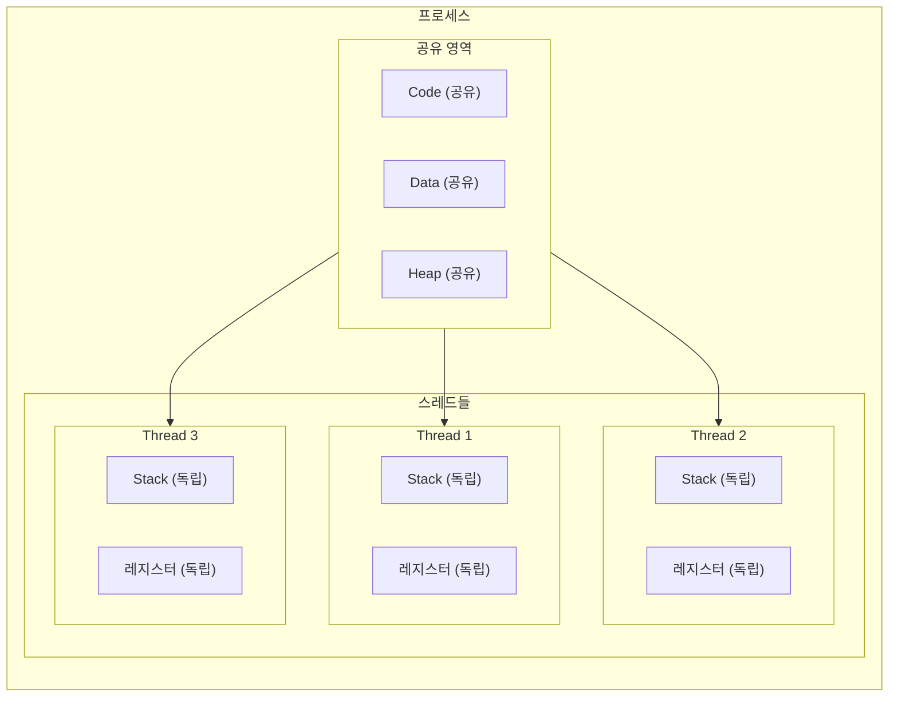
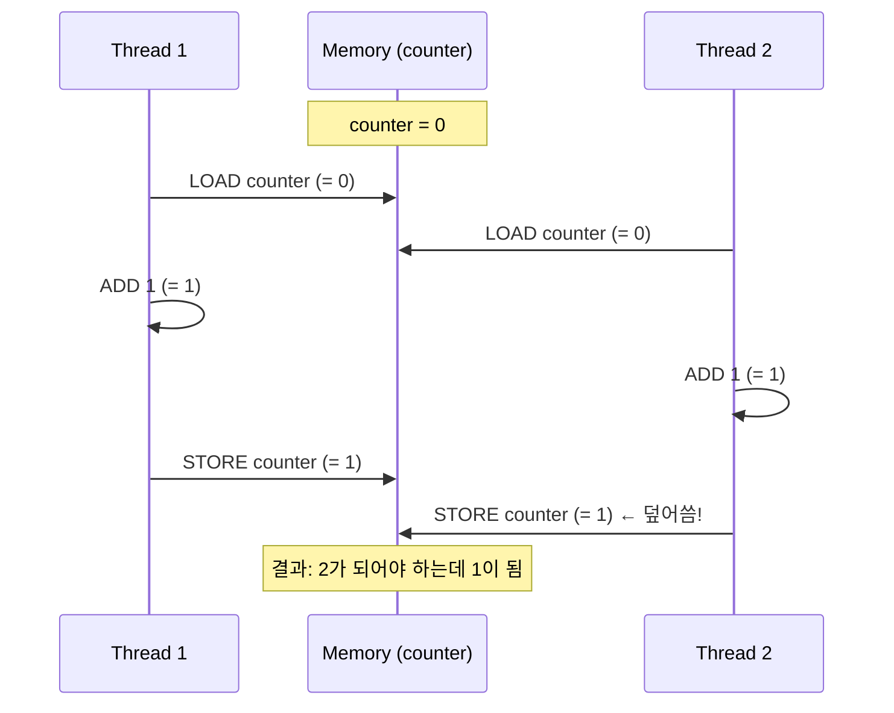
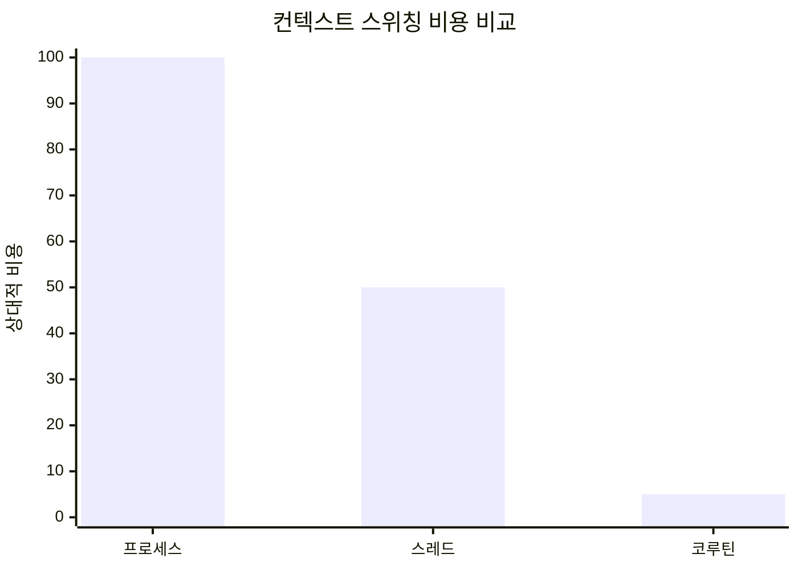

> **📚 FastAPI 시리즈 - Part 1. 기초 개념**
>
> 1. 프로세스 vs 스레드 vs 코루틴 ← 현재 글
> 2. [동시성 vs 병렬성](/posts/concurrency-vs-parallelism/)
> 3. [블로킹 vs 논블로킹 I/O](/posts/blocking-vs-nonblocking-io/)
> 4. [I/O 멀티플렉싱](/posts/io-multiplexing/)

---

# 1. 프로세스 vs 스레드 vs 코루틴

## 왜 이 세 가지를 먼저 알아야 하는가?

FastAPI를 쓰다 보면 이런 질문들이 생긴다:

- "왜 `async def`를 써야 하지?"
- "Uvicorn 워커 수는 몇 개로 설정해야 하지?"
- "CPU 연산이 많은 작업은 왜 별도 처리해야 하지?"

이 질문들에 답하려면 **실행 단위(unit of execution)**가 뭔지 정확히 알아야 한다.

---

## 프로세스 (Process)

### 정의

프로세스는 **실행 중인 프로그램**이다. OS가 관리하는 가장 기본적인 실행 단위다.

### 프로세스가 가지는 것들



### 핵심 특징: 격리(Isolation)



프로세스끼리는 **메모리를 공유하지 않는다**. 이것이 장점이자 단점이다.

- **장점**: 한 프로세스가 죽어도 다른 프로세스에 영향 없음
- **단점**: 데이터 공유하려면 IPC 필요 → 오버헤드 발생

### Python에서 프로세스 생성

```python
import multiprocessing
import os

def worker():
    print(f"자식 프로세스 PID: {os.getpid()}")
    print(f"부모 프로세스 PID: {os.getppid()}")

if __name__ == "__main__":
    print(f"메인 프로세스 PID: {os.getpid()}")

    # 새로운 프로세스 생성
    p = multiprocessing.Process(target=worker)
    p.start()
    p.join()
```

```
출력:
메인 프로세스 PID: 12345
자식 프로세스 PID: 12346
부모 프로세스 PID: 12345
```

---

## 스레드 (Thread)

### 정의

스레드는 **프로세스 내의 실행 흐름**이다. "경량 프로세스(lightweight process)"라고도 불린다.

### 프로세스와 스레드의 관계



### 스레드의 공유/독립 영역

| 구분 | 영역 |
|:---:|:---|
| **공유** | Code 영역, Data 영역, Heap 영역, 열린 파일 디스크립터 |
| **독립** | Stack, 레지스터, Program Counter, Thread ID |

- **공유하니까 좋은 점**: 데이터 교환이 쉽고 빠름
- **공유하니까 나쁜 점**: 동기화 문제 발생 (Race Condition)

### Race Condition 예시

```python
import threading

counter = 0

def increment():
    global counter
    for _ in range(100000):
        counter += 1  # 이 연산은 atomic하지 않음!

# 두 스레드가 동시에 실행
t1 = threading.Thread(target=increment)
t2 = threading.Thread(target=increment)

t1.start()
t2.start()
t1.join()
t2.join()

print(f"예상: 200000, 실제: {counter}")
```

```
출력 (매번 다름):
예상: 200000, 실제: 156432
```

왜 이런 일이 발생하는가? `counter += 1`은 실제로 3단계로 동작한다:



---

## 코루틴 (Coroutine)

### 정의

코루틴은 **실행을 일시 중단(suspend)하고 재개(resume)할 수 있는 함수**이다.

스레드와 가장 큰 차이점은 **OS가 아니라 프로그램(사용자)이 스케줄링**한다는 것이다.

### 스레드 vs 코루틴 스케줄링

```mermaid
gantt
    title 스레드 (선점형) - OS가 강제로 전환
    dateFormat X
    axisFormat %s

    section Thread 1
    실행    :0, 2
    대기    :2, 4
    실행    :4, 6

    section Thread 2
    대기    :0, 2
    실행    :2, 4
    대기    :4, 6
```

```mermaid
gantt
    title 코루틴 (협력형) - await에서만 전환
    dateFormat X
    axisFormat %s

    section Coroutine 1
    실행    :0, 3
    대기    :3, 5
    실행    :5, 8

    section Coroutine 2
    대기    :0, 3
    실행    :3, 5
    대기    :5, 8
```





### Python 코루틴 기본

```python
import asyncio

async def my_coroutine():
    print("시작")
    await asyncio.sleep(1)  # 여기서 일시 중단, 다른 코루틴 실행 가능
    print("1초 후")
    await asyncio.sleep(1)  # 또 일시 중단
    print("2초 후")
    return "완료"

# 코루틴은 호출해도 바로 실행되지 않음
coro = my_coroutine()
print(type(coro))  # <class 'coroutine'>

# 이벤트 루프에서 실행해야 함
result = asyncio.run(coro)
print(result)
```

### 코루틴이 가능한 이유: 상태 저장

```python
# 코루틴은 자신의 실행 상태를 저장함
async def stateful_coroutine():
    x = 1
    print(f"x = {x}")
    await asyncio.sleep(0.1)  # 중단되어도 x 값은 보존됨

    x += 1
    print(f"x = {x}")
    await asyncio.sleep(0.1)  # 또 중단되어도 x 값은 보존됨

    x += 1
    print(f"x = {x}")
    return x

# 출력:
# x = 1
# x = 2
# x = 3
```

---

## 세 가지 비교 정리

### 핵심 특성 비교

| 구분 | 프로세스 | 스레드 | 코루틴 |
|:---:|:---:|:---:|:---:|
| **메모리 공간** | 독립적 | 힙/데이터 공유 | 같은 스레드 내 |
| **생성 비용** | 무거움 (fork) | 가벼움 | 매우 가벼움 (함수호출 수준) |
| **컨텍스트 스위칭** | 1~10 ms (매우 느림) | 1~10 μs (느림) | 수백 ns (매우 빠름) |
| **스케줄링 주체** | OS | OS | 이벤트 루프 (사용자) |
| **병렬성 (Python)** | 가능 | GIL 제한 (I/O만 효과적) | 불가능 (동시성만 제공) |
| **적합한 작업** | CPU 바운드 (연산) | I/O 바운드 (제한적) | I/O 바운드 (최적) |

### 컨텍스트 스위칭 비용



| 단위 | 비용 | 설명 |
|:---:|:---:|:---|
| 프로세스 | 1~10 ms | 커널 모드 전환 + 메모리 매핑 변경 |
| 스레드 | 1~10 μs | 커널 모드 전환 |
| 코루틴 | 수백 ns | 사용자 모드에서 처리 |

---

## 실제 사용 예시: FastAPI에서

```python
from fastapi import FastAPI
from concurrent.futures import ProcessPoolExecutor
import asyncio
import time

app = FastAPI()

# ──────────────────────────────────────────────────────────────
# 1. 코루틴으로 처리 (I/O 바운드에 최적)
# ──────────────────────────────────────────────────────────────
@app.get("/async-io")
async def async_io():
    # DB 쿼리, 외부 API 호출 등
    await asyncio.sleep(1)  # 이 동안 다른 요청 처리 가능
    return {"type": "coroutine"}

# ──────────────────────────────────────────────────────────────
# 2. 동기 함수 (FastAPI가 스레드풀에서 실행)
# ──────────────────────────────────────────────────────────────
@app.get("/sync-io")
def sync_io():
    time.sleep(1)  # 블로킹, 하지만 별도 스레드라 이벤트 루프 안 막힘
    return {"type": "thread"}

# ──────────────────────────────────────────────────────────────
# 3. CPU 바운드는 프로세스로 분리
# ──────────────────────────────────────────────────────────────
executor = ProcessPoolExecutor(max_workers=4)

def heavy_computation(n):
    return sum(i * i for i in range(n))

@app.get("/cpu-bound")
async def cpu_bound():
    loop = asyncio.get_event_loop()
    # 별도 프로세스에서 실행 → GIL 우회
    result = await loop.run_in_executor(
        executor,
        heavy_computation,
        10_000_000
    )
    return {"type": "process", "result": result}
```

---

## 핵심 정리

### 프로세스

- 완전히 독립된 실행 환경
- 무겁지만 진정한 병렬 처리 가능
- **CPU 바운드 작업에 적합**

### 스레드

- 프로세스 내에서 메모리를 공유하는 실행 흐름
- 생성이 가볍지만 동기화 주의 필요
- **Python에서는 GIL 때문에 제한적**

### 코루틴

- 사용자가 제어하는 협력적 멀티태스킹
- 가장 가볍고, 컨텍스트 스위칭 오버헤드 최소
- **I/O 바운드 작업에 최적, FastAPI의 핵심**

---
