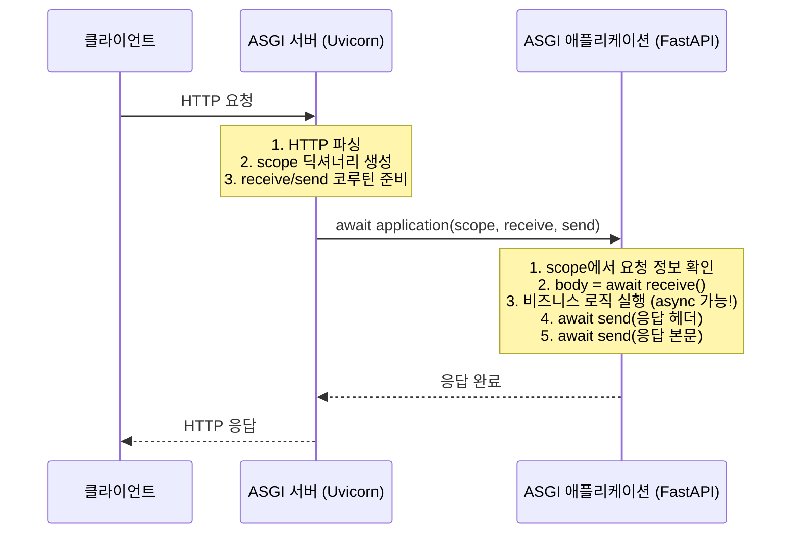
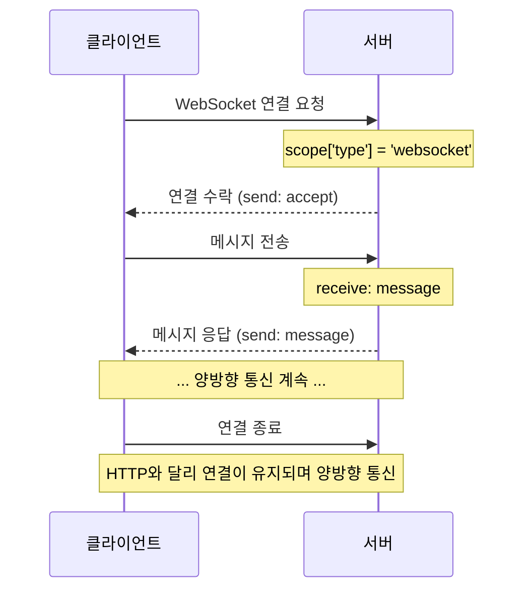
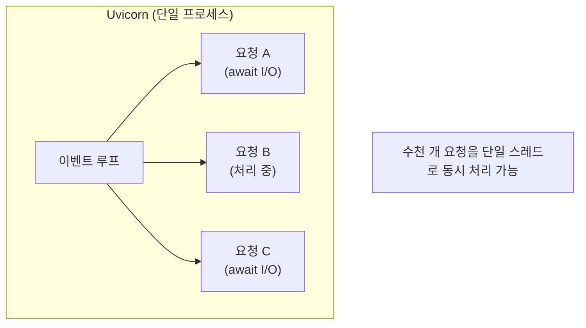

> **📚 FastAPI 시리즈 - Part 3. 웹 서버 인터페이스**
>
> 1. [WSGI 동작 원리](/posts/wsgi/)
> 2. ASGI 동작 원리 ← 현재 글
> 3. [Uvicorn 내부 구조](/posts/uvicorn-internals/)
> 4. [Gunicorn + Uvicorn 조합 상세](/posts/gunicorn-uvicorn/)

---

# 2. ASGI 동작 원리

## 왜 이 개념이 중요한가?

- FastAPI는 ASGI 기반
- WSGI의 한계(동기 전용, WebSocket 불가)를 극복
- 현대 Python 웹의 표준

---

## ASGI란?

### 한 줄 정의

**Asynchronous Server Gateway Interface - 비동기를 지원하는 웹 서버 인터페이스**

### WSGI vs ASGI

| 항목 | WSGI | ASGI |
|:---:|:---:|:---:|
| 동기/비동기 | 동기만 | **비동기 지원** |
| WebSocket | X | O |
| HTTP/2 | X | O |
| 장시간 연결 | X | O |
| async/await | X | O |

---

## ASGI 인터페이스

### 가장 간단한 ASGI 애플리케이션

```python
async def application(scope, receive, send):
    """
    scope: 연결 정보 (요청 메타데이터)
    receive: 메시지 수신 코루틴
    send: 메시지 송신 코루틴
    """
    # 응답 헤더 전송
    await send({
        'type': 'http.response.start',
        'status': 200,
        'headers': [(b'content-type', b'text/plain')],
    })

    # 응답 본문 전송
    await send({
        'type': 'http.response.body',
        'body': b'Hello, World!',
    })

```

### WSGI vs ASGI 비교

| 항목 | WSGI | ASGI |
|:---:|:---:|:---:|
| 함수 타입 | `def` | `async def` |
| 인자 | `environ`, `start_response` | `scope`, `receive`, `send` |
| 반환 | iterable | 없음 (send로 전송) |
| 통신 방식 | 단방향 | **양방향** |

---

## 핵심 구성요소

### 1. scope (연결 정보)

```python
# HTTP 요청의 scope 예시
scope = {
    'type': 'http',                    # 연결 타입
    'asgi': {'version': '3.0'},        # ASGI 버전
    'http_version': '1.1',             # HTTP 버전
    'method': 'GET',                   # HTTP 메서드
    'path': '/users',                  # 요청 경로
    'query_string': b'id=123',         # 쿼리 스트링
    'headers': [                       # HTTP 헤더
        (b'host', b'example.com'),
        (b'user-agent', b'curl/7.68.0'),
    ],
}

# WebSocket의 scope
scope = {
    'type': 'websocket',               # WebSocket!
    'path': '/ws/chat',
    'headers': [...],
}

```

### 2. receive (메시지 수신)

```python
async def application(scope, receive, send):
    # 요청 본문 수신
    message = await receive()

    # message 구조
    # {
    #     'type': 'http.request',
    #     'body': b'{"name": "kim"}',
    #     'more_body': False,
    # }

    body = message.get('body', b'')

```

### 3. send (메시지 송신)

```python
async def application(scope, receive, send):
    # 1. 응답 시작 (헤더)
    await send({
        'type': 'http.response.start',
        'status': 200,
        'headers': [(b'content-type', b'application/json')],
    })

    # 2. 응답 본문
    await send({
        'type': 'http.response.body',
        'body': b'{"status": "ok"}',
    })

```

---

## 요청 처리 흐름

### HTTP 요청



### WebSocket 연결



---

## 메시지 타입 정리

### HTTP

| 메시지 타입 | 방향 | 설명 |
|:---:|:---:|:---:|
| `http.request` | receive | 요청 본문 |
| `http.disconnect` | receive | 클라이언트 연결 끊김 |
| `http.response.start` | send | 응답 시작 (상태, 헤더) |
| `http.response.body` | send | 응답 본문 |

### WebSocket

| 메시지 타입 | 방향 | 설명 |
|:---:|:---:|:---:|
| `websocket.connect` | receive | 연결 요청 |
| `websocket.receive` | receive | 메시지 수신 |
| `websocket.disconnect` | receive | 연결 종료 |
| `websocket.accept` | send | 연결 수락 |
| `websocket.send` | send | 메시지 송신 |
| `websocket.close` | send | 연결 종료 |

---

## 실제 예제

### HTTP 에코 서버

```python
async def app(scope, receive, send):
    if scope['type'] != 'http':
        return

    # 요청 본문 읽기
    body = b''
    while True:
        message = await receive()
        body += message.get('body', b'')
        if not message.get('more_body'):
            break

    # 에코 응답
    await send({
        'type': 'http.response.start',
        'status': 200,
        'headers': [(b'content-type', b'text/plain')],
    })
    await send({
        'type': 'http.response.body',
        'body': body,  # 받은 그대로 반환
    })

```

### WebSocket 채팅

```python
async def app(scope, receive, send):
    if scope['type'] != 'websocket':
        return

    # 연결 수락
    await send({'type': 'websocket.accept'})

    while True:
        message = await receive()

        if message['type'] == 'websocket.disconnect':
            break

        if message['type'] == 'websocket.receive':
            text = message.get('text', '')
            # 에코
            await send({
                'type': 'websocket.send',
                'text': f'Echo: {text}',
            })

```

---

## ASGI의 동시성 모델

### 이벤트 루프 기반



### WSGI vs ASGI 동시성 비교

| 항목 | WSGI (Gunicorn) | ASGI (Uvicorn) |
|:---:|:---:|:---:|
| 방식 | 멀티 프로세스/스레드 | 이벤트 루프 |
| 1000 동시 연결 | 워커 1000개 필요 | 단일 프로세스 가능 |
| 메모리 | 높음 | 낮음 |
| WebSocket | 불가 | 가능 |

---

## ASGI 서버들

| 서버 | 특징 |
|:---:|:---:|
| **Uvicorn** | 가장 널리 사용, uvloop 지원 |
| **Daphne** | Django Channels용, 최초의 ASGI 서버 |
| **Hypercorn** | HTTP/2, HTTP/3 지원 |
| **Granian** | Rust 기반, 고성능 |

### Uvicorn 실행

```bash
# 기본 실행
uvicorn app:application

# 옵션
uvicorn app:application --host 0.0.0.0 --port 8000 --workers 4

```

---

## FastAPI와 ASGI

### FastAPI는 ASGI 앱

```python
from fastapi import FastAPI

app = FastAPI()

@app.get("/")
async def root():
    return {"message": "Hello"}

# app은 ASGI 애플리케이션!
# 내부적으로 async def __call__(self, scope, receive, send) 구현

```

### FastAPI 내부 (단순화)

```python
class FastAPI:
    async def __call__(self, scope, receive, send):
        """FastAPI는 ASGI callable"""
        if scope['type'] == 'http':
            # HTTP 요청 처리
            request = Request(scope, receive)
            response = await self.handle_request(request)
            await response(scope, receive, send)

        elif scope['type'] == 'websocket':
            # WebSocket 처리
            await self.handle_websocket(scope, receive, send)

```

---

## ASGI 미들웨어

### 구조

```python
class SomeMiddleware:
    def __init__(self, app):
        self.app = app

    async def __call__(self, scope, receive, send):
        # 요청 전처리
        print(f"Request: {scope['path']}")

        # 다음 앱 호출
        await self.app(scope, receive, send)

        # 응답 후처리
        print("Response sent")

# 적용
app = SomeMiddleware(original_app)

```

### FastAPI에서 미들웨어

```python
from fastapi import FastAPI
from starlette.middleware.base import BaseHTTPMiddleware

app = FastAPI()

class LoggingMiddleware(BaseHTTPMiddleware):
    async def dispatch(self, request, call_next):
        print(f"Request: {request.url}")
        response = await call_next(request)
        print(f"Response: {response.status_code}")
        return response

app.add_middleware(LoggingMiddleware)

```

---

## Lifespan (수명주기)

### 앱 시작/종료 이벤트

```python
async def app(scope, receive, send):
    if scope['type'] == 'lifespan':
        while True:
            message = await receive()

            if message['type'] == 'lifespan.startup':
                # 앱 시작 시 실행 (DB 연결 등)
                print("Starting up...")
                await send({'type': 'lifespan.startup.complete'})

            elif message['type'] == 'lifespan.shutdown':
                # 앱 종료 시 실행 (리소스 정리)
                print("Shutting down...")
                await send({'type': 'lifespan.shutdown.complete'})
                return

    elif scope['type'] == 'http':
        # HTTP 처리
        ...

```

### FastAPI에서

```python
from fastapi import FastAPI
from contextlib import asynccontextmanager

@asynccontextmanager
async def lifespan(app):
    # 시작 시
    print("Starting up...")
    yield
    # 종료 시
    print("Shutting down...")

app = FastAPI(lifespan=lifespan)

```

---

## 핵심 정리

| 개념 | 설명 |
|:---:|:---:|
| **ASGI** | 비동기 지원 웹 서버 인터페이스 |
| **인터페이스** | `async def app(scope, receive, send)` |
| **scope** | 연결 정보 (타입, 경로, 헤더 등) |
| **receive** | 메시지 수신 코루틴 |
| **send** | 메시지 송신 코루틴 |
| **지원 프로토콜** | HTTP, WebSocket, Lifespan |

### WSGI → ASGI 진화

```
WSGI: 동기, 단방향, HTTP만
  ↓
ASGI: 비동기, 양방향, HTTP + WebSocket + 더 많은 것

```

---