> **📚 FastAPI 시리즈 - Part 1. 기초 개념**
>
> 1. [프로세스 vs 스레드 vs 코루틴](/posts/process-thread-coroutine/)
> 2. [동시성 vs 병렬성](/posts/concurrency-vs-parallelism/)
> 3. 블로킹 vs 논블로킹 I/O ← 현재 글
> 4. [I/O 멀티플렉싱](/posts/io-multiplexing/)

---

# 3. 블로킹(Blocking) vs 논블로킹(Non-blocking) I/O

## 왜 이 개념이 중요한가?

앞서 배운 내용:

- 동시성은 I/O 바운드 작업에 효과적이다
- I/O 대기 시간에 다른 작업을 처리할 수 있다

**근본적인 질문:** 왜 I/O 대기 시간에 다른 작업이 가능한 걸까?

이 질문에 답하려면 **블로킹/논블로킹**을 이해해야 한다.

---

## 핵심 정의

| 구분 | 정의 | 호출 후 동작 |
|:---:|:---|:---|
| **블로킹 (Blocking)** | 작업이 완료될 때까지 호출자가 멈춤 | 기다림 (다른 일 못함) |
| **논블로킹 (Non-blocking)** | 작업 완료 여부와 관계없이 즉시 반환 | 바로 다음 코드 실행 |

---

## 비유로 이해하기: 식당 주문

### 블로킹 방식

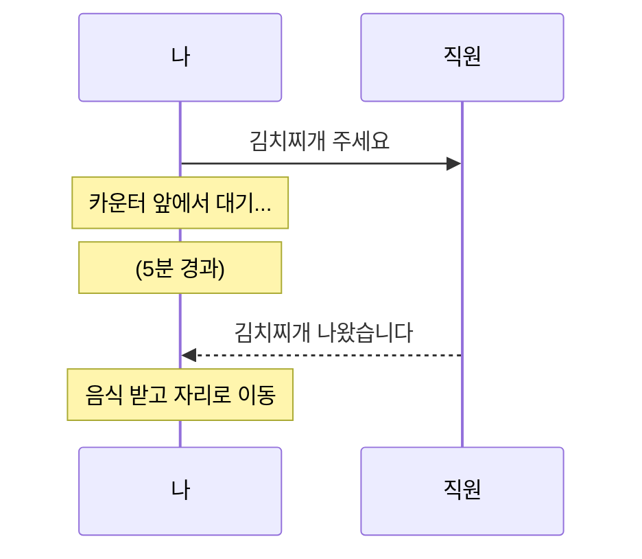

- 음식 나올 때까지 **아무것도 못함**
- 카운터 앞에 **붙잡혀 있음**

### 논블로킹 방식

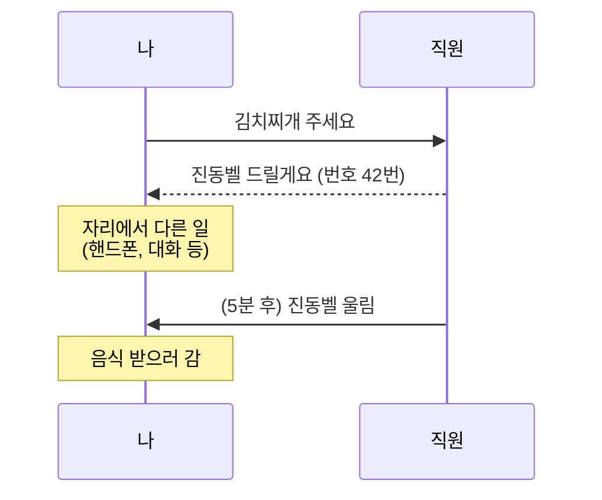

- 주문 후 **즉시 반환** (진동벨 받음)
- 기다리는 동안 **다른 일 가능**

---

## 코드로 보는 차이

### 블로킹 I/O

```python
import socket

# 블로킹 소켓 (기본값)
sock = socket.socket()
sock.connect(('example.com', 80))

sock.send(b'GET / HTTP/1.1\r\nHost: example.com\r\n\r\n')

# ★ 여기서 멈춤 - 데이터 올 때까지 대기 ★
data = sock.recv(1024)  # 블로킹!

print(data)  # 데이터 받은 후에야 실행됨

```

```mermaid
gantt
    title 블로킹 I/O - 시간 흐름
    dateFormat X
    axisFormat %s
    section 흐름
    send() :0, 1
    recv() 대기 (블로킹) :1, 5
    데이터 수신 :5, 6
    print() :6, 7
```

### 논블로킹 I/O

```python
import socket

# 논블로킹 소켓
sock = socket.socket()
sock.setblocking(False)  # ★ 논블로킹 모드 설정 ★
sock.connect(('example.com', 80))

sock.send(b'GET / HTTP/1.1\r\nHost: example.com\r\n\r\n')

# ★ 즉시 반환 - 데이터 없으면 예외 발생 ★
try:
    data = sock.recv(1024)  # 논블로킹!
    print(data)
except BlockingIOError:
    print("아직 데이터 없음, 나중에 다시 확인")
    # 다른 작업 수행 가능!

```

```mermaid
gantt
    title 논블로킹 I/O - 시간 흐름
    dateFormat X
    axisFormat %s
    section 흐름
    send() :0, 1
    recv() 즉시 반환 :1, 2
    다른 작업 수행 :2, 4
    다시 확인 :4, 5
    데이터 수신 :5, 6
```

---

## 블로킹 I/O의 문제점

### 단일 스레드에서 여러 클라이언트 처리

```python
# 블로킹 방식의 서버 (문제 있음)
import socket

server = socket.socket()
server.bind(('0.0.0.0', 8000))
server.listen()

while True:
    client, addr = server.accept()  # 블로킹: 연결 올 때까지 대기

    data = client.recv(1024)  # 블로킹: 데이터 올 때까지 대기

    # ★ 문제: 이 클라이언트 처리하는 동안 다른 클라이언트 못 받음 ★
    response = process(data)

    client.send(response)  # 블로킹: 전송 완료까지 대기
    client.close()

```

```mermaid
gantt
    title 블로킹 서버 - 동시 처리 불가
    dateFormat X
    axisFormat %s
    section Client A
    연결+수신+처리+응답 :0, 4
    section Client B
    대기 :0, 4
    연결+수신+처리+응답 :4, 8
    section Client C
    대기 :0, 8
    연결+수신+처리+응답 :8, 12
```

→ 동시 처리 불가능!

### 해결책 비교

| 해결책 | 방식 | 장점 | 단점 |
|:---:|:---|:---|:---|
| 멀티 프로세스 | 클라이언트마다 새 프로세스 | 간단함 | 메모리 많이 사용 |
| 멀티 스레드 | 클라이언트마다 새 스레드 | 프로세스보다 가벼움 | 여전히 자원 소모, GIL |
| **논블로킹 + 이벤트 루프** | 단일 스레드에서 여러 연결 관리 | 매우 효율적 | 코드 복잡도 증가 |

---

## 논블로킹 I/O의 동작 방식

### 직접 구현 (Busy Waiting) - 비효율적

```python
import socket

sock = socket.socket()
sock.setblocking(False)
# ... 연결 ...

# 나쁜 예: 계속 확인 (CPU 낭비)
while True:
    try:
        data = sock.recv(1024)
        if data:
            break
    except BlockingIOError:
        pass  # 계속 루프 돌며 확인 → CPU 100% 사용!

```

| 문제점 | 설명 |
|:---:|:---|
| CPU 낭비 | 데이터 없어도 계속 확인 |
| 전력 소모 | 의미 없는 루프 반복 |
| 비효율 | 확인하는 것 자체가 오버헤드 |

### 해결책: I/O 멀티플렉싱

```python
import socket
import select

sock1 = socket.socket()
sock2 = socket.socket()
# ... 연결 설정 ...

sockets = [sock1, sock2]

# ★ OS에게 "이 중에 준비된 거 있으면 알려줘" 요청 ★
readable, _, _ = select.select(sockets, [], [])

# 준비된 소켓만 처리
for sock in readable:
    data = sock.recv(1024)  # 여기선 바로 읽힘 (준비됐으니까)

```

---

## I/O 멀티플렉싱 (4번 주제 미리보기)

### 핵심 아이디어

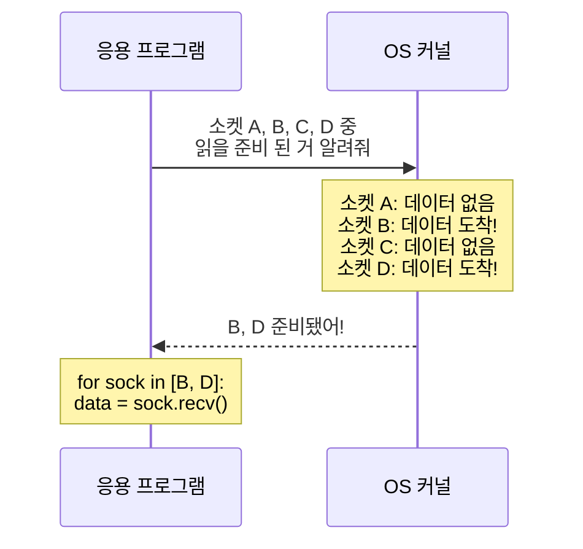

### OS별 I/O 멀티플렉싱 API

| OS | API | 특징 |
|:---:|:---:|:---|
| 공통 | `select` | 오래됨, 소켓 수 제한 (보통 1024) |
| Linux | `epoll` | 효율적, 대규모 연결 처리 |
| macOS/BSD | `kqueue` | 효율적, 다양한 이벤트 지원 |
| Windows | `IOCP` | 비동기 I/O 완료 포트 |

---

## 동기/비동기 vs 블로킹/논블로킹

### 자주 혼동되는 개념

| 구분 | 관점 | 질문 |
|:---:|:---|:---|
| **동기/비동기** | 작업 완료 통보 방식 | "완료되면 누가 알려주나?" |
| **블로킹/논블로킹** | 호출 시 제어권 | "호출 후 바로 반환되나?" |

### 4가지 조합

| 조합 | 설명 | 예시 |
|:---:|:---|:---|
| **동기 + 블로킹** | 완료까지 대기, 직접 결과 확인 | 일반적인 `read()` |
| **동기 + 논블로킹** | 즉시 반환, 직접 반복 확인 | 논블로킹 소켓 + 폴링 |
| **비동기 + 논블로킹** | 즉시 반환, 완료 시 콜백/알림 | `asyncio`, Node.js |
| 비동기 + 블로킹 | (일반적으로 의미 없음) | - |

### 시각적 비교

```mermaid
gantt
    title 동기 + 블로킹
    dateFormat X
    axisFormat %s
    section 흐름
    호출 :0, 1
    대기 (블로킹) :1, 5
    완료 :5, 6
```

```mermaid
gantt
    title 동기 + 논블로킹
    dateFormat X
    axisFormat %s
    section 흐름
    호출 :0, 1
    반환(미완료) :1, 2
    직접 확인 :2, 3
    반환(미완료) :3, 4
    직접 확인 :4, 5
    완료 :5, 6
```

```mermaid
gantt
    title 비동기 + 논블로킹
    dateFormat X
    axisFormat %s
    section 흐름
    호출+즉시반환 :0, 1
    다른 작업 수행 :1, 4
    콜백으로 알림 :4, 5
    결과 처리 :5, 6
```

---

## Python에서의 적용

### 블로킹 I/O (기본)

```python
import requests

# 블로킹: 응답 올 때까지 여기서 멈춤
response = requests.get('https://api.example.com/data')
print(response.json())  # 응답 받은 후 실행

```

### 논블로킹 I/O (asyncio)

```python
import asyncio
import aiohttp

async def fetch():
    async with aiohttp.ClientSession() as session:
        # 논블로킹: await에서 다른 코루틴에게 양보
        response = await session.get('https://api.example.com/data')
        return await response.json()

async def main():
    # 여러 요청을 동시에 (논블로킹이라 가능)
    results = await asyncio.gather(
        fetch(),
        fetch(),
        fetch(),
    )
    print(results)

asyncio.run(main())

```

---

## asyncio가 논블로킹을 활용하는 방법

```mermaid
sequenceDiagram
    participant Loop as 이벤트 루프
    participant A as 코루틴 A
    participant B as 코루틴 B
    participant OS as OS 커널

    Loop->>A: 1. 코루틴 A 실행
    A->>OS: 2. await session.get()<br/>(논블로킹 소켓 사용)
    OS-->>A: 즉시 반환
    Note over A: 일시 중단
    Loop->>B: 3. 코루틴 B 실행
    B->>OS: await 만남
    OS-->>B: 즉시 반환
    Note over B: 일시 중단
    OS->>Loop: 4. A의 I/O 완료!
    Loop->>A: 5. 코루틴 A 재개
    Note over A: 결과 처리
```

---

## 실제 성능 비교

```python
import time
import requests
import asyncio
import aiohttp

URLS = ['https://httpbin.org/delay/1'] * 5  # 각 1초 걸리는 요청

# ─────────────────────────────────────────────────────────────────
# 블로킹 방식
# ─────────────────────────────────────────────────────────────────
def blocking_requests():
    start = time.time()
    for url in URLS:
        requests.get(url)  # 블로킹: 하나씩 순차 처리
    print(f"블로킹: {time.time() - start:.1f}초")  # ~5초

# ─────────────────────────────────────────────────────────────────
# 논블로킹 방식 (asyncio)
# ─────────────────────────────────────────────────────────────────
async def nonblocking_requests():
    start = time.time()
    async with aiohttp.ClientSession() as session:
        tasks = [session.get(url) for url in URLS]
        await asyncio.gather(*tasks)  # 논블로킹: 동시 처리
    print(f"논블로킹: {time.time() - start:.1f}초")  # ~1초

blocking_requests()
asyncio.run(nonblocking_requests())

```

### 결과 비교

| 방식 | 소요 시간 | 이유 |
|:---:|:---:|:---|
| 블로킹 | ~5초 | 1초 × 5개 순차 실행 |
| 논블로킹 | ~1초 | 5개 동시 대기 (I/O 시간 겹침) |

### 시각화

```mermaid
gantt
    title 블로킹 방식 - 총 5초
    dateFormat X
    axisFormat %s
    section 요청
    요청1 :0, 1
    요청2 :1, 2
    요청3 :2, 3
    요청4 :3, 4
    요청5 :4, 5
```

```mermaid
gantt
    title 논블로킹 방식 - 총 1초
    dateFormat X
    axisFormat %s
    section 요청1
    요청1 :0, 1
    section 요청2
    요청2 :0, 1
    section 요청3
    요청3 :0, 1
    section 요청4
    요청4 :0, 1
    section 요청5
    요청5 :0, 1
```

---

## FastAPI에서의 적용

### 블로킹 함수 사용 시 주의

```python
from fastapi import FastAPI
import requests  # 블로킹 라이브러리
import httpx     # 비동기 지원 라이브러리

app = FastAPI()

# ❌ 나쁜 예: async 함수 내에서 블로킹 호출
@app.get("/bad")
async def bad_endpoint():
    # requests.get()은 블로킹 → 이벤트 루프 전체가 멈춤!
    response = requests.get("https://api.example.com/data")
    return response.json()

# ✅ 좋은 예 1: 비동기 라이브러리 사용
@app.get("/good1")
async def good_endpoint_1():
    async with httpx.AsyncClient() as client:
        response = await client.get("https://api.example.com/data")
        return response.json()

# ✅ 좋은 예 2: 동기 함수로 정의 (FastAPI가 스레드풀에서 실행)
@app.get("/good2")
def good_endpoint_2():  # async 없음!
    response = requests.get("https://api.example.com/data")
    return response.json()

```

### 왜 이렇게 동작하는가?

| 정의 방식 | 실행 위치 | 블로킹 I/O 영향 |
|:---:|:---|:---|
| `async def` | 이벤트 루프 (메인 스레드) | 전체 서버 블로킹! |
| `def` | 스레드 풀 (별도 스레드) | 해당 스레드만 블로킹 |

---

## 핵심 정리

| 개념 | 설명 |
|:---:|:---|
| **블로킹 I/O** | 작업 완료까지 호출자가 대기. 간단하지만 비효율적. |
| **논블로킹 I/O** | 즉시 반환. 완료 여부는 나중에 확인. 효율적이지만 복잡. |
| **I/O 멀티플렉싱** | OS가 여러 I/O를 감시하고 준비된 것만 알려줌. |
| **asyncio** | 논블로킹 I/O + 이벤트 루프로 효율적인 동시성 제공. |