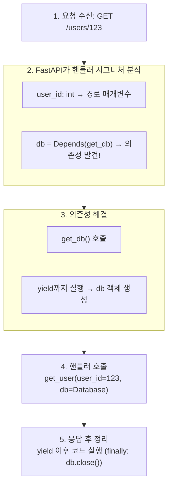
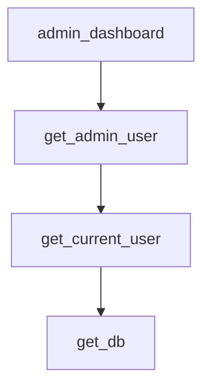
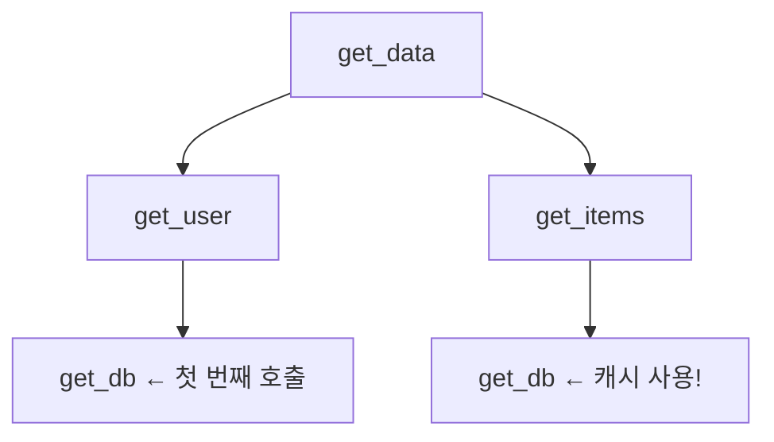

> **📚 FastAPI 시리즈 - Part 4. FastAPI 핵심 구성요소**
>
> 1. [Starlette 프레임워크](/posts/starlette/)
> 2. [Pydantic 데이터 검증](/posts/pydantic/)
> 3. [타입 힌트와 런타임 검증](/posts/type-hints-runtime/)
> 4. 의존성 주입 (Dependency Injection) ← 현재 글
> 5. [미들웨어 동작 방식](/posts/middleware/)

---

# 4. 의존성 주입 (Dependency Injection)

## 왜 이 개념이 중요한가?

- FastAPI의 핵심 기능 중 하나
- 코드 재사용, 테스트 용이성, 관심사 분리
- 인증, DB 세션, 설정 등 공통 로직 처리

---

## 의존성 주입이란?

### 한 줄 정의

**필요한 객체(의존성)를 외부에서 주입받는 패턴**

### 의존성 주입 없이 (Bad)

```python
class UserService:
    def __init__(self):
        self.db = Database()  # 직접 생성 → 강한 결합

    def get_user(self, user_id: int):
        return self.db.query(f"SELECT * FROM users WHERE id = {user_id}")

```

### 의존성 주입 사용 (Good)

```python
class UserService:
    def __init__(self, db: Database):  # 외부에서 주입받음
        self.db = db

    def get_user(self, user_id: int):
        return self.db.query(f"SELECT * FROM users WHERE id = {user_id}")

# 사용 시
db = Database()
service = UserService(db)  # 의존성 주입

```

### 장점

| 장점 | 설명 |
|:---:|:---:|
| 테스트 용이 | Mock 객체 주입 가능 |
| 느슨한 결합 | 구현체 교체 쉬움 |
| 코드 재사용 | 공통 로직 분리 |
| 관심사 분리 | 각 컴포넌트가 자기 역할만 |

---

## FastAPI의 Depends

### 기본 사용법

```python
from fastapi import FastAPI, Depends

app = FastAPI()

# 의존성 함수
def get_db():
    db = Database()
    try:
        yield db
    finally:
        db.close()

# 의존성 주입
@app.get("/users/{user_id}")
async def get_user(user_id: int, db = Depends(get_db)):
    return db.query(user_id)

```

### 동작 흐름



---

## 의존성 함수 유형

### 1. 일반 함수 (return)

```python
def get_settings():
    return Settings()

@app.get("/info")
async def info(settings = Depends(get_settings)):
    return {"app_name": settings.app_name}

```

### 2. 제너레이터 함수 (yield) - 리소스 정리 필요 시

```python
def get_db():
    db = SessionLocal()
    try:
        yield db       # 여기서 db 반환
    finally:
        db.close()     # 요청 끝나면 실행

@app.get("/users")
async def get_users(db = Depends(get_db)):
    return db.query(User).all()

```

### 3. 비동기 함수

```python
async def get_async_db():
    db = await AsyncDatabase.connect()
    try:
        yield db
    finally:
        await db.disconnect()

@app.get("/users")
async def get_users(db = Depends(get_async_db)):
    return await db.fetch_all("SELECT * FROM users")

```

### 4. 클래스

```python
class Pagination:
    def __init__(self, page: int = 1, size: int = 10):
        self.page = page
        self.size = size
        self.offset = (page - 1) * size

@app.get("/items")
async def get_items(pagination: Pagination = Depends()):
    # Depends()만 써도 클래스가 의존성으로 동작
    return {
        "page": pagination.page,
        "size": pagination.size,
        "offset": pagination.offset
    }

```

---

## 의존성 체인

### 의존성이 다른 의존성에 의존

```python
from fastapi import Depends, HTTPException

# 1단계: DB 세션
def get_db():
    db = SessionLocal()
    try:
        yield db
    finally:
        db.close()

# 2단계: 현재 사용자 (DB 의존)
def get_current_user(db = Depends(get_db), token: str = Header()):
    user = db.query(User).filter(User.token == token).first()
    if not user:
        raise HTTPException(status_code=401)
    return user

# 3단계: 관리자 확인 (현재 사용자 의존)
def get_admin_user(user = Depends(get_current_user)):
    if not user.is_admin:
        raise HTTPException(status_code=403)
    return user

# 사용
@app.get("/admin/dashboard")
async def admin_dashboard(admin = Depends(get_admin_user)):
    return {"message": f"Welcome, {admin.name}"}

```

### 의존성 체인 시각화



- **실행 순서**: get_db → get_current_user → get_admin_user → 핸들러
- **정리 순서**: 핸들러 → get_admin_user → get_current_user → get_db

---

## 실전 패턴

### 1. 인증/인가

```python
from fastapi import Depends, HTTPException, Header
from fastapi.security import HTTPBearer, HTTPAuthorizationCredentials

security = HTTPBearer()

async def get_current_user(
    credentials: HTTPAuthorizationCredentials = Depends(security)
):
    token = credentials.credentials
    user = decode_token(token)  # JWT 디코딩
    if not user:
        raise HTTPException(status_code=401, detail="Invalid token")
    return user

async def require_admin(user = Depends(get_current_user)):
    if user.role != "admin":
        raise HTTPException(status_code=403, detail="Admin required")
    return user

# 일반 사용자용
@app.get("/profile")
async def profile(user = Depends(get_current_user)):
    return user

# 관리자 전용
@app.delete("/users/{user_id}")
async def delete_user(user_id: int, admin = Depends(require_admin)):
    return {"deleted": user_id}

```

### 2. 데이터베이스 세션

```python
from sqlalchemy.orm import Session

def get_db():
    db = SessionLocal()
    try:
        yield db
    finally:
        db.close()

@app.post("/users")
async def create_user(user: UserCreate, db: Session = Depends(get_db)):
    db_user = User(**user.dict())
    db.add(db_user)
    db.commit()
    db.refresh(db_user)
    return db_user

```

### 3. 페이지네이션

```python
from fastapi import Query

def pagination(
    page: int = Query(1, ge=1),
    size: int = Query(10, ge=1, le=100)
):
    return {"skip": (page - 1) * size, "limit": size}

@app.get("/items")
async def list_items(
    db = Depends(get_db),
    paging = Depends(pagination)
):
    items = db.query(Item).offset(paging["skip"]).limit(paging["limit"]).all()
    return items

```

### 4. 설정 주입

```python
from functools import lru_cache
from pydantic_settings import BaseSettings

class Settings(BaseSettings):
    database_url: str
    api_key: str
    debug: bool = False

@lru_cache  # 싱글톤처럼 동작
def get_settings():
    return Settings()

@app.get("/info")
async def info(settings: Settings = Depends(get_settings)):
    return {"debug": settings.debug}

```

---

## 의존성 캐싱

### 같은 요청 내 캐싱 (기본 동작)

```python
call_count = 0

def get_db():
    global call_count
    call_count += 1
    print(f"get_db called: {call_count}")
    return "db_connection"

def get_user(db = Depends(get_db)):
    return {"user": "kim", "db": db}

def get_items(db = Depends(get_db)):
    return {"items": [], "db": db}

@app.get("/data")
async def get_data(
    user = Depends(get_user),
    items = Depends(get_items)
):
    return {"user": user, "items": items}

```



> **GET /data 요청 시**: get_db는 1번만 호출됨 (캐싱)

### 캐싱 비활성화

```python
@app.get("/data")
async def get_data(
    user = Depends(get_user),
    items = Depends(get_items, use_cache=False)  # 캐시 사용 안 함
):
    return {"user": user, "items": items}

```

---

## 글로벌 의존성

### 라우터 레벨

```python
from fastapi import APIRouter, Depends

router = APIRouter(
    prefix="/admin",
    dependencies=[Depends(require_admin)]  # 모든 라우트에 적용
)

@router.get("/users")
async def list_users():  # require_admin이 자동 적용
    return []

@router.delete("/users/{user_id}")
async def delete_user(user_id: int):  # require_admin이 자동 적용
    return {"deleted": user_id}

```

### 앱 레벨

```python
app = FastAPI(
    dependencies=[Depends(verify_api_key)]  # 모든 라우트에 적용
)

```

---

## 의존성에서 예외 처리

### HTTPException 발생

```python
from fastapi import Depends, HTTPException

async def get_current_user(token: str = Header()):
    if not token:
        raise HTTPException(
            status_code=401,
            detail="Token required",
            headers={"WWW-Authenticate": "Bearer"}
        )

    user = decode_token(token)
    if not user:
        raise HTTPException(status_code=401, detail="Invalid token")

    return user

```

### yield 사용 시 예외 처리

```python
def get_db():
    db = SessionLocal()
    try:
        yield db
    except Exception:
        db.rollback()  # 예외 발생 시 롤백
        raise
    finally:
        db.close()     # 항상 실행

```

---

## 테스트에서 의존성 오버라이드

### 기본 사용

```python
from fastapi.testclient import TestClient

app = FastAPI()

def get_db():
    return RealDatabase()

@app.get("/users")
async def get_users(db = Depends(get_db)):
    return db.get_all_users()

# 테스트
def test_get_users():
    # Mock 의존성
    def override_get_db():
        return MockDatabase()

    # 오버라이드 설정
    app.dependency_overrides[get_db] = override_get_db

    client = TestClient(app)
    response = client.get("/users")
    assert response.status_code == 200

    # 정리
    app.dependency_overrides.clear()

```

### pytest fixture 활용

```python
import pytest
from fastapi.testclient import TestClient

@pytest.fixture
def client():
    def override_get_db():
        return MockDatabase()

    app.dependency_overrides[get_db] = override_get_db

    with TestClient(app) as c:
        yield c

    app.dependency_overrides.clear()

def test_get_users(client):
    response = client.get("/users")
    assert response.status_code == 200

```

---

## Annotated 스타일 (권장)

### 기존 스타일

```python
@app.get("/items")
async def get_items(
    db = Depends(get_db),
    user = Depends(get_current_user)
):
    return []

```

### Annotated 스타일 (Python 3.9+)

```python
from typing import Annotated

DB = Annotated[Session, Depends(get_db)]
CurrentUser = Annotated[User, Depends(get_current_user)]

@app.get("/items")
async def get_items(db: DB, user: CurrentUser):
    return []

```

### 장점

```python
# 재사용 가능한 타입 정의
DB = Annotated[Session, Depends(get_db)]
CurrentUser = Annotated[User, Depends(get_current_user)]
AdminUser = Annotated[User, Depends(require_admin)]

# 여러 엔드포인트에서 깔끔하게 사용
@app.get("/users")
async def list_users(db: DB, user: CurrentUser): ...

@app.post("/users")
async def create_user(db: DB, admin: AdminUser): ...

@app.delete("/users/{id}")
async def delete_user(db: DB, admin: AdminUser): ...

```

---

## 핵심 정리

| 개념 | 설명 |
|:---:|:---:|
| **Depends** | 의존성 주입 선언 |
| **yield** | 리소스 정리가 필요할 때 |
| **의존성 체인** | 의존성이 다른 의존성에 의존 |
| **캐싱** | 같은 요청 내 같은 의존성은 1번만 호출 |
| **글로벌 의존성** | 라우터/앱 전체에 적용 |
| **오버라이드** | 테스트 시 Mock 주입 |
| **Annotated** | 타입 힌트와 의존성 결합 (권장) |

### 의존성 주입 사용 시점

| 상황 | 예시 |
|:---:|:---:|
| 인증/인가 | get_current_user, require_admin |
| DB 세션 | get_db |
| 설정 | get_settings |
| 공통 파라미터 | pagination, filtering |
| 외부 서비스 | get_http_client, get_cache |