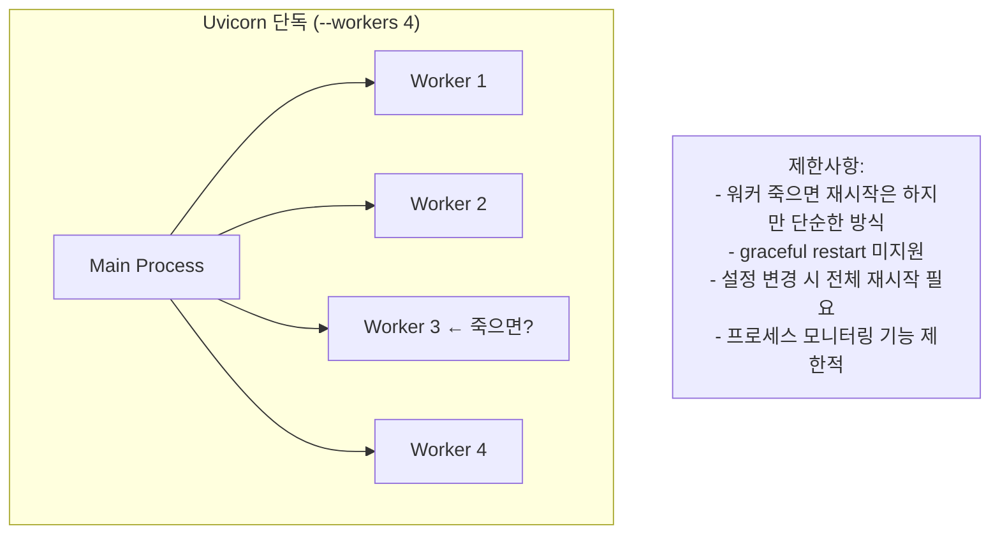
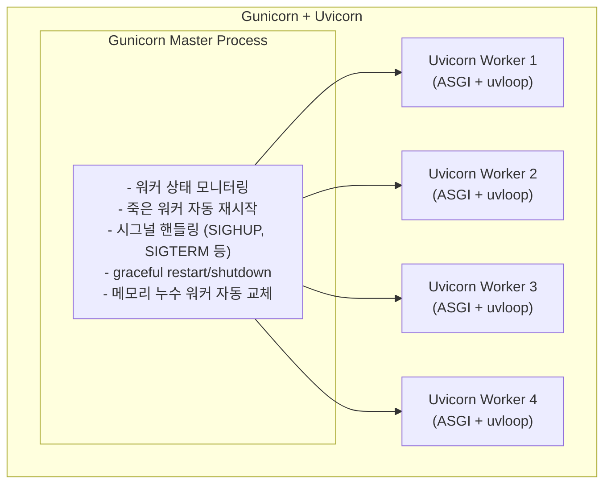

> **📚 FastAPI 시리즈 - Part 3. 웹 서버 인터페이스**
>
> 1. [WSGI 동작 원리](/posts/wsgi/)
> 2. [ASGI 동작 원리](/posts/asgi/)
> 3. [Uvicorn 내부 구조](/posts/uvicorn-internals/)
> 4. Gunicorn + Uvicorn 조합 상세 ← 현재 글

---

# 4. Gunicorn + Uvicorn 조합 상세

## Uvicorn 단독 vs Gunicorn + Uvicorn

### Uvicorn 단독의 한계



### Gunicorn + Uvicorn 조합



---

## Gunicorn이 제공하는 기능

### 1. Graceful Restart (무중단 재시작)

```bash
# 설정 변경 후 재시작
kill -HUP <gunicorn_master_pid>

```

**Graceful Restart 동작 순서:**

1. SIGHUP 시그널 수신
2. 새 워커 생성 (새 코드 로드)
3. 기존 워커는 현재 요청 처리 완료 후 종료
4. 클라이언트는 끊김 없이 계속 서비스 받음

```mermaid
gantt
    title Graceful Restart 타임라인
    dateFormat X
    axisFormat %s

    section 기존 워커
    Worker 1 처리 후 종료    :done, 0, 16
    Worker 2 처리 후 종료    :done, 0, 18

    section 새 워커
    Worker 1 시작           :active, 8, 20
    Worker 2 시작           :active, 10, 20
```



→ 서비스 중단 없음!

### 2. Graceful Shutdown (안전한 종료)

```bash
# 안전한 종료
kill -TERM <gunicorn_master_pid>

```

| 방식 | 동작 |
|:---:|:---:|
| Uvicorn 단독 | 즉시 종료 → 처리 중인 요청 끊김 가능 |
| Gunicorn | 새 요청 중단 → 처리 완료 대기 → 안전 종료 |

### 3. 워커 자동 관리

```python
# gunicorn.conf.py
workers = 4
max_requests = 1000        # 1000 요청 처리 후 워커 재시작 (메모리 누수 방지)
max_requests_jitter = 50   # 동시 재시작 방지 (0~50 랜덤 추가)
timeout = 30               # 30초 이상 응답 없으면 워커 kill

```

### 4. 시그널 핸들링

| 시그널 | 동작 |
|:---:|:---:|
| `SIGHUP` | graceful restart (설정 리로드) |
| `SIGTERM` | graceful shutdown |
| `SIGINT` | 빠른 종료 |
| `SIGUSR1` | 로그 파일 다시 열기 |
| `SIGUSR2` | 업그레이드 (새 마스터) |
| `SIGWINCH` | 워커 graceful shutdown |

---

## 비교 요약

| 기능 | Uvicorn 단독 | Gunicorn + Uvicorn |
|:---:|:---:|:---:|
| graceful restart | X | O |
| graceful shutdown | 제한적 | O |
| 워커 자동 재시작 | 기본적 | O (고급) |
| 메모리 누수 방지 | X | O (`max_requests`) |
| 시그널 핸들링 | 기본적 | O (다양함) |
| 설정 복잡도 | 단순 | 약간 복잡 |
| 개발 환경 | O (적합) | 과함 |
| 프로덕션 | 가능 | O (권장) |

---

## 언제 뭘 써야 하나?

| 환경 | 권장 | 이유 |
|:---:|:---:|:---:|
| 개발 | `uvicorn --reload` | 단순, 빠른 재시작 |
| 소규모 프로덕션 | `uvicorn --workers N` | 충분히 안정적 |
| 대규모 프로덕션 | `gunicorn + uvicorn` | 무중단 배포, 고급 관리 |
| Kubernetes | `uvicorn` (워커 1개) | K8s가 프로세스 관리 |

---

## Kubernetes에서는?

Gunicorn의 역할을 K8s가 대신한다:

| Gunicorn 기능 | Kubernetes 대응 |
|:---:|:---:|
| 워커 관리 | Pod replica |
| graceful restart | Rolling update |
| 헬스체크 | Liveness/Readiness probe |
| 로드밸런싱 | Service |

**권장: `uvicorn --workers 1` (Pod 당)** → Pod 수를 늘려서 스케일링

---

## 실행 예시

### Gunicorn + Uvicorn 기본

```bash
gunicorn app:app \
    -w 4 \
    -k uvicorn.workers.UvicornWorker \
    -b 0.0.0.0:8000

```

### Gunicorn 설정 파일 (gunicorn.conf.py)

```python
# gunicorn.conf.py
bind = "0.0.0.0:8000"
workers = 4
worker_class = "uvicorn.workers.UvicornWorker"

# 워커 관리
max_requests = 1000
max_requests_jitter = 50
timeout = 30
graceful_timeout = 30

# 로깅
accesslog = "-"
errorlog = "-"
loglevel = "info"

```

```bash
# 설정 파일로 실행
gunicorn app:app -c gunicorn.conf.py

```

---

## 결론

```
개발          → uvicorn --reload
VM 프로덕션   → gunicorn + uvicorn (프로세스 관리 필요)
Kubernetes   → uvicorn 단독 (K8s가 관리)

```