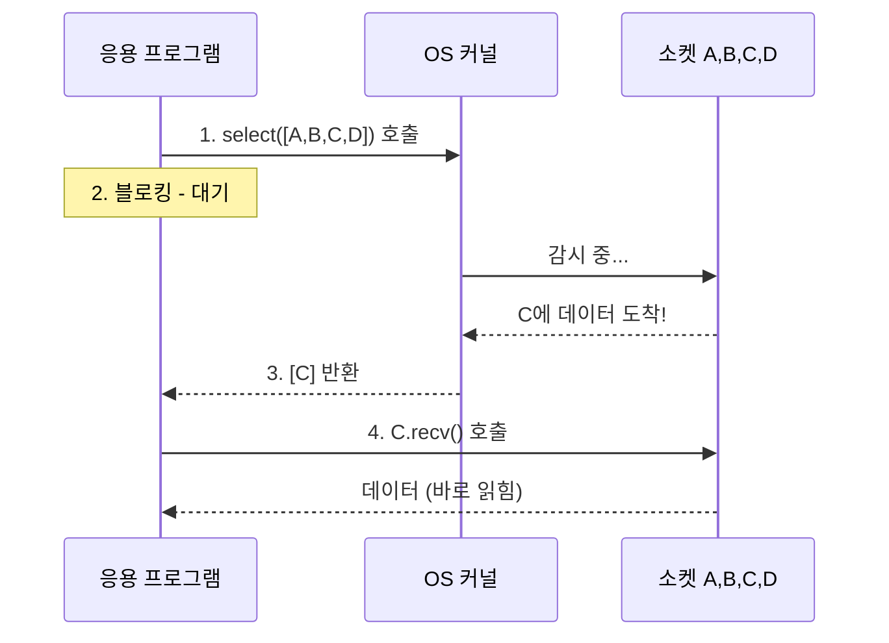
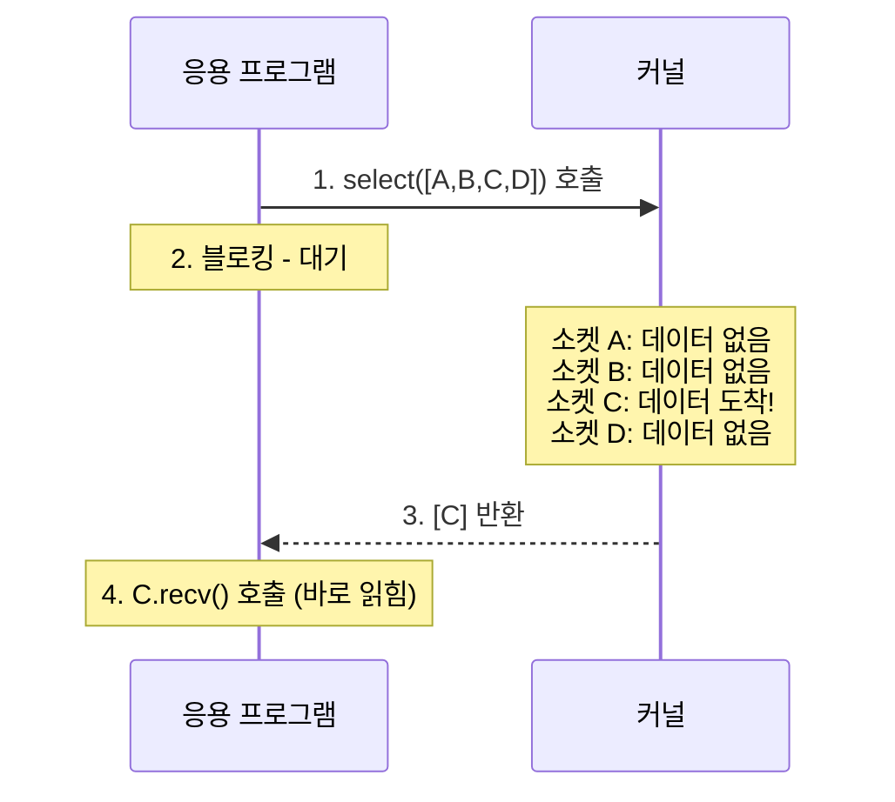
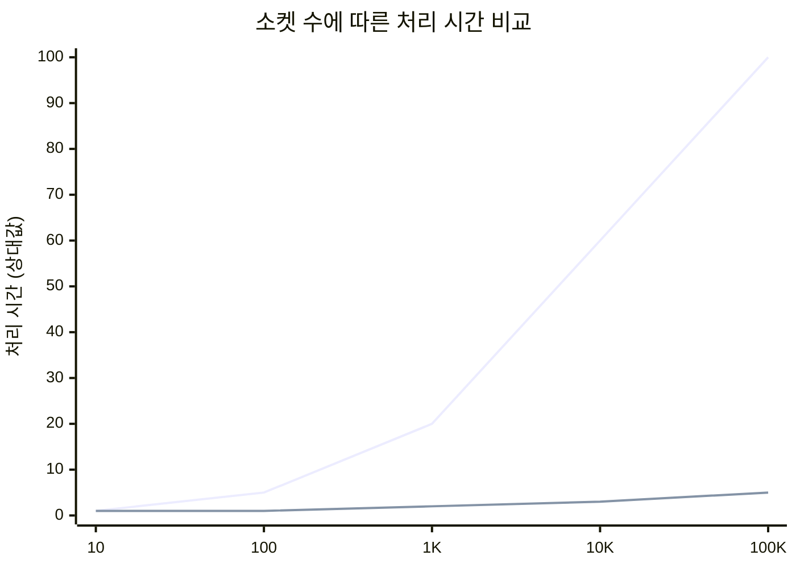
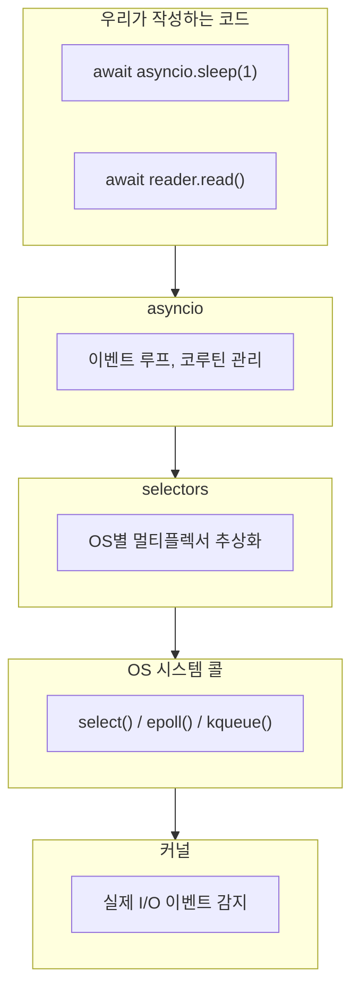

> **📚 FastAPI 시리즈 - Part 1. 기초 개념**
>
> 1. [프로세스 vs 스레드 vs 코루틴](/posts/process-thread-coroutine/)
> 2. [동시성 vs 병렬성](/posts/concurrency-vs-parallelism/)
> 3. [블로킹 vs 논블로킹 I/O](/posts/blocking-vs-nonblocking-io/)
> 4. I/O 멀티플렉싱 ← 현재 글
> 5. 이벤트 루프와 asyncio (예정)

---

# 4. I/O 멀티플렉싱 (select, epoll, kqueue)

## 왜 이 개념이 중요한가?

앞서 배운 내용:

- 논블로킹 I/O는 즉시 반환한다
- 이벤트 루프가 여러 작업을 관리한다

**근본적인 질문:** 이벤트 루프는 "어떤 I/O가 준비됐는지" 어떻게 알까?

답: **I/O 멀티플렉싱**을 통해 OS에게 물어본다.

---

## I/O 멀티플렉싱이란?

### 한 줄 정의

**하나의 스레드가 여러 I/O 채널을 동시에 감시하는 기법**

### 비유: 콜센터 상담원

| 방식 | 비유 | 문제점 |
|:---:|:---|:---|
| 블로킹 | 상담원 1명이 전화 1개만 담당 | 상담원 100명 필요 |
| 폴링 | 상담원이 모든 전화기를 계속 확인 | CPU 낭비 |
| **멀티플렉싱** | 전화 오면 벨이 울림, 그때만 받음 | 효율적! |

---

## 왜 필요한가?

### 문제 상황: 10,000개의 동시 연결

| 해결책 | 방식 | 문제점 |
|:---:|:---|:---|
| 스레드 per 연결 | 연결당 스레드 생성 | 메모리 폭발 (스레드당 ~1MB) |
| 프로세스 per 연결 | 연결당 프로세스 생성 | 더 심한 메모리 폭발 |
| 논블로킹 + 폴링 | 모든 소켓 반복 확인 | CPU 100% 사용 |
| **I/O 멀티플렉싱** | OS가 준비된 것만 알려줌 | 효율적 |

### C10K 문제

> **C10K Problem (1999)**: "동시에 10,000개의 클라이언트 연결을 어떻게 처리할 것인가?"

| 구분 | 내용 |
|:---:|:---|
| **문제** | 전통적 방식 (스레드 per 연결): 10,000 스레드 × 1MB = 10GB 메모리, 컨텍스트 스위칭 오버헤드 폭발 |
| **해결책** | I/O 멀티플렉싱 (select → epoll/kqueue), 단일 스레드로 수만 개 연결 처리 가능 |

---

## 동작 원리

### 기본 흐름



**단계별 설명:**
1. 감시할 소켓 목록 등록: `sockets = [sock_a, sock_b, sock_c, sock_d]`
2. OS에게 "이 중에 준비된 거 있으면 알려줘" 요청
3. 블로킹 - 준비된 게 생길 때까지 대기
4. 준비된 소켓 목록 반환: `ready = [sock_c]`
5. 준비된 소켓만 처리: `data = sock.recv()`

---

## select (가장 기본)

### 특징

| 항목 | 내용 |
|:---:|:---|
| 등장 | 1983년 (BSD) |
| 지원 OS | 거의 모든 OS |
| 최대 소켓 수 | 1024개 (FD_SETSIZE) |
| 시간 복잡도 | O(n) - 매번 전체 스캔 |

### 사용법

```python
import select
import socket

# 소켓 생성
server = socket.socket()
server.bind(('0.0.0.0', 8000))
server.listen()
server.setblocking(False)

sockets = [server]

while True:
    # OS에게 물어보기: "이 소켓들 중 읽을 준비 된 거 있어?"
    readable, writable, errors = select.select(
        sockets,  # 읽기 감시할 소켓들
        [],       # 쓰기 감시할 소켓들
        [],       # 에러 감시할 소켓들
        1.0       # 타임아웃 (초)
    )

    # 준비된 소켓만 처리
    for sock in readable:
        if sock is server:
            # 새 연결
            client, addr = server.accept()
            client.setblocking(False)
            sockets.append(client)
        else:
            # 데이터 수신
            data = sock.recv(1024)
            if data:
                sock.send(data)  # 에코
            else:
                sockets.remove(sock)
                sock.close()

```

### select의 동작 과정



### select의 문제점

| 문제 | 설명 |
|:---:|:---|
| 소켓 수 제한 | 최대 1024개 (FD_SETSIZE) |
| O(n) 스캔 | 매번 모든 소켓 확인 |
| 복사 오버헤드 | 매 호출마다 소켓 목록을 커널로 복사 |
| 확장성 | 소켓 많아지면 성능 급락 |

---

## epoll (Linux)

### 특징

| 항목 | 내용 |
|:---:|:---|
| 등장 | 2002년 (Linux 2.5.44) |
| 지원 OS | Linux only |
| 최대 소켓 수 | 시스템 메모리 한도까지 |
| 시간 복잡도 | O(1) - 준비된 것만 반환 |

### select vs epoll 차이

| 구분 | select (매번 전체 스캔) | epoll (이벤트 기반) |
|:---:|:---|:---|
| 방식 | 매 호출마다 "A,B,C,D 확인해줘" | 등록 1회: "A,B,C,D 감시해줘" |
| 동작 | 전체 스캔 후 결과 반환 | `epoll_wait()` → 이벤트 발생 시 알림 |
| 복잡도 | O(n) | O(1) |

### 사용법

```python
import select
import socket

# epoll 인스턴스 생성
epoll = select.epoll()

server = socket.socket()
server.bind(('0.0.0.0', 8000))
server.listen()
server.setblocking(False)

# 서버 소켓 등록 (한 번만)
epoll.register(server.fileno(), select.EPOLLIN)

connections = {server.fileno(): server}

while True:
    # 이벤트 대기 (준비된 것만 반환)
    events = epoll.wait(timeout=1)

    for fd, event in events:
        sock = connections[fd]

        if sock is server:
            # 새 연결
            client, addr = server.accept()
            client.setblocking(False)
            epoll.register(client.fileno(), select.EPOLLIN)
            connections[client.fileno()] = client

        elif event & select.EPOLLIN:
            # 데이터 수신
            data = sock.recv(1024)
            if data:
                sock.send(data)
            else:
                epoll.unregister(fd)
                del connections[fd]
                sock.close()

```

### epoll의 두 가지 모드

| 모드 | 동작 | 사용 상황 |
|:---:|:---|:---|
| Level Triggered (LT) | 데이터 있으면 계속 알림 | 기본값, 사용 쉬움 |
| Edge Triggered (ET) | 상태 변화 시 한 번만 알림 | 고성능, 주의 필요 |

**Level Triggered (LT)**:


**Edge Triggered (ET)**:


→ ET 모드에서는 한 번에 모든 데이터를 읽어야 한다 (EAGAIN까지).

---

## kqueue (macOS/BSD)

### 특징

| 항목 | 내용 |
|:---:|:---|
| 등장 | 2000년 (FreeBSD 4.1) |
| 지원 OS | macOS, FreeBSD, OpenBSD 등 |
| 최대 소켓 수 | 시스템 한도까지 |
| 시간 복잡도 | O(1) |
| 장점 | 다양한 이벤트 타입 지원 (파일, 시그널 등) |

### 사용법

```python
import select
import socket

# kqueue 인스턴스 생성
kq = select.kqueue()

server = socket.socket()
server.bind(('0.0.0.0', 8000))
server.listen()
server.setblocking(False)

# 이벤트 등록
event = select.kevent(
    server.fileno(),
    filter=select.KQ_FILTER_READ,
    flags=select.KQ_EV_ADD
)
kq.control([event], 0)

connections = {server.fileno(): server}

while True:
    # 이벤트 대기
    events = kq.control(None, 10, 1)  # 최대 10개, 1초 타임아웃

    for event in events:
        fd = event.ident
        sock = connections[fd]

        if sock is server:
            client, addr = server.accept()
            client.setblocking(False)
            # 새 클라이언트 등록
            ev = select.kevent(
                client.fileno(),
                filter=select.KQ_FILTER_READ,
                flags=select.KQ_EV_ADD
            )
            kq.control([ev], 0)
            connections[client.fileno()] = client
        else:
            data = sock.recv(1024)
            if data:
                sock.send(data)
            else:
                del connections[fd]
                sock.close()

```

---

## 성능 비교

### 소켓 수에 따른 성능

| 소켓 수 | select | epoll/kqueue |
|:---:|:---:|:---:|
| 10 | 빠름 | 빠름 |
| 100 | 보통 | 빠름 |
| 1,000 | 느림 | 빠름 |
| 10,000 | 매우 느림 | 빠름 |
| 100,000 | 사용 불가 | 빠름 |

### 시각화



---

## OS별 정리

| OS | API | Python 접근 |
|:---:|:---:|:---|
| Linux | epoll | `select.epoll()` |
| macOS | kqueue | `select.kqueue()` |
| BSD | kqueue | `select.kqueue()` |
| Windows | IOCP | `asyncio.ProactorEventLoop` |
| 공통 | select | `select.select()` |

---

## Python asyncio와의 연결

### asyncio가 내부적으로 하는 일

```python
# 우리가 작성하는 코드
async def main():
    reader, writer = await asyncio.open_connection('example.com', 80)
    writer.write(b'GET / HTTP/1.1\r\n\r\n')
    data = await reader.read(1024)

# asyncio 내부 (단순화)
class EventLoop:
    def __init__(self):
        # OS에 맞는 멀티플렉서 선택
        if sys.platform == 'linux':
            self.selector = selectors.EpollSelector()
        elif sys.platform == 'darwin':
            self.selector = selectors.KqueueSelector()
        else:
            self.selector = selectors.SelectSelector()

    def run_forever(self):
        while True:
            # I/O 멀티플렉싱으로 준비된 이벤트 확인
            events = self.selector.select(timeout)

            # 준비된 콜백 실행
            for key, mask in events:
                callback = key.data
                callback()

```

### 계층 구조



---

## Python selectors 모듈 (추상화 계층)

```python
import selectors
import socket

# OS에 맞는 최적의 멀티플렉서 자동 선택
sel = selectors.DefaultSelector()

server = socket.socket()
server.bind(('0.0.0.0', 8000))
server.listen()
server.setblocking(False)

def accept(sock):
    client, addr = sock.accept()
    client.setblocking(False)
    sel.register(client, selectors.EVENT_READ, data=handle)

def handle(sock):
    data = sock.recv(1024)
    if data:
        sock.send(data)
    else:
        sel.unregister(sock)
        sock.close()

# 서버 등록
sel.register(server, selectors.EVENT_READ, data=accept)

# 이벤트 루프
while True:
    events = sel.select(timeout=1)
    for key, mask in events:
        callback = key.data
        callback(key.fileobj)

```

---

## 실제 웹 서버/프레임워크에서의 사용

| 서버/프레임워크 | 사용 기술 |
|:---:|:---|
| Nginx | epoll (Linux), kqueue (BSD) |
| Node.js | libuv (epoll, kqueue, IOCP 추상화) |
| Uvicorn | uvloop (libuv) 또는 asyncio |
| Gunicorn | select/epoll (워커 타입에 따라) |
| Tornado | IOLoop (epoll, kqueue) |

---

## 핵심 정리

| 개념 | 설명 |
|:---:|:---|
| **I/O 멀티플렉싱** | 하나의 스레드가 여러 I/O를 동시에 감시 |
| **select** | 가장 기본, 소켓 수 제한, O(n) |
| **epoll** | Linux 전용, 무제한, O(1) |
| **kqueue** | BSD/macOS 전용, 무제한, O(1) |
| **asyncio** | 내부적으로 OS별 최적 멀티플렉서 사용 |

---

## 기타 내용

### 1. 비동기 라이브러리 사용

동기 라이브러리는 내부적으로 블로킹 I/O를 사용 → 멀티플렉싱 활용 못함

| 용도 | 동기 (블로킹) | 비동기 (논블로킹) |
|:---:|:---:|:---:|
| HTTP 요청 | requests | httpx, aiohttp |
| PostgreSQL | psycopg2 | asyncpg |
| MySQL | mysql-connector | aiomysql |
| Redis | redis-py | aioredis |
| 파일 I/O | open() | aiofiles |

---

### 2. 동시 연결 수 제한

멀티플렉싱이 효율적이라고 무한정 연결하면 안 됨

```python
# ❌ 위험: 10,000개 동시 요청 → 서버/네트워크 과부하
async def bad():
    urls = [f"https://api.example.com/{i}" for i in range(10000)]
    await asyncio.gather(*[fetch(url) for url in urls])

# ✅ 세마포어로 동시 요청 수 제한
async def good():
    semaphore = asyncio.Semaphore(100)  # 최대 100개 동시
    
    async def fetch_limited(url):
        async with semaphore:
            return await fetch(url)
    
    urls = [f"https://api.example.com/{i}" for i in range(10000)]
    await asyncio.gather(*[fetch_limited(url) for url in urls])
```

| 항목 | 권장 사항 |
|:---:|:---|
| HTTP 요청 | 동시 50~200개 정도 |
| DB 연결 | 커넥션 풀 사용 (10~50개) |
| 파일 I/O | OS 한계 고려 |

---

### 3. 타임아웃 설정

하나의 느린 I/O가 전체를 지연시키지 않도록

```python
# ❌ 타임아웃 없음 → 하나가 느리면 전체 대기
async def bad():
    await fetch(url)  # 10분 걸리면?

# ✅ 타임아웃 설정
async def good():
    try:
        await asyncio.wait_for(fetch(url), timeout=5.0)
    except asyncio.TimeoutError:
        print("타임아웃!")
```

---

### 4. 작업 단위 적절히 나누기

너무 긴 코루틴은 다른 작업을 지연시킬 수 있음

```python
# ❌ await 없이 긴 작업 → 다른 코루틴 실행 기회 없음
async def bad():
    result = []
    for i in range(1000000):
        result.append(process(i))  # await 없음!
    return result

# ✅ 중간에 양보 지점 추가
async def good():
    result = []
    for i in range(1000000):
        result.append(process(i))
        if i % 10000 == 0:
            await asyncio.sleep(0)  # 다른 코루틴에게 양보
    return result
```