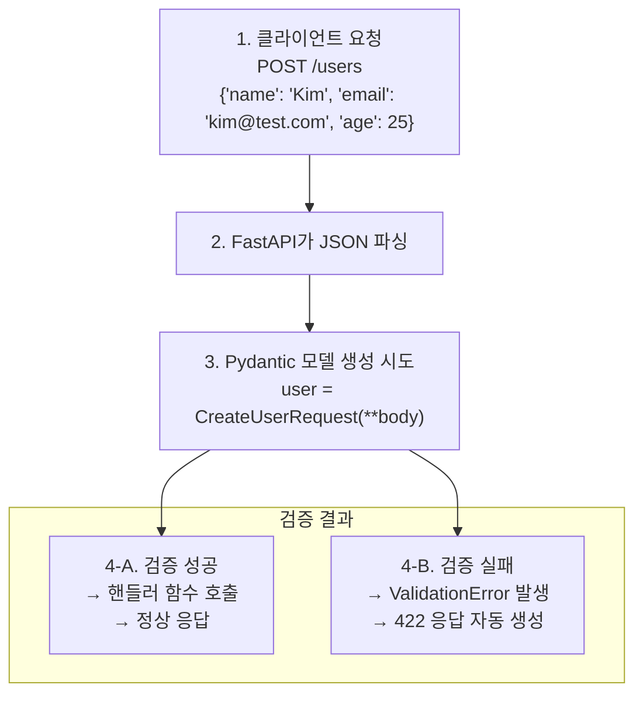
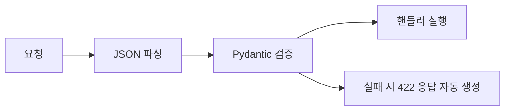

> **📚 FastAPI 시리즈 - Part 4. FastAPI 핵심 구성요소**
>
> 1. [Starlette 프레임워크](/posts/starlette/)
> 2. Pydantic 데이터 검증 ← 현재 글
> 3. [타입 힌트와 런타임 검증](/posts/type-hints-runtime/)
> 4. [의존성 주입 (Dependency Injection)](/posts/dependency-injection/)
> 5. [미들웨어 동작 방식](/posts/middleware/)

---

# 2. Pydantic 데이터 검증

## 왜 이 개념이 중요한가?

- FastAPI의 요청/응답 처리 핵심
- 자동 데이터 검증 및 직렬화
- 타입 힌트 기반 런타임 검증

---

## Pydantic이란?

### 한 줄 정의

**타입 힌트를 사용한 데이터 검증 및 설정 관리 라이브러리**

### 핵심 기능

| 기능 | 설명 |
|:---:|:---:|
| 데이터 검증 | 타입, 제약조건 자동 검증 |
| 타입 변환 | 문자열 → 정수 등 자동 변환 |
| 직렬화 | Python 객체 ↔ JSON |
| 스키마 생성 | JSON Schema 자동 생성 |

---

## BaseModel 기초

### 기본 사용법

```python
from pydantic import BaseModel

class User(BaseModel):
    id: int
    name: str
    email: str
    is_active: bool = True  # 기본값

# 생성
user = User(id=1, name="Kim", email="kim@example.com")
print(user.id)        # 1
print(user.name)      # Kim
print(user.is_active) # True (기본값)

# 딕셔너리로 변환
print(user.model_dump())
# {'id': 1, 'name': 'Kim', 'email': 'kim@example.com', 'is_active': True}

# JSON으로 변환
print(user.model_dump_json())
# '{"id":1,"name":"Kim","email":"kim@example.com","is_active":true}'

```

### 자동 타입 변환

```python
from pydantic import BaseModel

class User(BaseModel):
    id: int
    name: str

# 문자열 "123"이 자동으로 int 123으로 변환
user = User(id="123", name="Kim")
print(user.id)       # 123 (int)
print(type(user.id)) # <class 'int'>

```

---

## 검증 동작

### 검증 실패 시

```python
from pydantic import BaseModel, ValidationError

class User(BaseModel):
    id: int
    name: str

try:
    user = User(id="not_a_number", name="Kim")
except ValidationError as e:
    print(e)

```

```
1 validation error for User
id
  Input should be a valid integer, unable to parse string as an integer

```

### 검증 에러 상세

```python
try:
    user = User(id="abc", name=123)
except ValidationError as e:
    print(e.errors())

```

```python
[
    {
        'type': 'int_parsing',
        'loc': ('id',),
        'msg': 'Input should be a valid integer, unable to parse string as an integer',
        'input': 'abc',
    }
]

```

---

## 타입 종류

### 기본 타입

```python
from pydantic import BaseModel
from typing import Optional, List, Dict
from datetime import datetime

class Example(BaseModel):
    # 기본 타입
    name: str
    age: int
    score: float
    is_active: bool

    # Optional (None 허용)
    nickname: Optional[str] = None

    # 리스트
    tags: List[str] = []

    # 딕셔너리
    metadata: Dict[str, str] = {}

    # 날짜/시간
    created_at: datetime

```

### 중첩 모델

```python
from pydantic import BaseModel
from typing import List

class Address(BaseModel):
    city: str
    street: str

class User(BaseModel):
    name: str
    address: Address              # 중첩 모델
    friends: List["User"] = []    # 자기 참조

# 사용
user = User(
    name="Kim",
    address={"city": "Seoul", "street": "Gangnam"},  # dict → Address 자동 변환
)
print(user.address.city)  # Seoul

```

---

## Field를 통한 상세 검증

### 기본 제약조건

```python
from pydantic import BaseModel, Field

class User(BaseModel):
    name: str = Field(min_length=2, max_length=50)
    age: int = Field(ge=0, le=150)           # 0 <= age <= 150
    email: str = Field(pattern=r'^[\w\.-]+@[\w\.-]+\.\w+$')
    score: float = Field(gt=0, lt=100)       # 0 < score < 100

# 제약조건 위반 시 ValidationError

```

### Field 옵션

| 옵션 | 설명 | 예시 |
|:---:|:---:|:---:|
| `default` | 기본값 | `Field(default=0)` |
| `min_length` | 최소 길이 (str) | `Field(min_length=1)` |
| `max_length` | 최대 길이 (str) | `Field(max_length=100)` |
| `ge` | 이상 (>=) | `Field(ge=0)` |
| `gt` | 초과 (>) | `Field(gt=0)` |
| `le` | 이하 (<=) | `Field(le=100)` |
| `lt` | 미만 (<) | `Field(lt=100)` |
| `pattern` | 정규식 | `Field(pattern=r'^\d+$')` |
| `description` | 설명 (문서용) | `Field(description="사용자 이름")` |

---

## 커스텀 검증

### field_validator

```python
from pydantic import BaseModel, field_validator

class User(BaseModel):
    name: str
    email: str

    @field_validator('name')
    @classmethod
    def name_must_not_be_empty(cls, v):
        if not v.strip():
            raise ValueError('이름은 비어있을 수 없습니다')
        return v.strip()  # 앞뒤 공백 제거 후 반환

    @field_validator('email')
    @classmethod
    def email_must_contain_at(cls, v):
        if '@' not in v:
            raise ValueError('올바른 이메일 형식이 아닙니다')
        return v.lower()  # 소문자로 변환

```

### model_validator (여러 필드 검증)

```python
from pydantic import BaseModel, model_validator

class DateRange(BaseModel):
    start_date: str
    end_date: str

    @model_validator(mode='after')
    def check_dates(self):
        if self.start_date > self.end_date:
            raise ValueError('start_date는 end_date보다 이전이어야 합니다')
        return self

```

---

## FastAPI와 통합

### 요청 본문 검증

```python
from fastapi import FastAPI
from pydantic import BaseModel, Field

app = FastAPI()

class CreateUserRequest(BaseModel):
    name: str = Field(min_length=2, max_length=50)
    email: str
    age: int = Field(ge=0, le=150)

@app.post("/users")
async def create_user(user: CreateUserRequest):
    # user는 이미 검증 완료된 Pydantic 모델
    return {"id": 1, "name": user.name}

```

### 요청 흐름



### 422 에러 응답 예시

```json
{
    "detail": [
        {
            "type": "string_too_short",
            "loc": ["body", "name"],
            "msg": "String should have at least 2 characters",
            "input": "K"
        }
    ]
}

```

---

## 응답 모델

### response_model 사용

```python
from fastapi import FastAPI
from pydantic import BaseModel

app = FastAPI()

class UserCreate(BaseModel):
    name: str
    email: str
    password: str  # 입력에는 포함

class UserResponse(BaseModel):
    id: int
    name: str
    email: str
    # password 없음 (응답에서 제외)

@app.post("/users", response_model=UserResponse)
async def create_user(user: UserCreate):
    # DB 저장 로직...
    return {
        "id": 1,
        "name": user.name,
        "email": user.email,
        "password": user.password  # 반환해도 response_model에 의해 필터링됨
    }

```

```
응답:
{
    "id": 1,
    "name": "Kim",
    "email": "kim@test.com"
    // password는 자동으로 제외됨!
}

```

---

## 직렬화 옵션

### model_dump 옵션

```python
from pydantic import BaseModel
from typing import Optional

class User(BaseModel):
    id: int
    name: str
    email: Optional[str] = None
    password: str

user = User(id=1, name="Kim", password="secret")

# 기본
user.model_dump()
# {'id': 1, 'name': 'Kim', 'email': None, 'password': 'secret'}

# None 값 제외
user.model_dump(exclude_none=True)
# {'id': 1, 'name': 'Kim', 'password': 'secret'}

# 특정 필드 제외
user.model_dump(exclude={'password'})
# {'id': 1, 'name': 'Kim', 'email': None}

# 특정 필드만 포함
user.model_dump(include={'id', 'name'})
# {'id': 1, 'name': 'Kim'}

```

### 별칭 (Alias)

```python
from pydantic import BaseModel, Field

class User(BaseModel):
    user_id: int = Field(alias='userId')
    user_name: str = Field(alias='userName')

    model_config = {
        'populate_by_name': True  # 별칭과 필드명 둘 다 허용
    }

# 둘 다 가능
user1 = User(userId=1, userName="Kim")
user2 = User(user_id=1, user_name="Kim")

```

---

## 고급 타입

### Literal (특정 값만 허용)

```python
from pydantic import BaseModel
from typing import Literal

class Order(BaseModel):
    status: Literal['pending', 'completed', 'cancelled']

Order(status='pending')    # ✅
Order(status='invalid')    # ❌ ValidationError

```

### Annotated (메타데이터 추가)

```python
from pydantic import BaseModel
from typing import Annotated
from pydantic.functional_validators import AfterValidator

def check_positive(v: int) -> int:
    if v <= 0:
        raise ValueError('양수여야 합니다')
    return v

PositiveInt = Annotated[int, AfterValidator(check_positive)]

class Product(BaseModel):
    price: PositiveInt
    quantity: PositiveInt

```

### Enum 사용

```python
from pydantic import BaseModel
from enum import Enum

class Status(str, Enum):
    PENDING = 'pending'
    COMPLETED = 'completed'
    CANCELLED = 'cancelled'

class Order(BaseModel):
    id: int
    status: Status

order = Order(id=1, status='pending')  # 문자열도 자동 변환
print(order.status)        # Status.PENDING
print(order.status.value)  # 'pending'

```

---

## model_config 설정

### 주요 설정 옵션

```python
from pydantic import BaseModel

class User(BaseModel):
    model_config = {
        'str_strip_whitespace': True,    # 문자열 앞뒤 공백 제거
        'str_min_length': 1,             # 문자열 최소 길이
        'frozen': True,                  # 불변 객체 (수정 불가)
        'extra': 'forbid',               # 정의되지 않은 필드 금지
        'populate_by_name': True,        # 별칭과 필드명 둘 다 허용
    }

    name: str
    email: str

```

### extra 옵션

```python
from pydantic import BaseModel

class StrictUser(BaseModel):
    model_config = {'extra': 'forbid'}
    name: str

# 정의되지 않은 필드 전달 시 에러
StrictUser(name="Kim", unknown="value")  # ❌ ValidationError

```

| extra 값 | 동작 |
|:---:|:---:|
| `'ignore'` | 추가 필드 무시 (기본값) |
| `'forbid'` | 추가 필드 있으면 에러 |
| `'allow'` | 추가 필드 허용 (저장됨) |

---

## 성능 고려사항

### Pydantic v2 개선점

| 항목 | v1 | v2 |
|:---:|:---:|:---:|
| 코어 | Python | **Rust (pydantic-core)** |
| 속도 | 기준 | **5~50배 빠름** |
| 메모리 | 기준 | **더 적음** |

### 검증 비용

```python
# 검증은 객체 생성 시 발생
user = User(name="Kim", email="kim@test.com")  # 여기서 검증

# 이미 검증된 데이터는 model_construct로 스킵 가능 (주의해서 사용)
user = User.model_construct(name="Kim", email="kim@test.com")  # 검증 안 함

```

---

## 핵심 정리

| 개념 | 설명 |
|:---:|:---:|
| **BaseModel** | Pydantic의 기본 모델 클래스 |
| **자동 검증** | 타입, 제약조건 자동 체크 |
| **자동 변환** | "123" → 123 등 타입 변환 |
| **Field** | 상세 제약조건 정의 |
| **validator** | 커스텀 검증 로직 |
| **직렬화** | model_dump(), model_dump_json() |
| **ValidationError** | 검증 실패 시 발생 |

### FastAPI 연동 요약

