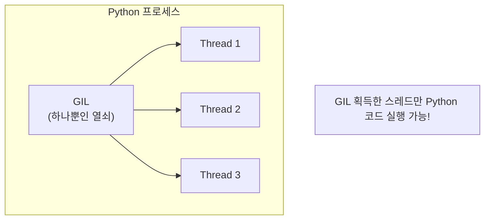
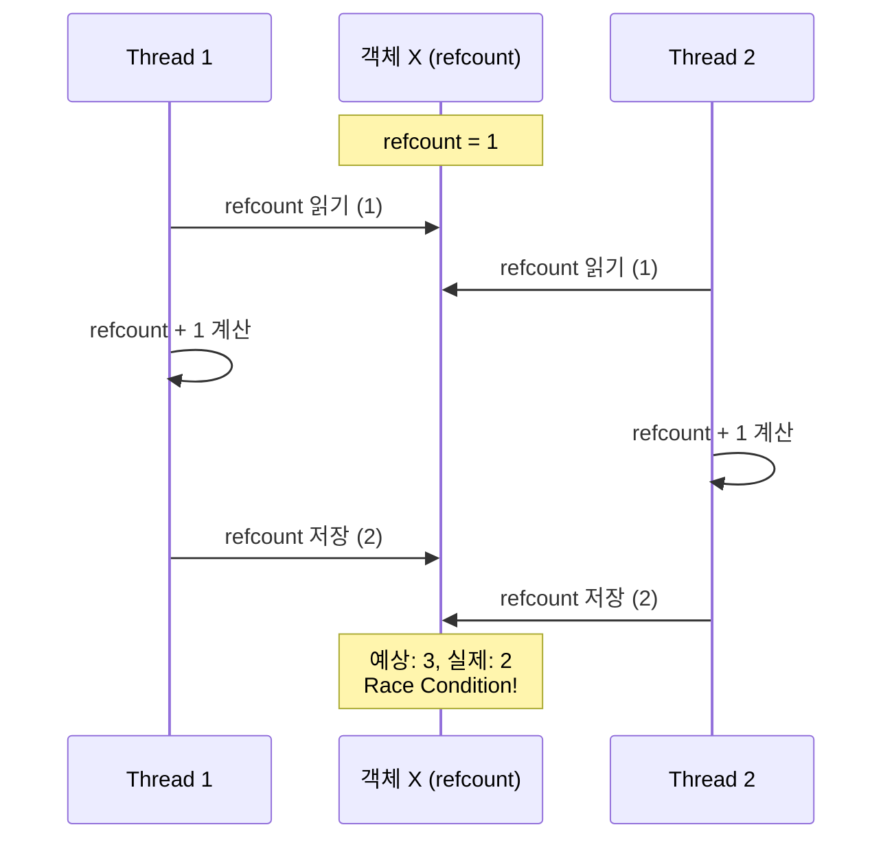
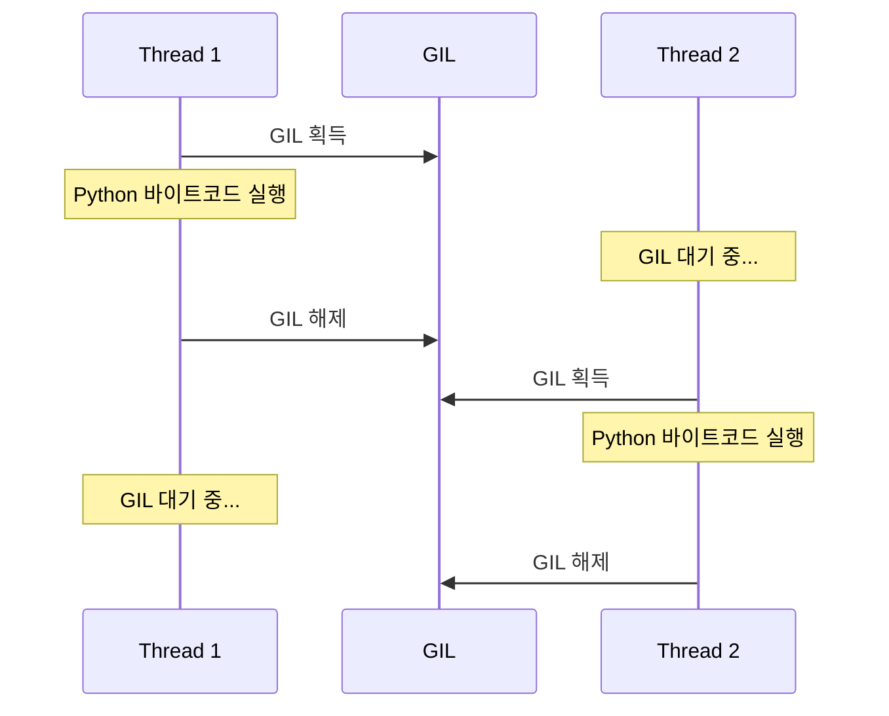
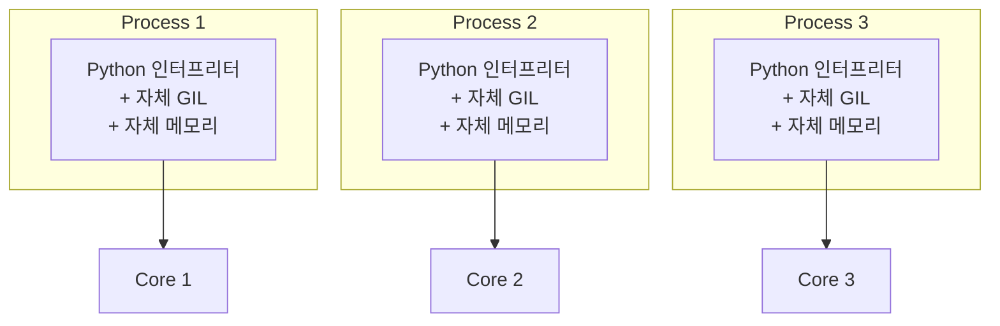
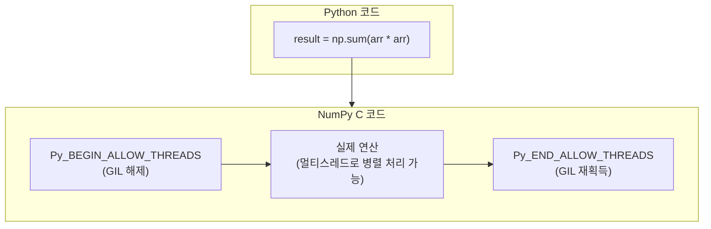
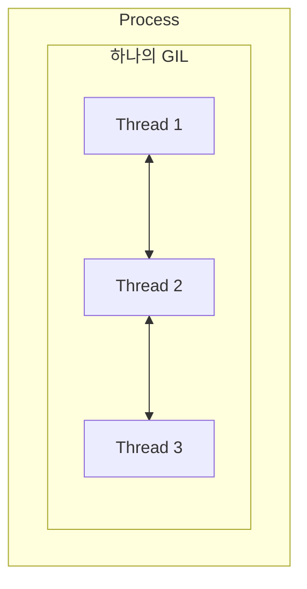
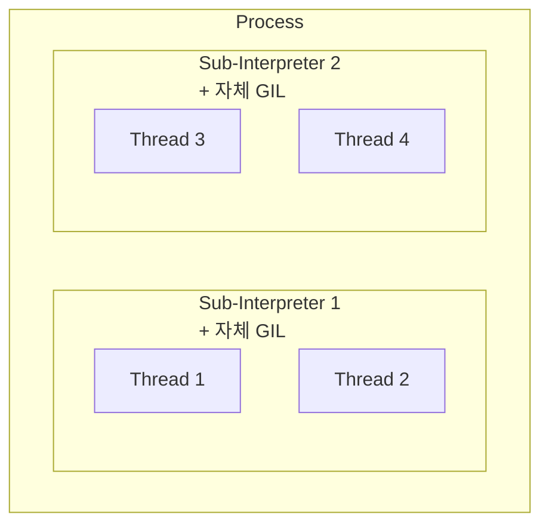

> **📚 FastAPI 시리즈 - Part 2. Python 특수성**
>
> 1. GIL (Global Interpreter Lock) ← 현재 글
> 2. [Python 스레드 동작 구조](/posts/python-thread-structure/)
> 3. [이벤트 루프 (asyncio)](/posts/python-event-loop/)
> 4. [Generator, yield와 async/await 코루틴](/posts/python-generator-coroutine/)

---

# 1. GIL (Global Interpreter Lock)

## 왜 이 개념이 중요한가?

앞서 배운 내용들에서 계속 등장했던 개념:

- "GIL 때문에 멀티스레드가 CPU 바운드에서 효과 없다"
- "I/O 대기 중에는 GIL이 해제된다"
- "멀티프로세스는 각자 GIL을 가진다"

이제 GIL이 정확히 무엇인지, 왜 존재하는지 깊이 이해해보자.

---

## GIL이란?

### 한 줄 정의

**한 번에 하나의 스레드만 Python 바이트코드를 실행하도록 하는 뮤텍스(Lock)**

### 핵심 특징

| 항목 | 내용 |
|:---:|:---|
| 적용 범위 | CPython 인터프리터 전체 |
| 목적 | Python 객체에 대한 동시 접근 보호 |
| 결과 | 멀티스레드여도 Python 코드는 한 번에 하나만 실행 |

---

## 시각화



---

## 왜 GIL이 존재하는가?

### 1. CPython의 메모리 관리 방식

Python은 **참조 카운팅(Reference Counting)**으로 메모리를 관리한다.

```python
# 모든 Python 객체는 참조 카운트를 가짐
a = []      # 리스트 객체 생성, refcount = 1
b = a       # 같은 객체 참조, refcount = 2
del a       # 참조 해제, refcount = 1
del b       # 참조 해제, refcount = 0 → 메모리 해제

```

### 2. 멀티스레드에서의 문제

> GIL 없이 멀티스레드가 동작한다면?



→ 잘못된 참조 카운트 → 메모리 누수 or 조기 해제 → 크래시

### 3. 해결책으로서의 GIL

| 선택지 | 장점 | 단점 |
|:---:|:---|:---|
| 객체마다 개별 Lock | 멀티코어 활용 가능 | 오버헤드 큼, 데드락 위험 |
| **GIL (전역 Lock)** | 간단, 안전, 단일 스레드 성능 좋음 | 멀티코어 활용 불가 |

**Python 선택:** 단순함과 안정성을 위해 GIL 채택 (1992년)

---

## GIL의 동작 방식

### 기본 메커니즘



### GIL 해제 시점

| 상황 | GIL 상태 | 이유 |
|:---:|:---:|:---|
| Python 바이트코드 실행 중 | 유지 | Python 객체 접근 필요 |
| I/O 작업 (네트워크, 파일) | **해제** | Python 객체 접근 안 함 |
| `time.sleep()` | **해제** | 대기 중 Python 코드 안 돌림 |
| C 확장 연산 (NumPy 등) | **해제** | C 레벨에서 자체 처리 |
| 일정 바이트코드 실행 후 | **해제** | 다른 스레드에게 기회 제공 |

### 주기적 GIL 해제 (Python 3.2+)

```python
# sys.getswitchinterval()로 확인 가능
import sys
print(sys.getswitchinterval())  # 기본값: 0.005초 (5ms)

# 변경 가능
sys.setswitchinterval(0.001)  # 1ms마다 GIL 해제

```

| 버전 | GIL 전환 기준 |
|:---:|:---|
| Python 2.x | 100 바이트코드 명령마다 |
| Python 3.2+ | 5ms (시간 기반) |

---

## GIL의 영향

### CPU 바운드 작업

```python
import threading
import time

def cpu_work():
    total = 0
    for i in range(10_000_000):
        total += i
    return total

# 단일 스레드
start = time.time()
cpu_work()
cpu_work()
print(f"단일 스레드: {time.time() - start:.2f}초")

# 멀티 스레드
start = time.time()
t1 = threading.Thread(target=cpu_work)
t2 = threading.Thread(target=cpu_work)
t1.start(); t2.start()
t1.join(); t2.join()
print(f"멀티 스레드: {time.time() - start:.2f}초")

```

**결과:**

| 방식 | 소요 시간 | 이유 |
|:---:|:---:|:---|
| 단일 스레드 | ~1.0초 | 기준 |
| 멀티 스레드 | ~1.0초 (또는 더 느림) | GIL 때문에 순차 실행 + 전환 오버헤드 |

### I/O 바운드 작업

```python
import threading
import time

def io_work():
    time.sleep(1)  # I/O 대기 시뮬레이션

# 단일 스레드
start = time.time()
io_work()
io_work()
print(f"단일 스레드: {time.time() - start:.2f}초")

# 멀티 스레드
start = time.time()
t1 = threading.Thread(target=io_work)
t2 = threading.Thread(target=io_work)
t1.start(); t2.start()
t1.join(); t2.join()
print(f"멀티 스레드: {time.time() - start:.2f}초")

```

**결과:**

| 방식 | 소요 시간 | 이유 |
|:---:|:---:|:---|
| 단일 스레드 | ~2.0초 | 순차 실행 |
| 멀티 스레드 | ~1.0초 | I/O 대기 중 GIL 해제 → 동시 처리 |

---

## GIL 우회 방법

### 방법 비교

| 방법 | CPU 바운드 | I/O 바운드 | 복잡도 |
|:---:|:---:|:---:|:---:|
| asyncio | X | O | 낮음 |
| 멀티스레딩 | X | O | 낮음 |
| **멀티프로세싱** | O | O | 중간 |
| **C 확장** | O | - | 높음 |
| **다른 인터프리터** | O | O | 높음 |

### 1. 멀티프로세싱

```python
from multiprocessing import Pool
import time

def cpu_work(n):
    total = 0
    for i in range(n):
        total += i
    return total

if __name__ == "__main__":
    # 멀티프로세스: 각 프로세스가 독립된 GIL 보유
    start = time.time()
    with Pool(4) as pool:
        results = pool.map(cpu_work, [10_000_000] * 4)
    print(f"멀티프로세스: {time.time() - start:.2f}초")  # ~1초 (4배 빠름)

```



→ 각자 독립적으로 병렬 실행 (진짜 병렬성)

### 2. C 확장 (NumPy 등)

```python
import numpy as np
import threading
import time

# NumPy: C로 구현되어 GIL 해제하고 연산
def numpy_work():
    arr = np.random.rand(10000, 10000)
    return np.sum(arr * arr)

# 멀티스레드에서도 효과 있음!
start = time.time()
t1 = threading.Thread(target=numpy_work)
t2 = threading.Thread(target=numpy_work)
t1.start(); t2.start()
t1.join(); t2.join()
print(f"NumPy 멀티스레드: {time.time() - start:.2f}초")

```



### 3. 다른 Python 구현체

| 구현체 | GIL | 특징 |
|:---:|:---:|:---|
| CPython | 있음 | 표준 구현, 가장 널리 사용 |
| Jython | 없음 | JVM 위에서 실행 |
| IronPython | 없음 | .NET 위에서 실행 |
| PyPy | 있음 | JIT 컴파일, 빠름 |
| GraalPython | 없음 | GraalVM 위에서 실행 |

---

## Python 3.12+ (Per-Interpreter GIL) - 비권장

### 새로운 기능: 인터프리터별 GIL

**기존 (단일 프로세스, 단일 GIL):**



**Python 3.12+ (단일 프로세스, 다중 GIL):**



→ 프로세스 오버헤드 없이 병렬성 확보 (실험적)

### Python 3.13+ (Free-threaded / No-GIL 실험) - 비권장

```bash
# Python 3.13+에서 GIL 없이 빌드 가능 (실험적)
./configure --disable-gil

```

| 버전 | GIL 상태 |
|:---:|:---|
| Python 3.12 | Per-Interpreter GIL (선택적) |
| Python 3.13+ | No-GIL 빌드 옵션 (실험적) |

---

## FastAPI에서의 GIL

### 일반적인 FastAPI 워크로드

```python
from fastapi import FastAPI
import httpx

app = FastAPI()

# ✅ I/O 바운드: GIL 문제 없음
@app.get("/io")
async def io_endpoint():
    async with httpx.AsyncClient() as client:
        response = await client.get("https://api.example.com")
    return response.json()

# ✅ def: 스레드풀에서 실행, I/O 시 GIL 해제
@app.get("/sync-io")
def sync_io_endpoint():
    import requests
    return requests.get("https://api.example.com").json()

```

### CPU 바운드가 필요할 때

```python
from fastapi import FastAPI
from concurrent.futures import ProcessPoolExecutor
import asyncio

app = FastAPI()
process_pool = ProcessPoolExecutor(max_workers=4)

def heavy_computation(data):
    # CPU 집약적 작업
    return sum(i * i for i in range(10_000_000))

# ✅ CPU 바운드: 프로세스 풀로 GIL 우회
@app.get("/cpu")
async def cpu_endpoint():
    loop = asyncio.get_event_loop()
    result = await loop.run_in_executor(process_pool, heavy_computation, "data")
    return {"result": result}

```

---

## 핵심 정리

| 개념 | 설명 |
|:---:|:---|
| **GIL이란** | 한 번에 하나의 스레드만 Python 코드를 실행하게 하는 Lock |
| **존재 이유** | 참조 카운팅 기반 메모리 관리의 Thread-Safety 확보 |
| **영향** | CPU 바운드에서 멀티스레드 효과 없음 |
| **해제 시점** | I/O 작업, C 확장, sleep 등 |
| **우회 방법** | 멀티프로세싱, C 확장 (NumPy), 다른 구현체 |
| **미래** | Python 3.13+에서 No-GIL 실험 중 |

---
