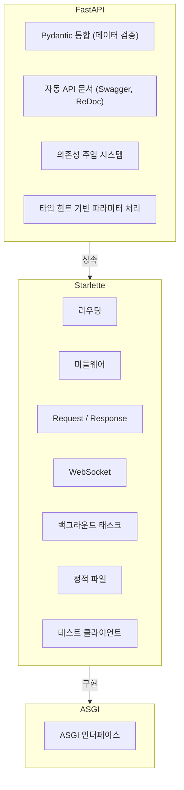
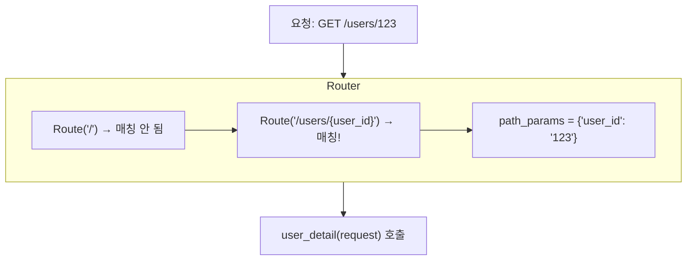
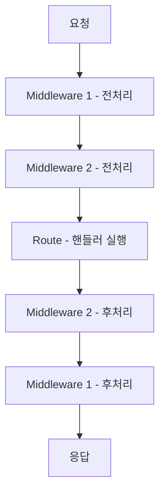
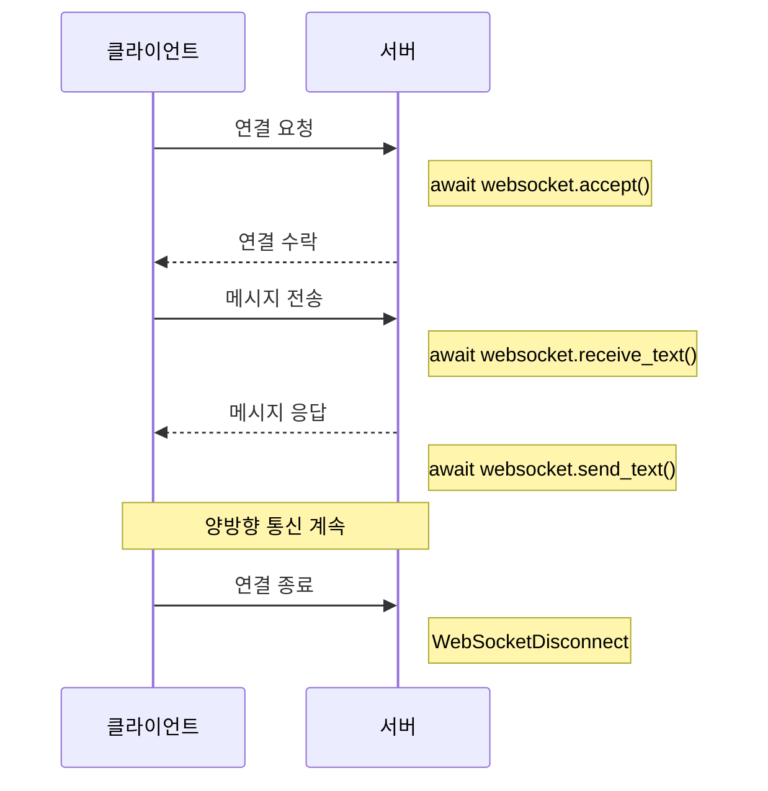

> **📚 FastAPI 시리즈 - Part 4. FastAPI 핵심 구성요소**
>
> 1. Starlette 프레임워크 ← 현재 글
> 2. [Pydantic 데이터 검증](/posts/pydantic/)
> 3. [타입 힌트와 런타임 검증](/posts/type-hints-runtime/)
> 4. [의존성 주입 (Dependency Injection)](/posts/dependency-injection/)
> 5. [미들웨어 동작 방식](/posts/middleware/)

---

# 1. Starlette 프레임워크

## 왜 이 개념이 중요한가?

- FastAPI는 Starlette 위에 구축됨
- 라우팅, 미들웨어, Request/Response 처리는 모두 Starlette
- Starlette을 알면 FastAPI를 더 깊이 이해할 수 있음

---

## FastAPI와 Starlette의 관계

### 계층 구조



### 코드로 확인

```python
from fastapi import FastAPI
from starlette.applications import Starlette

app = FastAPI()

# FastAPI는 Starlette의 서브클래스
print(isinstance(app, Starlette))  # True

```

---

## Starlette 핵심 컴포넌트

| 컴포넌트 | 역할 |
|:---:|:---:|
| `Application` | ASGI 앱, 라우팅/미들웨어 관리 |
| `Request` | HTTP 요청 래핑 |
| `Response` | HTTP 응답 생성 |
| `Route` | URL → 핸들러 매핑 |
| `Middleware` | 요청/응답 파이프라인 |
| `WebSocket` | WebSocket 연결 처리 |
| `BackgroundTask` | 응답 후 백그라운드 작업 |

---

## Request 객체

### 주요 속성/메서드

```python
from starlette.requests import Request

async def handler(request: Request):
    # URL 정보
    request.url              # 전체 URL
    request.url.path         # /users/123
    request.url.query        # name=kim
    request.path_params      # {"id": "123"}
    request.query_params     # {"name": "kim"}

    # 헤더
    request.headers          # Headers 객체
    request.headers.get("content-type")

    # 메서드
    request.method           # GET, POST 등

    # 클라이언트 정보
    request.client.host      # 클라이언트 IP
    request.client.port      # 클라이언트 포트

    # 본문 (비동기)
    body = await request.body()           # bytes
    json_data = await request.json()      # dict
    form_data = await request.form()      # FormData

    # 상태 저장 (미들웨어 간 데이터 전달)
    request.state.user = current_user

```

### FastAPI에서의 사용

```python
from fastapi import FastAPI, Request

app = FastAPI()

@app.get("/info")
async def get_info(request: Request):
    return {
        "client_host": request.client.host,
        "url": str(request.url),
        "headers": dict(request.headers),
    }

```

---

## Response 객체

### 응답 종류

```python
from starlette.responses import (
    Response,
    HTMLResponse,
    PlainTextResponse,
    JSONResponse,
    RedirectResponse,
    StreamingResponse,
    FileResponse,
)

# 기본 응답
Response(content=b"Hello", media_type="text/plain")

# JSON 응답 (기본)
JSONResponse({"message": "Hello"})

# HTML 응답
HTMLResponse("<h1>Hello</h1>")

# 리다이렉트
RedirectResponse(url="/new-path", status_code=302)

# 파일 다운로드
FileResponse("report.pdf", filename="report.pdf")

# 스트리밍 (대용량)
async def generate():
    for i in range(10):
        yield f"data: {i}\n"

StreamingResponse(generate(), media_type="text/event-stream")

```

### FastAPI에서의 사용

```python
from fastapi import FastAPI
from fastapi.responses import HTMLResponse, StreamingResponse

app = FastAPI()

@app.get("/html", response_class=HTMLResponse)
async def get_html():
    return "<h1>Hello World</h1>"

@app.get("/stream")
async def stream():
    async def generate():
        for i in range(10):
            yield f"data: {i}\n\n"
    return StreamingResponse(generate(), media_type="text/event-stream")

```

---

## 라우팅

### Starlette 라우팅

```python
from starlette.applications import Starlette
from starlette.routing import Route, Mount
from starlette.responses import JSONResponse

async def homepage(request):
    return JSONResponse({"message": "Home"})

async def user_detail(request):
    user_id = request.path_params["user_id"]
    return JSONResponse({"user_id": user_id})

# 라우트 정의
routes = [
    Route("/", homepage),
    Route("/users/{user_id}", user_detail),
]

app = Starlette(routes=routes)

```

### FastAPI 라우팅 (더 편리)

```python
from fastapi import FastAPI

app = FastAPI()

@app.get("/")
async def homepage():
    return {"message": "Home"}

@app.get("/users/{user_id}")
async def user_detail(user_id: int):  # 자동 타입 변환!
    return {"user_id": user_id}

```

### 라우팅 동작 원리



---

## 미들웨어

### Starlette 미들웨어 구조

```python
from starlette.middleware.base import BaseHTTPMiddleware
from starlette.requests import Request

class TimingMiddleware(BaseHTTPMiddleware):
    async def dispatch(self, request: Request, call_next):
        # 요청 전처리
        import time
        start = time.time()

        # 다음 미들웨어/라우트 호출
        response = await call_next(request)

        # 응답 후처리
        duration = time.time() - start
        response.headers["X-Process-Time"] = str(duration)

        return response

```

### 미들웨어 체인



### FastAPI에서 미들웨어 등록

```python
from fastapi import FastAPI
from starlette.middleware.base import BaseHTTPMiddleware

app = FastAPI()

# 방법 1: 데코레이터
@app.middleware("http")
async def add_header(request, call_next):
    response = await call_next(request)
    response.headers["X-Custom"] = "value"
    return response

# 방법 2: add_middleware
app.add_middleware(TimingMiddleware)

```

---

## 내장 미들웨어

### 주요 미들웨어

```python
from fastapi import FastAPI
from starlette.middleware.cors import CORSMiddleware
from starlette.middleware.gzip import GZipMiddleware
from starlette.middleware.httpsredirect import HTTPSRedirectMiddleware
from starlette.middleware.trustedhost import TrustedHostMiddleware

app = FastAPI()

# CORS
app.add_middleware(
    CORSMiddleware,
    allow_origins=["https://example.com"],
    allow_methods=["*"],
    allow_headers=["*"],
)

# Gzip 압축
app.add_middleware(GZipMiddleware, minimum_size=1000)

# HTTPS 리다이렉트
app.add_middleware(HTTPSRedirectMiddleware)

# 신뢰할 수 있는 호스트
app.add_middleware(
    TrustedHostMiddleware,
    allowed_hosts=["example.com", "*.example.com"]
)

```

---

## WebSocket

### Starlette WebSocket

```python
from starlette.websockets import WebSocket

async def websocket_endpoint(websocket: WebSocket):
    await websocket.accept()

    while True:
        data = await websocket.receive_text()
        await websocket.send_text(f"Echo: {data}")

```

### FastAPI WebSocket

```python
from fastapi import FastAPI, WebSocket

app = FastAPI()

@app.websocket("/ws")
async def websocket_endpoint(websocket: WebSocket):
    await websocket.accept()

    while True:
        data = await websocket.receive_text()
        await websocket.send_text(f"Echo: {data}")

```

### WebSocket 생명주기



---

## BackgroundTasks

### 응답 후 작업 실행

```python
from starlette.background import BackgroundTask
from starlette.responses import JSONResponse

async def send_email(email: str, message: str):
    # 이메일 전송 로직
    print(f"Sending email to {email}")

async def handler(request):
    # 응답은 즉시 반환
    # 이메일 전송은 백그라운드에서
    task = BackgroundTask(send_email, "user@example.com", "Hello!")
    return JSONResponse({"status": "ok"}, background=task)

```

### FastAPI에서

```python
from fastapi import FastAPI, BackgroundTasks

app = FastAPI()

def send_email(email: str, message: str):
    print(f"Sending email to {email}")

@app.post("/notify")
async def notify(background_tasks: BackgroundTasks):
    background_tasks.add_task(send_email, "user@example.com", "Hello!")
    return {"status": "ok"}  # 즉시 응답

```

---

## 테스트 클라이언트

### Starlette TestClient

```python
from starlette.testclient import TestClient
from fastapi import FastAPI

app = FastAPI()

@app.get("/")
async def root():
    return {"message": "Hello"}

# 동기 테스트
def test_root():
    client = TestClient(app)
    response = client.get("/")
    assert response.status_code == 200
    assert response.json() == {"message": "Hello"}

```

### 비동기 테스트 (httpx)

```python
import pytest
from httpx import AsyncClient
from fastapi import FastAPI

app = FastAPI()

@app.get("/")
async def root():
    return {"message": "Hello"}

@pytest.mark.asyncio
async def test_root():
    async with AsyncClient(app=app, base_url="http://test") as client:
        response = await client.get("/")
    assert response.status_code == 200

```

---

## 정적 파일

### Starlette StaticFiles

```python
from starlette.staticfiles import StaticFiles
from fastapi import FastAPI

app = FastAPI()

# /static 경로로 static 폴더 서빙
app.mount("/static", StaticFiles(directory="static"), name="static")

# 접근: /static/css/style.css → static/css/style.css 파일

```

---

## Starlette 직접 사용 vs FastAPI

### 언제 Starlette 직접 사용?

| 상황 | 권장 |
|:---:|:---:|
| API 서버 (일반) | FastAPI |
| 최소 의존성 필요 | Starlette |
| Pydantic 불필요 | Starlette |
| 극한의 성능 필요 | Starlette |
| 학습/이해 목적 | Starlette |

### 성능 차이

```
Starlette: 약간 더 빠름 (Pydantic 검증 없음)
FastAPI: 약간 느림 (자동 검증/직렬화 비용)

→ 대부분의 경우 FastAPI 편의성이 더 가치 있음

```

---

## 핵심 정리

| 개념 | 설명 |
|:---:|:---:|
| **Starlette** | FastAPI의 기반 프레임워크 |
| **Request** | HTTP 요청 래핑 객체 |
| **Response** | HTTP 응답 생성 객체 |
| **Route** | URL → 핸들러 매핑 |
| **Middleware** | 요청/응답 파이프라인 |
| **WebSocket** | 양방향 실시간 통신 |
| **BackgroundTask** | 응답 후 비동기 작업 |

### FastAPI = Starlette + α

```
Starlette 제공: 라우팅, 미들웨어, Request, Response, WebSocket
FastAPI 추가: Pydantic 통합, 자동 문서, DI, 타입 힌트 파라미터

```