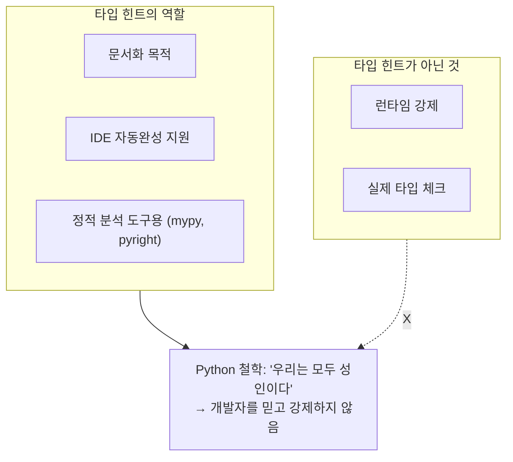
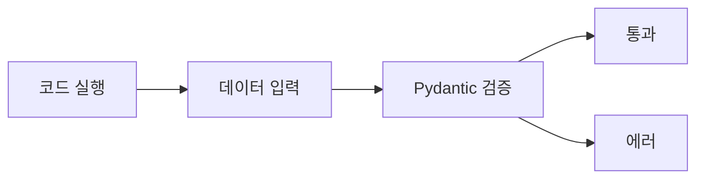
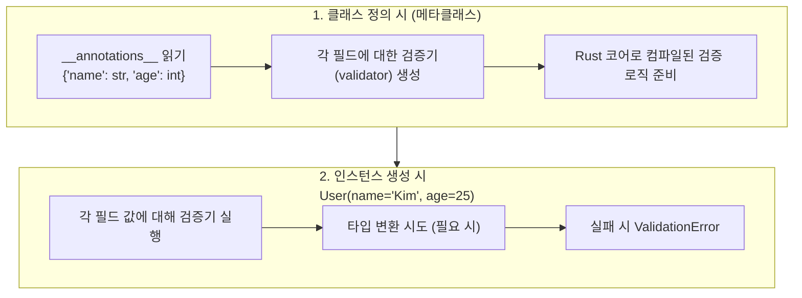
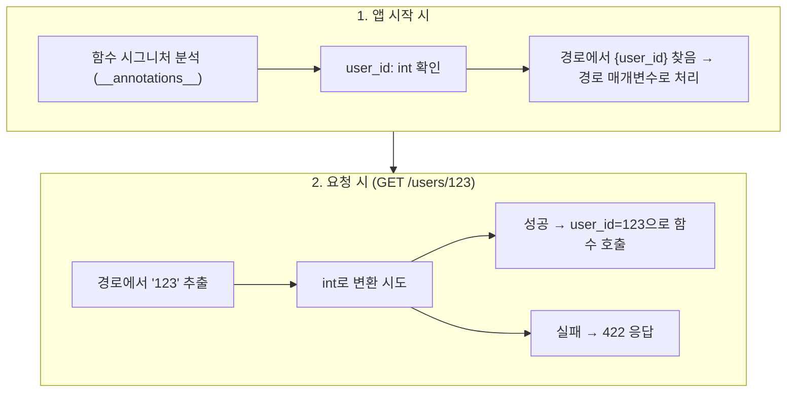
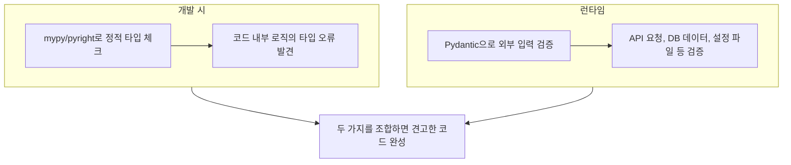

> **📚 FastAPI 시리즈 - Part 4. FastAPI 핵심 구성요소**
>
> 1. [Starlette 프레임워크](/posts/starlette/)
> 2. [Pydantic 데이터 검증](/posts/pydantic/)
> 3. 타입 힌트와 런타임 검증 ← 현재 글
> 4. [의존성 주입 (Dependency Injection)](/posts/dependency-injection/)
> 5. [미들웨어 동작 방식](/posts/middleware/)

---

# 3. 타입 힌트와 런타임 검증

## 왜 이 개념이 중요한가?

- Python 타입 힌트는 기본적으로 "힌트"일 뿐 강제가 아님
- Pydantic은 이 타입 힌트를 런타임에 실제로 검증함
- 이 차이를 이해해야 FastAPI의 동작을 제대로 파악할 수 있음

---

## Python 타입 힌트의 본질

### 타입 힌트 = 주석일 뿐

```python
def greet(name: str) -> str:
    return f"Hello, {name}"

# 타입 힌트 무시하고 실행됨
result = greet(123)  # 에러 안 남!
print(result)        # "Hello, 123"

```

### 왜 에러가 안 나는가?



---

## 정적 타입 체크 vs 런타임 타입 체크

### 비교

| 구분 | 정적 타입 체크 | 런타임 타입 체크 |
|:---:|:---:|:---:|
| 시점 | 코드 실행 전 | 코드 실행 중 |
| 도구 | mypy, pyright | Pydantic, beartype |
| 에러 발견 | IDE/CI에서 | 실행 시 |
| 성능 영향 | 없음 | 있음 (검증 비용) |

### 정적 타입 체크 (mypy)

```bash
# mypy로 정적 분석
$ mypy app.py

```

```python
def greet(name: str) -> str:
    return f"Hello, {name}"

greet(123)  # mypy: Argument 1 has incompatible type "int"; expected "str"

```


- **장점**: 실행 전에 오류 발견
- **단점**: 외부 입력(JSON, DB 등)은 검증 못 함

### 런타임 타입 체크 (Pydantic)

```python
from pydantic import BaseModel

class User(BaseModel):
    name: str
    age: int

# 런타임에 실제로 검증
user = User(name=123, age="not_a_number")  # ValidationError!

```



- **장점**: 외부 입력을 실제로 검증
- **단점**: 실행 시 성능 비용

---

## Pydantic이 타입 힌트를 활용하는 방법

### 내부 동작

```python
from pydantic import BaseModel

class User(BaseModel):
    name: str
    age: int

```



### **annotations** 확인

```python
from pydantic import BaseModel

class User(BaseModel):
    name: str
    age: int

# Python이 저장하는 타입 힌트 정보
print(User.__annotations__)
# {'name': <class 'str'>, 'age': <class 'int'>}

# Pydantic이 생성한 필드 정보
print(User.model_fields)
# {'name': FieldInfo(..., annotation=str), 'age': FieldInfo(..., annotation=int)}

```

---

## typing 모듈의 타입들

### 기본 타입

```python
from typing import List, Dict, Optional, Union, Tuple, Set

# 이것들은 모두 "힌트"일 뿐
def process(
    items: List[int],           # 정수 리스트
    mapping: Dict[str, int],    # 문자열→정수 딕셔너리
    maybe: Optional[str],       # str 또는 None
    either: Union[int, str],    # int 또는 str
) -> Tuple[int, str]:           # (정수, 문자열) 튜플
    pass

```

### Pydantic에서 활용

```python
from pydantic import BaseModel
from typing import List, Dict, Optional

class User(BaseModel):
    name: str
    tags: List[str]                    # 문자열 리스트 검증
    metadata: Dict[str, int]           # 딕셔너리 검증
    nickname: Optional[str] = None     # None 허용

# 검증 동작
user = User(
    name="Kim",
    tags=["dev", "python"],           # ✅
    metadata={"score": 100},          # ✅
    nickname=None                      # ✅
)

# 잘못된 타입
user = User(
    name="Kim",
    tags=["dev", 123],                # ✅ 123 → "123" 변환
    metadata={"score": "hundred"},    # ❌ "hundred" → int 변환 실패
)

```

---

## Generic 타입과 Pydantic

### List[int]의 동작

```python
from pydantic import BaseModel
from typing import List

class Numbers(BaseModel):
    values: List[int]

# 변환 시도
nums = Numbers(values=["1", "2", "3"])
print(nums.values)  # [1, 2, 3] - 각 요소가 int로 변환됨

# 변환 실패
nums = Numbers(values=["1", "two", "3"])  # ValidationError!

```

### 중첩 타입

```python
from pydantic import BaseModel
from typing import List, Dict

class Data(BaseModel):
    matrix: List[List[int]]
    nested: Dict[str, List[str]]

data = Data(
    matrix=[["1", "2"], ["3", "4"]],           # → [[1, 2], [3, 4]]
    nested={"tags": ["a", "b"]}
)

```

---

## FastAPI의 타입 힌트 활용

### 경로 매개변수

```python
from fastapi import FastAPI

app = FastAPI()

@app.get("/users/{user_id}")
async def get_user(user_id: int):  # 타입 힌트로 자동 변환 + 검증
    return {"user_id": user_id}

```

```
GET /users/123   → user_id = 123 (int)
GET /users/abc   → 422 Validation Error

```

### 쿼리 매개변수

```python
from fastapi import FastAPI
from typing import Optional, List

app = FastAPI()

@app.get("/search")
async def search(
    q: str,                           # 필수
    limit: int = 10,                  # 기본값 있음
    tags: Optional[List[str]] = None  # 선택적, 리스트
):
    return {"q": q, "limit": limit, "tags": tags}

```

```
GET /search?q=python&limit=5&tags=web&tags=api
→ q="python", limit=5, tags=["web", "api"]

```

### 동작 원리



---

## Annotated 타입

### 메타데이터 추가

```python
from typing import Annotated
from fastapi import FastAPI, Query, Path
from pydantic import Field

app = FastAPI()

@app.get("/items/{item_id}")
async def get_item(
    item_id: Annotated[int, Path(ge=1, description="아이템 ID")],
    q: Annotated[str, Query(min_length=3, max_length=50)] = None,
):
    return {"item_id": item_id, "q": q}

```

### Annotated의 구조

```python
from typing import Annotated

# Annotated[기본타입, 메타데이터1, 메타데이터2, ...]
UserId = Annotated[int, Field(ge=1), "사용자 ID"]

# 분해
from typing import get_args, get_origin

print(get_origin(UserId))  # typing.Annotated
print(get_args(UserId))    # (int, FieldInfo(...), '사용자 ID')

```

---

## 런타임 타입 정보 접근

### typing 모듈 유틸리티

```python
from typing import List, Dict, Optional, Union, get_origin, get_args

# get_origin: 제네릭의 기본 타입
print(get_origin(List[int]))        # <class 'list'>
print(get_origin(Dict[str, int]))   # <class 'dict'>
print(get_origin(Optional[str]))    # typing.Union

# get_args: 제네릭의 인자들
print(get_args(List[int]))          # (int,)
print(get_args(Dict[str, int]))     # (str, int)
print(get_args(Optional[str]))      # (str, NoneType)

```

### Pydantic 활용 예

```python
from pydantic import BaseModel
from typing import List, get_origin, get_args

class User(BaseModel):
    tags: List[str]

# 필드 타입 정보 접근
field_info = User.model_fields['tags']
annotation = field_info.annotation

print(get_origin(annotation))  # <class 'list'>
print(get_args(annotation))    # (str,)

```

---

## 타입 변환 규칙

### Pydantic 자동 변환

| 선언 타입 | 입력 | 결과 |
|:---:|:---:|:---:|
| `int` | `"123"` | `123` O |
| `int` | `"abc"` | ValidationError X |
| `float` | `"3.14"` | `3.14` O |
| `bool` | `"true"` | `True` O |
| `bool` | `1` | `True` O |
| `str` | `123` | `"123"` O |
| `List[int]` | `["1", "2"]` | `[1, 2]` O |
| `datetime` | `"2024-01-01"` | `datetime(2024, 1, 1)` O |

### strict 모드

```python
from pydantic import BaseModel, ConfigDict

class StrictUser(BaseModel):
    model_config = ConfigDict(strict=True)

    age: int

# strict 모드에서는 자동 변환 안 함
StrictUser(age="25")  # ❌ ValidationError (str → int 변환 거부)
StrictUser(age=25)    # ✅

```

---

## 커스텀 타입

### NewType (정적 분석용)

```python
from typing import NewType

UserId = NewType('UserId', int)

def get_user(user_id: UserId) -> dict:
    return {"id": user_id}

# 런타임에는 그냥 int
user_id: UserId = UserId(123)
print(type(user_id))  # <class 'int'>

```

### Pydantic 커스텀 타입

```python
from pydantic import BaseModel
from typing import Annotated
from pydantic.functional_validators import AfterValidator

def validate_positive(v: int) -> int:
    if v <= 0:
        raise ValueError('양수여야 합니다')
    return v

PositiveInt = Annotated[int, AfterValidator(validate_positive)]

class Product(BaseModel):
    price: PositiveInt

Product(price=100)   # ✅
Product(price=-10)   # ❌ ValidationError

```

---

## 정적 + 런타임 타입 체크 조합

### 추천 조합



### 실제 적용

```python
# mypy로 정적 체크 + Pydantic으로 런타임 체크
from pydantic import BaseModel

class UserCreate(BaseModel):
    name: str
    age: int

def create_user(data: UserCreate) -> dict:  # mypy가 체크
    # data는 이미 Pydantic이 검증함
    return {
        "id": 1,
        "name": data.name,
        "age": data.age,
    }

# 외부 입력 (JSON)
raw_data = {"name": "Kim", "age": "25"}
validated = UserCreate(**raw_data)  # Pydantic 런타임 검증
result = create_user(validated)     # mypy 정적 검증

```

---

## 핵심 정리

| 개념 | 설명 |
|:---:|:---:|
| **타입 힌트** | 기본적으로 런타임에 강제 안 됨 |
| **정적 타입 체크** | mypy 등, 실행 전 분석 |
| **런타임 타입 체크** | Pydantic, 실행 중 검증 |
| **annotations** | Python이 타입 힌트 저장하는 곳 |
| **Pydantic 동작** | **annotations** 읽어서 검증기 생성 |
| **자동 변환** | "123" → 123 등 타입 변환 |
| **strict 모드** | 자동 변환 비활성화 |

### 한 줄 요약

```
Python 타입 힌트 = 문서/힌트
Pydantic = 타입 힌트를 런타임에 실제로 강제

```

---