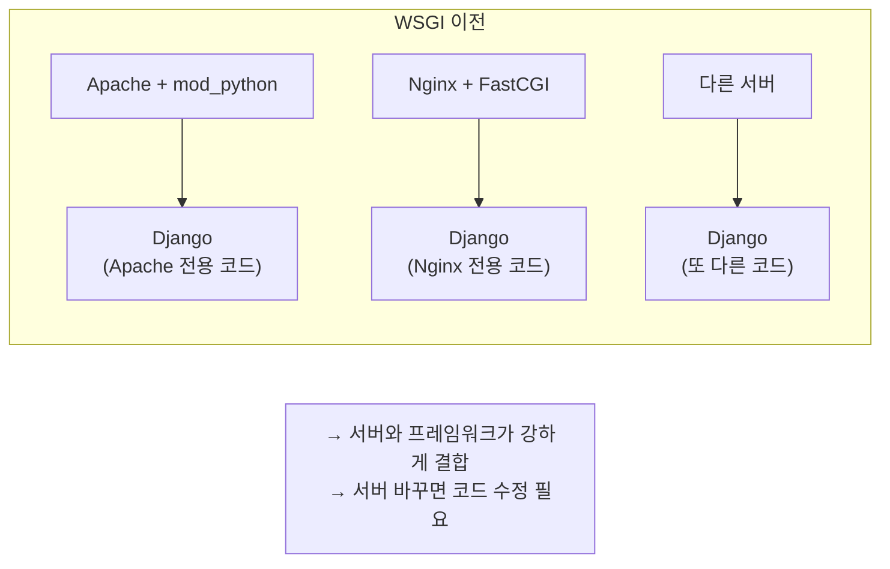
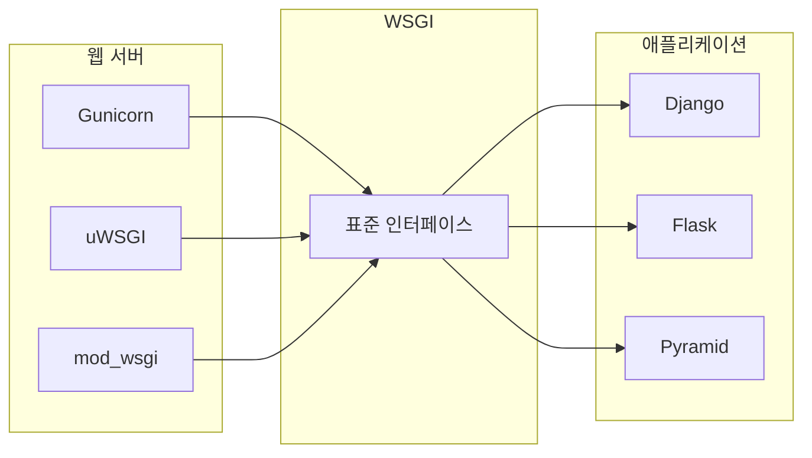
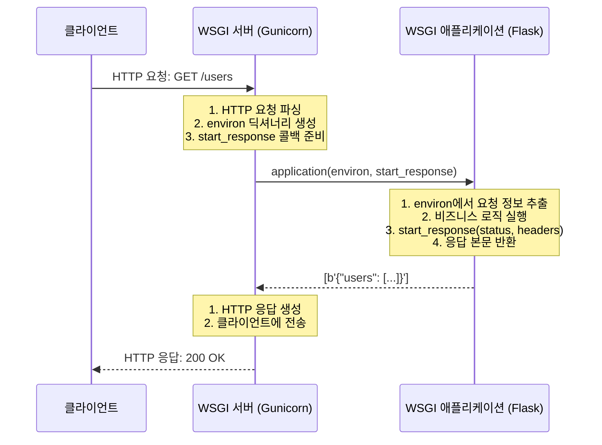
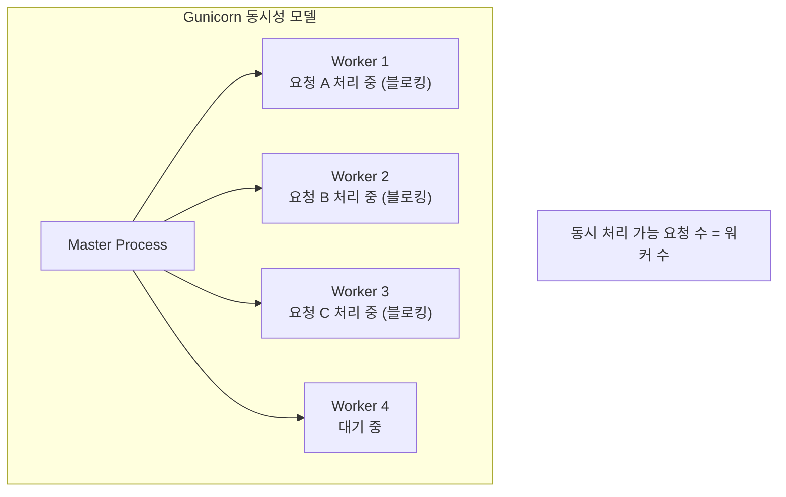
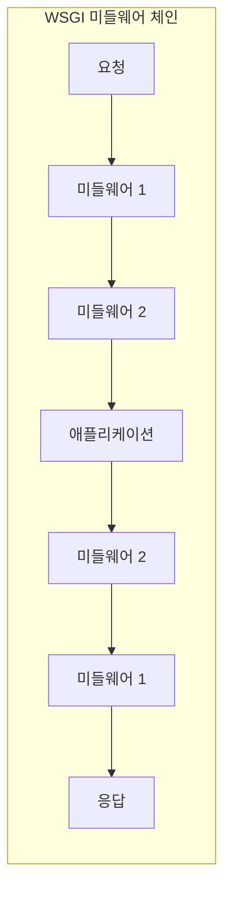

> **📚 FastAPI 시리즈 - Part 3. 웹 서버 인터페이스**
>
> 1. WSGI 동작 원리 ← 현재 글
> 2. [ASGI 동작 원리](/posts/asgi/)
> 3. [Uvicorn 내부 구조](/posts/uvicorn-internals/)
> 4. [Gunicorn + Uvicorn 조합 상세](/posts/gunicorn-uvicorn/)

---

# 1. WSGI 동작 원리

## 왜 이 개념이 중요한가?

- WSGI는 전통적인 Python 웹의 표준
- ASGI(FastAPI가 사용)를 이해하려면 WSGI를 먼저 알아야 함
- Django, Flask 등 대부분의 Python 웹 프레임워크가 WSGI 기반

---

## WSGI란?

### 한 줄 정의

**Web Server Gateway Interface - 웹 서버와 Python 애플리케이션 사이의 표준 인터페이스**

### 배경: WSGI 이전의 문제



### WSGI의 해결



→ 서버와 프레임워크가 독립적, 아무 서버 + 아무 프레임워크 조합 가능

---

## WSGI 인터페이스

### 가장 간단한 WSGI 애플리케이션

```python
def application(environ, start_response):
    """
    environ: 요청 정보가 담긴 딕셔너리
    start_response: 응답 시작을 알리는 콜백 함수
    """
    # 응답 헤더 설정
    status = '200 OK'
    headers = [('Content-Type', 'text/plain')]
    start_response(status, headers)

    # 응답 본문 반환 (iterable)
    return [b'Hello, World!']

```

### 핵심 규칙

| 항목 | 설명 |
|:---:|:---|
| 호출 가능 객체 | 함수, 클래스, `__call__` 메서드 |
| 인자 2개 | `environ`, `start_response` |
| 반환값 | iterable (리스트, 제너레이터 등) |
| 동기 실행 | 요청당 하나의 스레드/프로세스 |

---

## environ 딕셔너리

### 주요 항목

```python
def application(environ, start_response):
    # HTTP 요청 정보
    method = environ['REQUEST_METHOD']      # GET, POST 등
    path = environ['PATH_INFO']             # /users/123
    query = environ['QUERY_STRING']         # name=kim&age=30

    # HTTP 헤더 (HTTP_ 접두사)
    host = environ.get('HTTP_HOST')         # example.com
    user_agent = environ.get('HTTP_USER_AGENT')

    # 서버 정보
    server_name = environ['SERVER_NAME']
    server_port = environ['SERVER_PORT']

    # 요청 본문
    content_length = environ.get('CONTENT_LENGTH', 0)
    request_body = environ['wsgi.input'].read(int(content_length))

    start_response('200 OK', [('Content-Type', 'text/plain')])
    return [f'Method: {method}, Path: {path}'.encode()]

```

### environ 주요 키

| 키 | 설명 | 예시 |
|:---:|:---|:---|
| `REQUEST_METHOD` | HTTP 메서드 | `GET`, `POST` |
| `PATH_INFO` | 요청 경로 | `/users/123` |
| `QUERY_STRING` | 쿼리 스트링 | `name=kim` |
| `CONTENT_TYPE` | 본문 타입 | `application/json` |
| `CONTENT_LENGTH` | 본문 길이 | `42` |
| `HTTP_*` | HTTP 헤더들 | `HTTP_HOST` |
| `wsgi.input` | 요청 본문 스트림 | file-like 객체 |

---

## 요청 처리 흐름



---

## Flask가 WSGI를 사용하는 방식

### Flask 앱의 실체

```python
from flask import Flask

app = Flask(__name__)

@app.route('/')
def hello():
    return 'Hello, World!'

# app은 WSGI 애플리케이션!
# 내부적으로 __call__ 메서드가 있음

```

### Flask 내부 (단순화)

```python
class Flask:
    def __call__(self, environ, start_response):
        """Flask 앱은 WSGI callable"""
        # environ에서 요청 정보 추출
        request = self.create_request(environ)

        # 라우팅 + 뷰 함수 실행
        response = self.dispatch_request(request)

        # WSGI 응답 반환
        return response(environ, start_response)

```

---

## WSGI 서버들

### 주요 WSGI 서버

| 서버 | 특징 | 사용 |
|:---:|:---|:---|
| **Gunicorn** | 가장 널리 사용, 간단한 설정 | 프로덕션 |
| **uWSGI** | 고성능, 복잡한 설정 | 프로덕션 |
| **mod_wsgi** | Apache 모듈 | Apache 환경 |
| **Waitress** | Windows 지원, 순수 Python | 개발/프로덕션 |
| **Werkzeug** | Flask 내장 개발 서버 | 개발용 |

### Gunicorn 실행 예시

```bash
# 기본 실행
gunicorn app:application

# 워커 수 지정
gunicorn -w 4 app:application

# 바인드 주소 지정
gunicorn -b 0.0.0.0:8000 -w 4 app:application

```

---

## WSGI의 동시성 모델

### 동기 + 멀티 프로세스/스레드



### WSGI의 한계

| 한계 | 설명 |
|:---:|:---|
| **동기 전용** | async/await 사용 불가 |
| **요청당 스레드/프로세스** | 리소스 소비 큼 |
| **WebSocket 불가** | 장시간 연결 유지 어려움 |
| **HTTP/2 미지원** | HTTP/1.1만 가능 |

---

## WSGI 미들웨어

### 개념



### 예시: 로깅 미들웨어

```python
class LoggingMiddleware:
    def __init__(self, app):
        self.app = app

    def __call__(self, environ, start_response):
        # 요청 로깅
        print(f"Request: {environ['REQUEST_METHOD']} {environ['PATH_INFO']}")

        # 원래 앱 호출
        response = self.app(environ, start_response)

        # 응답 로깅
        print("Response sent")

        return response

# 적용
app = LoggingMiddleware(original_app)

```

---

## 간단한 WSGI 프레임워크 만들기

### 직접 구현해보기 (교육용)

```python
class MiniFramework:
    def __init__(self):
        self.routes = {}

    def route(self, path):
        def decorator(func):
            self.routes[path] = func
            return func
        return decorator

    def __call__(self, environ, start_response):
        path = environ['PATH_INFO']

        if path in self.routes:
            # 라우트 찾음
            handler = self.routes[path]
            body = handler()
            status = '200 OK'
        else:
            # 404
            body = 'Not Found'
            status = '404 Not Found'

        headers = [('Content-Type', 'text/plain')]
        start_response(status, headers)
        return [body.encode()]

# 사용
app = MiniFramework()

@app.route('/')
def home():
    return 'Hello, Home!'

@app.route('/about')
def about():
    return 'About Page'

# Gunicorn으로 실행: gunicorn myapp:app

```

---

## WSGI vs CGI

| 항목 | CGI | WSGI |
|:---:|:---|:---|
| 프로세스 | 요청마다 새 프로세스 | 프로세스 재사용 |
| 성능 | 느림 | 빠름 |
| 메모리 | 비효율적 | 효율적 |
| Python 특화 | X | O |

---

## 핵심 정리

| 개념 | 설명 |
|:---:|:---|
| **WSGI** | 웹 서버 ↔ Python 앱 표준 인터페이스 |
| **인터페이스** | `application(environ, start_response)` |
| **environ** | 요청 정보 딕셔너리 |
| **start_response** | 응답 헤더 설정 콜백 |
| **반환값** | iterable (응답 본문) |
| **동시성** | 동기, 멀티 프로세스/스레드 |
| **한계** | 비동기 불가, WebSocket 불가 |