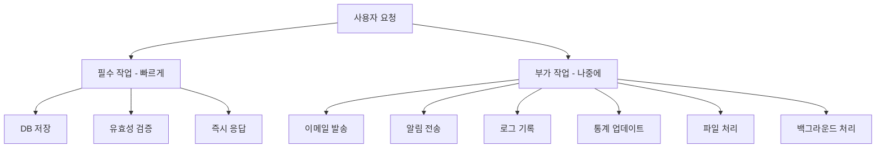
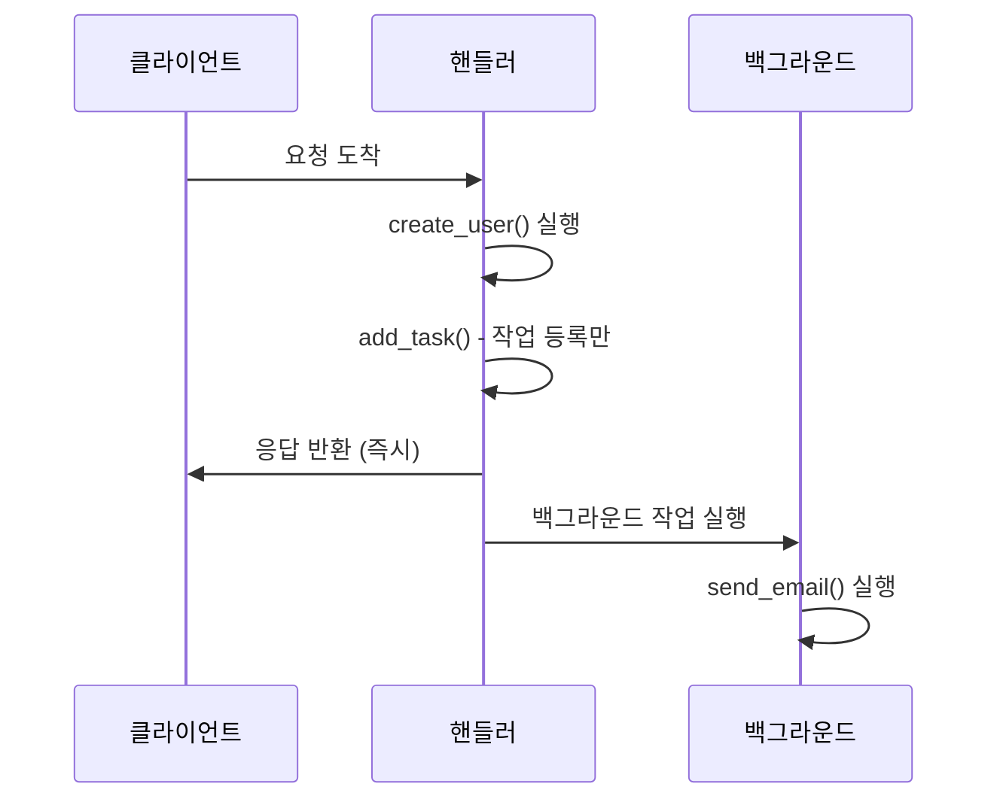
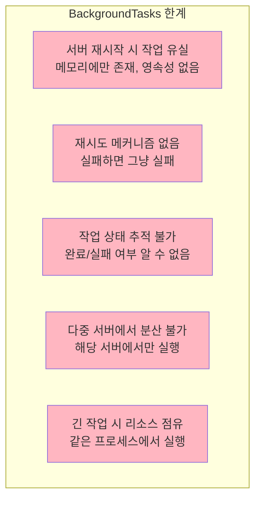
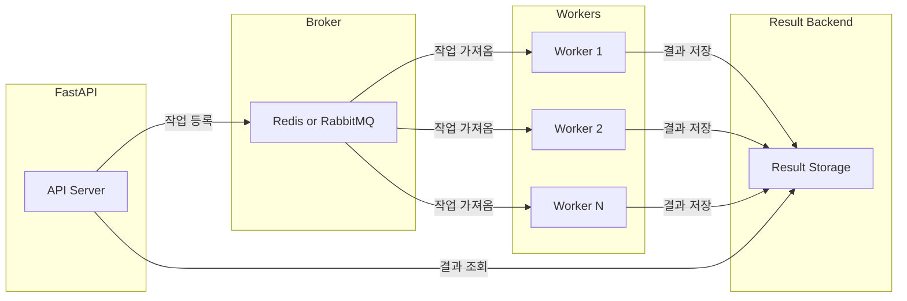
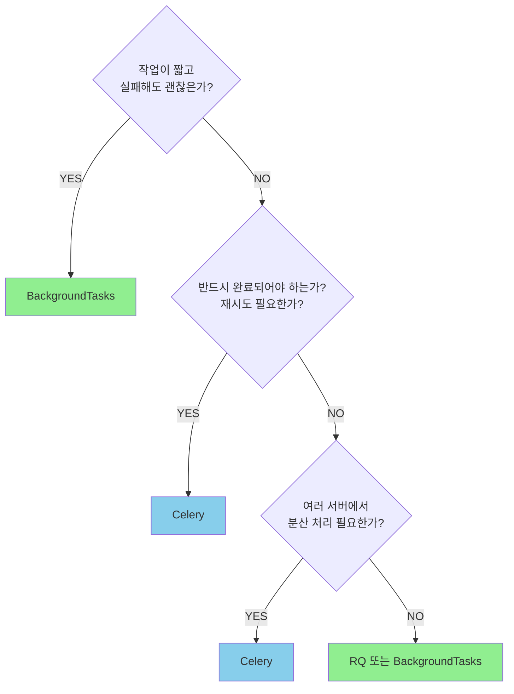

> **📚 FastAPI 시리즈 - Part 5. 실전 심화**
>
> 1. [동기 함수 vs 비동기 함수 선택 기준](/posts/sync-async-choice/)
> 2. BackgroundTasks와 작업 큐 ← 현재 글
> 3. [동시 요청 처리와 성능 튜닝](/posts/concurrency-tuning/)
> 4. [FastAPI 예외처리](/posts/exception-handling/)
> 5. [프로젝트 구조 설계](/posts/project-structure/)
> 6. [Python 객체/리소스 관리 패턴](/posts/resource-management/)

---

# 2. BackgroundTasks와 작업 큐

## 왜 이 개념이 중요한가?

- 응답 시간을 빠르게 유지하면서 후속 작업 처리
- 이메일 발송, 로그 기록, 알림 등 비동기 처리
- 작업 규모에 따른 적절한 도구 선택

---

## 백그라운드 작업이 필요한 상황



---

## 방법 1: FastAPI BackgroundTasks

### 가장 간단한 방법

```python
from fastapi import FastAPI, BackgroundTasks

app = FastAPI()

def send_email(email: str, message: str):
    """백그라운드에서 실행될 작업"""
    # 이메일 발송 로직 (시간이 걸림)
    print(f"Sending email to {email}: {message}")

@app.post("/register")
async def register(
    email: str,
    background_tasks: BackgroundTasks
):
    # 1. 필수 작업 (빠르게)
    user = create_user(email)

    # 2. 백그라운드 작업 등록
    background_tasks.add_task(send_email, email, "Welcome!")

    # 3. 즉시 응답 (이메일 발송 기다리지 않음)
    return {"user_id": user.id}

```

### 동작 흐름



### 여러 작업 등록

```python
@app.post("/order")
async def create_order(
    order: OrderCreate,
    background_tasks: BackgroundTasks
):
    # 주문 생성
    new_order = save_order(order)

    # 여러 백그라운드 작업 등록
    background_tasks.add_task(send_order_confirmation, order.email)
    background_tasks.add_task(update_inventory, order.items)
    background_tasks.add_task(notify_warehouse, new_order.id)
    background_tasks.add_task(log_order_analytics, new_order)

    return {"order_id": new_order.id}

```

### 의존성에서 BackgroundTasks 사용

```python
from fastapi import Depends

def log_request(background_tasks: BackgroundTasks, request: Request):
    """의존성에서 백그라운드 작업 등록"""
    background_tasks.add_task(
        save_log,
        path=request.url.path,
        method=request.method
    )

@app.get("/items")
async def get_items(
    log = Depends(log_request),  # 자동으로 로그 기록
    db = Depends(get_db)
):
    return db.query(Item).all()

```

---

## BackgroundTasks의 한계

### 언제 BackgroundTasks가 적합한가?

| 적합 ✅ | 부적합 ❌ |
| --- | --- |
| 짧은 작업 (수 초) | 긴 작업 (수 분~시간) |
| 실패해도 괜찮은 작업 | 반드시 완료되어야 하는 작업 |
| 단일 서버 | 다중 서버 (로드밸런싱) |
| 간단한 로직 | 복잡한 워크플로우 |
| 재시도 불필요 | 재시도/실패 처리 필요 |

### 한계점



---

## 방법 2: Celery (분산 작업 큐)

### 언제 Celery가 필요한가?

BackgroundTasks로 부족할 때:
- 작업이 길거나 (분 단위 이상)
- 반드시 완료되어야 하거나
- 재시도가 필요하거나
- 여러 서버에서 분산 처리가 필요하거나
- 작업 상태 추적이 필요할 때

→ Celery 사용

### 아키텍처



### Celery 설정

```python
# celery_app.py
from celery import Celery

celery = Celery(
    "tasks",
    broker="redis://localhost:6379/0",      # 메시지 브로커
    backend="redis://localhost:6379/1",     # 결과 저장소
)

# 설정
celery.conf.update(
    task_serializer="json",
    accept_content=["json"],
    result_serializer="json",
    timezone="Asia/Seoul",
    enable_utc=True,

    # 재시도 설정
    task_acks_late=True,
    task_reject_on_worker_lost=True,
)

```

### 태스크 정의

```python
# tasks.py
from celery_app import celery
import time

@celery.task(bind=True, max_retries=3)
def send_email(self, email: str, subject: str, body: str):
    """이메일 발송 태스크"""
    try:
        # 이메일 발송 로직
        result = email_service.send(email, subject, body)
        return {"status": "sent", "email": email}
    except Exception as e:
        # 재시도 (지수 백오프)
        raise self.retry(exc=e, countdown=2 ** self.request.retries)

@celery.task
def process_image(image_path: str):
    """이미지 처리 태스크 (CPU 집약적)"""
    # 시간이 오래 걸리는 처리
    processed = heavy_image_processing(image_path)
    return {"processed_path": processed}

@celery.task
def generate_report(user_id: int, report_type: str):
    """리포트 생성 태스크"""
    # 데이터 수집 및 리포트 생성
    report = create_detailed_report(user_id, report_type)
    return {"report_id": report.id}

```

### FastAPI에서 호출

```python
from fastapi import FastAPI
from tasks import send_email, process_image, generate_report

app = FastAPI()

@app.post("/register")
async def register(email: str):
    user = create_user(email)

    # Celery 태스크 비동기 호출
    task = send_email.delay(email, "Welcome!", "Thanks for joining!")

    return {
        "user_id": user.id,
        "email_task_id": task.id  # 태스크 ID 반환
    }

@app.get("/task/{task_id}")
async def get_task_status(task_id: str):
    """태스크 상태 조회"""
    task = celery.AsyncResult(task_id)

    return {
        "task_id": task_id,
        "status": task.status,      # PENDING, STARTED, SUCCESS, FAILURE
        "result": task.result if task.ready() else None
    }

```

### Celery 워커 실행

```bash
# 워커 시작
celery -A celery_app worker --loglevel=info

# 여러 워커 (프로덕션)
celery -A celery_app worker --loglevel=info --concurrency=4

# 모니터링 (Flower)
celery -A celery_app flower --port=5555

```

---

## 방법 3: 기타 대안

### asyncio.create_task (주의 필요)

```python
import asyncio

@app.post("/notify")
async def notify():
    # 주의: 요청 컨텍스트 외부에서 실행됨
    asyncio.create_task(send_notification())
    return {"status": "scheduled"}

async def send_notification():
    await asyncio.sleep(1)
    print("Notification sent")

```

> **주의사항:**
> - 예외 처리 어려움
> - 요청 컨텍스트(DB 세션 등) 접근 불가
> - 서버 종료 시 작업 유실
> - 대부분의 경우 BackgroundTasks가 더 안전

### ARQ (비동기 작업 큐)

```python
# Celery의 비동기 대안
from arq import create_pool
from arq.connections import RedisSettings

async def send_email(ctx, email: str, message: str):
    """ARQ 태스크"""
    await async_email_service.send(email, message)

@app.post("/register")
async def register(email: str):
    redis = await create_pool(RedisSettings())

    # 작업 등록
    await redis.enqueue_job("send_email", email, "Welcome!")

    return {"status": "ok"}

```

### RQ (Redis Queue) - 간단한 대안

```python
from redis import Redis
from rq import Queue

redis_conn = Redis()
queue = Queue(connection=redis_conn)

@app.post("/process")
def process_data(data: dict):
    # 작업 등록
    job = queue.enqueue(heavy_processing, data)
    return {"job_id": job.id}

```

---

## 선택 가이드

### 플로우차트



### 비교 표

| 기능 | BackgroundTasks | Celery | RQ |
| --- | --- | --- | --- |
| 설정 복잡도 | 매우 쉬움 | 복잡 | 쉬움 |
| 추가 인프라 | 불필요 | Redis/RabbitMQ | Redis |
| 재시도 | ❌ | ✅ | ✅ |
| 결과 추적 | ❌ | ✅ | ✅ |
| 분산 처리 | ❌ | ✅ | ✅ |
| 스케줄링 | ❌ | ✅ (Beat) | ❌ |
| 작업 영속성 | ❌ | ✅ | ✅ |
| 적합한 규모 | 소규모 | 대규모 | 중소규모 |

---

## 실전 패턴

### 1. 이메일 발송 (간단한 경우)

```python
# BackgroundTasks로 충분
@app.post("/contact")
async def contact(
    email: str,
    message: str,
    background_tasks: BackgroundTasks
):
    background_tasks.add_task(send_email, email, message)
    return {"status": "Message will be sent"}

```

### 2. 이메일 발송 (신뢰성 필요)

```python
# Celery 사용
@celery.task(bind=True, max_retries=5, default_retry_delay=60)
def send_important_email(self, email: str, content: str):
    try:
        email_service.send(email, content)
    except Exception as e:
        raise self.retry(exc=e)

@app.post("/invoice")
async def send_invoice(email: str, invoice_id: int):
    send_important_email.delay(email, generate_invoice(invoice_id))
    return {"status": "Invoice will be sent"}

```

### 3. 파일 처리 파이프라인

```python
from celery import chain

@celery.task
def download_file(url: str):
    return download(url)

@celery.task
def process_file(file_path: str):
    return process(file_path)

@celery.task
def upload_result(processed_path: str):
    return upload(processed_path)

@app.post("/process-file")
async def process_file_endpoint(url: str):
    # 체인으로 순차 실행
    pipeline = chain(
        download_file.s(url),
        process_file.s(),
        upload_result.s()
    )
    result = pipeline.apply_async()
    return {"pipeline_id": result.id}

```

### 4. 주기적 작업 (Celery Beat)

```python
# celery_app.py
celery.conf.beat_schedule = {
    "cleanup-every-hour": {
        "task": "tasks.cleanup_old_data",
        "schedule": 3600.0,  # 1시간마다
    },
    "daily-report": {
        "task": "tasks.generate_daily_report",
        "schedule": crontab(hour=9, minute=0),  # 매일 9시
    },
}

```

```bash
# Beat 스케줄러 실행
celery -A celery_app beat --loglevel=info

```

---

## 에러 핸들링

### BackgroundTasks 에러 처리

```python
import logging

logger = logging.getLogger(__name__)

def risky_task(data: dict):
    try:
        # 작업 수행
        process(data)
    except Exception as e:
        # 로깅 (사용자에게 알릴 방법 없음)
        logger.error(f"Background task failed: {e}")
        # 필요 시 알림 서비스로 전송
        send_alert_to_slack(str(e))

```

### Celery 에러 처리

```python
@celery.task(
    bind=True,
    max_retries=3,
    autoretry_for=(ConnectionError, TimeoutError),
    retry_backoff=True,  # 지수 백오프
    retry_jitter=True,   # 랜덤 지연 추가
)
def reliable_task(self, data: dict):
    try:
        result = process(data)
        return result
    except PermanentError as e:
        # 재시도 불필요한 에러
        logger.error(f"Permanent failure: {e}")
        return {"error": str(e)}
    except Exception as e:
        # 재시도
        raise self.retry(exc=e)

```

---

## 핵심 정리

| 도구 | 사용 시점 |
| --- | --- |
| **BackgroundTasks** | 간단, 짧은 작업, 실패 OK |
| **Celery** | 복잡, 긴 작업, 신뢰성 필요, 분산 처리 |
| **RQ** | Celery보다 단순, Redis만 필요 |

### BackgroundTasks

```python
background_tasks.add_task(함수, 인자1, 인자2)
# → 응답 후 실행, 간단, 추가 인프라 없음

```

### Celery

```python
task.delay(인자1, 인자2)
# → 워커에서 실행, 재시도, 분산 처리, 상태 추적

```

### 선택 기준

- **짧고 간단** → BackgroundTasks
- **길고 중요** → Celery
