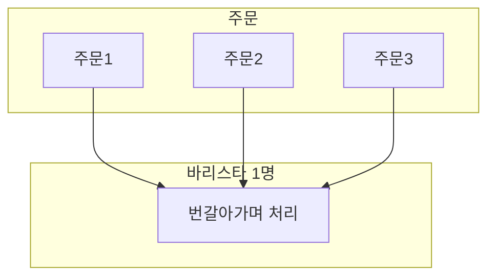
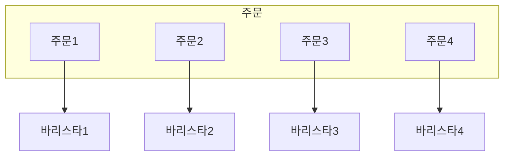

> **📚 FastAPI 시리즈 - Part 1. 기초 개념**
>
> 1. [프로세스 vs 스레드 vs 코루틴](/posts/process-thread-coroutine/)
> 2. 동시성 vs 병렬성 ← 현재 글
> 3. [블로킹 vs 논블로킹 I/O](/posts/blocking-vs-nonblocking-io/)
> 4. [I/O 멀티플렉싱](/posts/io-multiplexing/)

---

# 2. 동시성(Concurrency) vs 병렬성(Parallelism)

## 왜 이 구분이 중요한가?

이 두 개념을 혼동하면:

- "멀티스레딩 썼는데 왜 빨라지지 않지?"
- "async 썼는데 CPU 연산이 왜 느리지?"
- "Python은 멀티코어 활용이 안 된다던데?"

이런 의문에 답을 못한다.

---

## 핵심 차이 (한 줄 정의)

| 구분 | 정의 | 관점 |
|:---:|:---|:---:|
| **동시성 (Concurrency)** | 여러 작업을 "다루는" 것 (dealing with multiple things) | 구조 (Structure) |
| **병렬성 (Parallelism)** | 여러 작업을 "실행하는" 것 (doing multiple things) | 실행 (Execution) |

---

## 비유로 이해하기: 커피숍

### 동시성 - 바리스타 1명



- 커피 내리는 동안 → 다른 주문 받기
- 우유 데우는 동안 → 컵 준비하기
- 한 번에 하나만 "직접" 하지만, 여러 주문을 "관리"

### 병렬성 - 바리스타 4명



- 4개의 주문이 "동시에" 처리됨
- 실제로 같은 순간에 여러 작업이 진행

---

## 시각적 비교

### 순차 실행 (Sequential)

```mermaid
gantt
    title 순차 실행 - 하나 끝나야 다음 시작
    dateFormat X
    axisFormat %s
    section CPU 1
    Task A :0, 3
    Task B :3, 6
    Task C :6, 9
```



- 하나 끝나야 다음 시작
- 동시성 X, 병렬성 X

### 동시성 (Concurrency)

```mermaid
gantt
    title 동시성 - 번갈아가며 실행 (시분할)
    dateFormat X
    axisFormat %s
    section CPU 1
    A :0, 1
    B :1, 2
    A :2, 3
    C :3, 4
    B :4, 5
    C :5, 6
```



- 번갈아가며 실행 (시분할)
- 동시에 "진행 중"인 것처럼 보임
- 동시성 O, 병렬성 X

### 병렬성 (Parallelism)

```mermaid
gantt
    title 병렬성 - 실제로 동시에 실행
    dateFormat X
    axisFormat %s
    section CPU 1
    Task A :0, 3
    section CPU 2
    Task B :0, 3
    section CPU 3
    Task C :0, 3
```



- 실제로 동시에 실행
- 물리적으로 여러 코어 사용
- 동시성 O, 병렬성 O

---

## 동시성과 병렬성의 조합

|  | 병렬성 없음 | 병렬성 있음 |
|:---:|:---:|:---:|
| **동시성 없음** | 순차 실행 (A → B → C) | (불가능) |
| **동시성 있음** | 코루틴, 단일 스레드 (A↔B↔C 번갈아) | 멀티스레드, 멀티프로세스 (A,B,C 동시에) |

---

## Python에서의 구현

### 동시성만 (병렬성 X)

```python
import asyncio
import time

async def task(name, delay):
    print(f"[{time.strftime('%X')}] {name} 시작")
    await asyncio.sleep(delay)  # I/O 대기 시뮬레이션
    print(f"[{time.strftime('%X')}] {name} 완료")
    return name

async def main():
    start = time.time()

    # 3개 태스크를 동시에 실행 (하지만 단일 스레드)
    results = await asyncio.gather(
        task("A", 2),
        task("B", 2),
        task("C", 2),
    )

    print(f"총 소요시간: {time.time() - start:.1f}초")
    # 출력: 총 소요시간: 2.0초 (6초 아님!)

asyncio.run(main())

```

**출력:**

```
[10:00:00] A 시작
[10:00:00] B 시작
[10:00:00] C 시작
[10:00:02] A 완료
[10:00:02] B 완료
[10:00:02] C 완료
총 소요시간: 2.0초

```

**분석:**

| 시간 | Task A | Task B | Task C |
|:---:|:---:|:---:|:---:|
| 0s | 시작 | 시작 | 시작 |
| 0s~2s | 대기중... | 대기중... | 대기중... |
| 2s | 완료 | 완료 | 완료 |
- I/O 대기 시간이 겹쳐서 총 2초만 소요
- 동시성 O, 병렬성 X

### 병렬성 있음 (멀티프로세스)

```python
import multiprocessing
import time

def cpu_task(name):
    print(f"[{time.strftime('%X')}] {name} 시작 (PID: {multiprocessing.current_process().pid})")

    # CPU 집약적 작업
    result = sum(i * i for i in range(10_000_000))

    print(f"[{time.strftime('%X')}] {name} 완료")
    return result

if __name__ == "__main__":
    start = time.time()

    # 4개 프로세스에서 병렬 실행
    with multiprocessing.Pool(4) as pool:
        results = pool.map(cpu_task, ["A", "B", "C", "D"])

    print(f"총 소요시간: {time.time() - start:.1f}초")

```

**4코어 CPU에서 실행 결과:**

```
[10:00:00] A 시작 (PID: 1234)
[10:00:00] B 시작 (PID: 1235)
[10:00:00] C 시작 (PID: 1236)
[10:00:00] D 시작 (PID: 1237)
[10:00:01] A 완료
[10:00:01] B 완료
[10:00:01] C 완료
[10:00:01] D 완료
총 소요시간: 1.2초  (순차 실행 시 4.8초)

```

**분석:**

| Core | Process | 상태 |
|:---:|:---:|:---:|
| Core 1 | Process A | 동시 실행 |
| Core 2 | Process B | 동시 실행 |
| Core 3 | Process C | 동시 실행 |
| Core 4 | Process D | 동시 실행 |
- 실제로 동시에 실행됨
- 동시성 O, 병렬성 O

---

## I/O 바운드 vs CPU 바운드

### I/O 바운드 작업

| 항목 | 내용 |
|:---:|:---|
| **특징** | 대부분의 시간을 대기에 사용 |
| **예시** | DB 쿼리, API 호출, 파일 읽기, 네트워크 요청 |
| **CPU 사용 패턴** | 실행-대기-실행-대기 (대부분 대기) |
| **최적 전략** | 동시성 (async/await, 코루틴) |
| **이유** | 대기 시간에 다른 작업 처리 가능 |

### CPU 바운드 작업

| 항목 | 내용 |
|:---:|:---|
| **특징** | 대부분의 시간을 연산에 사용 |
| **예시** | 이미지 처리, 암호화, ML 추론, 과학 계산 |
| **CPU 사용 패턴** | 100% CPU 사용 (쉬는 시간 없음) |
| **최적 전략** | 병렬성 (멀티프로세싱) |
| **이유** | 여러 코어를 동시에 활용해야 빨라짐 |

---

## Python의 한계: GIL

### 기대 vs 현실

**기대하는 것:**

| Core | Thread | 상태 |
|:---:|:---:|:---:|
| Core 1 | Thread 1 | 병렬 실행 |
| Core 2 | Thread 2 | 병렬 실행 |
| Core 3 | Thread 3 | 병렬 실행 |
| Core 4 | Thread 4 | 병렬 실행 |

→ 4배 빨라지겠지?

**실제 (CPU 바운드 작업):**

```mermaid
gantt
    title GIL로 인한 스레드 번갈아 실행
    dateFormat X
    axisFormat %s
    section Core 1
    Thread1 (GIL) :0, 2
    Thread1 (GIL) :4, 6
    Thread1 (GIL) :8, 10
    section Core 2
    Thread2 (GIL) :2, 4
    Thread2 (GIL) :6, 8
```



| 문제점 | 설명 |
|:---:|:---|
| 순차 실행 | 한 번에 하나의 스레드만 Python 코드 실행 |
| 오버헤드 | 컨텍스트 스위칭 오버헤드만 추가됨 |
| 성능 저하 | 오히려 단일 스레드보다 느릴 수 있음! |

---

## 작업 유형별 Python 선택 가이드

| 작업 유형 | 방법 | 도구 | 효과 |
|:---:|:---:|:---|:---:|
| I/O 바운드 (대기 多) | 비동기 (코루틴) | asyncio, aiohttp, FastAPI | 최적 |
| I/O 바운드 (레거시) | 멀티스레딩 | threading, ThreadPoolExecutor | 양호 |
| CPU 바운드 (연산 多) | 멀티프로세싱 | multiprocessing, ProcessPoolExecutor, joblib | 최적 |
| CPU 바운드 (수치 연산) | C 확장 사용 (GIL 해제) | NumPy, Pandas, Cython | 최적 |

---

## FastAPI에서의 적용

```python
from fastapi import FastAPI
from concurrent.futures import ProcessPoolExecutor, ThreadPoolExecutor
import asyncio
import httpx

app = FastAPI()

# 프로세스 풀 (CPU 바운드용)
process_pool = ProcessPoolExecutor(max_workers=4)

# 스레드 풀 (동기 I/O 라이브러리용)
thread_pool = ThreadPoolExecutor(max_workers=10)

# ─────────────────────────────────────────────────────────────────
# Case 1: I/O 바운드 - 비동기 (최적)
# ─────────────────────────────────────────────────────────────────
@app.get("/io-async")
async def io_async():
    async with httpx.AsyncClient() as client:
        # 여러 API 동시 호출 (동시성)
        responses = await asyncio.gather(
            client.get("https://api.example.com/1"),
            client.get("https://api.example.com/2"),
            client.get("https://api.example.com/3"),
        )
    return {"status": "done"}

# ─────────────────────────────────────────────────────────────────
# Case 2: I/O 바운드 - 동기 라이브러리 사용 시
# ─────────────────────────────────────────────────────────────────
import requests  # 동기 라이브러리

def sync_api_call(url):
    return requests.get(url).json()

@app.get("/io-sync")
async def io_sync():
    loop = asyncio.get_event_loop()
    # 스레드풀에서 실행 (이벤트 루프 블로킹 방지)
    result = await loop.run_in_executor(
        thread_pool,
        sync_api_call,
        "https://api.example.com/data"
    )
    return result

# ─────────────────────────────────────────────────────────────────
# Case 3: CPU 바운드 - 프로세스 풀 (병렬성)
# ─────────────────────────────────────────────────────────────────
def heavy_computation(data):
    # CPU 집약적 작업 (예: 이미지 처리, ML 추론)
    result = sum(i * i for i in range(10_000_000))
    return result

@app.get("/cpu-bound")
async def cpu_bound():
    loop = asyncio.get_event_loop()
    # 별도 프로세스에서 실행 (GIL 우회)
    result = await loop.run_in_executor(
        process_pool,
        heavy_computation,
        "input_data"
    )
    return {"result": result}

```

---

## 실제 시나리오별 선택

| 시나리오 | 최적 선택 | 이유 |
|:---|:---|:---|
| 외부 API 여러 개 호출해서 결과 합치기 | `asyncio.gather()` + `aiohttp` | 동시성으로 충분, 병렬성 불필요 |
| 이미지 100장 리사이즈 | `multiprocessing.Pool` | CPU 바운드이므로 병렬성 필요 |
| DB에서 읽고 → 가공 → 저장 | 읽기/저장: async, 가공: ProcessPool | 혼합 전략 필요 |
| 웹 크롤링 1000페이지 수집 | `aiohttp` + `asyncio` | I/O 바운드, 단일 스레드로 수천 개 동시 요청 가능 |
| ML 모델 추론 서버 | API: FastAPI (async), 추론: ProcessPool 또는 Triton | 역할 분리 |

---

## 성능 비교 실험

```python
import asyncio
import time
from concurrent.futures import ProcessPoolExecutor, ThreadPoolExecutor

# ─────────────────────────────────────────────────────────────────
# I/O 바운드 작업 비교
# ─────────────────────────────────────────────────────────────────

async def io_bound_async():
    """비동기 방식"""
    await asyncio.sleep(1)
    return "done"

def io_bound_sync():
    """동기 방식"""
    time.sleep(1)
    return "done"

async def test_io_bound():
    # 비동기: 10개 동시 실행
    start = time.time()
    await asyncio.gather(*[io_bound_async() for _ in range(10)])
    print(f"비동기 I/O: {time.time() - start:.1f}초")  # ~1초

    # 스레드: 10개 동시 실행
    start = time.time()
    with ThreadPoolExecutor(10) as pool:
        list(pool.map(io_bound_sync, range(10)))
    print(f"스레드 I/O: {time.time() - start:.1f}초")  # ~1초

    # 순차: 10개 순차 실행
    start = time.time()
    for _ in range(10):
        io_bound_sync()
    print(f"순차 I/O: {time.time() - start:.1f}초")  # ~10초

# ─────────────────────────────────────────────────────────────────
# CPU 바운드 작업 비교
# ─────────────────────────────────────────────────────────────────

def cpu_bound():
    """CPU 집약적 작업"""
    return sum(i * i for i in range(5_000_000))

async def test_cpu_bound():
    # 프로세스: 4개 병렬 실행
    start = time.time()
    with ProcessPoolExecutor(4) as pool:
        list(pool.map(cpu_bound, range(4)))
    print(f"프로세스 CPU: {time.time() - start:.1f}초")  # ~0.5초

    # 스레드: 4개 (GIL 때문에 효과 없음)
    start = time.time()
    with ThreadPoolExecutor(4) as pool:
        list(pool.map(cpu_bound, range(4)))
    print(f"스레드 CPU: {time.time() - start:.1f}초")  # ~2초 (더 느림!)

    # 순차: 4개 순차 실행
    start = time.time()
    for _ in range(4):
        cpu_bound()
    print(f"순차 CPU: {time.time() - start:.1f}초")  # ~2초

# 실행
asyncio.run(test_io_bound())
asyncio.run(test_cpu_bound())

```

**예상 결과:**

| 방식 | I/O 바운드 (10개) | CPU 바운드 (4개) |
|:---:|:---:|:---:|
| 비동기/프로세스 | 1.0초 (최적) | 0.5초 (최적) |
| 스레드 | 1.0초 | 2.5초 (GIL 영향) |
| 순차 | 10.0초 | 2.0초 |

---

## 핵심 정리

| 개념 | 핵심 |
|:---:|:---|
| **동시성 (Concurrency)** | 여러 작업을 "번갈아가며" 처리. 하나의 실행 흐름이 여러 작업을 관리. I/O 대기 시간을 활용. |
| **병렬성 (Parallelism)** | 여러 작업을 "동시에" 실행. 여러 실행 흐름이 각자 작업 처리. 여러 CPU 코어를 활용. |
| **I/O 바운드** | 동시성이 효과적 (async/await). 대기 시간에 다른 작업 처리. |
| **CPU 바운드** | 병렬성이 필요 (multiprocessing). Python GIL 우회 필수. |

---

## 추가 내용

## CPU 코어수에 따른 프로세스 수

- 프로세스 ≠ CPU 코어

| 구분 | 프로세스 (Process) | CPU 코어 (Core) |
|:---:|:---:|:---:|
| **본질** | 소프트웨어 (실행 중인 프로그램) | 하드웨어 (물리적 연산 장치) |
| **개수** | 원하는 만큼 생성 가능 | 고정 (예: 4코어, 8코어) |
| **관리 주체** | OS가 생성/종료 | CPU 제조사가 결정 |

### 다양한 시나리오

**프로세스 수 < 코어 수**

```mermaid
gantt
    title 4코어 CPU, 2개 프로세스 → 코어가 남음 (비효율)
    dateFormat X
    axisFormat %s
    section Core 1
    P1 :0, 4
    section Core 2
    P2 :0, 4
    section Core 3
    (idle) :0, 0
    section Core 4
    (idle) :0, 0
```



**프로세스 수 = 코어 수 (이상적)**

```mermaid
gantt
    title 4코어 CPU, 4개 프로세스 → 모든 코어 활용 (최적)
    dateFormat X
    axisFormat %s
    section Core 1
    P1 :0, 4
    section Core 2
    P2 :0, 4
    section Core 3
    P3 :0, 4
    section Core 4
    P4 :0, 4
```



**프로세스 수 > 코어 수**

```mermaid
gantt
    title 4코어 CPU, 8개 프로세스 → 컨텍스트 스위칭 (오버헤드)
    dateFormat X
    axisFormat %s
    section Core 1
    P1 :0, 1
    P5 :1, 2
    P1 :2, 3
    P5 :3, 4
    section Core 2
    P2 :0, 1
    P6 :1, 2
    P2 :2, 3
    P6 :3, 4
    section Core 3
    P3 :0, 1
    P7 :1, 2
    P3 :2, 3
    P7 :3, 4
    section Core 4
    P4 :0, 1
    P8 :1, 2
    P4 :2, 3
    P8 :3, 4
```



---

### OS 스케줄러의 역할

| 역할 | 설명 |
|:---:|:---|
| **할당** | 어떤 프로세스를 어떤 코어에서 실행할지 결정 |
| **시분할** | 프로세스가 코어보다 많으면 번갈아 실행 |
| **로드 밸런싱** | 코어 간 작업량 균등 분배 |
| **우선순위** | 중요한 프로세스 먼저 실행 |