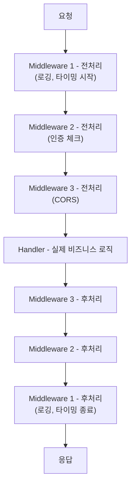
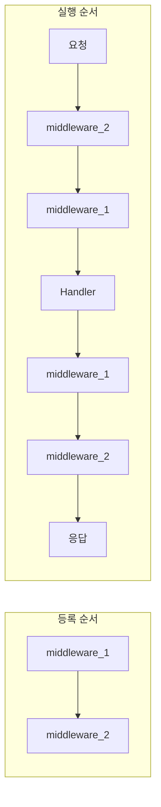

> **📚 FastAPI 시리즈 - Part 4. FastAPI 핵심 구성요소**
>
> 1. [Starlette 프레임워크](/posts/starlette/)
> 2. [Pydantic 데이터 검증](/posts/pydantic/)
> 3. [타입 힌트와 런타임 검증](/posts/type-hints-runtime/)
> 4. [의존성 주입 (Dependency Injection)](/posts/dependency-injection/)
> 5. 미들웨어 동작 방식 ← 현재 글

---

# 5. 미들웨어 동작 방식

## 왜 이 개념이 중요한가?

- 요청/응답 파이프라인을 커스터마이징
- 인증, 로깅, CORS, 압축 등 공통 처리
- 모든 요청에 적용되는 로직 구현

---

## 미들웨어란?

### 한 줄 정의

**요청이 핸들러에 도달하기 전/후에 실행되는 코드**

### 시각화



---

## 미들웨어 작성법

### 방법 1: 데코레이터 (@app.middleware)

```python
from fastapi import FastAPI, Request
import time

app = FastAPI()

@app.middleware("http")
async def add_process_time(request: Request, call_next):
    # 전처리
    start_time = time.time()

    # 다음 미들웨어/핸들러 호출
    response = await call_next(request)

    # 후처리
    process_time = time.time() - start_time
    response.headers["X-Process-Time"] = str(process_time)

    return response

```

### 방법 2: BaseHTTPMiddleware 클래스

```python
from starlette.middleware.base import BaseHTTPMiddleware
from fastapi import Request

class TimingMiddleware(BaseHTTPMiddleware):
    async def dispatch(self, request: Request, call_next):
        start_time = time.time()
        response = await call_next(request)
        process_time = time.time() - start_time
        response.headers["X-Process-Time"] = str(process_time)
        return response

# 등록
app.add_middleware(TimingMiddleware)

```

### 방법 3: 순수 ASGI 미들웨어 (고성능)

```python
class PureASGIMiddleware:
    def __init__(self, app):
        self.app = app

    async def __call__(self, scope, receive, send):
        if scope["type"] != "http":
            await self.app(scope, receive, send)
            return

        # 전처리
        print(f"Request: {scope['path']}")

        # 다음 앱 호출
        await self.app(scope, receive, send)

        # 후처리 (응답 후)
        print("Response sent")

# 등록
app.add_middleware(PureASGIMiddleware)

```

---

## 등록 순서 주의

### 등록 순서 vs 실행 순서

```python
app = FastAPI()

@app.middleware("http")
async def middleware_1(request, call_next):
    print("1 - 전처리")
    response = await call_next(request)
    print("1 - 후처리")
    return response

@app.middleware("http")
async def middleware_2(request, call_next):
    print("2 - 전처리")
    response = await call_next(request)
    print("2 - 후처리")
    return response

```

```
출력:
2 - 전처리    ← 나중에 등록된 것이 먼저 실행!
1 - 전처리
(핸들러 실행)
1 - 후처리
2 - 후처리

```

### 시각화



> 나중에 등록된 것이 바깥쪽 (양파 껍질처럼)

---

## 미들웨어 vs 의존성 (Depends)

### 비교

| 항목 | 미들웨어 | 의존성 (Depends) |
|:---:|:---:|:---:|
| 적용 범위 | 모든 요청 | 특정 엔드포인트 |
| 실행 시점 | 라우팅 전 | 라우팅 후 |
| 응답 수정 | O 가능 | X 불가 |
| Request 객체 | 직접 접근 | 직접 접근 |
| 값 반환 | Response | 어떤 값이든 |
| 용도 | 전역 처리 | 특정 기능 주입 |

### 언제 뭘 써야 하나?

| 상황 | 권장 |
|:---:|:---:|
| 모든 요청 로깅 | 미들웨어 |
| 모든 요청 타이밍 측정 | 미들웨어 |
| CORS, 압축 | 미들웨어 |
| 응답 헤더 추가 | 미들웨어 |
| 특정 엔드포인트 인증 | 의존성 |
| DB 세션 주입 | 의존성 |
| 페이지네이션 | 의존성 |

### 인증: 미들웨어 vs 의존성

```python
# 미들웨어: 모든 요청에 적용
@app.middleware("http")
async def auth_middleware(request: Request, call_next):
    if not request.headers.get("Authorization"):
        return JSONResponse(status_code=401, content={"detail": "Unauthorized"})
    response = await call_next(request)
    return response

# 의존성: 특정 엔드포인트만
async def get_current_user(token: str = Header()):
    # 검증 로직
    return user

@app.get("/profile")
async def profile(user = Depends(get_current_user)):  # 이 엔드포인트만 인증 필요
    return user

@app.get("/public")
async def public():  # 인증 불필요
    return {"message": "public"}

```

---

## 내장 미들웨어

### CORSMiddleware

```python
from fastapi.middleware.cors import CORSMiddleware

app.add_middleware(
    CORSMiddleware,
    allow_origins=["https://example.com"],  # 허용 도메인
    allow_credentials=True,
    allow_methods=["*"],                     # 허용 메서드
    allow_headers=["*"],                     # 허용 헤더
)

```

### GZipMiddleware

```python
from starlette.middleware.gzip import GZipMiddleware

app.add_middleware(
    GZipMiddleware,
    minimum_size=1000  # 1KB 이상만 압축
)

```

### TrustedHostMiddleware

```python
from starlette.middleware.trustedhost import TrustedHostMiddleware

app.add_middleware(
    TrustedHostMiddleware,
    allowed_hosts=["example.com", "*.example.com"]
)

```

### HTTPSRedirectMiddleware

```python
from starlette.middleware.httpsredirect import HTTPSRedirectMiddleware

app.add_middleware(HTTPSRedirectMiddleware)
# HTTP → HTTPS 자동 리다이렉트

```

---

## 실전 미들웨어 패턴

### 1. 요청/응답 로깅

```python
import logging
import time
from fastapi import Request

logger = logging.getLogger(__name__)

@app.middleware("http")
async def logging_middleware(request: Request, call_next):
    # 요청 로깅
    start_time = time.time()

    # 요청 정보
    logger.info(f"Request: {request.method} {request.url.path}")

    response = await call_next(request)

    # 응답 로깅
    duration = time.time() - start_time
    logger.info(f"Response: {response.status_code} ({duration:.3f}s)")

    return response

```

### 2. 요청 ID 추가

```python
import uuid
from fastapi import Request

@app.middleware("http")
async def request_id_middleware(request: Request, call_next):
    # 요청 ID 생성
    request_id = str(uuid.uuid4())

    # request.state에 저장 (핸들러에서 접근 가능)
    request.state.request_id = request_id

    response = await call_next(request)

    # 응답 헤더에 추가
    response.headers["X-Request-ID"] = request_id

    return response

# 핸들러에서 사용
@app.get("/")
async def root(request: Request):
    return {"request_id": request.state.request_id}

```

### 3. 예외 처리

```python
from fastapi import Request
from fastapi.responses import JSONResponse

@app.middleware("http")
async def exception_middleware(request: Request, call_next):
    try:
        return await call_next(request)
    except Exception as e:
        # 모든 예외를 잡아서 일관된 형식으로 응답
        return JSONResponse(
            status_code=500,
            content={
                "error": "Internal Server Error",
                "detail": str(e)
            }
        )

```

### 4. 요청 본문 로깅 (주의: 성능 영향)

```python
from fastapi import Request

@app.middleware("http")
async def log_request_body(request: Request, call_next):
    # 본문 읽기 (주의: 한 번만 읽을 수 있음)
    body = await request.body()

    if body:
        print(f"Request body: {body.decode()}")

    # 본문을 다시 읽을 수 있도록 처리 필요
    # (실제로는 더 복잡한 처리 필요)

    response = await call_next(request)
    return response

```

### 5. Rate Limiting (간단한 구현)

```python
from fastapi import Request, HTTPException
from collections import defaultdict
import time

# 간단한 인메모리 저장 (프로덕션에서는 Redis 사용)
request_counts = defaultdict(list)

@app.middleware("http")
async def rate_limit_middleware(request: Request, call_next):
    client_ip = request.client.host
    current_time = time.time()
    window = 60  # 1분
    max_requests = 100  # 분당 100회

    # 오래된 기록 제거
    request_counts[client_ip] = [
        t for t in request_counts[client_ip]
        if current_time - t < window
    ]

    # 제한 체크
    if len(request_counts[client_ip]) >= max_requests:
        return JSONResponse(
            status_code=429,
            content={"detail": "Too many requests"}
        )

    # 요청 기록
    request_counts[client_ip].append(current_time)

    return await call_next(request)

```

---

## 응답 본문 수정

### 주의: BaseHTTPMiddleware의 한계

```python
# BaseHTTPMiddleware에서는 응답 본문 수정이 까다로움
# StreamingResponse로 이미 전송이 시작되기 때문

class ModifyResponseMiddleware(BaseHTTPMiddleware):
    async def dispatch(self, request: Request, call_next):
        response = await call_next(request)

        # 이 시점에서 response.body를 직접 수정하기 어려움
        # 헤더만 수정 가능
        response.headers["X-Modified"] = "true"

        return response

```

### 응답 본문 수정이 필요하면: 순수 ASGI

```python
class ResponseModifierMiddleware:
    def __init__(self, app):
        self.app = app

    async def __call__(self, scope, receive, send):
        if scope["type"] != "http":
            await self.app(scope, receive, send)
            return

        # 응답을 가로채기 위한 상태
        response_started = False
        initial_message = {}
        body_parts = []

        async def send_wrapper(message):
            nonlocal response_started, initial_message

            if message["type"] == "http.response.start":
                response_started = True
                initial_message = message
                return

            if message["type"] == "http.response.body":
                body = message.get("body", b"")
                body_parts.append(body)

                if not message.get("more_body", False):
                    # 모든 본문 수집 완료, 수정 후 전송
                    full_body = b"".join(body_parts)
                    modified_body = full_body.upper()  # 예: 대문자로 변환

                    await send(initial_message)
                    await send({
                        "type": "http.response.body",
                        "body": modified_body,
                    })

        await self.app(scope, receive, send_wrapper)

```

---

## 미들웨어 실행 흐름 디버깅

```python
@app.middleware("http")
async def debug_middleware(request: Request, call_next):
    print(f"[1] 요청 시작: {request.method} {request.url.path}")
    print(f"[2] 헤더: {dict(request.headers)}")

    response = await call_next(request)

    print(f"[3] 응답 상태: {response.status_code}")
    print(f"[4] 응답 헤더: {dict(response.headers)}")

    return response

```

---

## 핵심 정리

| 개념 | 설명 |
|:---:|:---:|
| **미들웨어** | 모든 요청/응답에 적용되는 코드 |
| **call_next** | 다음 미들웨어/핸들러 호출 |
| **등록 순서** | 나중 등록 = 바깥쪽 (먼저 실행) |
| **전처리** | call_next 호출 전 |
| **후처리** | call_next 호출 후 |

### 미들웨어 vs 의존성

| 미들웨어 | 의존성 |
|:---:|:---:|
| 모든 요청 | 특정 엔드포인트 |
| 응답 수정 가능 | 값 주입 |
| 라우팅 전 | 라우팅 후 |

### 주요 내장 미들웨어

| 미들웨어 | 용도 |
|:---:|:---:|
| CORSMiddleware | CORS 처리 |
| GZipMiddleware | 응답 압축 |
| TrustedHostMiddleware | 호스트 검증 |
| HTTPSRedirectMiddleware | HTTPS 강제 |