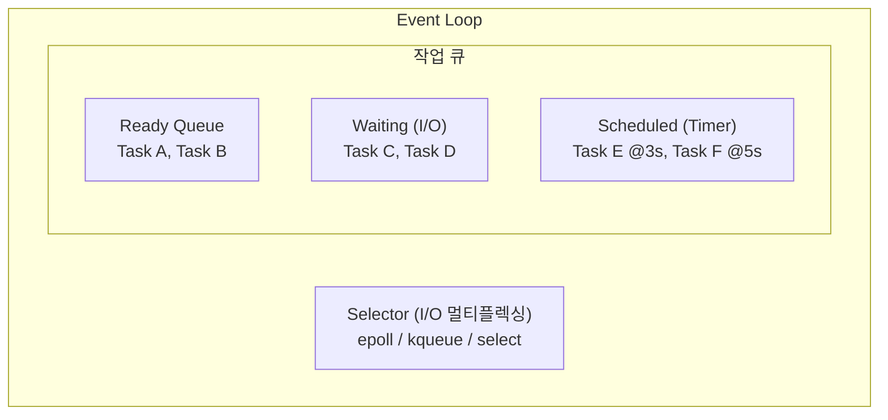
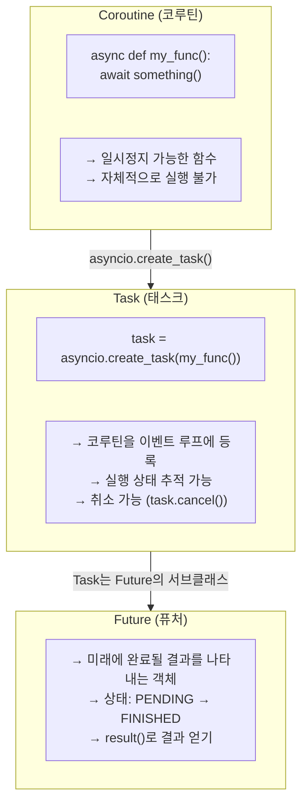
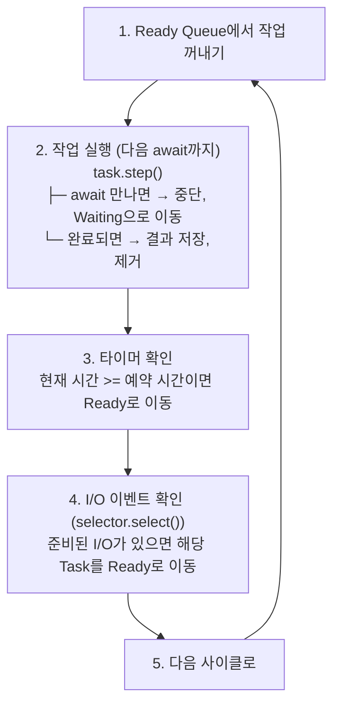
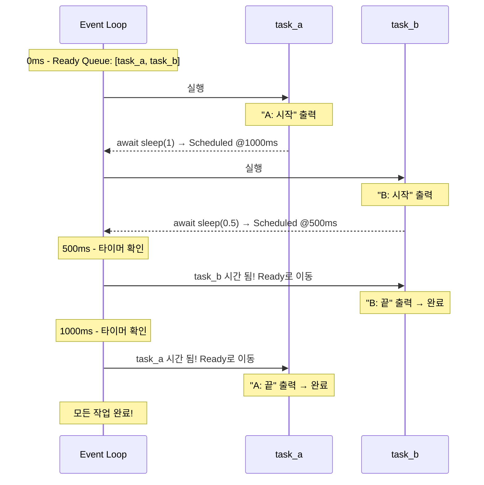
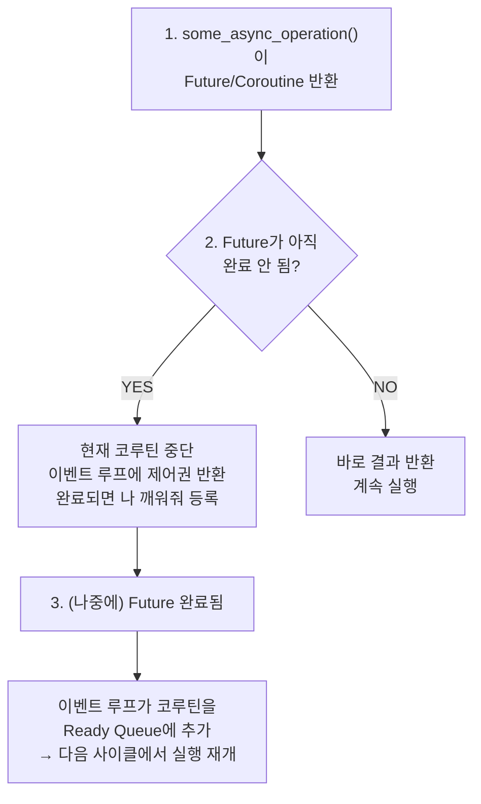
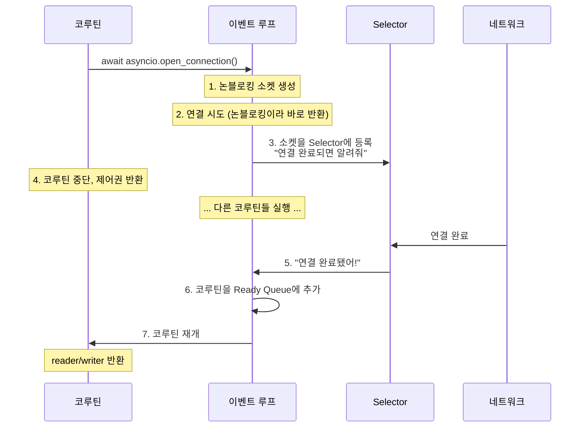

> **📚 FastAPI 시리즈 - Part 2. Python 특수성**
>
> 1. [GIL (Global Interpreter Lock)](/posts/python-gil/)
> 2. [Python 스레드 동작 구조](/posts/python-thread-structure/)
> 3. 이벤트 루프 (asyncio) ← 현재 글
> 4. [Generator, yield와 async/await 코루틴](/posts/python-generator-coroutine/)

---

# 3. 이벤트 루프 (asyncio)

## 왜 이 개념이 중요한가?

지금까지 배운 내용:

- `await`에서 코루틴이 양보한다
- 이벤트 루프가 코루틴을 관리한다
- I/O 멀티플렉싱으로 준비된 I/O를 감지한다

**이번 주제:** 이벤트 루프가 실제로 어떻게 동작하는지 내부를 들여다보자!

---

## 이벤트 루프란?

### 한 줄 정의

**무한 루프를 돌면서 "실행 가능한 작업"을 찾아 실행하는 스케줄러**

### 의사 코드

```python
# 이벤트 루프의 본질 (극도로 단순화)
while True:
    # 1. 실행 준비된 작업 가져오기
    ready_tasks = get_ready_tasks()

    # 2. 각 작업 실행
    for task in ready_tasks:
        task.run_one_step()

    # 3. I/O 이벤트 확인 (epoll/kqueue)
    io_events = check_io_events()

    # 4. I/O 완료된 작업을 ready로 이동
    for event in io_events:
        mark_task_ready(event.task)

```

---

## 핵심 구성 요소



| 구성 요소 | 역할 |
|:---:|:---|
| **Ready Queue** | 지금 바로 실행 가능한 작업들 |
| **Waiting (I/O)** | I/O 완료를 기다리는 작업들 |
| **Scheduled (Timer)** | 특정 시간에 실행될 작업들 |
| **Selector** | I/O 이벤트 감지 (epoll/kqueue) |

---

## Coroutine, Task, Future 관계

### 계층 구조



### 비유

| 개념 | 비유 |
|:---:|:---|
| Coroutine | 레시피 (요리법) |
| Task | 주문서 (레시피 + 실행 정보) |
| Future | 영수증 (결과를 받을 수 있는 약속) |

---

## 이벤트 루프 실행 흐름

### 단계별 동작



---

## 실제 코드로 이해하기

### 간단한 예시

```python
import asyncio

async def task_a():
    print("A: 시작")
    await asyncio.sleep(1)  # 여기서 양보
    print("A: 끝")

async def task_b():
    print("B: 시작")
    await asyncio.sleep(0.5)  # 여기서 양보
    print("B: 끝")

async def main():
    await asyncio.gather(task_a(), task_b())

asyncio.run(main())

```

### 이벤트 루프 내부 동작



**출력:**

```
A: 시작
B: 시작
B: 끝      (0.5초 후)
A: 끝      (1초 후)
```

---

## await의 내부 동작

### await가 하는 일

```python
async def fetch_data():
    # await 실행 시 내부 동작
    result = await some_async_operation()

```



---

## I/O 작업의 내부 동작

### 네트워크 요청 예시

```python
async def fetch_url(url):
    reader, writer = await asyncio.open_connection('example.com', 80)
    writer.write(b'GET / HTTP/1.1\r\n\r\n')
    data = await reader.read(1024)
    return data

```

### 내부 동작



---

## asyncio.gather vs asyncio.create_task

### gather

```python
# 여러 코루틴을 동시에 실행하고 모든 결과를 기다림
results = await asyncio.gather(
    fetch_url("http://a.com"),
    fetch_url("http://b.com"),
    fetch_url("http://c.com"),
)

```

### create_task

```python
# Task 객체를 얻어서 더 세밀한 제어 가능
task1 = asyncio.create_task(fetch_url("http://a.com"))
task2 = asyncio.create_task(fetch_url("http://b.com"))

# 나중에 결과 수집
result1 = await task1
result2 = await task2

```

### 차이점

| 항목 | gather | create_task |
|:---:|:---|:---|
| 반환값 | 결과 리스트 | Task 객체 |
| 실행 시점 | await 시 동시 시작 | create_task() 호출 즉시 시작 |
| 예외 처리 | 하나 실패 시 전체 실패 (기본) | 개별 처리 가능 |
| 취소 | 전체 취소 | 개별 취소 가능 |
| 사용 시점 | 단순히 동시 실행 | 세밀한 제어 필요 시 |

---

## 이벤트 루프 직접 접근

### 현재 이벤트 루프 얻기

```python
import asyncio

async def main():
    # 현재 실행 중인 이벤트 루프
    loop = asyncio.get_running_loop()

    # 루프 정보 확인
    print(f"실행 중: {loop.is_running()}")
    print(f"닫힘: {loop.is_closed()}")

asyncio.run(main())

```

### 저수준 API 사용

```python
import asyncio

async def main():
    loop = asyncio.get_running_loop()

    # 콜백 예약 (다음 사이클에 실행)
    loop.call_soon(lambda: print("곧 실행!"))

    # 지연 실행
    loop.call_later(1.0, lambda: print("1초 후 실행!"))

    # 특정 시간에 실행
    loop.call_at(loop.time() + 2.0, lambda: print("2초 후 실행!"))

    await asyncio.sleep(3)

asyncio.run(main())

```

---

## 이벤트 루프 단순 구현

### 직접 만들어보기 (교육용)

```python
import time
from collections import deque

class SimpleEventLoop:
    def __init__(self):
        self.ready = deque()      # 실행 준비된 작업
        self.scheduled = []       # 타이머 작업

    def call_soon(self, callback):
        """다음 사이클에 실행할 작업 등록"""
        self.ready.append(callback)

    def call_later(self, delay, callback):
        """delay초 후에 실행할 작업 등록"""
        when = time.time() + delay
        self.scheduled.append((when, callback))
        self.scheduled.sort(key=lambda x: x[0])

    def run_forever(self):
        """이벤트 루프 실행"""
        while self.ready or self.scheduled:

            # 1. 타이머 확인: 시간 된 작업을 ready로 이동
            now = time.time()
            while self.scheduled and self.scheduled[0][0] <= now:
                _, callback = self.scheduled.pop(0)
                self.ready.append(callback)

            # 2. ready 작업 실행
            while self.ready:
                callback = self.ready.popleft()
                callback()

            # 3. 다음 타이머까지 대기 (CPU 낭비 방지)
            if self.scheduled:
                sleep_time = self.scheduled[0][0] - time.time()
                if sleep_time > 0:
                    time.sleep(min(sleep_time, 0.1))

# 사용 예시
loop = SimpleEventLoop()
loop.call_soon(lambda: print("즉시 실행 1"))
loop.call_soon(lambda: print("즉시 실행 2"))
loop.call_later(1.0, lambda: print("1초 후"))
loop.call_later(0.5, lambda: print("0.5초 후"))
loop.run_forever()

```

**출력:**

```
즉시 실행 1
즉시 실행 2
0.5초 후
1초 후

```

---

## uvloop (고성능 이벤트 루프)

### 기본 asyncio vs uvloop (사용권장)

| 항목 | asyncio (기본) | uvloop |
|:---:|:---|:---|
| 구현 | 순수 Python + C | Cython + libuv |
| 성능 | 기준 | 2~4배 빠름 |
| 호환성 | 표준 | asyncio 호환 |
| 사용처 | 기본 | Uvicorn 기본값 |

### 사용법

```python
import asyncio
import uvloop

# 방법 1: 전역 설정
uvloop.install()

# 방법 2: 특정 루프만
async def main():
    pass

loop = uvloop.new_event_loop()
asyncio.set_event_loop(loop)
loop.run_until_complete(main())

```

### Uvicorn에서

```bash
# uvloop 자동 사용 (설치되어 있으면)
uvicorn app:app --loop uvloop

```

---

## 디버깅 팁

### 느린 콜백 감지

```python
import asyncio

# 느린 콜백 경고 활성화
loop = asyncio.get_event_loop()
loop.slow_callback_duration = 0.1  # 100ms 이상 걸리면 경고

# 디버그 모드 활성화
asyncio.run(main(), debug=True)

```

### 현재 Task 확인

```python
import asyncio

async def my_task():
    current = asyncio.current_task()
    print(f"현재 Task: {current.get_name()}")

    all_tasks = asyncio.all_tasks()
    print(f"모든 Task: {[t.get_name() for t in all_tasks]}")

asyncio.run(my_task())

```

---

## 핵심 정리

| 개념 | 설명 |
|:---:|:---|
| **이벤트 루프** | Ready/Waiting/Scheduled 큐를 관리하는 무한 루프 |
| **Coroutine** | 일시정지 가능한 함수 |
| **Task** | 이벤트 루프에 등록된 코루틴 |
| **Future** | 미래 결과를 나타내는 객체 |
| **await** | 중단점 생성 + 이벤트 루프에 제어권 반환 |
| **Selector** | I/O 이벤트 감지 (epoll/kqueue) |