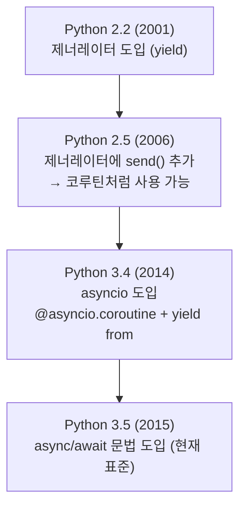
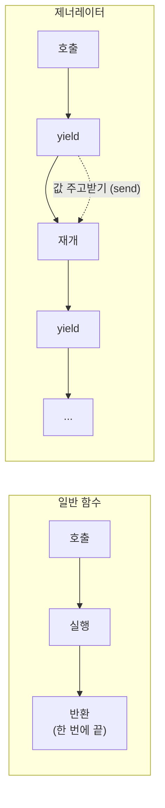
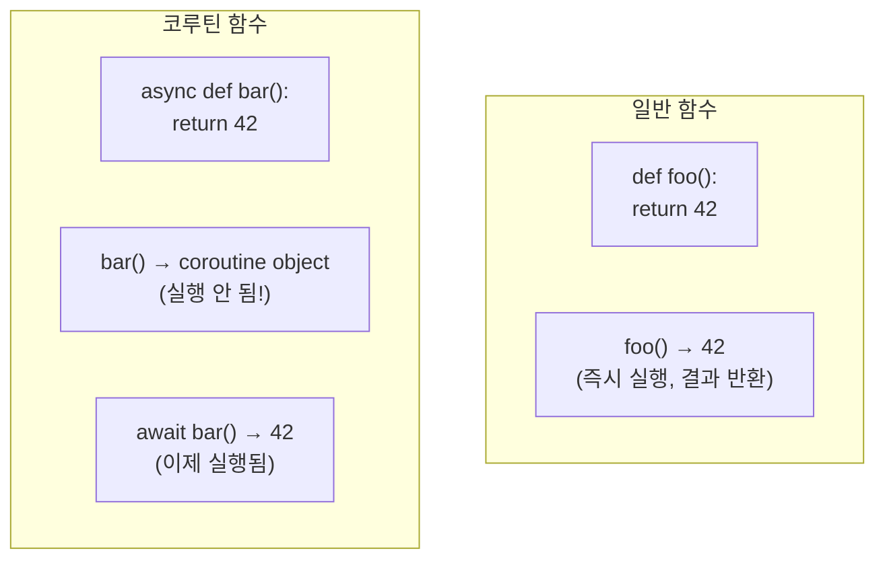
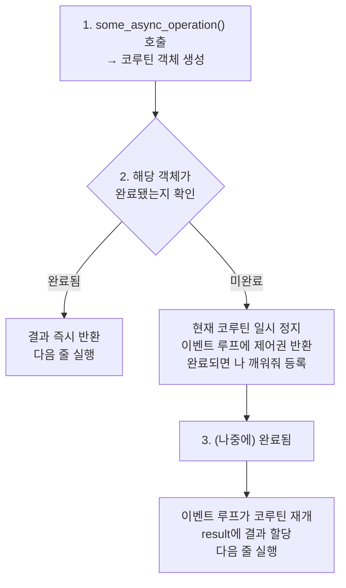

> **📚 FastAPI 시리즈 - Part 2. Python 특수성**
>
> 1. [GIL (Global Interpreter Lock)](/posts/python-gil/)
> 2. [Python 스레드 동작 구조](/posts/python-thread-structure/)
> 3. [이벤트 루프 (asyncio)](/posts/python-event-loop/)
> 4. Generator, yield와 async/await 코루틴 ← 현재 글

---

# 4. Generator, yield와 async/await 코루틴

## 왜 이 개념이 중요한가?

지금까지 async/await를 사용해왔지만:

- 정확히 어떻게 동작하는지
- 제너레이터와 어떤 관계인지
- 흔히 하는 실수는 무엇인지

깊이 이해하면 더 효과적으로 사용할 수 있다.

---

## 코루틴의 역사

### 제너레이터 → 코루틴 → async/await



---

## 제너레이터 복습

### 기본 제너레이터

```python
def gen():
    print("시작")
    yield 1
    print("중간")
    yield 2
    print("끝")

g = gen()           # 제너레이터 객체 생성 (실행 안 됨)
print(next(g))      # "시작" 출력, 1 반환
print(next(g))      # "중간" 출력, 2 반환
print(next(g))      # "끝" 출력, StopIteration 발생

```

### 제너레이터의 특징

| 특징 | 설명 |
|:---:|:---|
| 지연 실행 | 호출해도 바로 실행 안 됨 |
| 일시 정지 | yield에서 멈춤 |
| 상태 유지 | 멈춘 위치 기억 |
| 재개 가능 | next()로 이어서 실행 |

---

## 제너레이터 → 코루틴

### send()로 값 전달

```python
def coro():
    print("시작")
    x = yield        # 값을 받을 수 있음
    print(f"받은 값: {x}")
    y = yield
    print(f"받은 값: {y}")

c = coro()
next(c)              # "시작" 출력, 첫 yield까지
c.send(10)           # "받은 값: 10" 출력
c.send(20)           # "받은 값: 20" 출력

```

### 이것이 코루틴의 원형!



→ 이 특성을 이용해 "비동기 프로그래밍" 구현

---

## 옛날 스타일 vs 현대 스타일

### Python 3.4 (옛날)

```python
import asyncio

@asyncio.coroutine
def old_style():
    print("시작")
    yield from asyncio.sleep(1)
    print("끝")
    return "결과"

# 실행
loop = asyncio.get_event_loop()
result = loop.run_until_complete(old_style())

```

### Python 3.5+ (현대)

```python
import asyncio

async def new_style():
    print("시작")
    await asyncio.sleep(1)
    print("끝")
    return "결과"

# 실행
result = asyncio.run(new_style())

```

### 대응 관계

| 옛날 | 현대 |
|:---:|:---:|
| `@asyncio.coroutine` | `async def` |
| `yield from` | `await` |

---

## async def의 정체

### 코루틴 함수 vs 코루틴 객체

```python
async def my_coroutine():
    return 42

# async def는 "코루틴 함수"
print(my_coroutine)           # <function my_coroutine at 0x...>

# 호출하면 "코루틴 객체" 생성 (실행 안 됨!)
coro = my_coroutine()
print(coro)                   # <coroutine object my_coroutine at 0x...>

# 실행하려면 await 또는 이벤트 루프 필요
result = await coro           # 이제야 실행!

```

### 핵심: 호출 ≠ 실행



---

## await의 정체

### await가 할 수 있는 것

```python
# 1. 코루틴
async def coro():
    return 42

await coro()  # ✅

# 2. Task
task = asyncio.create_task(coro())
await task    # ✅

# 3. Future
future = asyncio.Future()
await future  # ✅

# 4. Awaitable 객체 (__await__ 메서드 구현)
await some_awaitable  # ✅

```

### await의 동작

```python
async def example():
    result = await some_async_operation()
    return result

```



---

## 흔한 실수들

### 1. await 빼먹기

```python
async def fetch():
    return "data"

async def main():
    # ❌ await 빼먹음
    result = fetch()
    print(result)  # <coroutine object fetch at 0x...>

    # ✅ 올바른 사용
    result = await fetch()
    print(result)  # "data"

```

**경고 메시지:**

```
RuntimeWarning: coroutine 'fetch' was never awaited

```

### 2. async def 안에서 블로킹 호출

```python
import requests

# ❌ 이벤트 루프 블로킹
async def bad():
    response = requests.get(url)  # 블로킹!
    return response.json()

# ✅ 비동기 라이브러리 사용
import httpx

async def good():
    async with httpx.AsyncClient() as client:
        response = await client.get(url)
    return response.json()

```

### 3. 동기 함수에서 await 사용

```python
# ❌ SyntaxError
def normal_function():
    await asyncio.sleep(1)  # async def가 아니면 await 사용 불가!

# ✅ async def 사용
async def async_function():
    await asyncio.sleep(1)

```

### 4. 코루틴을 실행 안 하고 그냥 반환

```python
async def fetch():
    return "data"

# ❌ 코루틴 객체만 만들고 실행 안 함
def bad():
    return fetch()  # <coroutine object>를 반환

# ✅ 방법 1: async def로 만들고 await
async def good1():
    return await fetch()

# ✅ 방법 2: Task로 만들기
async def good2():
    task = asyncio.create_task(fetch())
    return await task

```

### 5. asyncio.run() 중첩 호출

```python
async def inner():
    return 42

async def outer():
    # ❌ 이미 이벤트 루프 실행 중인데 또 run()
    result = asyncio.run(inner())  # RuntimeError!

    # ✅ 그냥 await
    result = await inner()

asyncio.run(outer())

```

---

## async for / async with

### async for (비동기 이터레이터)

```python
async def async_generator():
    for i in range(3):
        await asyncio.sleep(0.1)
        yield i

async def main():
    async for item in async_generator():
        print(item)

# 출력: 0, 1, 2 (각각 0.1초 간격)

```

### async with (비동기 컨텍스트 매니저)

```python
import aiofiles

async def main():
    # 비동기 파일 열기
    async with aiofiles.open('file.txt', 'r') as f:
        content = await f.read()

    # 비동기 HTTP 클라이언트
    async with httpx.AsyncClient() as client:
        response = await client.get(url)

```

### 일반 vs 비동기 비교

| 동기 | 비동기 |
|:---:|:---:|
| `for` | `async for` |
| `with` | `async with` |
| `__iter__` | `__aiter__` |
| `__enter__` | `__aenter__` |
| `__exit__` | `__aexit__` |

---

## 동시 실행 패턴

### 순차 실행 (느림)

```python
async def main():
    # 순차 실행: 3초 소요
    result1 = await fetch(url1)  # 1초
    result2 = await fetch(url2)  # 1초
    result3 = await fetch(url3)  # 1초

```

### 동시 실행 - gather

```python
async def main():
    # 동시 실행: 1초 소요
    result1, result2, result3 = await asyncio.gather(
        fetch(url1),
        fetch(url2),
        fetch(url3),
    )

```

### 동시 실행 - create_task

```python
async def main():
    # Task 생성 (즉시 스케줄링)
    task1 = asyncio.create_task(fetch(url1))
    task2 = asyncio.create_task(fetch(url2))
    task3 = asyncio.create_task(fetch(url3))

    # 결과 수집
    result1 = await task1
    result2 = await task2
    result3 = await task3

```

### 비교

| 패턴 | 시작 시점 | 사용 상황 |
|:---:|:---:|:---|
| 순차 await | 이전 완료 후 | 의존성 있을 때 |
| gather | 동시 | 단순히 동시 실행 |
| create_task | 즉시 | 세밀한 제어 필요 |

---

## 예외 처리

### 단일 코루틴

```python
async def risky():
    raise ValueError("에러!")

async def main():
    try:
        await risky()
    except ValueError as e:
        print(f"잡았다: {e}")

```

### gather에서 예외

```python
async def main():
    # 기본: 하나라도 실패하면 전체 실패
    try:
        results = await asyncio.gather(
            fetch(url1),
            risky(),      # 에러 발생!
            fetch(url3),
        )
    except ValueError:
        print("실패!")

    # return_exceptions=True: 예외도 결과로 반환
    results = await asyncio.gather(
        fetch(url1),
        risky(),
        fetch(url3),
        return_exceptions=True
    )
    # results = ["data1", ValueError("에러!"), "data3"]

```

### Task 취소

```python
async def long_task():
    try:
        await asyncio.sleep(100)
    except asyncio.CancelledError:
        print("취소됨! 정리 작업...")
        raise  # 취소 예외 다시 발생

async def main():
    task = asyncio.create_task(long_task())

    await asyncio.sleep(1)
    task.cancel()  # 취소 요청

    try:
        await task
    except asyncio.CancelledError:
        print("태스크 취소 완료")

```

| 케이스 | 설명 |
|:---:|:---|
| 타임아웃 | 너무 오래 걸리면 취소 |
| 사용자 취소 | 클라이언트 연결 끊김 등 |
| 경쟁 상황 | 하나 성공하면 나머지 취소 |
| 서버 종료 | 실행 중인 Task 정리 |

---

## 타임아웃

### asyncio.wait_for

```python
async def slow_operation():
    await asyncio.sleep(10)
    return "결과"

async def main():
    try:
        result = await asyncio.wait_for(
            slow_operation(),
            timeout=2.0
        )
    except asyncio.TimeoutError:
        print("시간 초과!")

```

### asyncio.timeout (Python 3.11+)

```python
async def main():
    try:
        async with asyncio.timeout(2.0):
            await slow_operation()
    except asyncio.TimeoutError:
        print("시간 초과!")

```

---

## 코루틴 내부 동작 (심화)

### 코루틴은 제너레이터의 확장

```python
# 코루틴 객체의 메서드
coro = my_coroutine()

coro.send(None)     # 실행/재개 (제너레이터와 동일)
coro.throw(exc)     # 예외 전달
coro.close()        # 종료

```

### **await** 프로토콜

```python
class MyAwaitable:
    def __await__(self):
        yield  # 일시 정지 지점
        return "결과"

async def main():
    result = await MyAwaitable()
    print(result)  # "결과"

```

---

## 핵심 정리

| 개념 | 설명 |
|:---:|:---|
| `async def` | 코루틴 함수 정의 |
| 코루틴 객체 | `async def` 호출 결과, 실행은 안 됨 |
| `await` | 코루틴 실행 + 완료까지 대기 |
| `async for` | 비동기 이터레이션 |
| `async with` | 비동기 컨텍스트 매니저 |

### 흔한 실수 체크리스트

| 실수 | 증상 | 해결 |
|:---:|:---:|:---|
| await 빼먹음 | RuntimeWarning | await 추가 |
| 블로킹 호출 | 전체 느려짐 | 비동기 라이브러리 사용 |
| asyncio.run() 중첩 | RuntimeError | await로 변경 |
| 순차 await | 불필요하게 느림 | gather/create_task |
