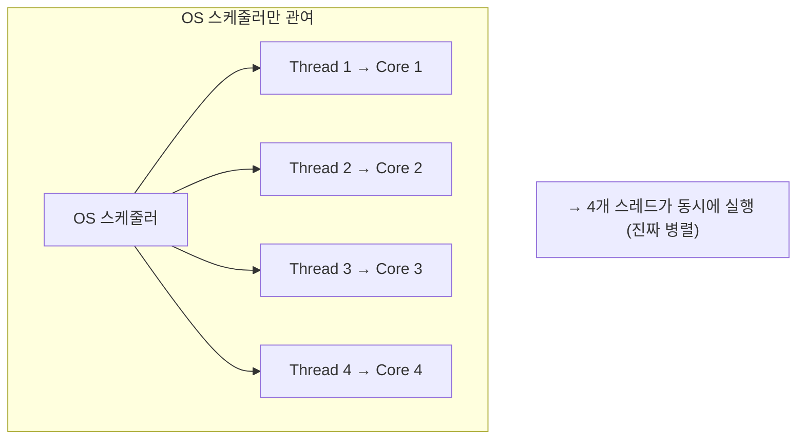
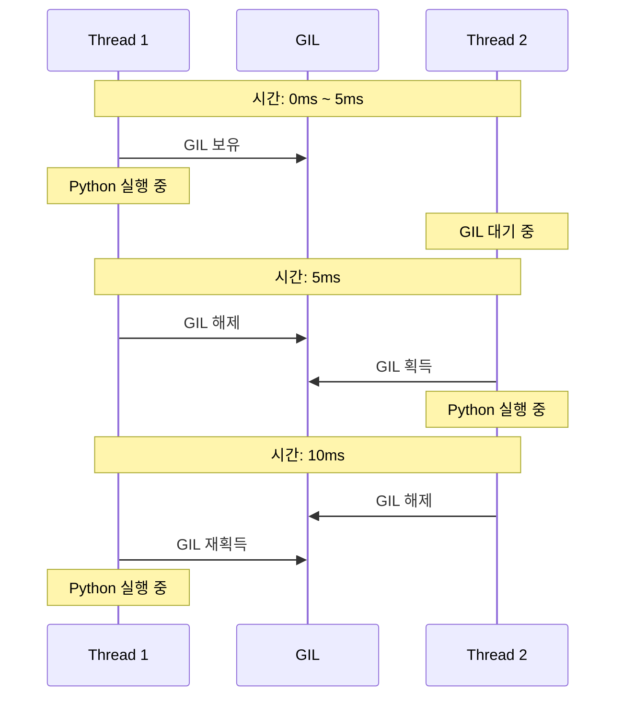
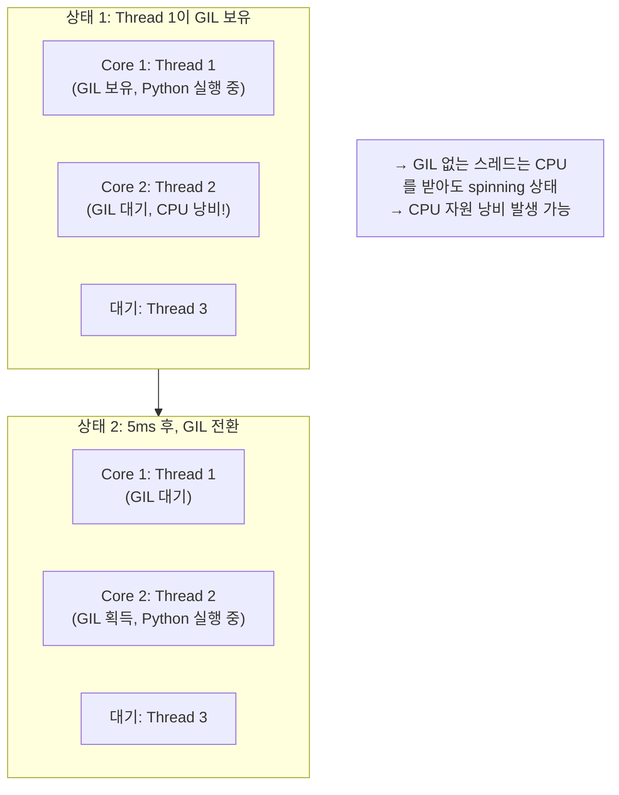
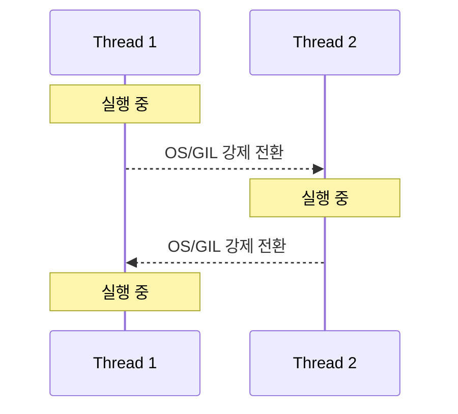
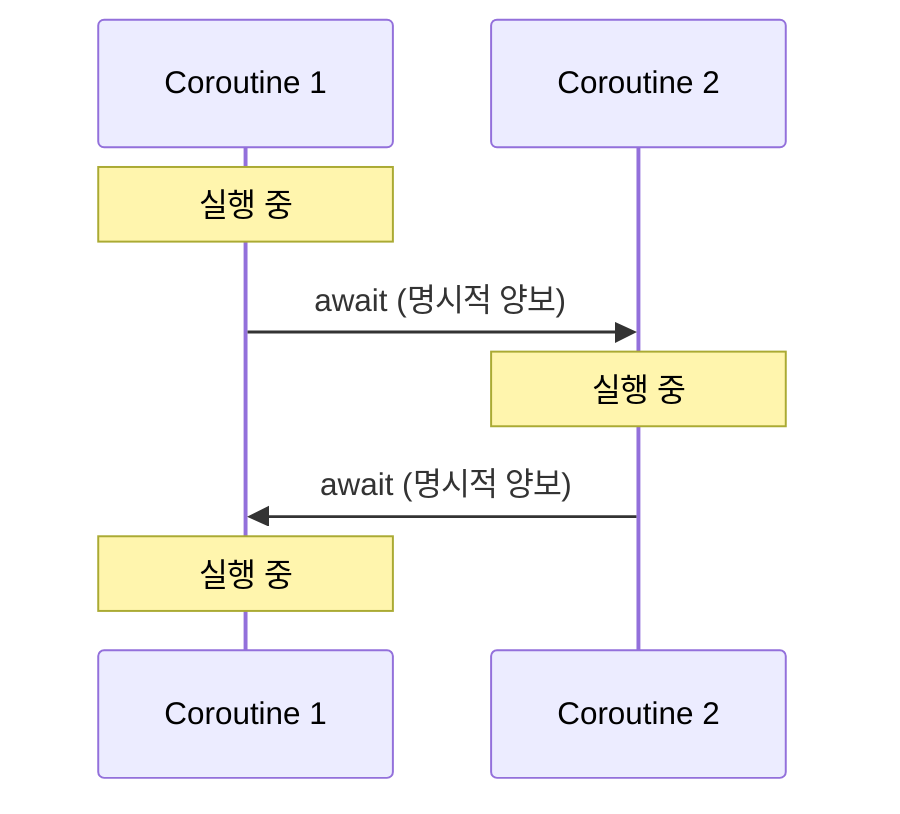
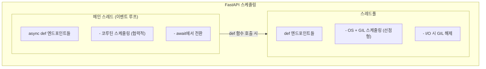

> **📚 FastAPI 시리즈 - Part 2. Python 특수성**
>
> 1. [GIL (Global Interpreter Lock)](/posts/python-gil/)
> 2. Python 스레드 동작 구조 ← 현재 글
> 3. [이벤트 루프 (asyncio)](/posts/python-event-loop/)
> 4. [Generator, yield와 async/await 코루틴](/posts/python-generator-coroutine/)

---

# 2. Python 스레드 동작 구조

## 왜 이 개념이 중요한가?

앞서 배운 내용:

- GIL은 한 번에 하나의 스레드만 Python 코드를 실행하게 한다
- 그런데 멀티스레드 프로그램은 여러 스레드가 "번갈아" 실행된다

**의문:** 누가, 언제, 어떻게 스레드를 전환하는가?

답: **OS 스케줄러**와 **GIL**이 함께 작동한다.

---

## 두 가지 스케줄링 레벨

| 레벨 | 담당 | 역할 |
|:---:|:---:|:---|
| **OS 스케줄러** | 운영체제 | 어떤 스레드를 CPU에서 실행할지 결정 |
| **GIL** | Python 인터프리터 | 어떤 스레드가 Python 코드를 실행할지 결정 |

---

## 일반적인 스레드 스케줄링 (GIL 없는 언어)

### Java, C++ 등



---

## Python 스레드 스케줄링 (GIL 있음)

### 두 단계 스케줄링


---

## GIL 획득/해제 메커니즘

### Python 3.2+ (시간 기반)

```python
import sys

# GIL 전환 간격 확인
print(sys.getswitchinterval())  # 기본값: 0.005 (5ms)

# 변경 가능
sys.setswitchinterval(0.001)  # 1ms로 변경

```

| 버전 | 전환 기준 | 특징 |
|:---:|:---|:---|
| Python 2.x | 100 바이트코드마다 | 불공평할 수 있음 |
| Python 3.2+ | 5ms (시간 기반) | 더 공평한 분배 |

### GIL 전환 과정



**매 5ms마다:**
1. 현재 스레드가 GIL 해제
2. 대기 중인 스레드에게 기회 제공
3. OS 스케줄러가 다음 실행 스레드 결정

---

## GIL 해제가 발생하는 상황

### 1. 시간 초과 (5ms)

```python
# CPU 바운드 작업 중에도 5ms마다 GIL 해제
def cpu_work():
    total = 0
    for i in range(10_000_000):
        total += i  # 5ms마다 GIL 해제 기회
    return total

```

### 2. I/O 작업 시작

```python
import socket

def io_work():
    sock = socket.socket()
    sock.connect(('example.com', 80))  # GIL 해제
    sock.recv(1024)                    # GIL 해제

```

### 3. 명시적 해제 (C 확장)

```c
// C 확장 코드
Py_BEGIN_ALLOW_THREADS  // GIL 해제
// ... C 코드 실행 ...
Py_END_ALLOW_THREADS    // GIL 재획득

```

### 4. time.sleep()

```python
import time

def sleep_work():
    time.sleep(1)  # 즉시 GIL 해제, 1초 후 재획득 시도

```

---

## OS 스케줄러와 GIL의 상호작용

### 시나리오: 2코어 CPU, 3개 스레드



### GIL Thrashing 문제

멀티코어에서 CPU 바운드 스레드 여러 개 실행 시:

1. Thread 1이 Core 1에서 GIL 보유하고 실행
2. Thread 2가 Core 2에서 GIL 요청
3. Thread 1이 GIL 해제
4. Thread 1과 Thread 2가 동시에 GIL 획득 경쟁
5. 경쟁 오버헤드 발생!

**결과: 단일 스레드보다 느려질 수 있음**

```mermaid
gantt
    title GIL Thrashing 비교
    dateFormat X
    axisFormat %s

    section 단일 스레드
    실행 (경쟁 없음) :0, 20

    section 멀티 스레드
    실행 :0, 4
    GIL 경쟁 :crit, 4, 6
    실행 :6, 10
    GIL 경쟁 :crit, 10, 12
    실행 :12, 16
    GIL 경쟁 :crit, 16, 18
    실행 :18, 20
```



---

## I/O 바운드 vs CPU 바운드 스케줄링

### I/O 바운드 (효율적)

```mermaid
gantt
    title I/O 바운드 스케줄링
    dateFormat X
    axisFormat %s

    section Thread 1
    실행 :0, 2
    I/O 대기 (GIL 해제) :done, 2, 6
    실행 :6, 8
    I/O 대기 (GIL 해제) :done, 8, 12

    section Thread 2
    실행 :2, 4
    I/O 대기 (GIL 해제) :done, 4, 8
    실행 :8, 10

    section Thread 3
    실행 :4, 6
    I/O 대기 (GIL 해제) :done, 6, 10
```



**특징:**
- I/O 시작하면 즉시 GIL 해제
- 다른 스레드가 바로 GIL 획득 가능
- GIL 경쟁이 적음 (대부분 I/O 대기 중이라)
- 멀티스레드 효과 있음!

### CPU 바운드 (비효율적)

```mermaid
gantt
    title CPU 바운드 스케줄링
    dateFormat X
    axisFormat %s

    section Thread 1
    실행 :0, 5
    GIL 해제/대기 :crit, 5, 10
    실행 :10, 15
    GIL 해제/대기 :crit, 15, 20

    section Thread 2
    GIL 대기 :crit, 0, 5
    실행 :5, 10
    GIL 대기 :crit, 10, 15
    실행 :15, 20
```



**특징:**
- 5ms마다 강제로 GIL 해제
- GIL 경쟁 발생
- 컨텍스트 스위칭 오버헤드
- 멀티스레드 효과 없음 (오히려 느림)

---

## 스레드 우선순위

### Python에서는 제어 불가

```python
import threading

t = threading.Thread(target=some_work)
# t.set_priority(HIGH)  ← 이런 메서드 없음!
t.start()

```

| 언어 | 스레드 우선순위 제어 |
|:---:|:---|
| Java | O - `setPriority()` |
| C/C++ | O - OS API 사용 |
| Python | X - 불가능 |

### 이유

**Python에서 우선순위가 의미 없는 이유:**

1. GIL 때문에 어차피 한 번에 하나만 실행
2. GIL 획득은 대략 FIFO (먼저 요청한 순서)
3. OS 우선순위를 높여봤자 GIL 대기 시간은 동일

**결론:** Python에서 스레드 우선순위는 큰 의미 없다

---

## 코루틴 스케줄링과 비교

### 스레드 vs 코루틴 스케줄링

| 항목 | 스레드 | 코루틴 |
|:---:|:---|:---|
| 스케줄링 주체 | OS + GIL | 이벤트 루프 |
| 전환 방식 | 선점형 (5ms 또는 I/O) | 협력적 (`await`) |
| 전환 시점 예측 | 어려움 | 쉬움 (`await` 위치) |
| 오버헤드 | 높음 (컨텍스트 스위칭) | 낮음 |
| Race Condition | 주의 필요 | 상대적으로 안전 |

### 시각화

**스레드 - 선점형:**



→ 언제 전환될지 예측 어려움

**코루틴 - 협력적:**



→ await 위치에서만 전환 (예측 가능)

---

## 실제 동작 확인

### GIL 전환 관찰

```python
import threading
import time
import sys

print(f"GIL 전환 간격: {sys.getswitchinterval()}초")

counter = 0
lock = threading.Lock()

def worker(name):
    global counter
    for i in range(5):
        print(f"[{time.strftime('%X.%f')}] {name} 실행 중 (i={i})")

        # CPU 바운드 작업 (GIL 필요)
        total = sum(range(1000000))

        with lock:
            counter += 1

# 스레드 생성
t1 = threading.Thread(target=worker, args=("Thread-1",))
t2 = threading.Thread(target=worker, args=("Thread-2",))

t1.start()
t2.start()
t1.join()
t2.join()

print(f"최종 counter: {counter}")

```

**예상 출력 (번갈아 실행됨):**

```
GIL 전환 간격: 0.005초
[10:00:00.000] Thread-1 실행 중 (i=0)
[10:00:00.050] Thread-2 실행 중 (i=0)
[10:00:00.100] Thread-1 실행 중 (i=1)
[10:00:00.150] Thread-2 실행 중 (i=1)
...

```

---

## FastAPI에서의 스케줄링

### 구조



### 권장 패턴

```python
from fastapi import FastAPI

app = FastAPI()

# ✅ async def: 코루틴 스케줄링 (효율적)
@app.get("/async")
async def async_endpoint():
    await some_async_io()  # await에서 명시적 양보
    return {"status": "done"}

# ✅ def + I/O: 스레드 스케줄링 (GIL 해제)
@app.get("/sync-io")
def sync_io_endpoint():
    result = requests.get(url)  # I/O 중 GIL 해제
    return result.json()

# ⚠️ def + CPU: 스레드 스케줄링 (GIL 병목)
@app.get("/sync-cpu")
def sync_cpu_endpoint():
    # 다른 요청 처리에 영향 줄 수 있음
    return heavy_computation()

```

---

## 핵심 정리

| 개념 | 설명 |
|:---:|:---|
| **이중 스케줄링** | OS 스케줄러 + GIL이 함께 작동 |
| **GIL 전환 간격** | Python 3.2+에서 5ms (시간 기반) |
| **GIL 해제 시점** | 5ms 경과, I/O 시작, C 확장, sleep |
| **CPU 바운드 문제** | GIL 경쟁으로 오히려 느려질 수 있음 |
| **I/O 바운드** | GIL 해제되어 멀티스레드 효과 있음 |
| **코루틴과 차이** | 스레드는 선점형, 코루틴은 협력적 |