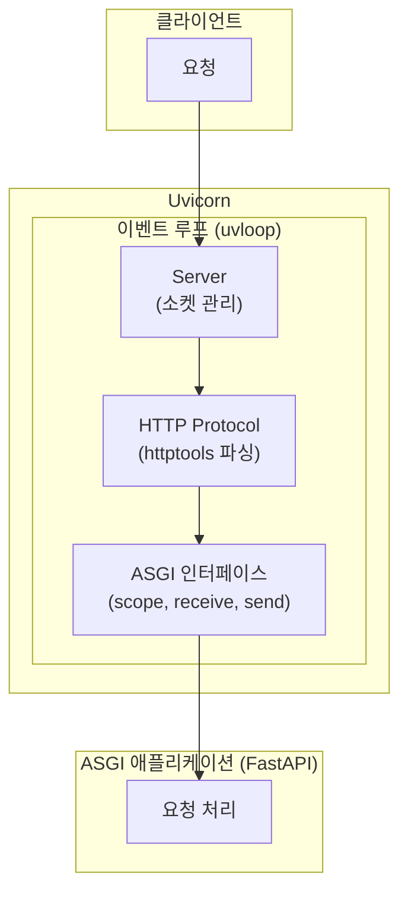
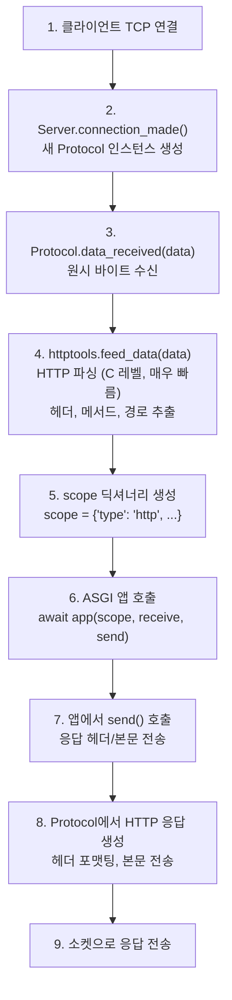
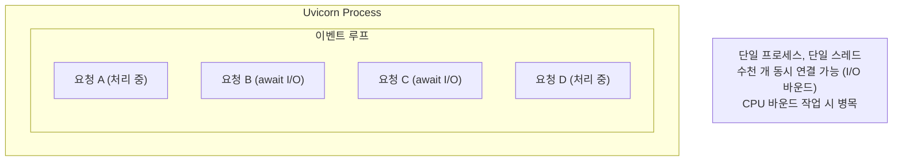
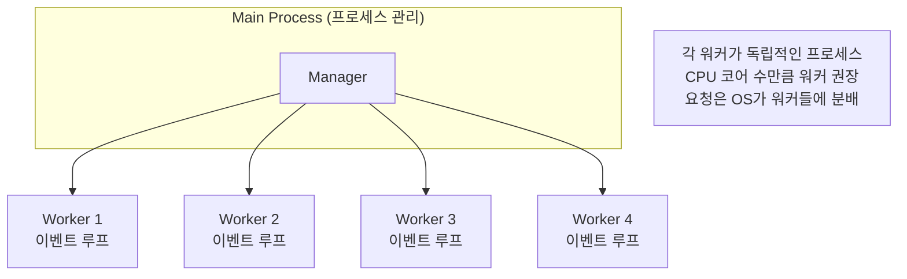
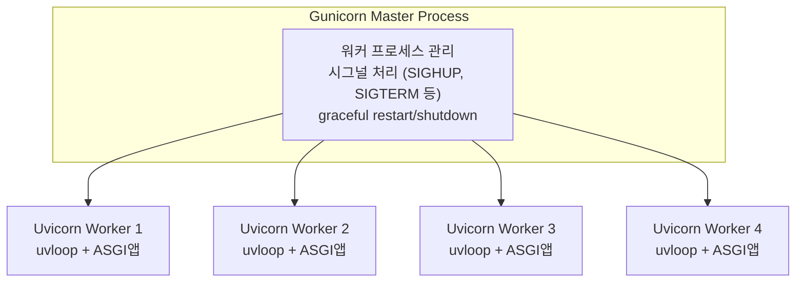

> **📚 FastAPI 시리즈 - Part 3. 웹 서버 인터페이스**
>
> 1. [WSGI 동작 원리](/posts/wsgi/)
> 2. [ASGI 동작 원리](/posts/asgi/)
> 3. Uvicorn 내부 구조 ← 현재 글
> 4. [Gunicorn + Uvicorn 조합 상세](/posts/gunicorn-uvicorn/)

---

# 3. Uvicorn 내부 구조

## 왜 이 개념이 중요한가?

- Uvicorn은 FastAPI의 기본 ASGI 서버
- 내부 구조를 알면 성능 튜닝과 문제 해결에 도움
- 프로덕션 배포 시 올바른 설정 가능

---

## Uvicorn이란?

### 한 줄 정의

**빠른 ASGI 서버 - uvloop과 httptools 기반의 고성능 Python 웹 서버**

### 핵심 특징

| 특징 | 설명 |
|:---:|:---:|
| ASGI 지원 | async/await, WebSocket |
| uvloop | 고성능 이벤트 루프 (선택) |
| httptools | 빠른 HTTP 파싱 (C 기반) |
| 경량 | 최소한의 의존성 |

---

## 아키텍처 개요



---

## 핵심 컴포넌트

### 1. Server (서버)

```python
# 역할: 소켓 생성, 연결 수락, 프로토콜 인스턴스 생성

class Server:
    def __init__(self, config):
        self.config = config

    async def serve(self):
        # 소켓 생성
        loop = asyncio.get_event_loop()
        server = await loop.create_server(
            protocol_factory=self.create_protocol,
            host=self.config.host,
            port=self.config.port,
        )

        # 연결 대기
        async with server:
            await server.serve_forever()

```

### 2. Protocol (프로토콜)

```python
# 역할: HTTP 요청 파싱, ASGI 인터페이스 변환

class HttpProtocol(asyncio.Protocol):
    def __init__(self, app):
        self.app = app
        self.parser = httptools.HttpRequestParser(self)

    def data_received(self, data):
        # httptools로 HTTP 파싱
        self.parser.feed_data(data)

    def on_message_complete(self):
        # ASGI scope 생성
        scope = {
            'type': 'http',
            'method': self.method,
            'path': self.path,
            'headers': self.headers,
            ...
        }

        # ASGI 앱 호출
        asyncio.create_task(self.app(scope, self.receive, self.send))

```

### 3. 이벤트 루프

| 옵션 | 라이브러리 | 성능 |
|:---:|:---:|:---:|
| `--loop asyncio` | 표준 asyncio | 기준 |
| `--loop uvloop` | uvloop (libuv) | 2~4배 빠름 |

---

## 요청 처리 흐름

### 상세 흐름



---

## 워커 모델

### 단일 워커 (기본)

```bash
uvicorn app:app

```



### 멀티 워커

```bash
uvicorn app:app --workers 4

```



### 워커 수 권장

| 상황 | 권장 워커 수 |
|:---:|:---:|
| 개발 | 1 (기본값) |
| I/O 바운드 | 1~2 (비동기로 충분) |
| CPU 바운드 혼합 | CPU 코어 수 |

---

## 주요 설정 옵션

### 명령줄 옵션

```bash
uvicorn app:app \
    --host 0.0.0.0 \
    --port 8000 \
    --workers 4 \
    --loop uvloop \
    --http httptools \
    --log-level info \
    --reload  # 개발용

```

### 옵션 설명

| 옵션 | 설명 | 기본값 |
|:---:|:---:|:---:|
| `--host` | 바인딩 호스트 | `127.0.0.1` |
| `--port` | 바인딩 포트 | `8000` |
| `--workers` | 워커 프로세스 수 | `1` |
| `--loop` | 이벤트 루프 | `auto` (uvloop 우선) |
| `--http` | HTTP 파서 | `auto` (httptools 우선) |
| `--reload` | 코드 변경 시 재시작 | `False` |
| `--log-level` | 로그 레벨 | `info` |

### 프로그래밍 방식 실행

```python
import uvicorn

if __name__ == "__main__":
    uvicorn.run(
        "app:app",
        host="0.0.0.0",
        port=8000,
        workers=4,
        loop="uvloop",
        reload=True,  # 개발용
    )

```

---

## httptools vs h11

### HTTP 파서 비교

| 항목 | httptools | h11 |
|:---:|:---:|:---:|
| 언어 | C (바인딩) | 순수 Python |
| 성능 | 빠름 | 느림 |
| 설치 | 컴파일 필요 | 없음 |
| 플랫폼 | Linux/macOS | 모든 플랫폼 |

```bash
# httptools 사용 (기본, 빠름)
uvicorn app:app --http httptools

# h11 사용 (호환성)
uvicorn app:app --http h11

```

---

## uvloop 통합

### 동작 방식

```python
# Uvicorn 내부 (단순화)
def get_event_loop():
    if uvloop_available and config.loop == "uvloop":
        import uvloop
        uvloop.install()  # 기본 이벤트 루프를 uvloop으로 교체

    return asyncio.get_event_loop()

```

### 성능 영향

| 이벤트 루프 | 성능 (req/s) | 비교 |
|:---:|:---:|:---:|
| asyncio | ~10,000 | 기준 |
| uvloop | ~25,000 | 약 2~4배 향상 |

---

## Gunicorn + Uvicorn 조합

### 왜 조합하는가?

| Uvicorn 단독 | Gunicorn + Uvicorn |
|:---:|:---:|
| 기본 프로세스 관리 | 고급 프로세스 관리 |
| 워커 재시작 단순 | graceful restart |
| 모니터링 제한적 | 다양한 훅 지원 |

### 실행 방법

```bash
gunicorn app:app \
    -w 4 \
    -k uvicorn.workers.UvicornWorker \
    -b 0.0.0.0:8000

```

### 구조



---

## 연결 관리

### Keep-Alive

```python
# Uvicorn 기본 설정
# - HTTP/1.1 Keep-Alive 지원
# - 연결 재사용으로 성능 향상

```

**Keep-Alive 없이:**
- 요청1 → 연결 → 응답 → 종료
- 요청2 → 연결 → 응답 → 종료 (매번 새 연결)
- 요청3 → 연결 → 응답 → 종료

**Keep-Alive 있을 때:**
- 요청1, 요청2, 요청3 → 연결 유지 → 응답들 → (타임아웃 후) 종료

### 타임아웃 설정

```bash
uvicorn app:app \
    --timeout-keep-alive 5 \    # Keep-Alive 타임아웃
    --limit-concurrency 1000    # 최대 동시 연결

```

---

## 프로덕션 권장 설정

### 기본 프로덕션

```bash
uvicorn app:app \
    --host 0.0.0.0 \
    --port 8000 \
    --workers 4 \
    --loop uvloop \
    --http httptools \
    --log-level warning

```

### Gunicorn 조합 (권장)

```bash
gunicorn app:app \
    -w 4 \
    -k uvicorn.workers.UvicornWorker \
    -b 0.0.0.0:8000 \
    --access-logfile - \
    --error-logfile - \
    --capture-output

```

### Docker 환경

```docker
FROM python:3.11-slim

WORKDIR /app
COPY requirements.txt .
RUN pip install --no-cache-dir -r requirements.txt

COPY . .

CMD ["uvicorn", "app:app", "--host", "0.0.0.0", "--port", "8000"]

```

---

## 핵심 정리

| 개념 | 설명 |
|:---:|:---:|
| **Uvicorn** | 빠른 ASGI 서버 |
| **uvloop** | 고성능 이벤트 루프 (2~4배) |
| **httptools** | C 기반 HTTP 파서 |
| **워커** | 멀티 프로세스 지원 |
| **Gunicorn 조합** | 프로덕션 프로세스 관리 |

### 실행 옵션 요약

| 환경 | 명령어 |
|:---:|:---:|
| 개발 | `uvicorn app:app --reload` |
| 프로덕션 (단순) | `uvicorn app:app --workers 4` |
| 프로덕션 (권장) | `gunicorn -k uvicorn.workers.UvicornWorker` |