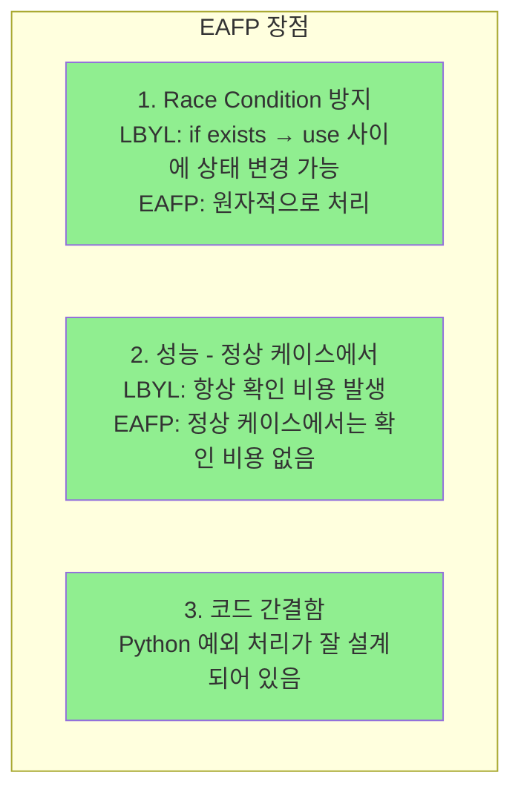

> **📚 FastAPI 시리즈 - Part 5. 실전 심화**
>
> 1. [동기 함수 vs 비동기 함수 선택 기준](/posts/sync-async-choice/)
> 2. [BackgroundTasks와 작업 큐](/posts/background-tasks/)
> 3. [동시 요청 처리와 성능 튜닝](/posts/concurrency-tuning/)
> 4. FastAPI 예외처리 ← 현재 글
> 5. [프로젝트 구조 설계](/posts/project-structure/)
> 6. [Python 객체/리소스 관리 패턴](/posts/resource-management/)

---

# 4. FastAPI 예외처리

## 왜 예외처리 전략이 중요한가?

- 일관된 API 응답 포맷 유지
- 코드 중복 제거
- 유지보수성 향상
- 디버깅 용이성

---

## Python 철학: EAFP

### EAFP vs LBYL

| 스타일 | 의미 | 방식 |
| --- | --- | --- |
| **LBYL** | Look Before You Leap | 먼저 확인하고 실행 |
| **EAFP** | Easier to Ask Forgiveness than Permission | 일단 실행하고 예외 처리 |

### 코드 비교

```python
# LBYL (다른 언어 스타일)
if user_id in users_dict:
    user = users_dict[user_id]
else:
    user = None

# EAFP (Python 스타일) ✅
try:
    user = users_dict[user_id]
except KeyError:
    user = None

```

### 왜 EAFP가 Python스러운가?



### FastAPI에서 EAFP 적용

```python
# ✅ EAFP 스타일 - DB 조회 후 없으면 예외
async def get_user(self, user_id: int):
    user = db.query(User).filter(User.id == user_id).first()
    if not user:
        raise NotFoundException("User", user_id)  # 일단 조회, 없으면 예외
    return user

# ❌ LBYL 스타일 - 먼저 존재 확인 (불필요한 쿼리)
async def get_user(self, user_id: int):
    exists = db.query(User).filter(User.id == user_id).exists()
    if not exists:
        raise NotFoundException("User", user_id)
    user = db.query(User).filter(User.id == user_id).first()  # 중복 쿼리!
    return user

```

---

## 예외처리 계층 구조


### 계층별 역할

| 계층 | 역할 | try-except |
| --- | --- | --- |
| 라우터 | 서비스 호출 | ❌ 사용 안 함 |
| 서비스 | 예외 발생 (raise) | 특수한 경우만 |
| 글로벌 핸들러 | 예외 → 응답 변환 | ✅ 여기서 처리 |

---

## 1단계: 커스텀 예외 정의

```python
# app/exceptions.py
from typing import Any, Optional

class AppException(Exception):
    """애플리케이션 기본 예외"""
    def __init__(
        self,
        status_code: int,
        error_code: str,
        message: str,
        detail: Optional[Any] = None
    ):
        self.status_code = status_code
        self.error_code = error_code
        self.message = message
        self.detail = detail
        super().__init__(message)

class NotFoundException(AppException):
    """리소스를 찾을 수 없음 (404)"""
    def __init__(self, resource: str, resource_id: Any):
        super().__init__(
            status_code=404,
            error_code="NOT_FOUND",
            message=f"{resource} not found",
            detail={"resource": resource, "id": resource_id}
        )

class UnauthorizedException(AppException):
    """인증 실패 (401)"""
    def __init__(self, message: str = "Authentication required"):
        super().__init__(
            status_code=401,
            error_code="UNAUTHORIZED",
            message=message
        )

class ForbiddenException(AppException):
    """권한 없음 (403)"""
    def __init__(self, message: str = "Permission denied"):
        super().__init__(
            status_code=403,
            error_code="FORBIDDEN",
            message=message
        )

class BadRequestException(AppException):
    """잘못된 요청 (400)"""
    def __init__(self, message: str, detail: Optional[Any] = None):
        super().__init__(
            status_code=400,
            error_code="BAD_REQUEST",
            message=message,
            detail=detail
        )

class ConflictException(AppException):
    """충돌 - 중복 등 (409)"""
    def __init__(self, message: str, detail: Optional[Any] = None):
        super().__init__(
            status_code=409,
            error_code="CONFLICT",
            message=message,
            detail=detail
        )

class ExternalServiceException(AppException):
    """외부 서비스 오류 (502)"""
    def __init__(self, service: str, message: str):
        super().__init__(
            status_code=502,
            error_code="EXTERNAL_SERVICE_ERROR",
            message=f"External service error: {service}",
            detail={"service": service, "error": message}
        )

```

---

## 2단계: 응답 스키마 정의

```python
# app/schemas/response.py
from pydantic import BaseModel
from typing import Any, Optional
from datetime import datetime

class ErrorResponse(BaseModel):
    """에러 응답 표준 포맷"""
    success: bool = False
    error_code: str
    message: str
    detail: Optional[Any] = None
    timestamp: datetime = datetime.utcnow()
    path: Optional[str] = None

class SuccessResponse(BaseModel):
    """성공 응답 표준 포맷 (선택적)"""
    success: bool = True
    data: Any
    message: Optional[str] = None

```

---

## 3단계: 글로벌 예외 핸들러

```python
# app/exception_handlers.py
from fastapi import FastAPI, Request
from fastapi.responses import JSONResponse
from fastapi.exceptions import RequestValidationError
from starlette.exceptions import HTTPException as StarletteHTTPException
import logging

from app.exceptions import AppException
from app.schemas.response import ErrorResponse

logger = logging.getLogger(__name__)

def register_exception_handlers(app: FastAPI):
    """예외 핸들러 등록"""

    @app.exception_handler(AppException)
    async def app_exception_handler(request: Request, exc: AppException):
        """커스텀 예외 처리"""
        logger.warning(
            f"AppException: {exc.error_code} - {exc.message}",
            extra={"path": request.url.path, "detail": exc.detail}
        )

        return JSONResponse(
            status_code=exc.status_code,
            content=ErrorResponse(
                error_code=exc.error_code,
                message=exc.message,
                detail=exc.detail,
                path=request.url.path
            ).model_dump(mode="json")
        )

    @app.exception_handler(RequestValidationError)
    async def validation_exception_handler(request: Request, exc: RequestValidationError):
        """Pydantic 검증 오류 처리"""
        errors = []
        for error in exc.errors():
            errors.append({
                "field": ".".join(str(loc) for loc in error["loc"]),
                "message": error["msg"],
                "type": error["type"]
            })

        return JSONResponse(
            status_code=422,
            content=ErrorResponse(
                error_code="VALIDATION_ERROR",
                message="Request validation failed",
                detail=errors,
                path=request.url.path
            ).model_dump(mode="json")
        )

    @app.exception_handler(StarletteHTTPException)
    async def http_exception_handler(request: Request, exc: StarletteHTTPException):
        """HTTP 예외 처리 (FastAPI HTTPException 포함)"""
        return JSONResponse(
            status_code=exc.status_code,
            content=ErrorResponse(
                error_code="HTTP_ERROR",
                message=str(exc.detail),
                path=request.url.path
            ).model_dump(mode="json")
        )

    @app.exception_handler(Exception)
    async def unhandled_exception_handler(request: Request, exc: Exception):
        """예상치 못한 예외 처리 (최후의 방어선)"""
        logger.error(
            f"Unhandled exception: {exc}",
            exc_info=True,
            extra={"path": request.url.path}
        )

        # 프로덕션에서는 상세 에러 숨김
        return JSONResponse(
            status_code=500,
            content=ErrorResponse(
                error_code="INTERNAL_ERROR",
                message="Internal server error",
                path=request.url.path
            ).model_dump(mode="json")
        )

```

---

## 4단계: 서비스에서 예외 발생

### 기본 패턴: 그냥 예외 던지기

```python
# app/services/user_service.py
from app.exceptions import NotFoundException, ConflictException, BadRequestException

class UserService:
    def __init__(self, db: Session):
        self.db = db

    async def get_user(self, user_id: int):
        """사용자 조회 - EAFP 스타일"""
        user = self.db.query(User).filter(User.id == user_id).first()
        if not user:
            raise NotFoundException("User", user_id)  # 그냥 던지기
        return user

    async def create_user(self, data: UserCreate):
        """사용자 생성"""
        # 중복 체크
        existing = self.db.query(User).filter(User.email == data.email).first()
        if existing:
            raise ConflictException(
                message="Email already registered",
                detail={"email": data.email}
            )

        # 비즈니스 규칙 검증
        if len(data.password) < 8:
            raise BadRequestException(
                message="Password too short",
                detail={"min_length": 8}
            )

        user = User(**data.model_dump())
        self.db.add(user)
        self.db.commit()
        return user

```

---

## 서비스 내 try-except 사용 케이스

### 언제 서비스에서 try-except를 쓰는가?

| 상황 | 처리 방식 |
| --- | --- |
| 외부 예외 → 우리 예외로 변환 | `except → raise CustomException` |
| 실패해도 괜찮음 → 기본값 | `except → return default` |
| 실패 시 대체 로직 실행 | `except → 다른 방법 시도` |
| 그 외 (일반적인 경우) | try-except 없이 그냥 raise |

---

### 케이스 1: 외부 예외 → 커스텀 예외로 변환

```python
class PaymentService:
    async def charge(self, amount: int):
        try:
            return await stripe_api.charge(amount)
        except StripeError as e:
            # Stripe 예외 → 우리 예외로 통일
            raise ExternalServiceException("Stripe", str(e))
        except requests.Timeout:
            raise ExternalServiceException("Stripe", "Request timeout")

```

**이유**: 외부 라이브러리 예외가 그대로 올라가면 글로벌 핸들러에서 처리 어려움

---

### 케이스 2: 실패해도 괜찮음 → 기본값 반환

```python
class UserService:
    async def get_user_preferences(self, user_id: int):
        try:
            prefs = await cache.get(f"prefs:{user_id}")
            return json.loads(prefs)
        except (CacheError, json.JSONDecodeError):
            # 캐시 실패? 그냥 기본값 반환
            return {"theme": "light", "language": "ko"}

    async def get_user_avatar(self, user_id: int):
        try:
            return await storage.get_avatar(user_id)
        except StorageError:
            # 아바타 못 가져오면 기본 이미지
            return "/static/default-avatar.png"

```

**이유**: 부가 기능 실패로 전체 요청이 실패하면 안 됨

---

### 케이스 3: 실패 시 대체 로직 실행

```python
class NotificationService:
    async def send(self, user_id: int, message: str):
        try:
            await push_service.send(user_id, message)
        except PushServiceError:
            # 푸시 실패 → 이메일로 대체
            logger.warning(f"Push failed for user {user_id}, trying email")
            await email_service.send(user_id, message)

class DataService:
    async def get_data(self, key: str):
        try:
            # 1차: 캐시에서 조회
            return await cache.get(key)
        except CacheError:
            # 2차: DB에서 조회
            logger.info(f"Cache miss for {key}, fetching from DB")
            return await db.get(key)

```

**이유**: Fallback 로직으로 서비스 안정성 확보

---

### 케이스 4: 로깅 후 다시 던지기

```python
class OrderService:
    async def process_order(self, order_id: int):
        try:
            return await self._do_process(order_id)
        except Exception as e:
            # 로깅 후 다시 던지기
            logger.error(f"Order {order_id} processing failed: {e}")
            raise  # 글로벌 핸들러가 처리

```

**이유**: 에러 컨텍스트 로깅이 필요하지만, 처리는 글로벌 핸들러에서

---

## 5단계: 라우터 (깔끔하게)

```python
# app/routers/users.py
from fastapi import APIRouter, Depends
from app.services.user_service import UserService
from app.schemas.user import UserCreate, UserResponse

router = APIRouter(prefix="/users", tags=["users"])

@router.get("/{user_id}", response_model=UserResponse)
async def get_user(user_id: int, service: UserService = Depends()):
    # try-except 없음! 깔끔!
    return await service.get_user(user_id)

@router.post("/", response_model=UserResponse)
async def create_user(data: UserCreate, service: UserService = Depends()):
    # try-except 없음! 깔끔!
    return await service.create_user(data)

@router.delete("/{user_id}")
async def delete_user(user_id: int, service: UserService = Depends()):
    await service.delete_user(user_id)
    return {"message": "User deleted"}

```

---

## 6단계: 앱 구성

```python
# app/main.py
from fastapi import FastAPI
from app.exception_handlers import register_exception_handlers
from app.routers import users, items

app = FastAPI(title="My API")

# 예외 핸들러 등록
register_exception_handlers(app)

# 라우터 등록
app.include_router(users.router)
app.include_router(items.router)

```

---

## 응답 예시

### 404 Not Found

```json
{
    "success": false,
    "error_code": "NOT_FOUND",
    "message": "User not found",
    "detail": {"resource": "User", "id": 123},
    "timestamp": "2024-01-15T10:30:00Z",
    "path": "/users/123"
}

```

### 422 Validation Error

```json
{
    "success": false,
    "error_code": "VALIDATION_ERROR",
    "message": "Request validation failed",
    "detail": [
        {"field": "body.email", "message": "invalid email format", "type": "value_error"},
        {"field": "body.age", "message": "value is not a valid integer", "type": "type_error"}
    ],
    "timestamp": "2024-01-15T10:30:00Z",
    "path": "/users"
}

```

### 409 Conflict

```json
{
    "success": false,
    "error_code": "CONFLICT",
    "message": "Email already registered",
    "detail": {"email": "test@example.com"},
    "timestamp": "2024-01-15T10:30:00Z",
    "path": "/users"
}

```

### 502 External Service Error

```json
{
    "success": false,
    "error_code": "EXTERNAL_SERVICE_ERROR",
    "message": "External service error: Stripe",
    "detail": {"service": "Stripe", "error": "Connection timeout"},
    "timestamp": "2024-01-15T10:30:00Z",
    "path": "/payments"
}

```

---

## 프로젝트 구조

```
app/
├── main.py                    # 앱 진입점
├── exceptions.py              # 커스텀 예외 정의
├── exception_handlers.py      # 글로벌 핸들러
├── schemas/
│   ├── response.py            # 응답 포맷
│   └── user.py                # 사용자 스키마
├── services/
│   ├── user_service.py        # 예외 발생 (raise)
│   └── payment_service.py     # 외부 예외 변환
└── routers/
    └── users.py               # try-except 없이 깔끔

```

---

## 핵심 정리

### EAFP 철학

일단 실행하고, 안 되면 예외 처리 (Python 스타일) → FastAPI에서 자연스럽게 적용됨

### 예외처리 원칙

| 위치 | 역할 |
| --- | --- |
| 서비스 | 예외 **발생** (raise) |
| 글로벌 핸들러 | 예외 **처리** (응답 변환) |
| 라우터 | try-except **없음** |

### 서비스 내 try-except 사용

| 상황 | 사용 |
| --- | --- |
| 외부 예외 → 커스텀 예외 변환 | ✅ |
| 실패해도 OK → 기본값 반환 | ✅ |
| 실패 시 대체 로직 | ✅ |
| 그 외 일반적인 경우 | ❌ (그냥 raise) |

### 한 줄 요약

서비스에서 예외 던지고 (raise), 글로벌 핸들러에서 일괄 처리! 서비스 내 try-except는 "변환/무시/대체" 할 때만!
