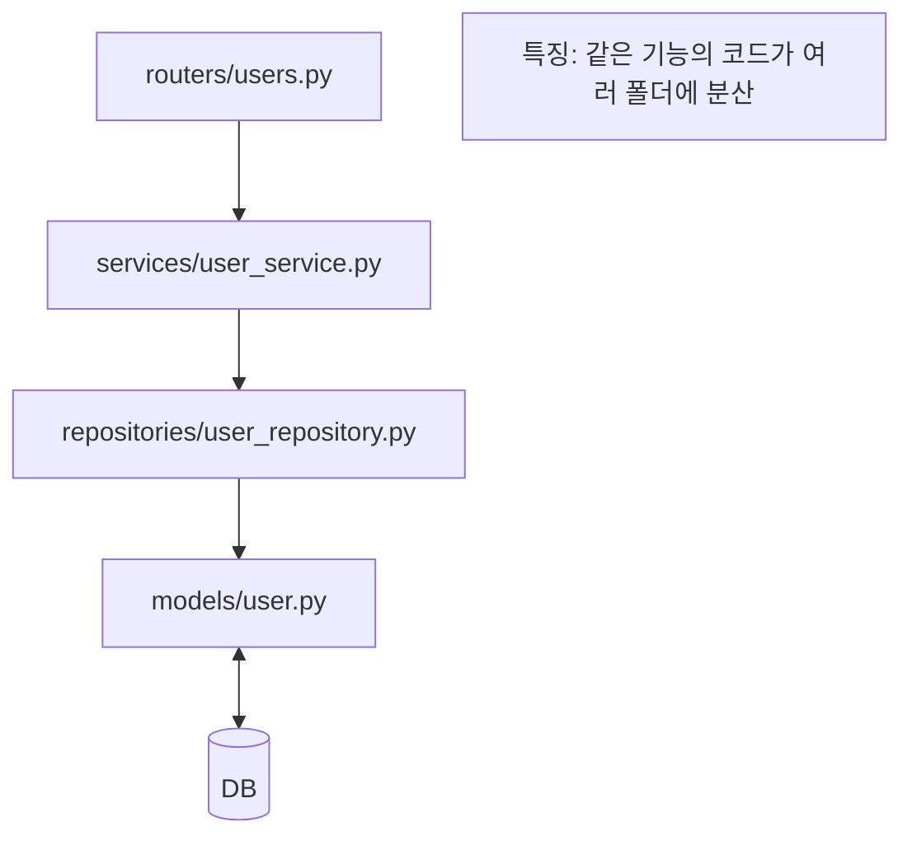
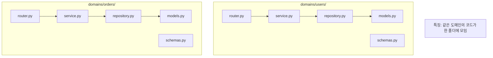
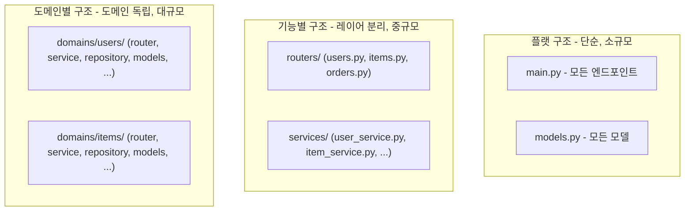
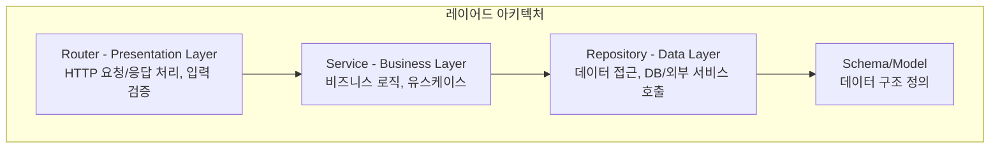
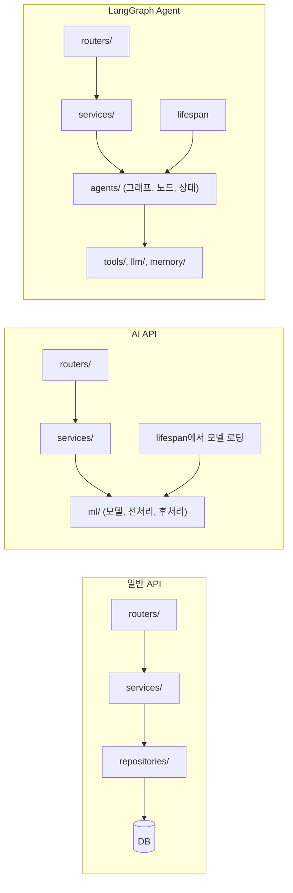

> **📚 FastAPI 시리즈 - Part 5. 실전 심화**
>
> 1. [동기 함수 vs 비동기 함수 선택 기준](/posts/sync-async-choice/)
> 2. [BackgroundTasks와 작업 큐](/posts/background-tasks/)
> 3. [동시 요청 처리와 성능 튜닝](/posts/concurrency-tuning/)
> 4. [FastAPI 예외처리](/posts/exception-handling/)
> 5. 프로젝트 구조 설계 ← 현재 글
> 6. [Python 객체/리소스 관리 패턴](/posts/resource-management/)

---

# 5. 프로젝트 구조 설계

## 왜 프로젝트 구조가 중요한가?

- 코드 가독성과 유지보수성
- 팀 협업 효율성
- 테스트 용이성
- 확장성

---

## Part 1: 규모별 프로젝트 구조

### 구조 선택 기준

| 규모 | 구조 | 특징 |
| --- | --- | --- |
| 소규모 / PoC | **플랫 구조** | 단순, 빠른 개발 |
| 중규모 | **기능별 구조** | 레이어 분리 |
| 대규모 / MSA | **도메인별 구조** | 도메인 독립성 |

---

## 1. 플랫 구조 (소규모 / PoC)

### 언제 사용?

- 빠른 프로토타이핑
- 엔드포인트 10개 이하
- 1~2명 개발
- PoC, MVP

### 구조

```
project/
├── main.py              # 모든 것이 여기에
├── models.py            # DB 모델
├── schemas.py           # Pydantic 스키마
├── database.py          # DB 연결
├── config.py            # 설정
├── requirements.txt
└── Dockerfile

```

### 코드 예시

```python
# main.py - 모든 것이 한 파일에
from fastapi import FastAPI, Depends, HTTPException
from sqlalchemy.orm import Session

from database import get_db, engine
from models import User, Item, Base
from schemas import UserCreate, UserResponse, ItemCreate

Base.metadata.create_all(bind=engine)

app = FastAPI()

# ===== Users =====
@app.get("/users/{user_id}", response_model=UserResponse)
def get_user(user_id: int, db: Session = Depends(get_db)):
    user = db.query(User).filter(User.id == user_id).first()
    if not user:
        raise HTTPException(status_code=404, detail="User not found")
    return user

@app.post("/users/", response_model=UserResponse)
def create_user(data: UserCreate, db: Session = Depends(get_db)):
    user = User(**data.model_dump())
    db.add(user)
    db.commit()
    return user

# ===== Items =====
@app.get("/items/")
def get_items(db: Session = Depends(get_db)):
    return db.query(Item).all()

@app.post("/items/")
def create_item(data: ItemCreate, db: Session = Depends(get_db)):
    item = Item(**data.model_dump())
    db.add(item)
    db.commit()
    return item

```

### 장단점

| 장점 | 단점 |
| --- | --- |
| 단순함 | 확장 어려움 |
| 빠른 개발 | 코드 중복 |
| 파악 쉬움 | 테스트 어려움 |

---

## 2. 기능별 구조 (중규모)

### 언제 사용?

- 엔드포인트 10~50개
- 팀 2~5명
- 일반적인 API 서버

### 구조

```
project/
├── app/
│   ├── __init__.py
│   ├── main.py
│   ├── config.py
│   │
│   ├── routers/              # 기능별 라우터
│   │   ├── __init__.py
│   │   ├── users.py
│   │   ├── items.py
│   │   └── orders.py
│   │
│   ├── services/             # 기능별 비즈니스 로직
│   │   ├── __init__.py
│   │   ├── user_service.py
│   │   ├── item_service.py
│   │   └── order_service.py
│   │
│   ├── repositories/         # 기능별 데이터 접근
│   │   ├── __init__.py
│   │   ├── user_repository.py
│   │   └── item_repository.py
│   │
│   ├── models/               # DB 모델
│   │   ├── __init__.py
│   │   ├── user.py
│   │   └── item.py
│   │
│   ├── schemas/              # Pydantic 스키마
│   │   ├── __init__.py
│   │   ├── user.py
│   │   └── item.py
│   │
│   ├── core/                 # 공통 유틸리티
│   │   ├── __init__.py
│   │   ├── database.py
│   │   ├── exceptions.py
│   │   └── security.py
│   │
│   └── dependencies/         # 의존성
│       ├── __init__.py
│       └── auth.py
│
├── tests/
├── alembic/
└── pyproject.toml

```

### 흐름



### 장단점

| 장점 | 단점 |
| --- | --- |
| 레이어 분리 명확 | 도메인 파악 어려움 |
| 역할별 코드 관리 | 파일 찾기 번거로움 |
| 팀 분업 용이 | 도메인 간 의존성 복잡 |

---

## 3. 도메인별 구조 (대규모 / DDD)

### 언제 사용?

- 엔드포인트 50개 이상
- 팀 5명 이상
- 마이크로서비스 전환 고려
- 복잡한 비즈니스 로직

### 구조

```
project/
├── app/
│   ├── __init__.py
│   ├── main.py
│   ├── config.py
│   │
│   ├── domains/                    # 도메인별 분리
│   │   │
│   │   ├── users/                  # 사용자 도메인
│   │   │   ├── __init__.py
│   │   │   ├── router.py
│   │   │   ├── service.py
│   │   │   ├── repository.py
│   │   │   ├── models.py
│   │   │   ├── schemas.py
│   │   │   └── exceptions.py
│   │   │
│   │   ├── items/                  # 상품 도메인
│   │   │   ├── __init__.py
│   │   │   ├── router.py
│   │   │   ├── service.py
│   │   │   ├── repository.py
│   │   │   ├── models.py
│   │   │   └── schemas.py
│   │   │
│   │   ├── orders/                 # 주문 도메인
│   │   │   ├── __init__.py
│   │   │   ├── router.py
│   │   │   ├── service.py
│   │   │   ├── repository.py
│   │   │   ├── models.py
│   │   │   └── schemas.py
│   │   │
│   │   └── payments/               # 결제 도메인
│   │       ├── __init__.py
│   │       ├── router.py
│   │       ├── service.py
│   │       └── ...
│   │
│   ├── core/                       # 공통
│   │   ├── __init__.py
│   │   ├── database.py
│   │   ├── exceptions.py
│   │   └── security.py
│   │
│   └── shared/                     # 공유 모듈
│       ├── __init__.py
│       ├── schemas.py              # 공통 스키마
│       └── utils.py
│
├── tests/
│   ├── domains/
│   │   ├── users/
│   │   ├── items/
│   │   └── orders/
│
└── pyproject.toml

```

### 흐름



### 코드 예시

```python
# app/domains/users/router.py
from fastapi import APIRouter, Depends
from .service import UserService
from .schemas import UserCreate, UserResponse
from app.core.dependencies import get_user_service

router = APIRouter(prefix="/users", tags=["users"])

@router.get("/{user_id}", response_model=UserResponse)
async def get_user(user_id: int, service: UserService = Depends(get_user_service)):
    return await service.get_user(user_id)

@router.post("/", response_model=UserResponse)
async def create_user(data: UserCreate, service: UserService = Depends(get_user_service)):
    return await service.create_user(data)

```

```python
# app/domains/users/service.py
from .repository import UserRepository
from .schemas import UserCreate
from .exceptions import UserNotFoundException

class UserService:
    def __init__(self, repository: UserRepository):
        self.repository = repository

    async def get_user(self, user_id: int):
        user = await self.repository.find_by_id(user_id)
        if not user:
            raise UserNotFoundException(user_id)
        return user

    async def create_user(self, data: UserCreate):
        return await self.repository.create(data)

```

```python
# app/main.py
from fastapi import FastAPI
from app.domains.users.router import router as users_router
from app.domains.items.router import router as items_router
from app.domains.orders.router import router as orders_router

app = FastAPI()

app.include_router(users_router, prefix="/api/v1")
app.include_router(items_router, prefix="/api/v1")
app.include_router(orders_router, prefix="/api/v1")

```

### 장단점

| 장점 | 단점 |
| --- | --- |
| 도메인 독립성 | 초기 설계 복잡 |
| MSA 전환 용이 | 공통 코드 관리 필요 |
| 팀별 도메인 담당 가능 | 도메인 간 통신 설계 필요 |
| 코드 파악 쉬움 | 오버엔지니어링 위험 |

---

## 구조 비교 요약



### 선택 가이드

| 상황 | 추천 구조 |
| --- | --- |
| PoC, 해커톤 | 플랫 |
| 일반 API 서버 | 기능별 |
| 복잡한 비즈니스 | 도메인별 |
| MSA 준비 | 도메인별 |
| 1인 개발 | 플랫 or 기능별 |
| 팀 개발 (3명+) | 기능별 or 도메인별 |

---

## Part 2: 서버 유형별 구조

다음은 서버 유형(일반 API, AI API, LangGraph)에 따른 구조입니다.

---

### 공통 원칙: 레이어 분리



### 레이어별 역할

| 레이어 | 역할 | 의존성 |
| --- | --- | --- |
| Router | HTTP 처리, 라우팅 | → Service |
| Service | 비즈니스 로직 | → Repository |
| Repository | 데이터 접근 | → DB/외부 |
| Schema | 데이터 구조 | 없음 |

---

## 4. 일반 API 서버 구조 (기능별)

### 유스케이스

- CRUD API
- 사용자 관리
- 주문/결제 시스템
- 일반적인 백엔드 서비스

### 프로젝트 구조

```
project/
├── app/
│   ├── __init__.py
│   ├── main.py                    # FastAPI 앱 진입점
│   ├── config.py                  # 설정 관리
│   │
│   ├── routers/                   # 라우터 (Presentation)
│   │   ├── __init__.py
│   │   ├── users.py
│   │   ├── items.py
│   │   └── orders.py
│   │
│   ├── services/                  # 서비스 (Business Logic)
│   │   ├── __init__.py
│   │   ├── user_service.py
│   │   ├── item_service.py
│   │   └── order_service.py
│   │
│   ├── repositories/              # 레포지토리 (Data Access)
│   │   ├── __init__.py
│   │   ├── user_repository.py
│   │   ├── item_repository.py
│   │   └── order_repository.py
│   │
│   ├── models/                    # DB 모델 (SQLAlchemy)
│   │   ├── __init__.py
│   │   ├── user.py
│   │   └── item.py
│   │
│   ├── schemas/                   # Pydantic 스키마
│   │   ├── __init__.py
│   │   ├── user.py
│   │   ├── item.py
│   │   └── response.py
│   │
│   ├── core/                      # 핵심 유틸리티
│   │   ├── __init__.py
│   │   ├── database.py            # DB 연결
│   │   ├── security.py            # 보안 관련
│   │   └── exceptions.py          # 커스텀 예외
│   │
│   └── dependencies/              # 의존성 주입
│       ├── __init__.py
│       ├── database.py
│       └── auth.py
│
├── tests/
│   ├── __init__.py
│   ├── conftest.py
│   ├── test_users.py
│   └── test_items.py
│
├── alembic/                       # DB 마이그레이션
│   └── versions/
│
├── pyproject.toml
├── Dockerfile
└── docker-compose.yml

```

### 코드 예시

### main.py

```python
# app/main.py
from fastapi import FastAPI
from app.config import settings
from app.core.exceptions import register_exception_handlers
from app.core.database import engine
from app.routers import users, items, orders

app = FastAPI(
    title=settings.APP_NAME,
    version=settings.VERSION,
)

# 예외 핸들러 등록
register_exception_handlers(app)

# 라우터 등록
app.include_router(users.router, prefix="/api/v1")
app.include_router(items.router, prefix="/api/v1")
app.include_router(orders.router, prefix="/api/v1")

@app.get("/health")
async def health_check():
    return {"status": "healthy"}

```

### Router

```python
# app/routers/users.py
from fastapi import APIRouter, Depends
from typing import Annotated

from app.schemas.user import UserCreate, UserResponse, UserList
from app.services.user_service import UserService
from app.dependencies.database import get_user_service
from app.dependencies.auth import get_current_user

router = APIRouter(prefix="/users", tags=["users"])

# 의존성 타입 정의
UserServiceDep = Annotated[UserService, Depends(get_user_service)]

@router.get("/", response_model=UserList)
async def list_users(
    service: UserServiceDep,
    skip: int = 0,
    limit: int = 20
):
    """사용자 목록 조회"""
    return await service.get_users(skip=skip, limit=limit)

@router.get("/{user_id}", response_model=UserResponse)
async def get_user(user_id: int, service: UserServiceDep):
    """사용자 상세 조회"""
    return await service.get_user(user_id)

@router.post("/", response_model=UserResponse, status_code=201)
async def create_user(data: UserCreate, service: UserServiceDep):
    """사용자 생성"""
    return await service.create_user(data)

```

### Service

```python
# app/services/user_service.py
from app.repositories.user_repository import UserRepository
from app.schemas.user import UserCreate, UserResponse
from app.core.exceptions import NotFoundException, ConflictException

class UserService:
    def __init__(self, repository: UserRepository):
        self.repository = repository

    async def get_users(self, skip: int = 0, limit: int = 20):
        """사용자 목록 조회"""
        users = await self.repository.find_all(skip=skip, limit=limit)
        total = await self.repository.count()
        return {"items": users, "total": total}

    async def get_user(self, user_id: int):
        """사용자 조회"""
        user = await self.repository.find_by_id(user_id)
        if not user:
            raise NotFoundException("User", user_id)
        return user

    async def create_user(self, data: UserCreate):
        """사용자 생성"""
        # 중복 체크
        existing = await self.repository.find_by_email(data.email)
        if existing:
            raise ConflictException(f"Email {data.email} already exists")

        return await self.repository.create(data)

```

### Repository

```python
# app/repositories/user_repository.py
from sqlalchemy.ext.asyncio import AsyncSession
from sqlalchemy import select, func
from app.models.user import User
from app.schemas.user import UserCreate

class UserRepository:
    def __init__(self, session: AsyncSession):
        self.session = session

    async def find_all(self, skip: int = 0, limit: int = 20):
        query = select(User).offset(skip).limit(limit)
        result = await self.session.execute(query)
        return result.scalars().all()

    async def find_by_id(self, user_id: int):
        query = select(User).where(User.id == user_id)
        result = await self.session.execute(query)
        return result.scalar_one_or_none()

    async def find_by_email(self, email: str):
        query = select(User).where(User.email == email)
        result = await self.session.execute(query)
        return result.scalar_one_or_none()

    async def create(self, data: UserCreate):
        user = User(**data.model_dump())
        self.session.add(user)
        await self.session.commit()
        await self.session.refresh(user)
        return user

    async def count(self):
        query = select(func.count()).select_from(User)
        result = await self.session.execute(query)
        return result.scalar()

```

### Dependencies

```python
# app/dependencies/database.py
from typing import AsyncGenerator
from fastapi import Depends
from sqlalchemy.ext.asyncio import AsyncSession

from app.core.database import async_session_maker
from app.repositories.user_repository import UserRepository
from app.services.user_service import UserService

async def get_session() -> AsyncGenerator[AsyncSession, None]:
    async with async_session_maker() as session:
        yield session

async def get_user_repository(
    session: AsyncSession = Depends(get_session)
) -> UserRepository:
    return UserRepository(session)

async def get_user_service(
    repository: UserRepository = Depends(get_user_repository)
) -> UserService:
    return UserService(repository)

```

---

## 5. AI API 서버 구조

### 유스케이스

- ML 모델 추론 API
- 이미지 처리 서비스
- 추천 시스템
- 실시간 예측 서비스

### 일반 API와의 차이

| 항목 | 일반 API | AI API |
| --- | --- | --- |
| 모델 로딩 | 없음 | **앱 시작 시 로딩 (싱글톤)** |
| 전처리/후처리 | 없음 | **별도 모듈 필요** |
| 리소스 | 가벼움 | **GPU/메모리 집약적** |
| 응답 시간 | 일정 | **모델에 따라 다름** |

### 프로젝트 구조

```
ai-api/
├── app/
│   ├── __init__.py
│   ├── main.py
│   ├── config.py
│   │
│   ├── routers/
│   │   ├── __init__.py
│   │   ├── prediction.py          # 예측 API
│   │   └── health.py              # 헬스체크 (모델 상태 포함)
│   │
│   ├── services/
│   │   ├── __init__.py
│   │   └── prediction_service.py  # 예측 비즈니스 로직
│   │
│   ├── ml/                        # ⭐ ML 관련 모듈
│   │   ├── __init__.py
│   │   ├── model_manager.py       # 모델 로딩/관리 (싱글톤)
│   │   ├── preprocessor.py        # 전처리
│   │   ├── postprocessor.py       # 후처리
│   │   └── inference.py           # 추론 래퍼
│   │
│   ├── schemas/
│   │   ├── __init__.py
│   │   ├── prediction.py          # 입출력 스키마
│   │   └── response.py
│   │
│   ├── core/
│   │   ├── __init__.py
│   │   ├── config.py
│   │   ├── exceptions.py
│   │   └── lifespan.py            # ⭐ 앱 수명주기 (모델 로딩)
│   │
│   └── dependencies/
│       ├── __init__.py
│       └── ml.py                  # ML 의존성
│
├── models/                        # ⭐ 모델 파일
│   ├── model_v1.onnx
│   └── labels.json
│
├── tests/
├── Dockerfile
└── docker-compose.yml

```

### 코드 예시

### Lifespan (모델 로딩)

```python
# app/core/lifespan.py
from contextlib import asynccontextmanager
from fastapi import FastAPI
import logging

from app.ml.model_manager import ModelManager
from app.config import settings

logger = logging.getLogger(__name__)

@asynccontextmanager
async def lifespan(app: FastAPI):
    """앱 수명주기 관리 - 시작 시 모델 로딩"""

    # 시작: 모델 로딩
    logger.info("Loading ML models...")
    model_manager = ModelManager()
    await model_manager.load_models(settings.MODEL_PATH)

    # 앱 상태에 저장
    app.state.model_manager = model_manager
    logger.info("Models loaded successfully")

    yield  # 앱 실행

    # 종료: 리소스 정리
    logger.info("Shutting down, cleaning up resources...")
    await model_manager.cleanup()

```

### main.py

```python
# app/main.py
from fastapi import FastAPI
from app.core.lifespan import lifespan
from app.routers import prediction, health

app = FastAPI(
    title="AI Prediction API",
    lifespan=lifespan  # 수명주기 관리
)

app.include_router(prediction.router, prefix="/api/v1")
app.include_router(health.router)

```

### Model Manager (싱글톤)

```python
# app/ml/model_manager.py
import onnxruntime as ort
import json
from pathlib import Path
from typing import Optional

class ModelManager:
    """모델 관리 - 싱글톤으로 사용"""

    _instance: Optional["ModelManager"] = None

    def __new__(cls):
        if cls._instance is None:
            cls._instance = super().__new__(cls)
            cls._instance._initialized = False
        return cls._instance

    def __init__(self):
        if self._initialized:
            return
        self.model: Optional[ort.InferenceSession] = None
        self.labels: list[str] = []
        self._initialized = True

    async def load_models(self, model_path: str):
        """모델 로딩"""
        path = Path(model_path)

        # ONNX 모델 로딩
        model_file = path / "model_v1.onnx"
        self.model = ort.InferenceSession(
            str(model_file),
            providers=["CUDAExecutionProvider", "CPUExecutionProvider"]
        )

        # 라벨 로딩
        labels_file = path / "labels.json"
        with open(labels_file) as f:
            self.labels = json.load(f)

    def predict(self, input_data):
        """추론 실행"""
        if self.model is None:
            raise RuntimeError("Model not loaded")

        input_name = self.model.get_inputs()[0].name
        output = self.model.run(None, {input_name: input_data})
        return output[0]

    async def cleanup(self):
        """리소스 정리"""
        self.model = None

    @property
    def is_ready(self) -> bool:
        return self.model is not None

```

### Preprocessor / Postprocessor

```python
# app/ml/preprocessor.py
import numpy as np
from PIL import Image
from io import BytesIO

class ImagePreprocessor:
    def __init__(self, target_size: tuple = (224, 224)):
        self.target_size = target_size

    def process(self, image_bytes: bytes) -> np.ndarray:
        """이미지 전처리"""
        # 바이트 → 이미지
        image = Image.open(BytesIO(image_bytes)).convert("RGB")

        # 리사이즈
        image = image.resize(self.target_size)

        # 정규화
        arr = np.array(image, dtype=np.float32) / 255.0

        # CHW 변환 + 배치 차원
        arr = np.transpose(arr, (2, 0, 1))
        return np.expand_dims(arr, 0)

# app/ml/postprocessor.py
import numpy as np
from app.schemas.prediction import PredictionResult

class Postprocessor:
    def __init__(self, labels: list[str]):
        self.labels = labels

    def process(self, output: np.ndarray) -> PredictionResult:
        """후처리"""
        probabilities = self._softmax(output[0])
        class_id = int(np.argmax(probabilities))

        return PredictionResult(
            label=self.labels[class_id],
            confidence=float(probabilities[class_id]),
            class_id=class_id
        )

    def _softmax(self, x):
        exp_x = np.exp(x - np.max(x))
        return exp_x / exp_x.sum()

```

### Prediction Service

```python
# app/services/prediction_service.py
from app.ml.model_manager import ModelManager
from app.ml.preprocessor import ImagePreprocessor
from app.ml.postprocessor import Postprocessor
from app.schemas.prediction import PredictionResult

class PredictionService:
    def __init__(self, model_manager: ModelManager):
        self.model_manager = model_manager
        self.preprocessor = ImagePreprocessor()
        self.postprocessor = Postprocessor(model_manager.labels)

    async def predict_image(self, image_bytes: bytes) -> PredictionResult:
        """이미지 예측"""
        # 전처리
        input_tensor = self.preprocessor.process(image_bytes)

        # 추론
        output = self.model_manager.predict(input_tensor)

        # 후처리
        return self.postprocessor.process(output)

```

### Router

```python
# app/routers/prediction.py
from fastapi import APIRouter, Depends, UploadFile, File, Request
from app.services.prediction_service import PredictionService
from app.schemas.prediction import PredictionResult

router = APIRouter(prefix="/predictions", tags=["predictions"])

def get_prediction_service(request: Request) -> PredictionService:
    """모델 매니저에서 서비스 생성"""
    model_manager = request.app.state.model_manager
    return PredictionService(model_manager)

@router.post("/image", response_model=PredictionResult)
async def predict_image(
    file: UploadFile = File(...),
    service: PredictionService = Depends(get_prediction_service)
):
    """이미지 분류 예측"""
    image_bytes = await file.read()
    return await service.predict_image(image_bytes)

```

### Health Check (모델 상태 포함)

```python
# app/routers/health.py
from fastapi import APIRouter, Request

router = APIRouter(tags=["health"])

@router.get("/health")
async def health_check():
    return {"status": "healthy"}

@router.get("/health/ready")
async def readiness_check(request: Request):
    """Readiness - 모델 로딩 완료 여부"""
    model_manager = request.app.state.model_manager

    if model_manager.is_ready:
        return {"status": "ready", "model_loaded": True}

    return {"status": "not_ready", "model_loaded": False}

```

---

## 6. LangGraph AI Agent 서버 구조

### 유스케이스

- 대화형 AI 에이전트
- 멀티스텝 추론
- 도구 사용 에이전트
- RAG 시스템

### 일반 AI API와의 차이

| 항목 | AI API | LangGraph Agent |
| --- | --- | --- |
| 상태 | Stateless | **Stateful (대화 히스토리)** |
| 흐름 | 단일 추론 | **그래프 기반 멀티스텝** |
| 도구 | 없음 | **도구 호출 필요** |
| 응답 | 즉시 | **스트리밍 가능** |

### 프로젝트 구조

```
agent-api/
├── app/
│   ├── __init__.py
│   ├── main.py
│   ├── config.py
│   │
│   ├── routers/
│   │   ├── __init__.py
│   │   ├── chat.py                # 채팅 API
│   │   ├── sessions.py            # 세션 관리
│   │   └── health.py
│   │
│   ├── services/
│   │   ├── __init__.py
│   │   ├── chat_service.py        # 채팅 서비스
│   │   └── session_service.py     # 세션 관리
│   │
│   ├── agents/                    # ⭐ LangGraph 에이전트
│   │   ├── __init__.py
│   │   ├── graph.py               # 그래프 정의
│   │   ├── nodes.py               # 노드 정의
│   │   ├── state.py               # 상태 정의
│   │   └── factory.py             # 에이전트 팩토리
│   │
│   ├── tools/                     # ⭐ 에이전트 도구
│   │   ├── __init__.py
│   │   ├── search.py              # 검색 도구
│   │   ├── calculator.py          # 계산 도구
│   │   └── database.py            # DB 조회 도구
│   │
│   ├── llm/                       # ⭐ LLM 관련
│   │   ├── __init__.py
│   │   ├── client.py              # LLM 클라이언트 (싱글톤)
│   │   └── prompts.py             # 프롬프트 템플릿
│   │
│   ├── memory/                    # ⭐ 메모리/세션 관리
│   │   ├── __init__.py
│   │   ├── store.py               # 세션 스토어 (Redis)
│   │   └── checkpointer.py        # LangGraph 체크포인터
│   │
│   ├── schemas/
│   │   ├── __init__.py
│   │   ├── chat.py
│   │   └── session.py
│   │
│   ├── core/
│   │   ├── __init__.py
│   │   ├── config.py
│   │   ├── exceptions.py
│   │   └── lifespan.py
│   │
│   └── dependencies/
│       ├── __init__.py
│       ├── llm.py
│       └── session.py
│
├── tests/
├── Dockerfile
└── docker-compose.yml

```

### 코드 예시

### State 정의

```python
# app/agents/state.py
from typing import Annotated, TypedDict, Sequence
from langgraph.graph.message import add_messages
from langchain_core.messages import BaseMessage

class AgentState(TypedDict):
    """에이전트 상태"""
    messages: Annotated[Sequence[BaseMessage], add_messages]
    session_id: str
    user_id: str
    current_step: str
    tool_results: dict

```

### Nodes 정의

```python
# app/agents/nodes.py
from langchain_core.messages import AIMessage, ToolMessage
from app.agents.state import AgentState
from app.llm.client import LLMClient

async def chat_node(state: AgentState, llm_client: LLMClient) -> dict:
    """일반 대화 노드"""
    response = await llm_client.chat(state["messages"])
    return {"messages": [response]}

async def tool_call_node(state: AgentState, tools: dict) -> dict:
    """도구 호출 노드"""
    last_message = state["messages"][-1]

    results = []
    for tool_call in last_message.tool_calls:
        tool = tools[tool_call["name"]]
        result = await tool.invoke(tool_call["args"])
        results.append(
            ToolMessage(content=str(result), tool_call_id=tool_call["id"])
        )

    return {"messages": results}

def should_use_tool(state: AgentState) -> str:
    """도구 사용 여부 판단 (조건부 엣지)"""
    last_message = state["messages"][-1]

    if hasattr(last_message, "tool_calls") and last_message.tool_calls:
        return "tool"
    return "end"

```

### Graph 정의

```python
# app/agents/graph.py
from langgraph.graph import StateGraph, END
from langgraph.checkpoint.memory import MemorySaver

from app.agents.state import AgentState
from app.agents.nodes import chat_node, tool_call_node, should_use_tool

def create_agent_graph(llm_client, tools: dict, checkpointer=None):
    """에이전트 그래프 생성"""

    # 그래프 생성
    graph = StateGraph(AgentState)

    # 노드 추가 (의존성 바인딩)
    graph.add_node("chat", lambda state: chat_node(state, llm_client))
    graph.add_node("tools", lambda state: tool_call_node(state, tools))

    # 엣지 추가
    graph.set_entry_point("chat")

    graph.add_conditional_edges(
        "chat",
        should_use_tool,
        {
            "tool": "tools",
            "end": END
        }
    )

    graph.add_edge("tools", "chat")  # 도구 실행 후 다시 chat으로

    # 컴파일
    return graph.compile(checkpointer=checkpointer)

```

### Agent Factory

```python
# app/agents/factory.py
from typing import Optional
from langgraph.checkpoint.memory import MemorySaver
from langgraph.checkpoint.postgres.aio import AsyncPostgresSaver

from app.agents.graph import create_agent_graph
from app.llm.client import LLMClient
from app.tools import search_tool, calculator_tool, database_tool
from app.config import settings

class AgentFactory:
    """에이전트 팩토리 - 싱글톤"""

    _instance: Optional["AgentFactory"] = None

    def __new__(cls):
        if cls._instance is None:
            cls._instance = super().__new__(cls)
            cls._instance._initialized = False
        return cls._instance

    def __init__(self):
        if self._initialized:
            return

        self.llm_client: Optional[LLMClient] = None
        self.tools: dict = {}
        self.checkpointer = None
        self.graph = None
        self._initialized = True

    async def initialize(self):
        """초기화"""
        # LLM 클라이언트
        self.llm_client = LLMClient()

        # 도구 등록
        self.tools = {
            "search": search_tool,
            "calculator": calculator_tool,
            "database": database_tool,
        }

        # 체크포인터 (세션 저장)
        if settings.USE_POSTGRES_CHECKPOINTER:
            self.checkpointer = AsyncPostgresSaver.from_conn_string(
                settings.DATABASE_URL
            )
        else:
            self.checkpointer = MemorySaver()

        # 그래프 생성
        self.graph = create_agent_graph(
            self.llm_client,
            self.tools,
            self.checkpointer
        )

    def get_graph(self):
        """컴파일된 그래프 반환"""
        return self.graph

    async def cleanup(self):
        """리소스 정리"""
        pass

```

### Chat Service

```python
# app/services/chat_service.py
from typing import AsyncGenerator
from langchain_core.messages import HumanMessage

from app.agents.factory import AgentFactory
from app.schemas.chat import ChatRequest, ChatResponse

class ChatService:
    def __init__(self, agent_factory: AgentFactory):
        self.agent_factory = agent_factory

    async def chat(self, request: ChatRequest) -> ChatResponse:
        """일반 채팅"""
        graph = self.agent_factory.get_graph()

        # 설정 (세션 ID로 상태 복원)
        config = {"configurable": {"thread_id": request.session_id}}

        # 입력
        input_state = {
            "messages": [HumanMessage(content=request.message)],
            "session_id": request.session_id,
            "user_id": request.user_id,
        }

        # 실행
        result = await graph.ainvoke(input_state, config)

        # 마지막 AI 메시지 반환
        last_message = result["messages"][-1]
        return ChatResponse(
            message=last_message.content,
            session_id=request.session_id
        )

    async def chat_stream(
        self, request: ChatRequest
    ) -> AsyncGenerator[str, None]:
        """스트리밍 채팅"""
        graph = self.agent_factory.get_graph()
        config = {"configurable": {"thread_id": request.session_id}}

        input_state = {
            "messages": [HumanMessage(content=request.message)],
            "session_id": request.session_id,
            "user_id": request.user_id,
        }

        # 스트리밍 실행
        async for event in graph.astream_events(input_state, config, version="v2"):
            if event["event"] == "on_chat_model_stream":
                chunk = event["data"]["chunk"]
                if chunk.content:
                    yield chunk.content

```

### Router

```python
# app/routers/chat.py
from fastapi import APIRouter, Depends, Request
from fastapi.responses import StreamingResponse

from app.services.chat_service import ChatService
from app.schemas.chat import ChatRequest, ChatResponse

router = APIRouter(prefix="/chat", tags=["chat"])

def get_chat_service(request: Request) -> ChatService:
    agent_factory = request.app.state.agent_factory
    return ChatService(agent_factory)

@router.post("/", response_model=ChatResponse)
async def chat(
    request: ChatRequest,
    service: ChatService = Depends(get_chat_service)
):
    """일반 채팅"""
    return await service.chat(request)

@router.post("/stream")
async def chat_stream(
    request: ChatRequest,
    service: ChatService = Depends(get_chat_service)
):
    """스트리밍 채팅"""
    return StreamingResponse(
        service.chat_stream(request),
        media_type="text/event-stream"
    )

```

### Tools

```python
# app/tools/search.py
from langchain_core.tools import tool

@tool
async def search_tool(query: str) -> str:
    """웹 검색을 수행합니다.

    Args:
        query: 검색할 내용

    Returns:
        검색 결과
    """
    # 실제 검색 로직
    results = await perform_search(query)
    return format_results(results)

# app/tools/calculator.py
@tool
def calculator_tool(expression: str) -> str:
    """수학 계산을 수행합니다.

    Args:
        expression: 계산할 수식 (예: "2 + 3 * 4")

    Returns:
        계산 결과
    """
    try:
        result = eval(expression)  # 실제로는 안전한 파서 사용
        return str(result)
    except Exception as e:
        return f"계산 오류: {e}"

```

### Lifespan

```python
# app/core/lifespan.py
from contextlib import asynccontextmanager
from fastapi import FastAPI
import logging

from app.agents.factory import AgentFactory

logger = logging.getLogger(__name__)

@asynccontextmanager
async def lifespan(app: FastAPI):
    """앱 수명주기"""

    # 시작: 에이전트 초기화
    logger.info("Initializing agent...")
    agent_factory = AgentFactory()
    await agent_factory.initialize()
    app.state.agent_factory = agent_factory
    logger.info("Agent initialized")

    yield

    # 종료
    logger.info("Cleaning up...")
    await agent_factory.cleanup()

```

---

## 구조 비교 요약



### 핵심 차이

| 항목 | 일반 API | AI API | LangGraph Agent |
| --- | --- | --- | --- |
| 데이터 레이어 | Repository + DB | Model + 전후처리 | Graph + Memory |
| 초기화 | DB 연결 | **모델 로딩** | **에이전트 초기화** |
| 상태 관리 | Stateless | Stateless | **Stateful (세션)** |
| 추가 모듈 | - | `ml/` | `agents/`, `tools/` |