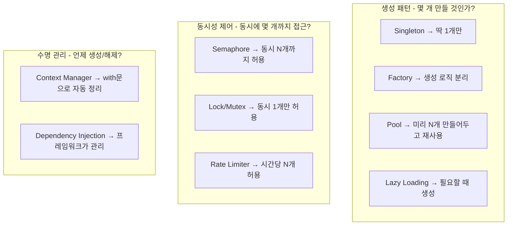
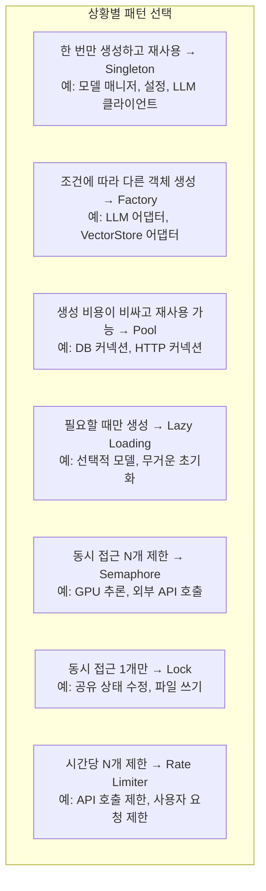

> **📚 FastAPI 시리즈 - Part 5. 실전 심화**
>
> 1. [동기 함수 vs 비동기 함수 선택 기준](/posts/sync-async-choice/)
> 2. [BackgroundTasks와 작업 큐](/posts/background-tasks/)
> 3. [동시 요청 처리와 성능 튜닝](/posts/concurrency-tuning/)
> 4. [FastAPI 예외처리](/posts/exception-handling/)
> 5. [프로젝트 구조 설계](/posts/project-structure/)
> 6. Python 객체/리소스 관리 패턴 ← 현재 글

---

# 6. Python 객체/리소스 관리 패턴

## 왜 객체/리소스 관리가 중요한가?

- 메모리 효율성
- 성능 최적화
- 동시성 제어
- 리소스 누수 방지

---

## 패턴 분류



---

## Part 1: 생성 패턴

### 1. Singleton (싱글톤)

### 개념

```
인스턴스가 오직 1개만 존재하도록 보장
```

### 언제 사용?

| 사용 O | 사용 X |
| --- | --- |
| ML 모델 | DB 세션 (요청별 필요) |
| 설정 객체 | 사용자 컨텍스트 |
| LLM 클라이언트 | 트랜잭션 |
| HTTP 클라이언트 | 요청별 데이터 |

### 구현

```python
from typing import Optional

class ModelManager:
    """싱글톤 - 모델 매니저"""

    _instance: Optional["ModelManager"] = None

    def __new__(cls):
        if cls._instance is None:
            cls._instance = super().__new__(cls)
            cls._instance._initialized = False
        return cls._instance

    def __init__(self):
        if self._initialized:
            return

        self.model = None
        self._initialized = True

    def load(self, path: str):
        self.model = load_model(path)

    def predict(self, data):
        return self.model.predict(data)

# 사용 - 어디서든 같은 인스턴스
manager1 = ModelManager()
manager2 = ModelManager()
print(manager1 is manager2)  # True

```

### FastAPI 적용

```python
# lifespan에서 초기화
@asynccontextmanager
async def lifespan(app: FastAPI):
    model_manager = ModelManager()
    await model_manager.load("models/")
    app.state.model_manager = model_manager
    yield
    await model_manager.cleanup()

# 의존성으로 주입
def get_model_manager(request: Request) -> ModelManager:
    return request.app.state.model_manager

@router.post("/predict")
async def predict(
    data: Input,
    model: ModelManager = Depends(get_model_manager)
):
    return model.predict(data)

```

---

### 2. Factory (팩토리)

### 개념

```
객체 생성 로직을 별도 클래스/함수로 분리
→ 생성 로직 변경 시 한 곳만 수정
→ 조건에 따라 다른 객체 생성
```

### 언제 사용?

| 사용 O | 사용 X |
| --- | --- |
| LLM 어댑터 (OpenAI/Anthropic) | 단순 객체 |
| VectorStore 어댑터 | 생성 로직이 단순할 때 |
| 환경별 다른 설정 |  |

### 구현

```python
from abc import ABC, abstractmethod

# 추상 인터페이스
class LLMClient(ABC):
    @abstractmethod
    async def chat(self, messages: list) -> str:
        pass

# 구현체들
class OpenAIClient(LLMClient):
    def __init__(self, api_key: str):
        self.client = AsyncOpenAI(api_key=api_key)

    async def chat(self, messages: list) -> str:
        response = await self.client.chat.completions.create(
            model="gpt-4",
            messages=messages
        )
        return response.choices[0].message.content

class AnthropicClient(LLMClient):
    def __init__(self, api_key: str):
        self.client = AsyncAnthropic(api_key=api_key)

    async def chat(self, messages: list) -> str:
        response = await self.client.messages.create(
            model="claude-3-sonnet",
            messages=messages,
            max_tokens=4096
        )
        return response.content[0].text

class BedrockClient(LLMClient):
    def __init__(self, region: str):
        self.client = boto3.client("bedrock-runtime", region_name=region)

    async def chat(self, messages: list) -> str:
        # Bedrock 구현
        pass

# 팩토리
class LLMClientFactory:
    """LLM 클라이언트 팩토리"""

    @staticmethod
    def create(provider: str, **kwargs) -> LLMClient:
        if provider == "openai":
            return OpenAIClient(api_key=kwargs["api_key"])
        elif provider == "anthropic":
            return AnthropicClient(api_key=kwargs["api_key"])
        elif provider == "bedrock":
            return BedrockClient(region=kwargs["region"])
        else:
            raise ValueError(f"Unknown provider: {provider}")

# 사용
client = LLMClientFactory.create(
    provider=settings.LLM_PROVIDER,
    api_key=settings.LLM_API_KEY
)

```

### 설정 기반 팩토리

```python
# config.py
class Settings(BaseSettings):
    LLM_PROVIDER: str = "openai"  # openai, anthropic, bedrock
    LLM_API_KEY: str = ""
    LLM_REGION: str = "us-east-1"

# factory.py
def create_llm_client(settings: Settings) -> LLMClient:
    """설정에 따라 LLM 클라이언트 생성"""

    config = {
        "openai": lambda: OpenAIClient(settings.LLM_API_KEY),
        "anthropic": lambda: AnthropicClient(settings.LLM_API_KEY),
        "bedrock": lambda: BedrockClient(settings.LLM_REGION),
    }

    factory = config.get(settings.LLM_PROVIDER)
    if not factory:
        raise ValueError(f"Unknown provider: {settings.LLM_PROVIDER}")

    return factory()

```

---

### 3. Pool (풀)

### 개념

```
미리 N개의 리소스를 만들어두고 재사용
→ 생성 비용이 비싼 리소스에 적합
→ 사용 후 반환, 다른 요청이 재사용
```

### 언제 사용?

| 사용 O | 사용 X |
| --- | --- |
| DB 커넥션 | 가벼운 객체 |
| HTTP 커넥션 | 생성 비용이 저렴한 것 |
| 스레드 풀 | 상태가 있는 객체 |

### DB 커넥션 풀

```python
from sqlalchemy import create_engine
from sqlalchemy.orm import sessionmaker
from sqlalchemy.ext.asyncio import create_async_engine, AsyncSession

# 동기 커넥션 풀
engine = create_engine(
    DATABASE_URL,
    pool_size=10,          # 기본 커넥션 수
    max_overflow=20,       # 추가 허용 커넥션
    pool_recycle=1800,     # 30분마다 재생성
    pool_pre_ping=True,    # 사용 전 연결 체크
)

# 비동기 커넥션 풀
async_engine = create_async_engine(
    ASYNC_DATABASE_URL,
    pool_size=10,
    max_overflow=20,
)

# 세션 팩토리
SessionLocal = sessionmaker(bind=engine)
AsyncSessionLocal = sessionmaker(
    bind=async_engine,
    class_=AsyncSession,
    expire_on_commit=False
)

# FastAPI 의존성 - 풀에서 가져와 사용 후 반환
async def get_db():
    async with AsyncSessionLocal() as session:
        yield session  # 사용 후 자동 반환

```

### HTTP 커넥션 풀

```python
import httpx

class HTTPClientPool:
    """HTTP 클라이언트 풀 (싱글톤)"""

    _instance = None

    def __new__(cls):
        if cls._instance is None:
            cls._instance = super().__new__(cls)
            cls._instance._initialized = False
        return cls._instance

    def __init__(self):
        if self._initialized:
            return
        self.client = None
        self._initialized = True

    async def initialize(self):
        self.client = httpx.AsyncClient(
            limits=httpx.Limits(
                max_connections=100,      # 최대 커넥션
                max_keepalive_connections=20,  # 유지할 커넥션
            ),
            timeout=httpx.Timeout(30.0),
        )

    async def get(self, url: str, **kwargs):
        return await self.client.get(url, **kwargs)

    async def post(self, url: str, **kwargs):
        return await self.client.post(url, **kwargs)

    async def close(self):
        if self.client:
            await self.client.aclose()

```

### 커스텀 풀 구현

```python
import asyncio
from typing import Generic, TypeVar, Callable
from collections import deque

T = TypeVar("T")

class ObjectPool(Generic[T]):
    """범용 객체 풀"""

    def __init__(
        self,
        factory: Callable[[], T],
        max_size: int = 10,
        min_size: int = 2
    ):
        self.factory = factory
        self.max_size = max_size
        self.min_size = min_size
        self._pool: deque[T] = deque()
        self._in_use: set[T] = set()
        self._lock = asyncio.Lock()

    async def initialize(self):
        """최소 개수만큼 미리 생성"""
        for _ in range(self.min_size):
            obj = self.factory()
            self._pool.append(obj)

    async def acquire(self) -> T:
        """풀에서 객체 가져오기"""
        async with self._lock:
            if self._pool:
                obj = self._pool.popleft()
            elif len(self._in_use) < self.max_size:
                obj = self.factory()
            else:
                raise RuntimeError("Pool exhausted")

            self._in_use.add(obj)
            return obj

    async def release(self, obj: T):
        """객체 반환"""
        async with self._lock:
            self._in_use.discard(obj)
            if len(self._pool) < self.max_size:
                self._pool.append(obj)

# 사용 예시
gpu_pool = ObjectPool(
    factory=lambda: GPUWorker(),
    max_size=4,
    min_size=2
)

async def process():
    worker = await gpu_pool.acquire()
    try:
        result = await worker.process(data)
        return result
    finally:
        await gpu_pool.release(worker)

```

---

### 4. Lazy Loading (지연 로딩)

### 개념

```
필요할 때 생성 (처음 접근 시)
→ 시작 시간 단축
→ 사용하지 않으면 생성 안 함
```

### 언제 사용?

| 사용 O | 사용 X |
| --- | --- |
| 선택적 기능의 모델 | 항상 필요한 리소스 |
| 무거운 초기화 | 빠른 응답 필요할 때 |
| 조건부 사용 리소스 |  |

### 구현

```python
class LazyModelLoader:
    """지연 로딩 모델 매니저"""

    def __init__(self):
        self._models: dict = {}
        self._model_paths: dict = {
            "classifier": "models/classifier.onnx",
            "detector": "models/detector.onnx",
            "segmenter": "models/segmenter.onnx",
        }

    def get_model(self, name: str):
        """필요할 때 로딩"""
        if name not in self._models:
            path = self._model_paths.get(name)
            if not path:
                raise ValueError(f"Unknown model: {name}")

            print(f"Loading model: {name}")  # 첫 접근 시만 로딩
            self._models[name] = load_model(path)

        return self._models[name]

# 사용
loader = LazyModelLoader()

# classifier가 필요할 때만 로딩
result1 = loader.get_model("classifier").predict(data)

# detector는 호출 안 하면 로딩 안 됨

```

### Property를 활용한 Lazy Loading

```python
class ServiceContainer:
    """서비스 컨테이너 - Lazy Loading"""

    def __init__(self, settings):
        self.settings = settings
        self._llm_client = None
        self._vector_store = None
        self._db_session = None

    @property
    def llm_client(self):
        """LLM 클라이언트 - 첫 접근 시 생성"""
        if self._llm_client is None:
            self._llm_client = LLMClientFactory.create(
                provider=self.settings.LLM_PROVIDER,
                api_key=self.settings.LLM_API_KEY
            )
        return self._llm_client

    @property
    def vector_store(self):
        """VectorStore - 첫 접근 시 생성"""
        if self._vector_store is None:
            self._vector_store = VectorStoreFactory.create(
                provider=self.settings.VECTOR_STORE_PROVIDER
            )
        return self._vector_store

# 사용
container = ServiceContainer(settings)

# llm_client 접근 시에만 생성
response = await container.llm_client.chat(messages)

```

---

## Part 2: 동시성 제어 패턴

### 1. Semaphore (세마포어)

### 개념

```
동시에 N개까지만 접근 허용
→ 리소스 과부하 방지
→ N=1이면 Lock과 동일
```

### 언제 사용?

| 사용 O | 사용 X |
| --- | --- |
| GPU 동시 사용 제한 | 순서가 중요한 작업 |
| 외부 API 동시 호출 제한 | 단일 접근만 필요할 때 |
| DB 커넥션 제한 |  |

### 구현

```python
import asyncio

class GPUInferenceService:
    """GPU 추론 서비스 - 동시 실행 제한"""

    def __init__(self, max_concurrent: int = 4):
        self.semaphore = asyncio.Semaphore(max_concurrent)
        self.model = None

    async def predict(self, data):
        """최대 4개까지만 동시 실행"""
        async with self.semaphore:
            # 이 블록 안에는 최대 4개 요청만 동시 진입
            result = await self._do_inference(data)
            return result

    async def _do_inference(self, data):
        # GPU 추론 실행
        return self.model.predict(data)

# 사용
service = GPUInferenceService(max_concurrent=4)

# 100개 요청이 와도 동시에 4개만 실행
results = await asyncio.gather(*[
    service.predict(data) for data in data_list
])

```

### 외부 API 호출 제한

```python
class ExternalAPIClient:
    """외부 API 클라이언트 - 동시 호출 제한"""

    def __init__(self, max_concurrent: int = 10):
        self.semaphore = asyncio.Semaphore(max_concurrent)
        self.client = httpx.AsyncClient()

    async def call_api(self, endpoint: str, data: dict):
        """동시 최대 10개 호출"""
        async with self.semaphore:
            response = await self.client.post(endpoint, json=data)
            return response.json()

# OpenAI API 호출 제한
class OpenAIRateLimitedClient:
    """OpenAI API - Rate Limit 대응"""

    def __init__(self, api_key: str, max_concurrent: int = 50):
        self.client = AsyncOpenAI(api_key=api_key)
        self.semaphore = asyncio.Semaphore(max_concurrent)

    async def chat(self, messages: list):
        async with self.semaphore:
            return await self.client.chat.completions.create(
                model="gpt-4",
                messages=messages
            )

```

### FastAPI 엔드포인트 동시 실행 제한

```python
# 글로벌 세마포어
inference_semaphore = asyncio.Semaphore(10)

@router.post("/heavy-task")
async def heavy_task(data: Input):
    """무거운 작업 - 동시 10개 제한"""
    async with inference_semaphore:
        result = await process_heavy_task(data)
        return result

# 또는 의존성으로
async def get_semaphore_slot():
    """세마포어 슬롯 획득"""
    async with inference_semaphore:
        yield

@router.post("/heavy-task")
async def heavy_task(
    data: Input,
    _: None = Depends(get_semaphore_slot)
):
    return await process_heavy_task(data)

```

---

### 2. Lock / Mutex (락 / 뮤텍스)

### 개념

```
동시에 1개만 접근 허용
→ 공유 자원 보호
→ 경쟁 상태(Race Condition) 방지
```

### 언제 사용?

| 사용 O | 사용 X |
| --- | --- |
| 공유 상태 수정 | 읽기 전용 |
| 파일 쓰기 | 독립적인 작업 |
| 카운터 증가 |  |

### 구현

```python
import asyncio
from threading import Lock

# 비동기 Lock
class Counter:
    """스레드 안전 카운터"""

    def __init__(self):
        self.value = 0
        self.lock = asyncio.Lock()

    async def increment(self):
        async with self.lock:
            # 이 블록은 한 번에 하나만 실행
            current = self.value
            await asyncio.sleep(0.001)  # 시뮬레이션
            self.value = current + 1
            return self.value

# 동기 Lock (멀티스레딩)
class ThreadSafeCounter:
    def __init__(self):
        self.value = 0
        self.lock = Lock()

    def increment(self):
        with self.lock:
            self.value += 1
            return self.value

```

### 파일 쓰기 보호

```python
class LogWriter:
    """로그 파일 쓰기 - 동시 접근 방지"""

    def __init__(self, filepath: str):
        self.filepath = filepath
        self.lock = asyncio.Lock()

    async def write(self, message: str):
        async with self.lock:
            async with aiofiles.open(self.filepath, "a") as f:
                await f.write(f"{datetime.now()}: {message}\n")

```

### 싱글톤 + Lock (스레드 안전)

```python
import threading

class ThreadSafeSingleton:
    """스레드 안전 싱글톤"""

    _instance = None
    _lock = threading.Lock()

    def __new__(cls):
        if cls._instance is None:
            with cls._lock:
                # Double-checked locking
                if cls._instance is None:
                    cls._instance = super().__new__(cls)
        return cls._instance

```

---

### 3. Rate Limiter (속도 제한)

### 개념

```
시간당 N개까지만 허용
→ API 과부하 방지
→ 외부 서비스 Rate Limit 대응
```

### 언제 사용?

| 사용 O | 사용 X |
| --- | --- |
| 외부 API 호출 | 내부 처리 |
| 사용자별 요청 제한 | 제한 없는 리소스 |
| 비용 제어 |  |

### Token Bucket 구현

```python
import asyncio
import time

class TokenBucketRateLimiter:
    """토큰 버킷 Rate Limiter"""

    def __init__(self, rate: float, capacity: int):
        """
        Args:
            rate: 초당 토큰 생성 수
            capacity: 버킷 최대 용량
        """
        self.rate = rate
        self.capacity = capacity
        self.tokens = capacity
        self.last_update = time.monotonic()
        self.lock = asyncio.Lock()

    async def acquire(self, tokens: int = 1) -> bool:
        """토큰 획득 시도"""
        async with self.lock:
            now = time.monotonic()
            elapsed = now - self.last_update

            # 토큰 충전
            self.tokens = min(
                self.capacity,
                self.tokens + elapsed * self.rate
            )
            self.last_update = now

            if self.tokens >= tokens:
                self.tokens -= tokens
                return True
            return False

    async def wait_and_acquire(self, tokens: int = 1):
        """토큰 획득까지 대기"""
        while not await self.acquire(tokens):
            await asyncio.sleep(0.1)

# 사용 - 초당 10개 요청 제한
rate_limiter = TokenBucketRateLimiter(rate=10, capacity=10)

async def call_external_api(data):
    await rate_limiter.wait_and_acquire()
    return await external_api.call(data)

```

### Sliding Window 구현

```python
from collections import deque

class SlidingWindowRateLimiter:
    """슬라이딩 윈도우 Rate Limiter"""

    def __init__(self, max_requests: int, window_seconds: int):
        """
        Args:
            max_requests: 윈도우 내 최대 요청 수
            window_seconds: 윈도우 크기 (초)
        """
        self.max_requests = max_requests
        self.window_seconds = window_seconds
        self.requests: deque = deque()
        self.lock = asyncio.Lock()

    async def is_allowed(self) -> bool:
        """요청 허용 여부"""
        async with self.lock:
            now = time.monotonic()

            # 윈도우 밖의 요청 제거
            while self.requests and self.requests[0] < now - self.window_seconds:
                self.requests.popleft()

            if len(self.requests) < self.max_requests:
                self.requests.append(now)
                return True
            return False

# 사용 - 분당 100개 요청 제한
limiter = SlidingWindowRateLimiter(max_requests=100, window_seconds=60)

@router.post("/api")
async def api_endpoint(data: Input):
    if not await limiter.is_allowed():
        raise HTTPException(status_code=429, detail="Too Many Requests")

    return await process(data)

```

---

## Part 3: 수명 관리 패턴

### 1. Context Manager

### 개념

```
with문으로 리소스 자동 정리
→ 시작/종료 로직 캡슐화
→ 예외 발생해도 정리 보장
```

### 동기 Context Manager

```python
class DatabaseConnection:
    """DB 연결 Context Manager"""

    def __init__(self, url: str):
        self.url = url
        self.connection = None

    def __enter__(self):
        self.connection = create_connection(self.url)
        return self.connection

    def __exit__(self, exc_type, exc_val, exc_tb):
        if self.connection:
            self.connection.close()
        return False  # 예외 전파

# 사용
with DatabaseConnection(url) as conn:
    conn.execute("SELECT * FROM users")
# 자동으로 close() 호출

```

### 비동기 Context Manager

```python
class AsyncHTTPClient:
    """비동기 HTTP 클라이언트"""

    def __init__(self):
        self.client = None

    async def __aenter__(self):
        self.client = httpx.AsyncClient()
        return self.client

    async def __aexit__(self, exc_type, exc_val, exc_tb):
        if self.client:
            await self.client.aclose()
        return False

# 사용
async with AsyncHTTPClient() as client:
    response = await client.get("https://api.example.com")

```

### contextlib 활용

```python
from contextlib import asynccontextmanager, contextmanager

@contextmanager
def timer():
    """실행 시간 측정"""
    start = time.time()
    yield
    elapsed = time.time() - start
    print(f"Elapsed: {elapsed:.2f}s")

@asynccontextmanager
async def get_db_session():
    """DB 세션 관리"""
    session = AsyncSession()
    try:
        yield session
        await session.commit()
    except Exception:
        await session.rollback()
        raise
    finally:
        await session.close()

# 사용
with timer():
    process_data()

async with get_db_session() as session:
    await session.execute(...)

```

---

### 2. FastAPI Lifespan

### 개념

```
앱 시작/종료 시 리소스 관리
→ 모델 로딩, 클라이언트 초기화
→ 정리 작업 보장
```

### 구현

```python
from contextlib import asynccontextmanager
from fastapi import FastAPI

@asynccontextmanager
async def lifespan(app: FastAPI):
    """앱 수명주기 관리"""

    # ===== 시작 시 =====
    print("Starting up...")

    # 모델 로딩
    model_manager = ModelManager()
    await model_manager.load()
    app.state.model_manager = model_manager

    # HTTP 클라이언트
    http_client = httpx.AsyncClient()
    app.state.http_client = http_client

    # Redis
    redis = await aioredis.from_url(settings.REDIS_URL)
    app.state.redis = redis

    yield  # 앱 실행

    # ===== 종료 시 =====
    print("Shutting down...")

    await http_client.aclose()
    await redis.close()
    await model_manager.cleanup()

app = FastAPI(lifespan=lifespan)

```

---

## Part 4: 패턴 선택 가이드

### 상황별 패턴 선택



### FastAPI 실전 조합

```python
# 완전한 예시 - 모든 패턴 조합
from contextlib import asynccontextmanager
from fastapi import FastAPI, Depends, Request
import asyncio

# 1. Singleton - 모델 매니저
class ModelManager:
    _instance = None

    def __new__(cls):
        if cls._instance is None:
            cls._instance = super().__new__(cls)
        return cls._instance

# 2. Factory - LLM 클라이언트
class LLMFactory:
    @staticmethod
    def create(provider: str) -> LLMClient:
        clients = {"openai": OpenAIClient, "anthropic": AnthropicClient}
        return clients[provider]()

# 3. Pool - DB 커넥션
engine = create_async_engine(DATABASE_URL, pool_size=10)

# 4. Semaphore - GPU 동시 사용 제한
gpu_semaphore = asyncio.Semaphore(4)

# 5. Rate Limiter - API 호출 제한
api_limiter = TokenBucketRateLimiter(rate=10, capacity=10)

# Lifespan - 수명 관리
@asynccontextmanager
async def lifespan(app: FastAPI):
    # 시작
    model_manager = ModelManager()
    await model_manager.load()
    app.state.model_manager = model_manager
    app.state.llm_client = LLMFactory.create(settings.LLM_PROVIDER)

    yield

    # 종료
    await model_manager.cleanup()

app = FastAPI(lifespan=lifespan)

# 의존성
def get_model_manager(request: Request) -> ModelManager:
    return request.app.state.model_manager

async def get_db():
    async with AsyncSession(engine) as session:
        yield session

async def acquire_gpu():
    async with gpu_semaphore:
        yield

# 엔드포인트
@app.post("/predict")
async def predict(
    data: Input,
    model: ModelManager = Depends(get_model_manager),
    db: AsyncSession = Depends(get_db),
    _: None = Depends(acquire_gpu),  # GPU 슬롯 획득
):
    # Rate Limit 체크
    await api_limiter.wait_and_acquire()

    # 추론
    result = model.predict(data)

    # DB 저장
    await db.execute(...)

    return result

```

---

## 핵심 정리

| 패턴 | 목적 | 예시 |
| --- | --- | --- |
| **Singleton** | 1개만 생성 | 모델, 설정 |
| **Factory** | 생성 로직 분리 | 어댑터 생성 |
| **Pool** | N개 재사용 | DB 커넥션 |
| **Lazy Loading** | 필요시 생성 | 선택적 모델 |
| **Semaphore** | 동시 N개 | GPU 제한 |
| **Lock** | 동시 1개 | 상태 수정 |
| **Rate Limiter** | 시간당 N개 | API 제한 |
| **Context Manager** | 자동 정리 | 리소스 관리 |

### 한 줄 요약

```
Singleton = 1개만, Pool = N개 재사용, Semaphore = 동시 N개 제한
→ 상황에 맞게 조합해서 사용!
```