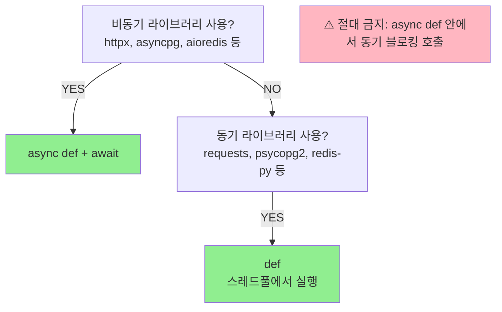
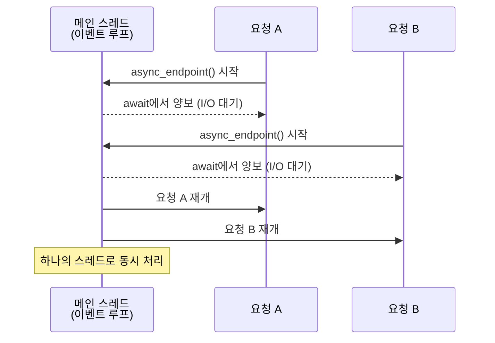
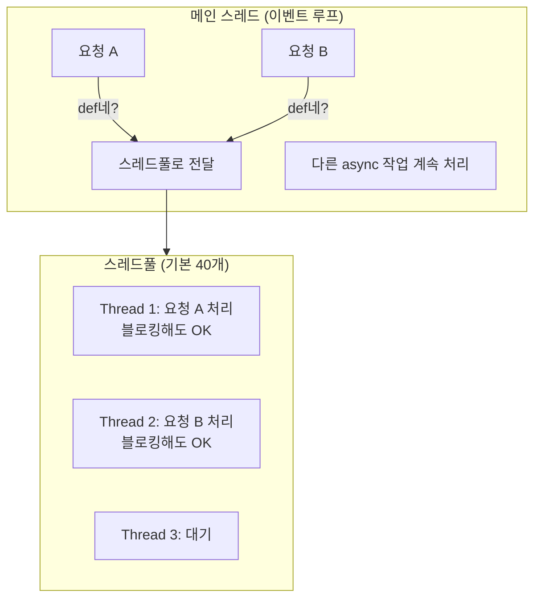
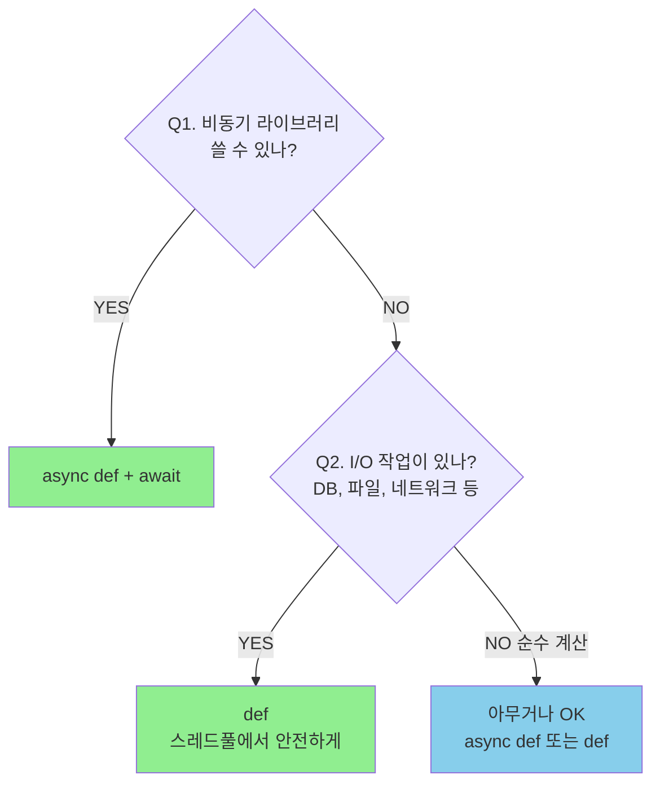
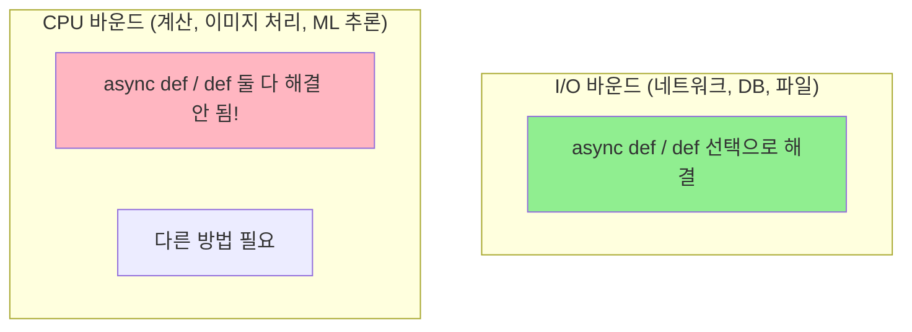
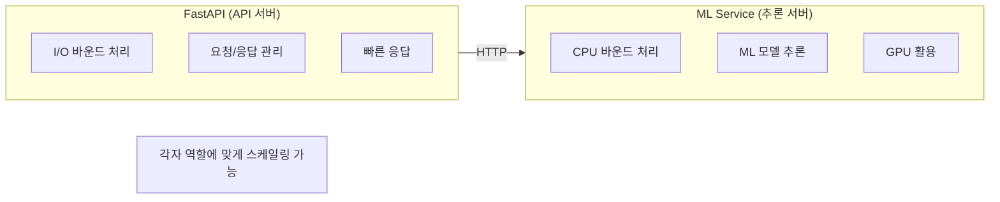
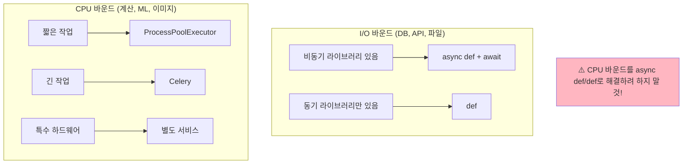

> **📚 FastAPI 시리즈 - Part 5. 실전 심화**
>
> 1. 동기 함수 vs 비동기 함수 선택 기준 ← 현재 글
> 2. [BackgroundTasks와 작업 큐](/posts/background-tasks/)
> 3. [동시 요청 처리와 성능 튜닝](/posts/concurrency-tuning/)
> 4. [FastAPI 예외처리](/posts/exception-handling/)
> 5. [프로젝트 구조 설계](/posts/project-structure/)
> 6. [Python 객체/리소스 관리 패턴](/posts/resource-management/)

---

# 1. 동기 함수 vs 비동기 함수 선택 기준

## 왜 이 개념이 중요한가?

- FastAPI에서 가장 흔히 하는 실수
- 잘못 선택하면 성능이 크게 저하됨
- 상황에 맞는 올바른 선택이 중요

---

## 핵심 규칙 (먼저 결론)



---

## FastAPI의 처리 방식

### async def → 메인 이벤트 루프

```python
@app.get("/async")
async def async_endpoint():
    await some_async_io()  # await로 양보
    return {"status": "done"}

```



### def → 스레드풀

```python
@app.get("/sync")
def sync_endpoint():
    some_blocking_io()  # 블로킹 OK
    return {"status": "done"}

```



---

## 올바른 사용 예시

### ✅ async def + 비동기 라이브러리

```python
import httpx

@app.get("/external")
async def call_external():
    async with httpx.AsyncClient() as client:
        response = await client.get("https://api.example.com")
    return response.json()

```

### ✅ def + 동기 라이브러리

```python
import requests

@app.get("/external")
def call_external():
    response = requests.get("https://api.example.com")  # 블로킹 OK
    return response.json()

```

### ❌ async def + 동기 라이브러리 (절대 금지!)

```python
import requests

@app.get("/bad")
async def bad_endpoint():
    # 이벤트 루프 전체가 블로킹됨!
    # 다른 모든 요청도 멈춤!
    response = requests.get("https://api.example.com")
    return response.json()

```

---

## 왜 async def + 블로킹이 위험한가?

### 시뮬레이션

```python
import time

# ❌ 잘못된 코드
@app.get("/bad")
async def bad():
    time.sleep(5)  # 5초 블로킹
    return {"status": "done"}

```



```mermaid
gantt
    title async def + 블로킹의 문제 (이벤트 루프 - 단일 스레드)
    dateFormat X
    axisFormat %s초

    section 요청 A
    time.sleep 5초 실행 :0, 5

    section 요청 B
    대기 :5, 10

    section 요청 C
    대기 :10, 15

    section 요청 D
    대기 :15, 20
```

> **동시 처리 불가! 순차 처리됨!**

### 성능 비교 (동시 100개 요청, 각 1초 I/O)

| 방식 | 총 소요 시간 |
| --- | --- |
| ✅ `async def` + `await asyncio.sleep(1)` | **~1초** |
| ✅ `def` + `time.sleep(1)` | ~3초 (스레드풀 크기에 따라) |
| ❌ `async def` + `time.sleep(1)` | **~100초** (순차 실행) |

---

## 실전 케이스별 가이드

### 1. 외부 API 호출

```python
# ✅ 비동기 (httpx)
@app.get("/api")
async def call_api():
    async with httpx.AsyncClient() as client:
        response = await client.get("https://api.example.com")
    return response.json()

# ✅ 동기 (requests)
@app.get("/api")
def call_api():
    response = requests.get("https://api.example.com")
    return response.json()

```

### 2. 데이터베이스

```python
# ✅ 비동기 ORM (SQLAlchemy 2.0 async)
@app.get("/users")
async def get_users(db: AsyncSession = Depends(get_async_db)):
    result = await db.execute(select(User))
    return result.scalars().all()

# ✅ 동기 ORM (SQLAlchemy 기본)
@app.get("/users")
def get_users(db: Session = Depends(get_db)):
    return db.query(User).all()

```

### 3. 파일 I/O

```python
# ✅ 비동기 (aiofiles)
@app.get("/file")
async def read_file():
    async with aiofiles.open("data.txt") as f:
        return await f.read()

# ✅ 동기 (기본 open)
@app.get("/file")
def read_file():
    with open("data.txt") as f:
        return f.read()

```

### 4. Redis

```python
# ✅ 비동기 (aioredis / redis-py async)
@app.get("/cache")
async def get_cache():
    value = await redis.get("key")
    return {"value": value}

# ✅ 동기 (redis-py)
@app.get("/cache")
def get_cache():
    value = redis_client.get("key")
    return {"value": value}

```

---

## 혼합 사용

### 하나의 앱에서 둘 다 사용 가능

```python
from fastapi import FastAPI

app = FastAPI()

# 비동기 가능한 외부 API
@app.get("/async-api")
async def async_api():
    async with httpx.AsyncClient() as client:
        return await client.get("https://api.example.com")

# 레거시 동기 라이브러리
@app.get("/legacy")
def legacy():
    return legacy_sync_library.do_something()

# 단순 연산 (뭘 써도 됨)
@app.get("/health")
async def health():
    return {"status": "ok"}

```

---

## 동기 코드를 async에서 실행해야 할 때

### run_in_executor 사용

```python
import asyncio
import requests

@app.get("/workaround")
async def workaround():
    loop = asyncio.get_event_loop()

    # 동기 함수를 스레드풀에서 실행
    response = await loop.run_in_executor(
        None,  # 기본 스레드풀
        lambda: requests.get("https://api.example.com")
    )

    return response.json()

```

### 언제 사용?

- **상황**: async def 엔드포인트인데, 동기 라이브러리를 써야 할 때
- **해결**: run_in_executor로 스레드풀에 위임

하지만 가능하면:
- 비동기 라이브러리로 교체하거나
- def로 변경하는 것이 더 깔끔하다

---

## 판단 플로우차트



---

## 주요 라이브러리 매핑

| 용도 | 동기 (def) | 비동기 (async def) |
| --- | --- | --- |
| HTTP 클라이언트 | requests | httpx, aiohttp |
| PostgreSQL | psycopg2 | asyncpg, psycopg3 |
| MySQL | PyMySQL | aiomysql |
| Redis | redis-py | aioredis, redis-py async |
| 파일 I/O | 기본 open | aiofiles |
| MongoDB | PyMongo | Motor |
| SQLAlchemy | Session | AsyncSession (2.0+) |

---

## 핵심 정리

| 상황 | 선택 |
| --- | --- |
| 비동기 라이브러리 사용 | `async def` + `await` |
| 동기 라이브러리 사용 | `def` |
| 잘 모르겠으면 | `def` (안전) |
| **async def + 블로킹** | **❌ 절대 금지** |

### 체크리스트

- 내가 쓰는 라이브러리가 비동기를 지원하나?
  - YES → async def
  - NO → def
- async def 안에서 await 없이 I/O 하고 있나?
  - YES → 위험! def로 바꾸거나 비동기 라이브러리로 교체

---

## 기타내용

## CPU 바운드는 다른 방법으로!

### async def vs def 는 I/O 바운드 얘기



### 왜 CPU 바운드는 다른가?

```python
# CPU 바운드 예시
def heavy_computation():
    result = 0
    for i in range(100_000_000):
        result += i * i
    return result

```

| 작업 유형 | CPU 사용 패턴 | 설명 |
| --- | --- | --- |
| **I/O 바운드** | 대부분 대기, 가끔 실행 | 대기 시간에 다른 작업 가능 |
| **CPU 바운드** | 계속 실행, 대기 없음 | 양보할 틈이 없음, async def 써도 await 할 곳이 없음, def 써도 GIL 때문에 다른 스레드 블로킹 |

### CPU 바운드 해결책

### 1. ProcessPoolExecutor (멀티프로세싱)

```python
import asyncio
from concurrent.futures import ProcessPoolExecutor

# 프로세스 풀 생성 (앱 시작 시)
process_pool = ProcessPoolExecutor(max_workers=4)

def heavy_computation(n: int) -> int:
    """CPU 집약적 작업 (별도 프로세스에서 실행)"""
    result = 0
    for i in range(n):
        result += i * i
    return result

@app.get("/compute")
async def compute(n: int = 1000000):
    loop = asyncio.get_event_loop()

    # 별도 프로세스에서 실행 → GIL 우회
    result = await loop.run_in_executor(
        process_pool,
        heavy_computation,
        n
    )

    return {"result": result}

```

### 2. Celery (작업 큐)

```python
from celery import Celery

celery_app = Celery("tasks", broker="redis://localhost:6379")

@celery_app.task
def heavy_computation(n: int) -> int:
    result = 0
    for i in range(n):
        result += i * i
    return result

@app.post("/compute")
async def compute(n: int):
    # 워커에 작업 위임, 즉시 응답
    task = heavy_computation.delay(n)
    return {"task_id": task.id}

@app.get("/result/{task_id}")
async def get_result(task_id: str):
    task = heavy_computation.AsyncResult(task_id)
    if task.ready():
        return {"result": task.result}
    return {"status": "processing"}

```

### 3. 별도 서비스로 분리



### CPU 바운드 해결책 비교

| 방법 | 장점 | 단점 | 적합한 경우 |
| --- | --- | --- | --- |
| ProcessPoolExecutor | 간단, 추가 인프라 불필요 | 프로세스 간 데이터 복사 비용 | 간단한 계산 |
| Celery | 확장성, 재시도, 모니터링 | 인프라 복잡 (Redis/RabbitMQ) | 대규모, 긴 작업 |
| 별도 서비스 | 독립적 스케일링, GPU 활용 | 네트워크 오버헤드 | ML 추론, 특수 하드웨어 |

### 최종 정리


