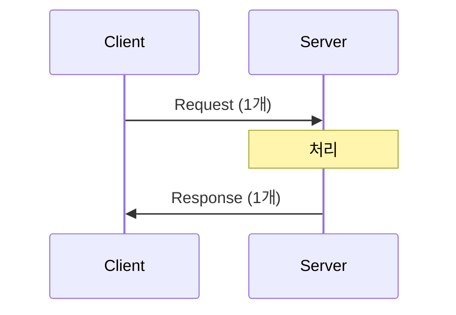
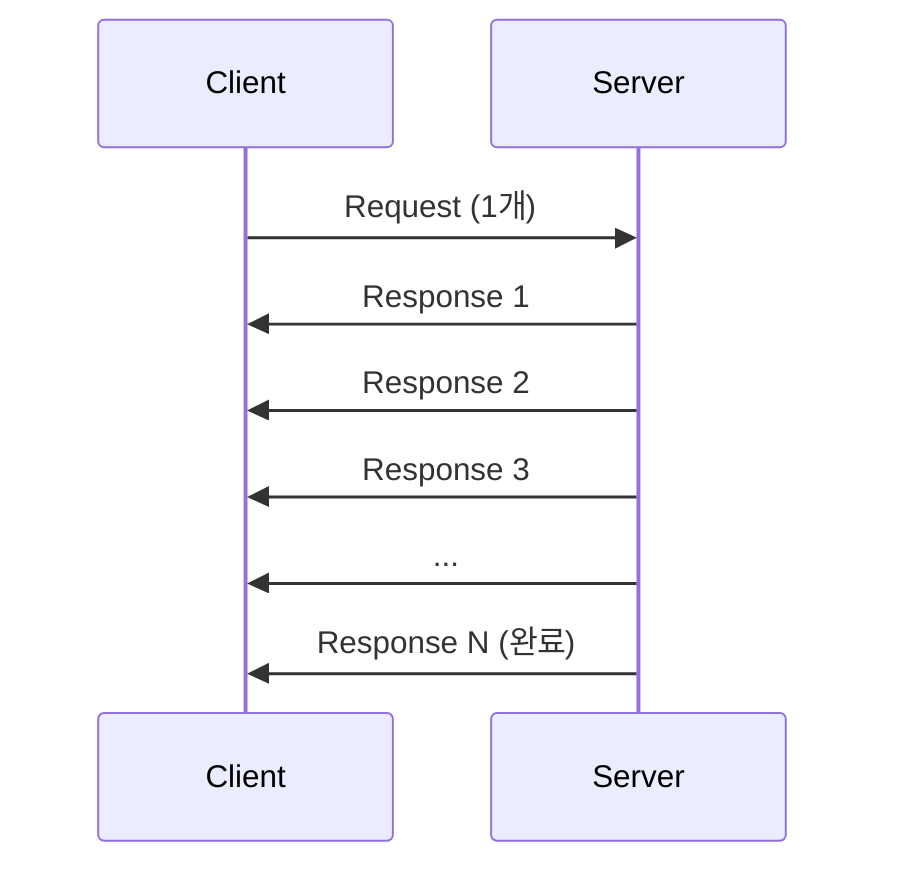
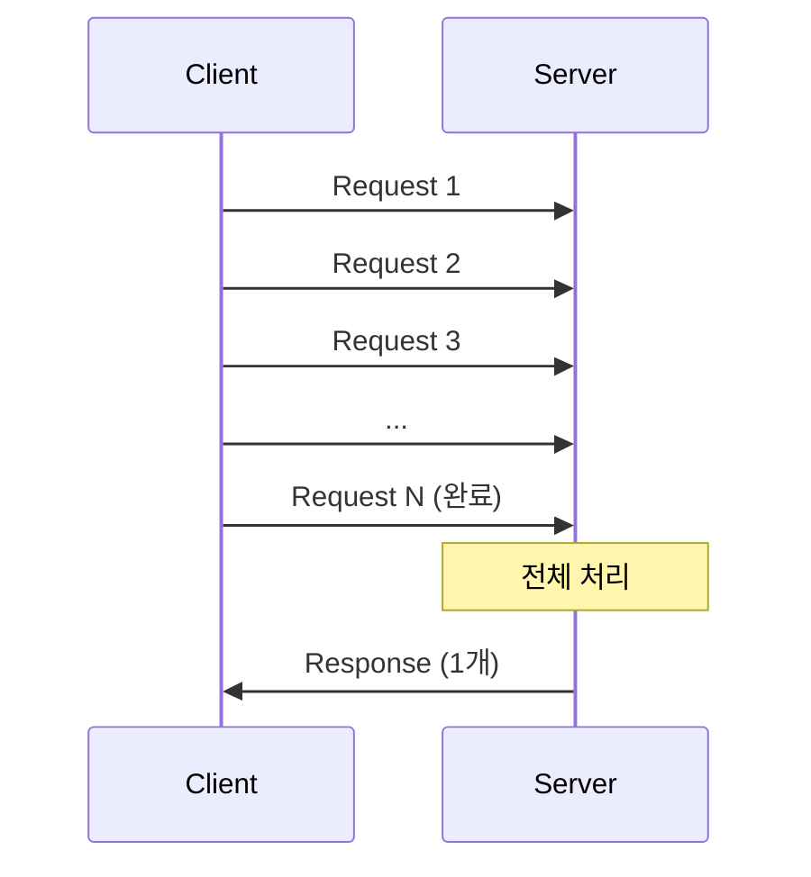
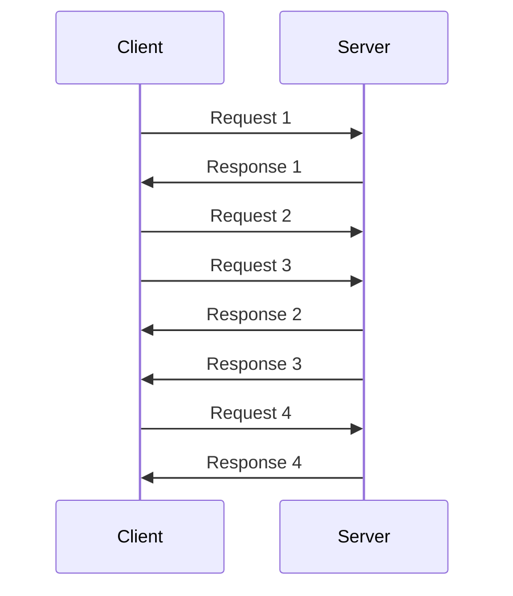
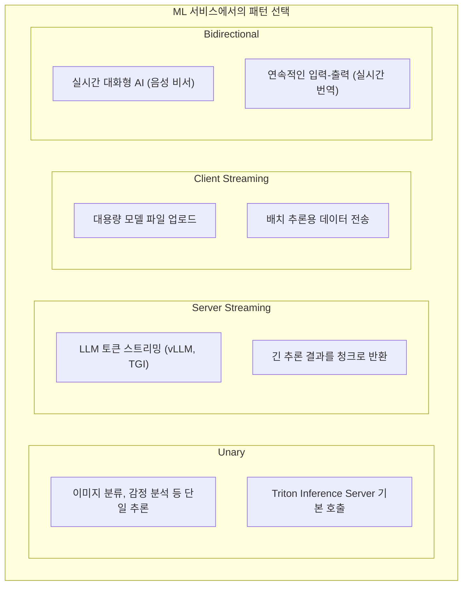

> **📚 gRPC 시리즈 - Part 2. gRPC 핵심 개념**
>
> 1. [.proto 파일과 코드 생성](/posts/proto-codegen/)
> 2. 4가지 통신 패턴 ← 현재 글
> 3. [Channel, Metadata, Error Handling](/posts/grpc-advanced/)
> 4. [gRPC vs REST 비교](/posts/grpc-vs-rest/)

---

## 왜 이걸 알아야 하는가?

REST는 요청-응답 하나뿐이다. gRPC는 **4가지 패턴**을 지원한다.

- LLM 토큰 스트리밍 → Server Streaming
- 대용량 파일 업로드 → Client Streaming
- 실시간 채팅 → Bidirectional Streaming

상황에 맞는 패턴을 선택해야 효율적인 설계가 가능하다.

---

## 4가지 패턴 개요

| 패턴 | 요청 | 응답 |
| --- | --- | --- |
| **Unary** | 1개 | 1개 |
| **Server Streaming** | 1개 | N개 |
| **Client Streaming** | N개 | 1개 |
| **Bidirectional Streaming** | N개 | N개 |

---

## 1. Unary RPC

### 개념



**가장 일반적인 패턴.** REST API의 요청-응답과 동일하다.

### proto 정의

```protobuf
service UserService {
    rpc GetUser(GetUserRequest) returns (GetUserResponse);  // stream 없음
}
```

### 서버 구현

```python
class UserServiceServicer(user_pb2_grpc.UserServiceServicer):

    def GetUser(self, request, context):
        user = db.get_user(request.id)
        return user_pb2.GetUserResponse(user=user)
```

### 클라이언트 호출

```python
# 일반 함수 호출처럼 사용
response = stub.GetUser(user_pb2.GetUserRequest(id=123))
print(response.user.name)
```

### 사용 사례

| 사용처 | 예시 |
| --- | --- |
| CRUD 작업 | 유저 조회, 생성, 수정, 삭제 |
| 단일 추론 | 이미지 분류, 감정 분석 |
| 설정 조회 | 서버 설정, 피처 플래그 |

---

## 2. Server Streaming RPC

### 개념



**서버가 여러 응답을 순차적으로 전송.**

### proto 정의

```protobuf
service UserService {
    rpc ListUsers(ListUsersRequest) returns (stream User);  // 응답에 stream
}

service LLMService {
    rpc Generate(GenerateRequest) returns (stream Token);   // 토큰 스트리밍
}
```

### 서버 구현

```python
class UserServiceServicer(user_pb2_grpc.UserServiceServicer):

    def ListUsers(self, request, context):
        users = db.get_all_users()

        # yield로 하나씩 전송
        for user in users:
            yield user  # 각 user가 클라이언트로 전송됨
```

### 클라이언트 호출

```python
# 이터레이터로 받음
for user in stub.ListUsers(user_pb2.ListUsersRequest()):
    print(user.name)  # 하나씩 도착할 때마다 처리
```

### 사용 사례

| 사용처 | 예시 |
| --- | --- |
| **LLM 토큰 스트리밍** | ChatGPT처럼 글자가 하나씩 나오는 효과 |
| 대용량 목록 조회 | 10만 건 데이터를 청크로 전송 |
| 실시간 피드 | 주식 시세, 로그 모니터링 |

### LLM 스트리밍 예시

```protobuf
// llm.proto
service LLMService {
    rpc Generate(GenerateRequest) returns (stream GenerateResponse);
}

message GenerateRequest {
    string prompt = 1;
    int32 max_tokens = 2;
}

message GenerateResponse {
    string token = 1;
    bool is_finished = 2;
}
```

```python
# 서버
class LLMServiceServicer(llm_pb2_grpc.LLMServiceServicer):

    def Generate(self, request, context):
        for token in llm.generate(request.prompt):
            yield llm_pb2.GenerateResponse(
                token=token,
                is_finished=False
            )

        yield llm_pb2.GenerateResponse(is_finished=True)

# 클라이언트
for response in stub.Generate(llm_pb2.GenerateRequest(prompt="안녕")):
    if not response.is_finished:
        print(response.token, end="", flush=True)  # 토큰 하나씩 출력
```

---

## 3. Client Streaming RPC

### 개념



**클라이언트가 여러 요청을 보내고, 서버가 한 번에 응답.**

### proto 정의

```protobuf
service FileService {
    rpc Upload(stream FileChunk) returns (UploadResponse);  // 요청에 stream
}

service DataService {
    rpc BatchInsert(stream Record) returns (BatchResponse);
}
```

### 서버 구현

```python
class FileServiceServicer(file_pb2_grpc.FileServiceServicer):

    def Upload(self, request_iterator, context):
        total_size = 0
        file_data = b""

        # 이터레이터로 요청들을 받음
        for chunk in request_iterator:
            file_data += chunk.data
            total_size += len(chunk.data)

        # 파일 저장
        save_file(file_data)

        # 최종 응답
        return file_pb2.UploadResponse(
            success=True,
            total_size=total_size
        )
```

### 클라이언트 호출

```python
def generate_chunks(file_path):
    """파일을 청크로 나눠서 yield"""
    with open(file_path, 'rb') as f:
        while True:
            chunk = f.read(1024 * 1024)  # 1MB씩
            if not chunk:
                break
            yield file_pb2.FileChunk(data=chunk)

# 제너레이터를 전달
response = stub.Upload(generate_chunks("/path/to/large_file.zip"))
print(f"Uploaded: {response.total_size} bytes")
```

### 사용 사례

| 사용처 | 예시 |
| --- | --- |
| 대용량 파일 업로드 | 영상, 모델 파일 업로드 |
| 배치 삽입 | 대량 데이터 한 번에 전송 |
| IoT 센서 데이터 | 센서 값들을 모아서 처리 |

---

## 4. Bidirectional Streaming RPC

### 개념



**양쪽이 독립적으로 스트리밍.** 순서나 타이밍 제약 없음.

### proto 정의

```protobuf
service ChatService {
    rpc Chat(stream ChatMessage) returns (stream ChatMessage);  // 양쪽 stream
}
```

### 서버 구현

```python
class ChatServiceServicer(chat_pb2_grpc.ChatServiceServicer):

    def Chat(self, request_iterator, context):
        for message in request_iterator:
            # 클라이언트 메시지 처리
            print(f"Received: {message.content}")

            # 응답 생성 및 전송
            response = process_message(message)
            yield chat_pb2.ChatMessage(content=response)
```

### 클라이언트 호출

```python
import threading
import queue

def run_chat():
    # 보낼 메시지 큐
    outgoing = queue.Queue()

    def generate_messages():
        while True:
            msg = outgoing.get()
            if msg is None:
                break
            yield chat_pb2.ChatMessage(content=msg)

    # 양방향 스트림 시작
    responses = stub.Chat(generate_messages())

    # 응답 수신 스레드
    def receive():
        for response in responses:
            print(f"Server: {response.content}")

    recv_thread = threading.Thread(target=receive)
    recv_thread.start()

    # 메시지 전송
    while True:
        user_input = input("You: ")
        if user_input == "quit":
            outgoing.put(None)
            break
        outgoing.put(user_input)

    recv_thread.join()
```

### 사용 사례

| 사용처 | 예시 |
| --- | --- |
| 실시간 채팅 | 메신저, 상담 챗봇 |
| 게임 서버 | 실시간 멀티플레이어 |
| 협업 도구 | 동시 편집, 화이트보드 |
| 음성/영상 통화 | 양방향 미디어 스트리밍 |

---

## 패턴 비교 정리

| 패턴 | 요청 | 응답 | 사용 사례 |
| --- | --- | --- | --- |
| **Unary** | 1개 | 1개 | 일반 API 호출 |
| **Server Stream** | 1개 | N개 | LLM 토큰 스트리밍, 대용량 목록 조회 |
| **Client Stream** | N개 | 1개 | 파일 업로드, 배치 데이터 전송 |
| **Bidirectional** | N개 | N개 | 실시간 채팅, 게임, 협업 도구 |

---

## proto 문법 정리

```protobuf
service MyService {
    // Unary - stream 키워드 없음
    rpc Method1(Request) returns (Response);

    // Server Streaming - 응답에 stream
    rpc Method2(Request) returns (stream Response);

    // Client Streaming - 요청에 stream
    rpc Method3(stream Request) returns (Response);

    // Bidirectional - 양쪽에 stream
    rpc Method4(stream Request) returns (stream Response);
}
```

---

## MLOps 관점에서 활용



---

## 핵심 정리

| 패턴 | 키워드 | 핵심 |
| --- | --- | --- |
| **Unary** | 없음 | REST처럼 1:1 |
| **Server Streaming** | `returns (stream X)` | 서버가 여러 번 응답 |
| **Client Streaming** | `(stream X) returns` | 클라이언트가 여러 번 요청 |
| **Bidirectional** | 양쪽 `stream` | 실시간 양방향 |
