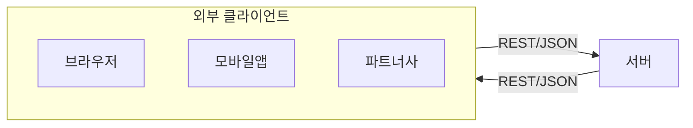
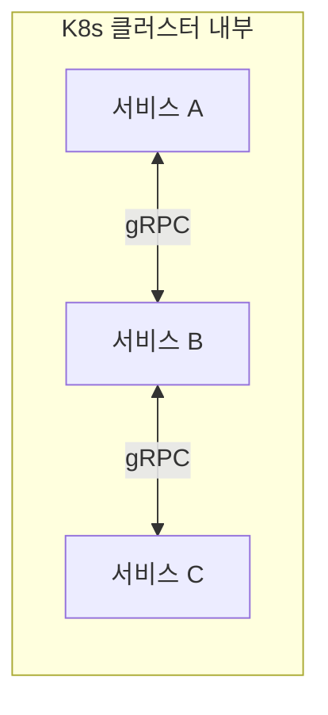
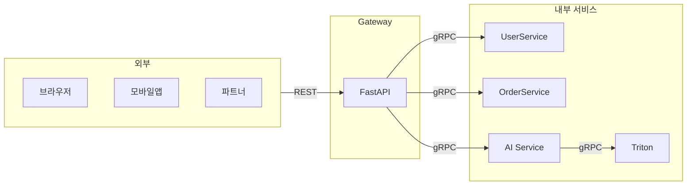
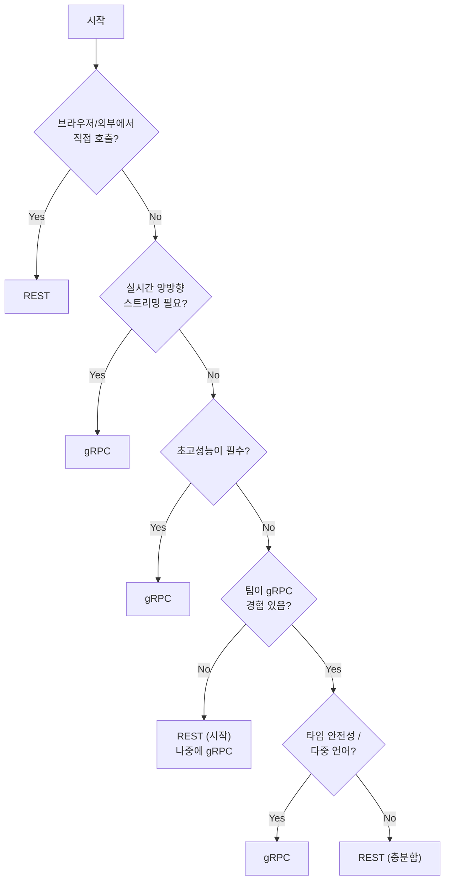

> **📚 gRPC 시리즈 - Part 2. gRPC 핵심 개념**
>
> 1. [.proto 파일과 코드 생성](/posts/proto-codegen/)
> 2. [4가지 통신 패턴](/posts/grpc-patterns/)
> 3. [Channel, Metadata, Error Handling](/posts/grpc-advanced/)
> 4. gRPC vs REST 비교 ← 현재 글

---

## 왜 이걸 알아야 하는가?

"gRPC가 좋다던데 왜 아직도 REST 쓰나요?"

실제로 gRPC가 모든 상황에서 좋은 건 아니다. 각각 적합한 상황이 다르다.

이 문서를 읽고 나면 **"이 상황에서는 뭘 써야 하지?"** 에 답할 수 있다.

---

## 한눈에 비교

| 항목 | REST | gRPC |
| --- | --- | --- |
| **프로토콜** | HTTP/1.1 (주로) | HTTP/2 |
| **데이터 포맷** | JSON (주로) | Protobuf (바이너리) |
| **설계 사상** | 리소스 중심 (Noun) | 함수 중심 (Verb) |
| **타입 안전성** | 런타임 체크 | 컴파일 타임 체크 |
| **스트리밍** | 제한적 (SSE, WebSocket 별도) | 네이티브 지원 |
| **브라우저 지원** | ✅ 완벽 | ❌ 직접 불가 (프록시 필요) |
| **가독성** | 높음 (JSON) | 낮음 (바이너리) |
| **코드 생성** | 선택 (OpenAPI) | 필수 (protoc) |

---

## 성능 비교

### 페이로드 크기

```mermaid
flowchart TB
    subgraph Comparison["페이로드 크기 비교"]
        subgraph JSON["JSON (62 bytes)"]
            J1["{\"user_id\":123,\"name\":\"홍길동\",\"email\":\"hong@test.com\"}"]
        end

        subgraph Protobuf["Protobuf (28 bytes)"]
            P1["08 7B 12 09 ED 99 8D EA B8 B8 EB 8F 99 1A 0E ..."]
        end
    end

    JSON -.->|"55% 감소"| Protobuf
```

### 지연 시간 (내부 통신 기준)

| 시나리오 | REST + JSON | gRPC + Protobuf |
| --- | --- | --- |
| 단순 조회 | ~10ms | ~2ms |
| 대용량 목록 (1만 건) | ~500ms | ~100ms |
| 연속 호출 100회 | ~1000ms | ~200ms |

### 왜 이런 차이가 나는가?

**REST가 느린 이유:**

- JSON 파싱 (문자열 처리)
- 매 요청마다 헤더 반복 전송
- HTTP/1.1 Head-of-Line Blocking

**gRPC가 빠른 이유:**

- 바이너리 직렬화 (파싱 오버헤드 적음)
- HTTP/2 헤더 압축 (HPACK)
- 멀티플렉싱 (연결 재사용)

---

## 개발 경험 비교

### API 정의

**REST (OpenAPI 명세 - 선택사항)**

```yaml
paths:
  /users/{id}:
    get:
      summary: Get user by ID
      parameters:
        - name: id
          in: path
          required: true
          schema:
            type: integer
```

→ 명세 없이도 개발 가능
→ 문서와 코드가 분리될 수 있음

**gRPC (.proto 파일 - 필수)**

```protobuf
service UserService {
    rpc GetUser(GetUserRequest) returns (User);
}

message GetUserRequest {
    int64 id = 1;
}
```

→ 반드시 스키마 정의 필요
→ 스키마가 곧 문서

### 디버깅

| 상황 | REST | gRPC |
| --- | --- | --- |
| **빠른 테스트** | curl로 바로 가능 | grpcurl 별도 설치 |
| **브라우저 테스트** | 주소창에 입력 | 불가능 |
| **로그 확인** | JSON 바로 읽힘 | 바이너리라 도구 필요 |
| **네트워크 분석** | Wireshark로 쉽게 | Protobuf 디코더 필요 |

```bash
# REST 테스트
curl http://localhost:8000/users/123

# gRPC 테스트 (별도 도구 필요)
grpcurl -plaintext localhost:50051 user.UserService/GetUser
```

### 학습 곡선

**REST 시작:**

1. FastAPI 설치
2. 엔드포인트 작성
3. 끝

**gRPC 시작:**

1. grpcio, grpcio-tools 설치
2. .proto 파일 작성
3. protoc로 코드 생성
4. Servicer 구현
5. 서버 설정
6. 끝

→ gRPC가 초기 설정이 더 복잡

---

## 언제 REST를 쓸까?

### REST가 적합한 경우

**1. 외부 공개 API**



→ 누구나 쉽게 호출 가능
→ 별도 라이브러리 불필요

**2. 빠른 프로토타이핑**

- 스키마 정의 없이 바로 개발
- curl로 바로 테스트
- 디버깅 쉬움

**3. 단순 CRUD 서비스**

- 복잡한 스트리밍 불필요
- 트래픽이 많지 않음
- 팀이 REST에 익숙

**4. 다른 팀/회사와 협업**

- gRPC 경험 없는 팀과 연동
- 낮은 진입 장벽 필요

---

## 언제 gRPC를 쓸까?

### gRPC가 적합한 경우

**1. 내부 마이크로서비스 통신**



→ 고성능 필요
→ 같은 팀이 관리
→ 타입 안전성 중요

**2. ML 추론 서버**

- Triton, vLLM, TF Serving 등 gRPC 네이티브 지원
- 대용량 텐서 전송에 효율적
- 저지연 필수

**3. 실시간 스트리밍**

- LLM 토큰 스트리밍
- 실시간 채팅
- 양방향 통신

**4. 다중 언어 환경**

- Python 서버 ↔ Go 클라이언트
- .proto 하나로 모든 언어 코드 생성
- 타입 불일치 방지

---

## 혼합 패턴 (실무에서 가장 흔함)

### Gateway 패턴



→ 외부는 REST (호환성)
→ 내부는 gRPC (성능)

### FastAPI + gRPC 예시

```python
# gateway/main.py
from fastapi import FastAPI
import grpc
from generated import user_pb2, user_pb2_grpc

app = FastAPI()

# gRPC 클라이언트
channel = grpc.insecure_channel('user-service:50051')
user_stub = user_pb2_grpc.UserServiceStub(channel)

@app.get("/users/{user_id}")
async def get_user(user_id: int):
    """REST → gRPC 변환"""

    # gRPC 호출
    response = user_stub.GetUser(
        user_pb2.GetUserRequest(id=user_id)
    )

    # JSON으로 변환해서 응답
    return {
        "id": response.user.id,
        "name": response.user.name,
        "email": response.user.email
    }
```

---

## 선택 가이드

### 플로우차트



### 빠른 판단표

| 상황 | 선택 |
| --- | --- |
| 외부 공개 API | REST |
| 내부 서비스 통신 (고성능) | gRPC |
| 브라우저 직접 호출 | REST |
| ML 추론 서버 연동 | gRPC |
| LLM 스트리밍 | gRPC |
| 빠른 프로토타입 | REST |
| 실시간 채팅/게임 | gRPC |
| 다른 팀과 협업 | REST (또는 협의) |

---

## 핵심 정리

### REST를 선택해야 할 때

- 외부 API (브라우저, 모바일, 파트너)
- 빠른 개발, 쉬운 디버깅 필요
- gRPC 경험 없는 팀
- 단순 CRUD, 낮은 트래픽

### gRPC를 선택해야 할 때

- 내부 마이크로서비스 통신
- 고성능, 저지연 필수
- 스트리밍 (LLM, 실시간)
- ML 서빙 (Triton, vLLM)
- 다중 언어 환경

### 실무에서는

- **대부분 혼합 사용** (외부 REST + 내부 gRPC)
- Gateway 패턴이 일반적
- "둘 중 하나"가 아니라 "상황에 맞게"
