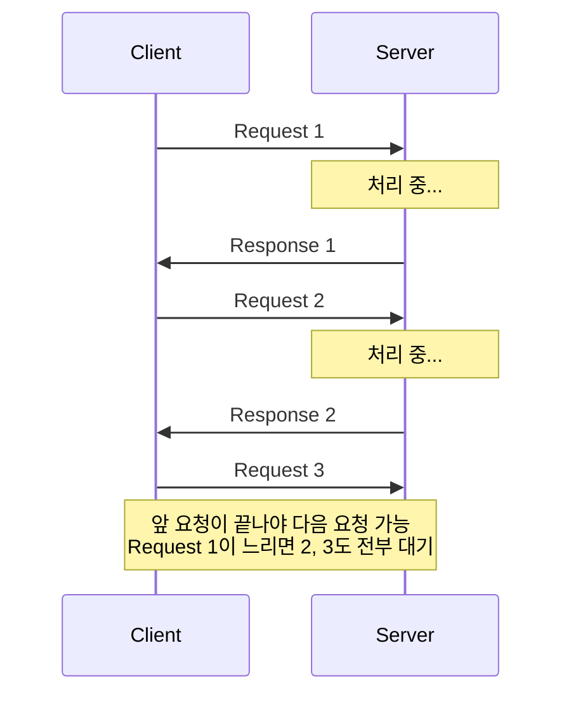
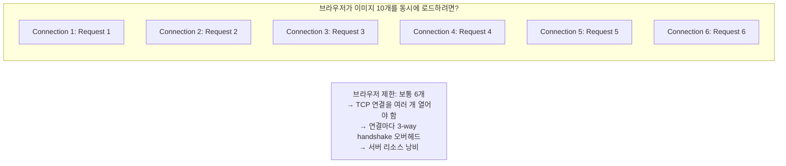
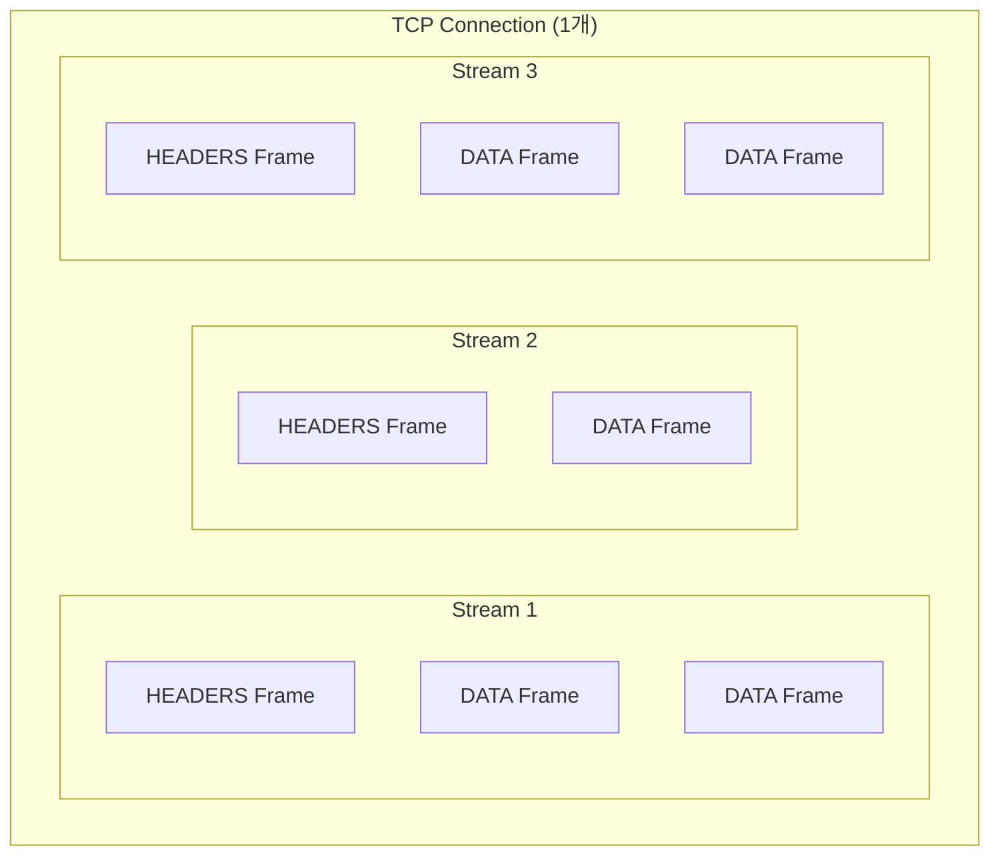
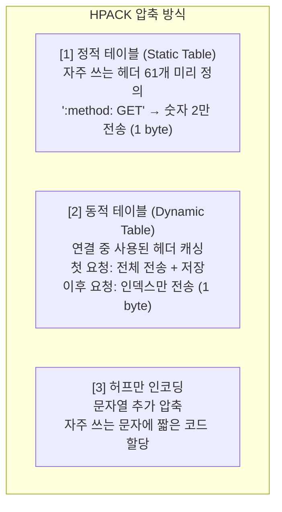
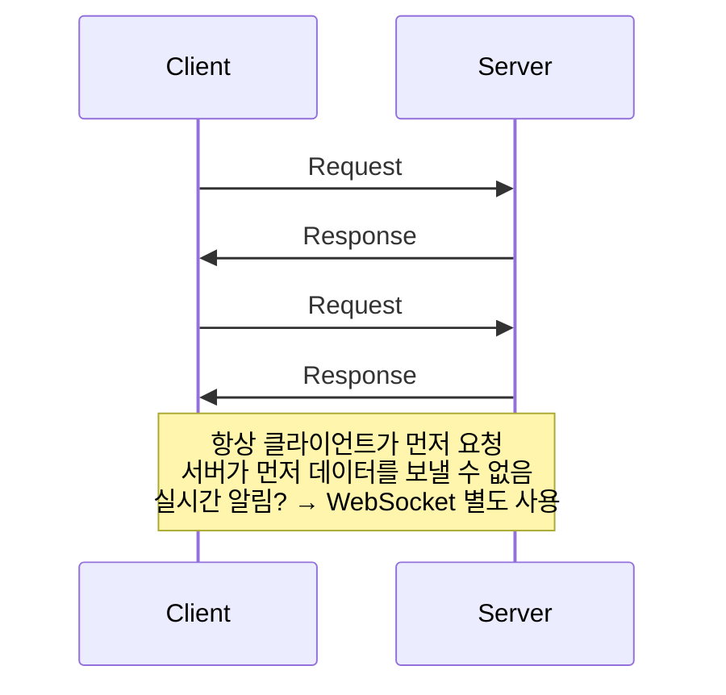
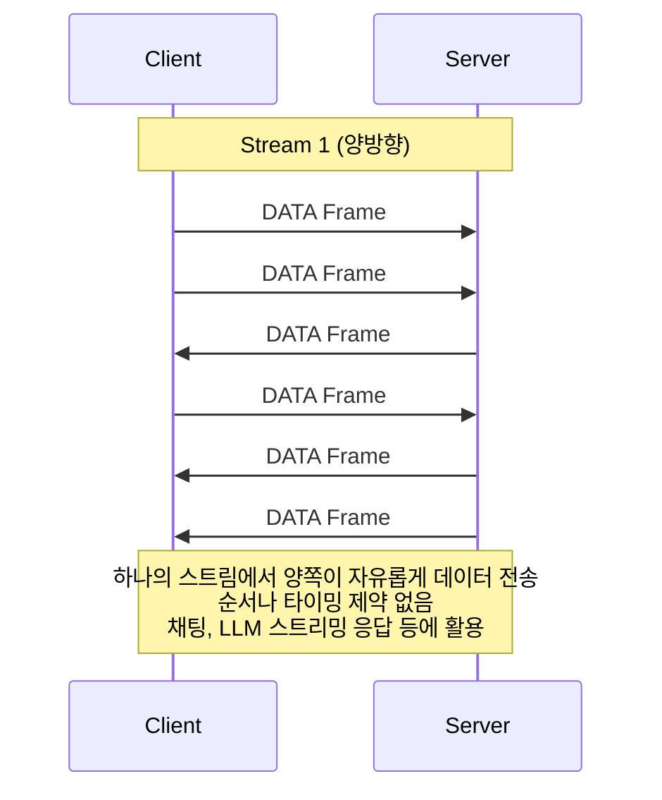
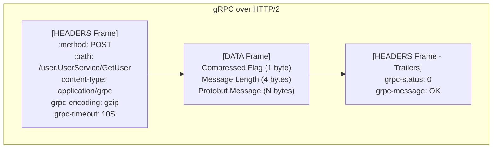
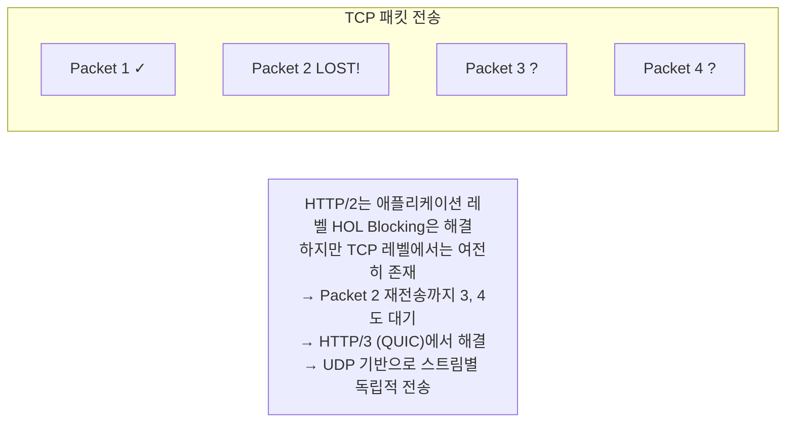

> **📚 gRPC 시리즈 - Part 1. 기반 기술**
>
> 1. [RPC(Remote Procedure Call) 개념](/posts/rpc-concept/)
> 2. [IDL과 직렬화/역직렬화](/posts/idl-serialization/)
> 3. [Protocol Buffers (Protobuf)](/posts/protobuf/)
> 4. HTTP/2 프로토콜 ← 현재 글

---

## 왜 HTTP/2를 알아야 하는가?

gRPC가 빠른 이유의 절반은 Protobuf, 나머지 절반은 **HTTP/2** 덕분이다.

- "gRPC가 왜 REST보다 빠르지?" → HTTP/2 때문
- "gRPC는 어떻게 양방향 스트리밍을 지원하지?" → HTTP/2 때문
- "왜 하나의 연결로 여러 요청을 동시에 처리하지?" → HTTP/2 때문

HTTP/2를 모르면 gRPC의 성능 이점을 이해할 수 없다.

---

## HTTP/1.1의 한계

### 문제 1: Head-of-Line Blocking

### 문제 2: 연결 오버헤드

### 문제 3: 헤더 중복 전송

| 요청 | 헤더 내용 | 크기 |
| --- | --- | --- |
| Request 1 | Host, User-Agent, Accept, Authorization, Cookie... | ~800 bytes |
| Request 2 | Host, User-Agent, Accept, Authorization, Cookie... (거의 동일) | ~800 bytes |
| Request 100 | ... | ~800 bytes |

→ 100번 요청하면 헤더만 50~80KB 낭비

---

## HTTP/2의 해결책

### 핵심 개념: 스트림과 프레임

**용어 정리:**
- **Connection**: 하나의 TCP 연결
- **Stream**: 요청-응답 쌍을 위한 논리적 채널
- **Frame**: 데이터 전송의 최소 단위

---

## 멀티플렉싱 (Multiplexing)

### HTTP/1.1 vs HTTP/2

```mermaid
gantt
    title HTTP/1.1 - 순차 처리 (여러 연결 필요)
    dateFormat X
    axisFormat %s

    section Conn 1
    Req 1 :0, 3
    Req 4 :3, 6

    section Conn 2
    Req 2 :0, 3
    Req 5 :3, 6

    section Conn 3
    Req 3 :0, 3
    Req 6 :3, 6
```

```mermaid
gantt
    title HTTP/2 - 멀티플렉싱 (단일 연결)
    dateFormat X
    axisFormat %s

    section Conn 1
    R1 :0, 1
    R2 :1, 2
    R3 :2, 3
    R1 :3, 4
    R2 :4, 5
    R4 :5, 6
```

### 멀티플렉싱의 장점

| 장점 | HTTP/1.1 | HTTP/2 |
| --- | --- | --- |
| **Head-of-Line Blocking** | Request 1이 느리면 2, 3 대기 | 각 스트림 독립적, 서로 블로킹 안 함 |
| **연결 수** | 동시 요청 100개 → 연결 6~100개 필요 | 동시 요청 100개 → 연결 1개로 충분 |

---

## 바이너리 프레이밍

### HTTP/1.1 (텍스트) vs HTTP/2 (바이너리)

| 특성 | HTTP/1.1 | HTTP/2 |
| --- | --- | --- |
| **형식** | 텍스트 기반 | 바이너리 기반 |
| **가독성** | 사람이 읽을 수 있음 | 사람이 읽을 수 없음 |
| **파싱** | 문자열 처리 필요 (느림) | 고정 크기 헤더로 빠른 파싱 |
| **구분자** | 줄바꿈(\r\n)으로 구분 | 프레임 타입으로 명확한 구분 |

### 프레임 타입

| 타입 | 설명 | 용도 |
| --- | --- | --- |
| **HEADERS** | 헤더 정보 | 요청/응답 시작 |
| **DATA** | 본문 데이터 | 실제 페이로드 전송 |
| **SETTINGS** | 연결 설정 | 초기 협상 |
| **PING** | 연결 상태 확인 | keepalive |
| **GOAWAY** | 연결 종료 알림 | graceful shutdown |
| **WINDOW_UPDATE** | 흐름 제어 | 백프레셔 |
| **RST_STREAM** | 스트림 취소 | 에러/취소 처리 |

---

## 헤더 압축 (HPACK)

### 압축 원리

### 압축 효과

| 요청 | HTTP/1.1 | HTTP/2 | 압축률 |
| --- | --- | --- | --- |
| 첫 번째 요청 | ~800 bytes | ~200 bytes | 75% 감소 |
| 두 번째 이후 요청 (동일 헤더) | ~800 bytes | ~20 bytes | 97% 감소! |

→ 반복 요청이 많을수록 효과 극대화
→ API 서버처럼 동일 헤더가 반복되는 경우 특히 유리

---

## 양방향 통신

### HTTP/1.1의 한계

### HTTP/2의 양방향 스트리밍

---

## gRPC가 HTTP/2를 활용하는 방식

### gRPC 요청의 실제 모습

### HTTP/2 기능별 gRPC 활용

| HTTP/2 기능 | gRPC 활용 |
| --- | --- |
| **멀티플렉싱** | 하나의 연결로 여러 RPC 동시 처리 |
| **바이너리 프레이밍** | Protobuf 메시지 효율적 전송 |
| **양방향 스트리밍** | Bidirectional Streaming RPC |
| **헤더 압축** | 메타데이터 오버헤드 감소 |
| **흐름 제어** | 백프레셔 처리 |

---

## 성능 비교

### HTTP/1.1 + JSON vs HTTP/2 + Protobuf (gRPC)

| 항목 | HTTP/1.1 + JSON | HTTP/2 + Protobuf |
| --- | --- | --- |
| **연결 수 (100 동시요청)** | 6~100개 | 1개 |
| **헤더 크기 (반복 요청)** | ~800 bytes | ~20 bytes |
| **페이로드 크기** | 100% (기준) | 30~50% |
| **지연시간 (내부 통신)** | ~10ms | ~2ms |
| **CPU 사용률 (파싱)** | 높음 | 낮음 |

### 실제 벤치마크 예시

| 항목 | REST (HTTP/1.1 + JSON) | gRPC (HTTP/2 + Protobuf) |
| --- | --- | --- |
| **처리량 (1KB 요청)** | ~15,000 req/sec | ~45,000 req/sec (3배) |
| **지연시간 (P99)** | ~25ms | ~5ms (80% 감소) |

---

## HTTP/2의 한계

### 브라우저 직접 호출 불가

**문제:**
- 브라우저 JavaScript에서 HTTP/2 프레임 직접 제어 불가
- gRPC 바이너리 프로토콜 처리 어려움
- Trailer 헤더 접근 제한

**해결책:**
- gRPC-Web이라는 변환 레이어 필요
- 또는 REST Gateway 패턴 사용

### TCP HOL Blocking

---

## 핵심 정리

### HTTP/1.1 vs HTTP/2

| 특성 | HTTP/1.1 | HTTP/2 |
| --- | --- | --- |
| **프로토콜** | 텍스트 | 바이너리 |
| **멀티플렉싱** | ❌ | ✅ |
| **헤더 압축** | ❌ | ✅ (HPACK) |
| **양방향 스트리밍** | ❌ | ✅ |
| **연결 재사용** | Keep-Alive | 단일 연결, 다중 스트림 |

### gRPC가 빠른 이유

gRPC = Protobuf (작은 페이로드) + HTTP/2 (효율적 전송)

| 요인 | 설명 |
| --- | --- |
| **페이로드 크기 감소** | Protobuf |
| **헤더 크기 감소** | HPACK |
| **연결 재사용** | 멀티플렉싱 |
| **빠른 파싱** | 바이너리 |

→ 종합적으로 REST 대비 2~10배 성능 향상

---

## 다른 RPC 구현체들

| 구현체 | 만든 곳 | 기반 기술 |
| --- | --- | --- |
| **gRPC** | Google | HTTP/2 + Protobuf |
| **Thrift** | Facebook | 자체 프로토콜 + Thrift IDL |
| **Dubbo** | Alibaba | 다양한 프로토콜 지원 |
| **SOAP** | W3C | HTTP/1.1 + XML |
