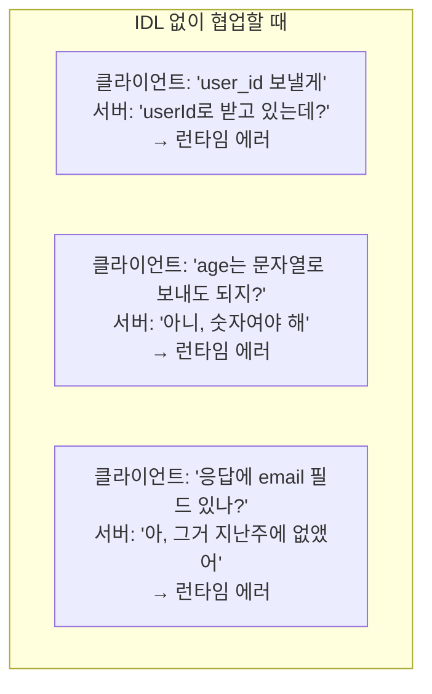
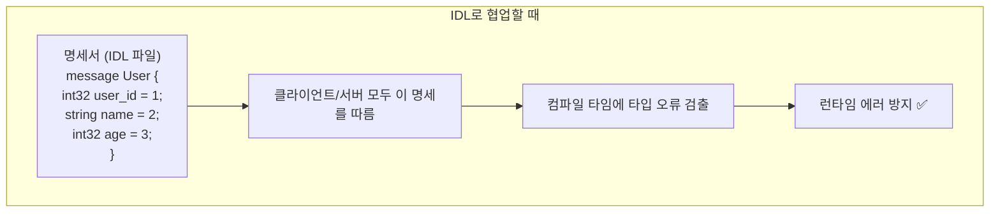
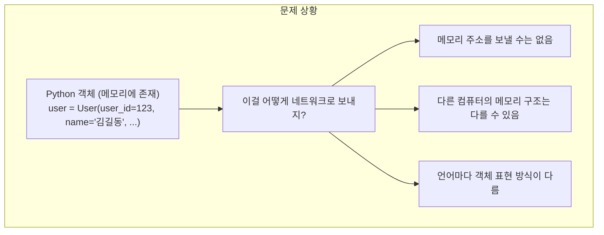
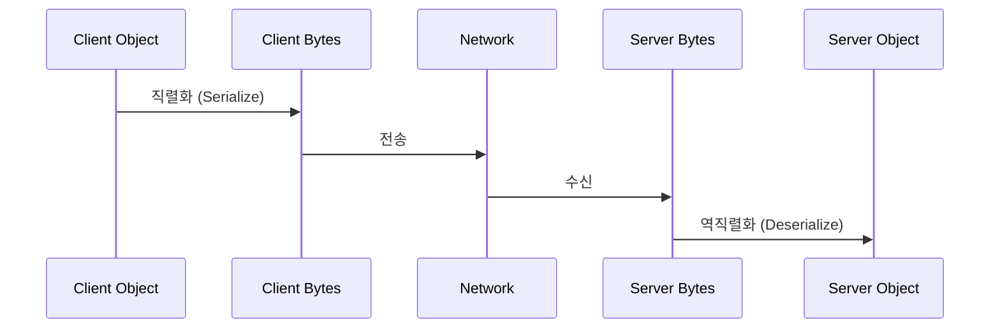
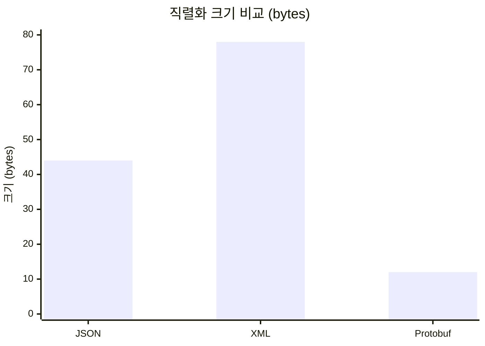
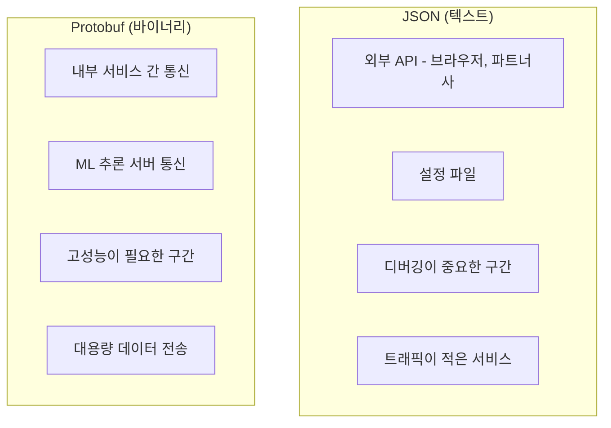

> **📚 gRPC 시리즈 - Part 1. 기반 기술**
>
> 1. [RPC(Remote Procedure Call) 개념](/posts/rpc-concept/)
> 2. IDL과 직렬화/역직렬화 ← 현재 글
> 3. [Protocol Buffers (Protobuf)](/posts/protobuf/)
> 4. [HTTP/2 프로토콜](/posts/http2/)

---

## 왜 이걸 알아야 하는가?

RPC에서 클라이언트와 서버가 통신하려면 두 가지가 필요하다:

1. **"무슨 함수가 있고, 어떤 데이터를 주고받을지"** → IDL
2. **"데이터를 어떻게 네트워크로 보낼지"** → 직렬화

이 두 개념을 모르면:

- "왜 .proto 파일을 작성해야 하지?"
- "JSON이랑 뭐가 다르지?"
- "왜 gRPC가 빠르다는 거지?"

이런 질문에 답할 수 없다.

---

## IDL (Interface Definition Language)

### 한 줄 정의

IDL은 **서비스의 계약(Contract)을 정의하는 언어**이다.

클라이언트와 서버가 "어떤 형태로 통신할지" 미리 약속하는 명세서다.

---

### IDL 없이 개발하면 생기는 일



### IDL이 있으면



---

### IDL의 역할

| 역할 | 설명 |
| --- | --- |
| **데이터 구조 정의** | User, Order, Product 같은 메시지 형태 |
| **서비스 인터페이스 정의** | GetUser, CreateOrder 같은 함수 시그니처 |
| **코드 자동 생성의 기반** | 여러 언어로 클라이언트/서버 코드 생성 |
| **문서화** | IDL 자체가 API 명세서 역할 |

---

### IDL의 장점

| 장점 | 설명 |
| --- | --- |
| **언어 중립적** | 한 번 정의하면 Python, Go, Java 등 여러 언어로 코드 생성 |
| **명확한 계약** | 클라이언트/서버 간 약속이 코드로 존재 |
| **타입 안전성** | 컴파일 타임에 타입 오류 검출 |
| **버전 관리** | 스키마 변경 이력 추적 가능 (Git으로 관리) |
| **코드 자동 생성** | Stub/Skeleton 코드를 직접 작성할 필요 없음 |

---

### 다양한 IDL들

| IDL | 사용처 | 특징 |
| --- | --- | --- |
| **Protocol Buffers** (.proto) | gRPC | 바이너리 직렬화, 작고 빠름 |
| **Thrift IDL** (.thrift) | Apache Thrift | Facebook 개발, 다양한 언어 지원 |
| **Avro** (.avsc) | Kafka, Hadoop | JSON 기반 스키마, 스키마 진화에 강점 |
| **OpenAPI** (.yaml/.json) | REST API | REST API 문서화 표준 (Swagger) |
| **GraphQL Schema** (.graphql) | GraphQL | 쿼리 언어와 스키마 통합 |

---

### gRPC의 IDL: Protocol Buffers 맛보기

```protobuf
// user.proto

syntax = "proto3";

// 데이터 구조 정의
message User {
    int32 user_id = 1;
    string name = 2;
    string email = 3;
}

message GetUserRequest {
    int32 user_id = 1;
}

// 서비스 인터페이스 정의
service UserService {
    rpc GetUser(GetUserRequest) returns (User);
}
```

이 파일 하나로:

- 클라이언트 Stub 코드 생성
- 서버 Skeleton 코드 생성
- 데이터 직렬화/역직렬화 코드 생성

**→ 다음 문서에서 Protobuf를 상세히 다룬다**

---

## 직렬화와 역직렬화

### 한 줄 정의

```
직렬화 (Serialization)   : 메모리의 객체 → 저장/전송 가능한 형태
역직렬화 (Deserialization): 저장/전송된 데이터 → 메모리의 객체
```

---

### 왜 필요한가?



---

### 직렬화/역직렬화 흐름



---

### Python 예시

```python
# 직렬화 예시 (객체 → 바이트)
import json

user = {
    "user_id": 123,
    "name": "김길동",
    "email": "kim@example.com"
}

# 직렬화: dict → JSON 문자열 → 바이트
serialized = json.dumps(user).encode('utf-8')
print(f"크기: {len(serialized)} bytes")
# 크기: 74 bytes

# 역직렬화 예시 (바이트 → 객체)
received_bytes = serialized  # 네트워크로 받았다고 가정

# 역직렬화: 바이트 → JSON 문자열 → dict
deserialized = json.loads(received_bytes.decode('utf-8'))
print(deserialized)
# {'user_id': 123, 'name': '김길동', 'email': 'kim@example.com'}
```

---

## 직렬화 포맷: 텍스트 vs 바이너리

### 텍스트 기반 포맷

```json
{
    "user_id": 123,
    "name": "김길동",
    "email": "kim@example.com",
    "is_active": true
}
```

```xml
<user>
    <user_id>123</user_id>
    <name>김길동</name>
    <email>kim@example.com</email>
    <is_active>true</is_active>
</user>
```

### 바이너리 포맷

```
Protocol Buffers (같은 데이터)

08 7B 12 09 EA B9 80 EC 83 81 EC 9A B1 1A 13 6B
69 6D 40 65 78 61 6D 70 6C 65 2E 63 6F 6D 20 01

→ 사람이 읽을 수 없음
→ 하지만 훨씬 작음!
```

---

### 포맷별 비교

| 포맷 | 타입 | 크기 | 파싱 속도 | 가독성 | 주 사용처 |
| --- | --- | --- | --- | --- | --- |
| **JSON** | 텍스트 | 중간 | 중간 | 높음 | REST API, 설정 파일 |
| **XML** | 텍스트 | 큼 | 느림 | 중간 | 레거시, SOAP |
| **Protobuf** | 바이너리 | 작음 | 빠름 | 없음 | gRPC, 내부 통신 |
| **MessagePack** | 바이너리 | 작음 | 빠름 | 없음 | 캐시, 로그 |

---

### 같은 데이터, 크기 비교



- JSON: 44 bytes
- XML: 78 bytes
- Protobuf: 12 bytes (JSON 대비 약 73% 감소)

---

## 왜 바이너리 직렬화가 빠른가?

### JSON의 문제점

| 문제 | 설명 |
| --- | --- |
| **필드명 매번 전송** | "user_id"가 8 bytes, 100만 건이면 8MB가 필드명 |
| **숫자도 문자열로 표현** | 123은 실제로 "123" (3 bytes), 바이너리면 1~2 bytes |
| **파싱 시 문자열 처리** | "123" 읽고 → 숫자로 변환 → CPU 오버헤드 |

### Protobuf의 효율성

| 장점 | 설명 |
| --- | --- |
| **필드명 대신 번호 전송** | "user_id" (8 bytes) → 1 (1 byte) |
| **숫자는 바이너리 그대로** | 123은 0x7B (1 byte) |
| **파싱 시 바로 읽기** | 문자열 변환 불필요, CPU 효율적 |

---

## 실제 성능 차이

### 마이크로서비스 환경 시뮬레이션

| 항목 | JSON (500 bytes/요청) | Protobuf (150 bytes/요청) |
| --- | --- | --- |
| **일일 전송량** | 약 50 GB | 약 15 GB (70% 감소) |
| **직렬화 시간** | 건당 ~10 μs | 건당 ~1 μs (90% 감소) |
| **역직렬화 시간** | 건당 ~15 μs | 건당 ~1 μs (93% 감소) |

**연간 절감 효과:**
- 네트워크 비용: 수천만 원 절감
- 서버 CPU: 20~30% 여유 확보

---

## 언제 무엇을 쓸 것인가?

### 판단 기준



---

## 핵심 정리

### IDL

- 서비스 계약을 코드로 정의
- 클라이언트/서버 간 약속
- 코드 자동 생성의 기반
- gRPC는 Protocol Buffers (.proto)를 IDL로 사용

### 직렬화/역직렬화

- 객체 ↔ 바이트 변환
- 네트워크 전송을 위해 필수
- 텍스트(JSON): 가독성 ↑, 성능 ↓
- 바이너리(Protobuf): 가독성 ↓, 성능 ↑

### 선택 기준

| 상황 | 포맷 |
| --- | --- |
| 외부 API, 협업 필요 | JSON |
| 내부 통신, 성능 중요 | Protobuf |
