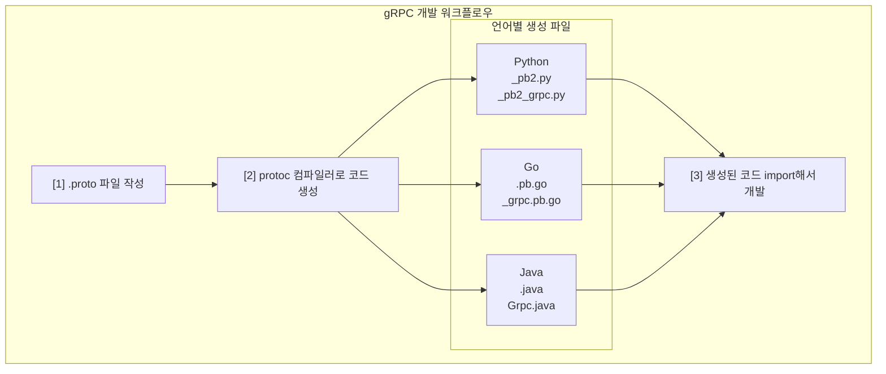
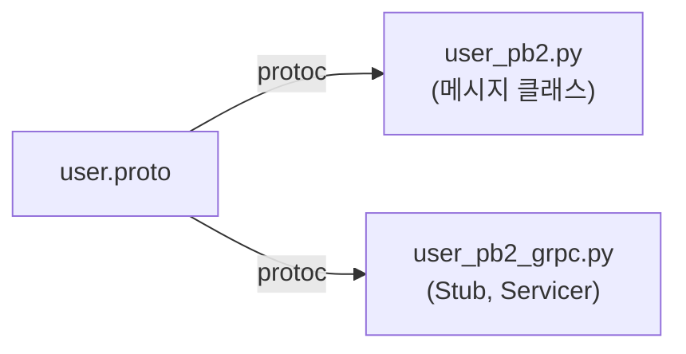
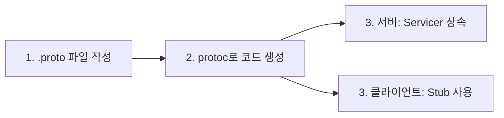

> **📚 gRPC 시리즈 - Part 2. gRPC 핵심 개념**
>
> 1. .proto 파일과 코드 생성 ← 현재 글
> 2. [4가지 통신 패턴](/posts/grpc-patterns/)
> 3. [Channel, Metadata, Error Handling](/posts/grpc-advanced/)
> 4. [gRPC vs REST 비교](/posts/grpc-vs-rest/)

---

## 왜 이걸 알아야 하는가?

gRPC 개발의 시작점은 **.proto 파일 작성**이다.

- 서비스 정의 → .proto 파일
- 데이터 구조 정의 → .proto 파일
- 클라이언트/서버 코드 → .proto에서 자동 생성

.proto 파일 없이는 gRPC 개발을 시작할 수 없다.

---

## 전체 흐름



---

## .proto 파일 작성

### 실전 예시: 유저 서비스

```protobuf
// protos/user/v1/user.proto

syntax = "proto3";

package user.v1;

// 언어별 옵션
option go_package = "github.com/myproject/gen/user/v1";
option java_package = "com.myproject.user.v1";
option java_multiple_files = true;

// 메시지 정의
message User {
    int64 id = 1;
    string name = 2;
    string email = 3;
    UserStatus status = 4;
    repeated string roles = 5;
}

enum UserStatus {
    USER_STATUS_UNSPECIFIED = 0;
    USER_STATUS_ACTIVE = 1;
    USER_STATUS_INACTIVE = 2;
}

// 요청/응답 메시지
message GetUserRequest {
    int64 id = 1;
}

message GetUserResponse {
    User user = 1;
}

message ListUsersRequest {
    int32 page_size = 1;
    string page_token = 2;
}

message ListUsersResponse {
    repeated User users = 1;
    string next_page_token = 2;
}

message CreateUserRequest {
    string name = 1;
    string email = 2;
}

message CreateUserResponse {
    User user = 1;
}

// 서비스 정의
service UserService {
    // 단일 유저 조회
    rpc GetUser(GetUserRequest) returns (GetUserResponse);

    // 유저 목록 조회
    rpc ListUsers(ListUsersRequest) returns (ListUsersResponse);

    // 유저 생성
    rpc CreateUser(CreateUserRequest) returns (CreateUserResponse);
}
```

---

## 프로젝트 구조

### 권장 디렉토리 구조

```
my-grpc-project/
│
├── protos/                          # .proto 파일들
│   └── user/
│       └── v1/
│           └── user.proto
│
├── generated/                       # 생성된 코드 (Git에 포함 or 제외)
│   └── user/
│       └── v1/
│           ├── user_pb2.py          # 메시지 클래스
│           └── user_pb2_grpc.py     # 서비스 Stub/Servicer
│
├── server/                          # 서버 구현
│   └── main.py
│
├── client/                          # 클라이언트 구현
│   └── main.py
│
├── scripts/
│   └── generate.sh                  # 코드 생성 스크립트
│
└── requirements.txt
```

### 버전 관리 (v1, v2)

```
protos/
├── user/
│   ├── v1/                  # 현재 버전
│   │   └── user.proto
│   └── v2/                  # 새 버전 (하위 호환성 깨질 때)
│       └── user.proto
│
└── order/
    └── v1/
        └── order.proto
```

---

## 코드 생성

### 1. 패키지 설치

```bash
pip install grpcio grpcio-tools
```

### 2. 코드 생성 명령어

```bash
# 기본 형태
python -m grpc_tools.protoc \
    -I./protos \                          # proto 파일 검색 경로
    --python_out=./generated \            # 메시지 코드 출력 경로
    --grpc_python_out=./generated \       # gRPC 코드 출력 경로
    ./protos/user/v1/user.proto           # 대상 proto 파일
```

### 3. 생성 스크립트 (권장)

```bash
#!/bin/bash
# scripts/generate.sh

PROTO_DIR="./protos"
OUT_DIR="./generated"

# 출력 디렉토리 생성
mkdir -p $OUT_DIR

# 모든 .proto 파일 찾아서 컴파일
find $PROTO_DIR -name "*.proto" | while read proto; do
    echo "Generating: $proto"
    python -m grpc_tools.protoc \
        -I$PROTO_DIR \
        --python_out=$OUT_DIR \
        --grpc_python_out=$OUT_DIR \
        $proto
done

echo "Done!"
```

```bash
# 실행
chmod +x scripts/generate.sh
./scripts/generate.sh
```

---

## 생성된 코드 분석

### 생성되는 파일



| 파일 | 내용 |
| --- | --- |
| `user_pb2.py` | User, GetUserRequest, GetUserResponse 등 메시지 클래스 |
| `user_pb2_grpc.py` | UserServiceStub (클라이언트), UserServiceServicer (서버) |

### user_pb2.py (메시지)

```python
# generated/user/v1/user_pb2.py (자동 생성됨)

# 이런 식으로 생성됨 (실제 코드는 더 복잡)

class User:
    id: int
    name: str
    email: str
    status: UserStatus
    roles: List[str]

class GetUserRequest:
    id: int

class GetUserResponse:
    user: User

# ... 등등
```

### user_pb2_grpc.py (서비스)

```python
# generated/user/v1/user_pb2_grpc.py (자동 생성됨)

class UserServiceStub:
    """클라이언트가 사용"""

    def __init__(self, channel):
        self.GetUser = channel.unary_unary(...)
        self.ListUsers = channel.unary_unary(...)
        self.CreateUser = channel.unary_unary(...)

class UserServiceServicer:
    """서버가 상속받아 구현"""

    def GetUser(self, request, context):
        raise NotImplementedError()

    def ListUsers(self, request, context):
        raise NotImplementedError()

    def CreateUser(self, request, context):
        raise NotImplementedError()

def add_UserServiceServicer_to_server(servicer, server):
    """서버에 서비스 등록"""
    ...
```

---

## 서버 구현

### 기본 구조

```python
# server/main.py

from concurrent import futures
import grpc

# 생성된 코드 import
from generated.user.v1 import user_pb2
from generated.user.v1 import user_pb2_grpc

# 서비스 구현 (Servicer 상속)
class UserServiceServicer(user_pb2_grpc.UserServiceServicer):

    def __init__(self):
        # 임시 저장소 (실제로는 DB)
        self.users = {}
        self.next_id = 1

    def GetUser(self, request, context):
        """단일 유저 조회"""
        user_id = request.id

        if user_id not in self.users:
            context.set_code(grpc.StatusCode.NOT_FOUND)
            context.set_details(f"User {user_id} not found")
            return user_pb2.GetUserResponse()

        return user_pb2.GetUserResponse(user=self.users[user_id])

    def ListUsers(self, request, context):
        """유저 목록 조회"""
        users = list(self.users.values())
        return user_pb2.ListUsersResponse(users=users)

    def CreateUser(self, request, context):
        """유저 생성"""
        user = user_pb2.User(
            id=self.next_id,
            name=request.name,
            email=request.email,
            status=user_pb2.USER_STATUS_ACTIVE
        )

        self.users[self.next_id] = user
        self.next_id += 1

        return user_pb2.CreateUserResponse(user=user)

# 서버 실행
def serve():
    # 스레드 풀 생성 (동시 요청 처리)
    server = grpc.server(futures.ThreadPoolExecutor(max_workers=10))

    # 서비스 등록
    user_pb2_grpc.add_UserServiceServicer_to_server(
        UserServiceServicer(),
        server
    )

    # 포트 바인딩
    server.add_insecure_port('[::]:50051')

    print("Server started on port 50051")
    server.start()
    server.wait_for_termination()

if __name__ == '__main__':
    serve()
```

---

## 클라이언트 구현

### 기본 구조

```python
# client/main.py

import grpc

from generated.user.v1 import user_pb2
from generated.user.v1 import user_pb2_grpc

def main():
    # 채널 생성 (서버 연결)
    channel = grpc.insecure_channel('localhost:50051')

    # Stub 생성 (클라이언트 프록시)
    stub = user_pb2_grpc.UserServiceStub(channel)

    # RPC 호출 - 마치 로컬 함수처럼!

    # 유저 생성
    create_response = stub.CreateUser(
        user_pb2.CreateUserRequest(
            name="홍길동",
            email="hong@example.com"
        )
    )
    print(f"Created: {create_response.user}")

    # 유저 조회
    get_response = stub.GetUser(
        user_pb2.GetUserRequest(id=create_response.user.id)
    )
    print(f"Got: {get_response.user}")

    # 유저 목록
    list_response = stub.ListUsers(user_pb2.ListUsersRequest())
    print(f"Total users: {len(list_response.users)}")

    # 채널 종료
    channel.close()

if __name__ == '__main__':
    main()
```

---

## 실행 결과

```bash
# 터미널 1: 서버 실행
$ python server/main.py
Server started on port 50051

# 터미널 2: 클라이언트 실행
$ python client/main.py
Created: id: 1
name: "홍길동"
email: "hong@example.com"
status: USER_STATUS_ACTIVE

Got: id: 1
name: "홍길동"
email: "hong@example.com"
status: USER_STATUS_ACTIVE

Total users: 1
```

---

## Import 문제 해결

### 문제: 생성된 코드 import 에러

```python
# 이렇게 하면 에러 날 수 있음
from generated.user.v1 import user_pb2  # ModuleNotFoundError!
```

### 해결 1: `__init__.py` 추가

```
generated/
├── __init__.py          # 빈 파일
└── user/
    ├── __init__.py      # 빈 파일
    └── v1/
        ├── __init__.py  # 빈 파일
        ├── user_pb2.py
        └── user_pb2_grpc.py
```

### 해결 2: sys.path 추가

```python
import sys
sys.path.insert(0, './generated')

from user.v1 import user_pb2
```

### 해결 3: PYTHONPATH 설정

```bash
export PYTHONPATH="${PYTHONPATH}:./generated"
python client/main.py
```

---

## proto 파일 import

### 다른 proto 파일 참조

```protobuf
// protos/common/v1/pagination.proto

syntax = "proto3";

package common.v1;

message PaginationRequest {
    int32 page_size = 1;
    string page_token = 2;
}

message PaginationResponse {
    string next_page_token = 1;
    int32 total_count = 2;
}
```

```protobuf
// protos/user/v1/user.proto

syntax = "proto3";

package user.v1;

import "common/v1/pagination.proto";  // 다른 proto import

message ListUsersRequest {
    common.v1.PaginationRequest pagination = 1;  // 패키지명.메시지명
}

message ListUsersResponse {
    repeated User users = 1;
    common.v1.PaginationResponse pagination = 2;
}
```

### 코드 생성 시 경로 주의

```bash
# -I 옵션에 import 경로 포함
python -m grpc_tools.protoc \
    -I./protos \                    # protos 기준으로 import 해석
    --python_out=./generated \
    --grpc_python_out=./generated \
    ./protos/user/v1/user.proto \
    ./protos/common/v1/pagination.proto
```

---

## Google Well-Known Types

### 자주 쓰는 기본 제공 타입

```protobuf
syntax = "proto3";

import "google/protobuf/timestamp.proto";
import "google/protobuf/duration.proto";
import "google/protobuf/empty.proto";
import "google/protobuf/wrappers.proto";

message User {
    int64 id = 1;
    string name = 2;

    google.protobuf.Timestamp created_at = 3;     // 시간
    google.protobuf.Duration session_ttl = 4;     // 기간
    google.protobuf.Int32Value age = 5;           // nullable int
    google.protobuf.StringValue nickname = 6;     // nullable string
}

service UserService {
    rpc DeleteUser(DeleteUserRequest) returns (google.protobuf.Empty);
}
```

### 주요 타입

| 타입 | 용도 |
| --- | --- |
| `Timestamp` | 시간 (초 + 나노초) |
| `Duration` | 기간 |
| `Empty` | 빈 메시지 (응답 없을 때) |
| `StringValue` | nullable string |
| `Int32Value` | nullable int32 |
| `BoolValue` | nullable bool |
| `Struct` | 동적 JSON 같은 구조 |

---

## 핵심 정리

### 개발 흐름



### 생성되는 코드

| 파일 | 내용 | 용도 |
| --- | --- | --- |
| `*_pb2.py` | 메시지 클래스 | 데이터 구조 |
| `*_pb2_grpc.py` | Stub, Servicer | 클라이언트/서버 코드 |

### 핵심 포인트

- **.proto 파일 = 단일 진실 공급원** (Single Source of Truth)
- 코드는 항상 자동 생성 (직접 수정 금지)
- proto 변경 → 재생성 → 서버/클라이언트 모두 업데이트
