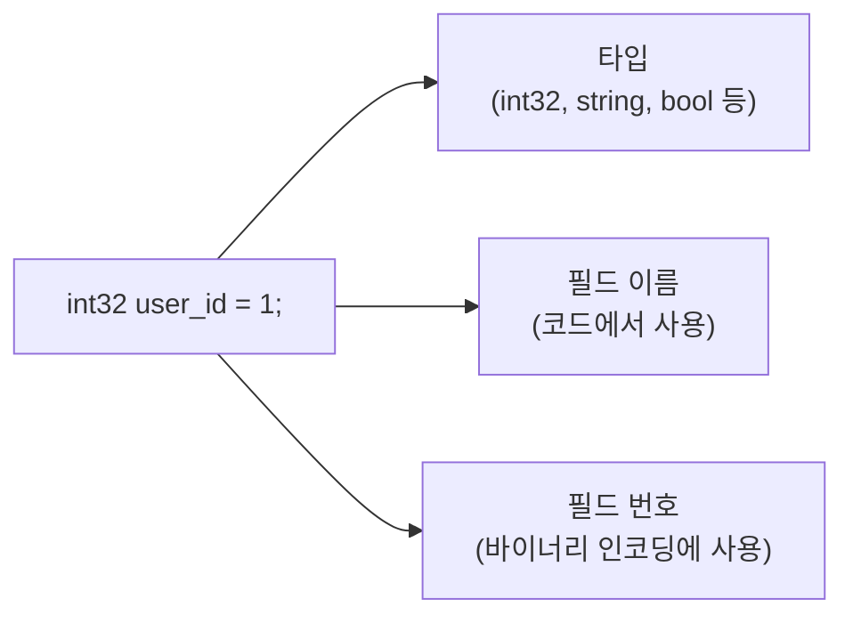
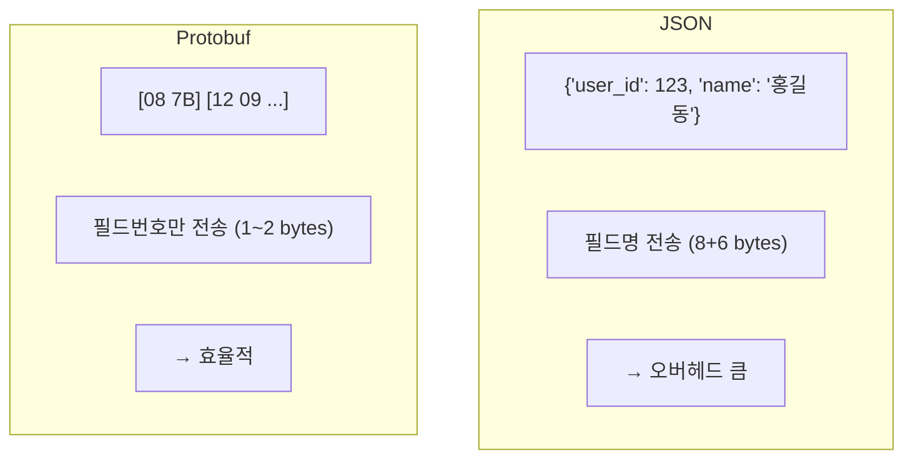
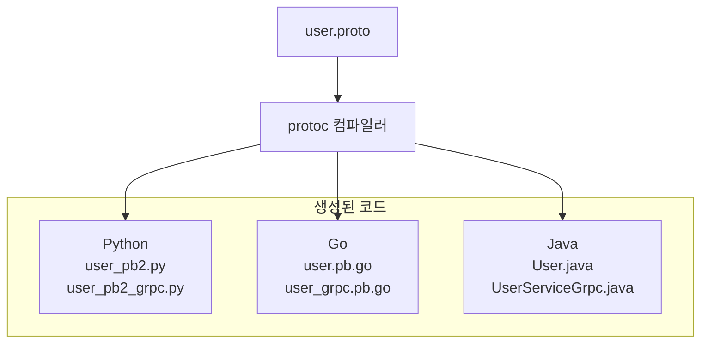
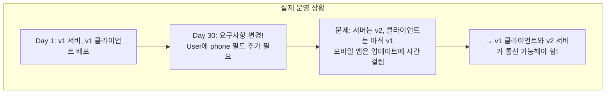

> **📚 gRPC 시리즈 - Part 1. 기반 기술**
>
> 1. [RPC(Remote Procedure Call) 개념](/posts/rpc-concept/)
> 2. [IDL과 직렬화/역직렬화](/posts/idl-serialization/)
> 3. Protocol Buffers (Protobuf) ← 현재 글
> 4. [HTTP/2 프로토콜](/posts/http2/)

---

## 왜 Protobuf를 알아야 하는가?

Protobuf는 gRPC의 **기본 언어**이다.

- gRPC 서비스를 정의하려면 → .proto 파일 작성
- 데이터를 주고받으려면 → Protobuf 메시지 정의
- 클라이언트/서버 코드 생성하려면 → protoc 컴파일러 사용

Protobuf를 모르면 gRPC를 쓸 수 없다.

---

## Protobuf란?

### 한 줄 정의

Protocol Buffers는 Google이 개발한 **언어 중립적, 플랫폼 중립적인 직렬화 포맷**이다.

### 핵심 특징

| 특징 | 설명 |
| --- | --- |
| **바이너리 포맷** | JSON보다 작고 빠름 |
| **스키마 기반** | .proto 파일로 구조 정의 |
| **코드 자동 생성** | Python, Go, Java 등 여러 언어 지원 |
| **하위 호환성** | 필드 추가/삭제에 유연함 |
| **타입 안전** | 컴파일 타임에 타입 체크 |

---

## .proto 파일 기본 구조

### 전체 구조

```protobuf
// user.proto

// 1. 문법 버전 선언 (필수)
syntax = "proto3";

// 2. 패키지 선언 (네임스페이스)
package user.v1;

// 3. 옵션 설정
option go_package = "github.com/myproject/user/v1";
option java_package = "com.myproject.user.v1";

// 4. import (다른 .proto 파일 참조)
import "google/protobuf/timestamp.proto";

// 5. 메시지 정의 (데이터 구조)
message User {
    int32 user_id = 1;
    string name = 2;
    string email = 3;
}

// 6. 서비스 정의 (gRPC용)
service UserService {
    rpc GetUser(GetUserRequest) returns (User);
    rpc CreateUser(CreateUserRequest) returns (User);
}
```

---

## 메시지 정의

### 기본 문법

```protobuf
message User {
    int32 user_id = 1;      // 타입 필드명 = 필드번호;
    string name = 2;
    string email = 3;
    bool is_active = 4;
}
```

### 메시지 구성 요소



---

## 스칼라 타입

### 타입 목록

| .proto 타입 | Python | Go | Java | 설명 |
| --- | --- | --- | --- | --- |
| `double` | float | float64 | double | 64비트 부동소수점 |
| `float` | float | float32 | float | 32비트 부동소수점 |
| `int32` | int | int32 | int | 32비트 정수 (음수 비효율) |
| `int64` | int | int64 | long | 64비트 정수 |
| `uint32` | int | uint32 | int | 부호 없는 32비트 |
| `uint64` | int | uint64 | long | 부호 없는 64비트 |
| `sint32` | int | int32 | int | 음수에 효율적인 32비트 |
| `sint64` | int | int64 | long | 음수에 효율적인 64비트 |
| `bool` | bool | bool | boolean | 불리언 |
| `string` | str | string | String | UTF-8 문자열 |
| `bytes` | bytes | []byte | ByteString | 바이트 배열 |

### 정수 타입 선택 가이드

| 상황 | 권장 타입 |
| --- | --- |
| 양수만 사용 (ID, 카운트 등) | uint32, uint64 |
| 양수가 대부분, 음수 거의 없음 | int32, int64 |
| 음수가 자주 사용됨 (온도, 좌표 등) | sint32, sint64 |
| 고정 크기가 필요함 (해시 등) | fixed32, fixed64 |

---

## 필드 번호의 중요성

### 필드 번호란?

```protobuf
message User {
    int32 user_id = 1;   // ← 1, 2, 3이 필드 번호
    string name = 2;
    string email = 3;
}
```

### 왜 필드 번호를 쓰는가?



### 필드 번호 규칙

| 범위 | 인코딩 크기 | 권장 용도 |
| --- | --- | --- |
| **1 ~ 15** | 1 byte | 자주 사용하는 필드에 할당 |
| **16 ~ 2047** | 2 bytes | 일반 필드 |
| **2048 ~ 524287** | 3 bytes | 거의 사용 안 함 |
| **19000 ~ 19999** | - | 예약됨, 사용 금지 |

### 절대 하면 안 되는 것

**[1] 필드 번호 변경 금지**

```protobuf
// v1
message User {
    int32 user_id = 1;
    string name = 2;
}

// v2 - 잘못된 변경!
message User {
    int32 user_id = 2;  // ❌ 1에서 2로 변경
    string name = 1;    // ❌ 2에서 1로 변경
}
// → 기존 데이터 읽기 불가!
```

**[2] 삭제된 필드 번호 재사용 금지**

```protobuf
// v2 - 잘못된 방법
message User {
    int32 user_id = 1;
    string name = 2;
    string email = 3;     // ❌ 삭제된 3번 재사용
}

// v2 - 올바른 방법
message User {
    int32 user_id = 1;
    string name = 2;
    reserved 3;           // ✅ 3번은 예약
    string email = 4;     // ✅ 새 번호 사용
}
```

---

## 복합 타입

### 중첩 메시지 (Nested Message)

```protobuf
message User {
    int32 user_id = 1;
    string name = 2;

    // 중첩 메시지 정의
    message Address {
        string city = 1;
        string street = 2;
        string zip_code = 3;
    }

    Address address = 3;  // 중첩 메시지 사용
}
```

### 별도 메시지로 분리

```protobuf
message Address {
    string city = 1;
    string street = 2;
    string zip_code = 3;
}

message User {
    int32 user_id = 1;
    string name = 2;
    Address address = 3;  // 다른 메시지 참조
}
```

### 배열/리스트 (repeated)

```protobuf
message User {
    int32 user_id = 1;
    string name = 2;

    repeated string tags = 3;           // 문자열 배열
    repeated Address addresses = 4;     // 메시지 배열
}
```

```python
# Python에서 사용
user = User()
user.user_id = 1
user.name = "홍길동"
user.tags.append("developer")
user.tags.append("python")
user.tags.extend(["grpc", "mlops"])

print(user.tags)  # ['developer', 'python', 'grpc', 'mlops']
```

### Map 타입

```protobuf
message User {
    int32 user_id = 1;
    string name = 2;

    map<string, string> metadata = 3;   // key-value 맵
    map<string, int32> scores = 4;      // 점수 맵
}
```

```python
# Python에서 사용
user = User()
user.metadata["department"] = "AI팀"
user.metadata["level"] = "senior"

user.scores["math"] = 95
user.scores["english"] = 88
```

---

## Enum (열거형)

```protobuf
// 상태 정의
enum UserStatus {
    USER_STATUS_UNSPECIFIED = 0;  // 기본값 (proto3 필수)
    USER_STATUS_ACTIVE = 1;
    USER_STATUS_INACTIVE = 2;
    USER_STATUS_SUSPENDED = 3;
}

message User {
    int32 user_id = 1;
    string name = 2;
    UserStatus status = 3;
}
```

### Enum 규칙

| 규칙 | 설명 |
| --- | --- |
| **첫 번째 값은 0** | proto3에서 기본값으로 사용됨 |
| **접두사 권장** | USER_STATUS_ACTIVE (O), ACTIVE (X) - 다른 enum과 충돌 가능 |
| **UNSPECIFIED 포함** | 값이 설정되지 않은 상태를 명시적으로 표현 |

---

## 서비스 정의 (gRPC용)

### 기본 서비스 정의

```protobuf
service UserService {
    // Unary RPC (단일 요청 - 단일 응답)
    rpc GetUser(GetUserRequest) returns (GetUserResponse);

    // Server Streaming (단일 요청 - 스트림 응답)
    rpc ListUsers(ListUsersRequest) returns (stream User);

    // Client Streaming (스트림 요청 - 단일 응답)
    rpc UploadUsers(stream User) returns (UploadUsersResponse);

    // Bidirectional Streaming (양방향 스트림)
    rpc Chat(stream ChatMessage) returns (stream ChatMessage);
}
```

### 요청/응답 메시지 패턴

```protobuf
// 요청 메시지 - 접미사 Request
message GetUserRequest {
    int32 user_id = 1;
}

message ListUsersRequest {
    int32 page_size = 1;
    string page_token = 2;
}

message CreateUserRequest {
    string name = 1;
    string email = 2;
}

// 응답 메시지 - 접미사 Response
message GetUserResponse {
    User user = 1;
}

message ListUsersResponse {
    repeated User users = 1;
    string next_page_token = 2;
}

message CreateUserResponse {
    User user = 1;
}
```

---

## 코드 생성

### 흐름



### Python 코드 생성

```bash
# 1. 패키지 설치
pip install grpcio grpcio-tools

# 2. 코드 생성 명령
python -m grpc_tools.protoc \
    -I./protos \
    --python_out=./generated \
    --grpc_python_out=./generated \
    ./protos/user.proto
```

### 생성된 코드 사용

```python
from generated import user_pb2
from generated import user_pb2_grpc

# 메시지 생성
user = user_pb2.User()
user.user_id = 123
user.name = "홍길동"
user.email = "hong@example.com"

# 또는 생성자로
user = user_pb2.User(
    user_id=123,
    name="홍길동",
    email="hong@example.com"
)

# 직렬화 (바이트로 변환)
serialized = user.SerializeToString()
print(f"크기: {len(serialized)} bytes")

# 역직렬화 (바이트에서 복원)
new_user = user_pb2.User()
new_user.ParseFromString(serialized)
print(new_user.name)  # "홍길동"
```

---

## 스키마 진화 (Schema Evolution)

### 왜 중요한가?



### 안전한 변경 (하위 호환)

```protobuf
// v1
message User {
    int32 user_id = 1;
    string name = 2;
}

// v2 - 필드 추가 (안전 ✅)
message User {
    int32 user_id = 1;
    string name = 2;
    string email = 3;      // 새 필드 추가
    string phone = 4;      // 새 필드 추가
}
```

### 필드 추가 시 동작

| 시나리오 | 동작 |
| --- | --- |
| v2 서버 → v1 클라이언트 | email, phone 포함 전송됨, v1은 모르는 필드 무시, 정상 동작 ✅ |
| v1 클라이언트 → v2 서버 | email, phone 없이 전송됨, v2는 기본값으로 처리, 정상 동작 ✅ |

### 변경 유형별 호환성

| 변경 유형 | 하위 호환 | 설명 |
| --- | --- | --- |
| 새 필드 추가 | ✅ | 기존 클라이언트는 새 필드 무시 |
| 필드 삭제 | ✅ | 단, 번호 재사용 금지 (reserved 사용) |
| 필드명 변경 | ✅ | 바이너리는 번호로 식별 |
| 필드 번호 변경 | ❌ | 기존 데이터 읽기 불가 |
| 필드 타입 변경 | ❌ | 파싱 오류 발생 |
| required → optional | ✅ | proto3는 기본이 optional |

### reserved 키워드

```protobuf
message User {
    int32 user_id = 1;
    string name = 2;

    // 삭제된 필드 번호와 이름을 예약
    reserved 3, 4, 10 to 15;
    reserved "nickname", "avatar";

    string email = 5;  // 새 필드는 다른 번호 사용
}
```

### reserved를 쓰는 이유

| 이유 | 설명 |
| --- | --- |
| **실수 방지** | 다른 개발자가 삭제된 번호를 재사용하면 컴파일 에러 |
| **문서화** | 어떤 필드가 삭제되었는지 기록으로 남음 |
| **호환성 보장** | 이전 버전 데이터와 충돌 방지 |

---

## 실전 예시: ML 추론 메시지

### Triton 스타일 추론 요청

```protobuf
syntax = "proto3";

package inference.v1;

// 추론 요청
message InferRequest {
    string model_name = 1;
    string model_version = 2;

    repeated InferInputTensor inputs = 3;
    repeated InferRequestedOutputTensor outputs = 4;
}

// 입력 텐서
message InferInputTensor {
    string name = 1;                    // "input_ids", "attention_mask" 등
    string datatype = 2;                // "INT64", "FP32" 등
    repeated int64 shape = 3;           // [1, 512]

    // 실제 데이터 (타입별로 하나만 사용)
    bytes raw_contents = 4;             // 바이너리 데이터
    repeated int64 int64_contents = 5;  // INT64 배열
    repeated float fp32_contents = 6;   // FP32 배열
}

// 요청할 출력
message InferRequestedOutputTensor {
    string name = 1;
}

// 추론 응답
message InferResponse {
    string model_name = 1;
    string model_version = 2;

    repeated InferOutputTensor outputs = 3;
}

// 출력 텐서
message InferOutputTensor {
    string name = 1;
    string datatype = 2;
    repeated int64 shape = 3;

    bytes raw_contents = 4;
    repeated float fp32_contents = 5;
}

// 서비스 정의
service InferenceService {
    rpc Infer(InferRequest) returns (InferResponse);
    rpc StreamInfer(stream InferRequest) returns (stream InferResponse);
}
```

---

## 핵심 정리

### .proto 파일 구조

| 요소 | 설명 |
| --- | --- |
| syntax | 버전 선언 (proto3) |
| package | 네임스페이스 |
| import | 다른 proto 파일 참조 |
| message | 데이터 구조 정의 |
| service | RPC 메서드 정의 |
| enum | 열거형 정의 |

### 필드 번호

| 규칙 | 설명 |
| --- | --- |
| 1~15 사용 | 자주 쓰는 필드에 할당 (1 byte) |
| 변경 금지 | 한번 정하면 바꾸지 않음 |
| 재사용 금지 | 삭제된 번호는 reserved 처리 |

### 스키마 진화

| 안전 | 위험 |
| --- | --- |
| 필드 추가 | 필드 번호 변경 |
| 필드 삭제 (reserved) | 필드 타입 변경 |
| 필드명 변경 | 번호 재사용 |
