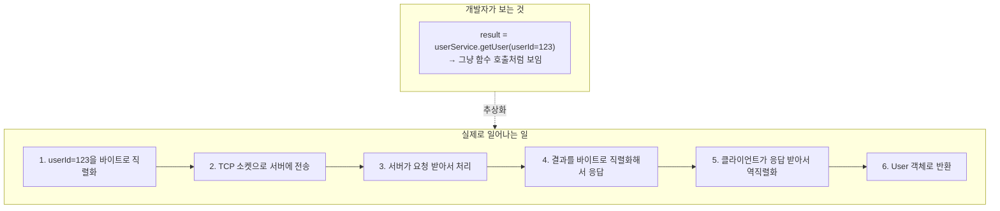
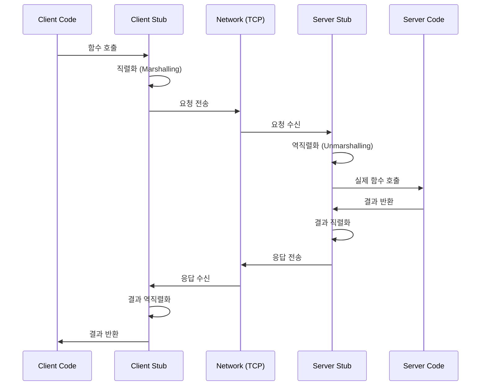
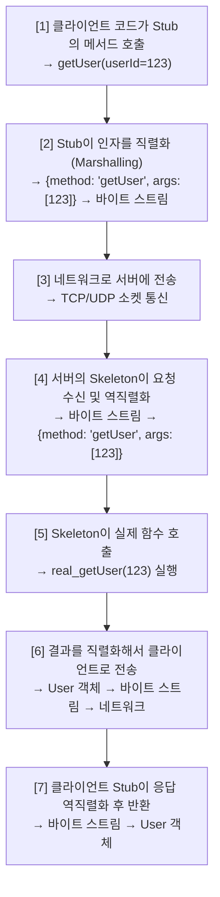
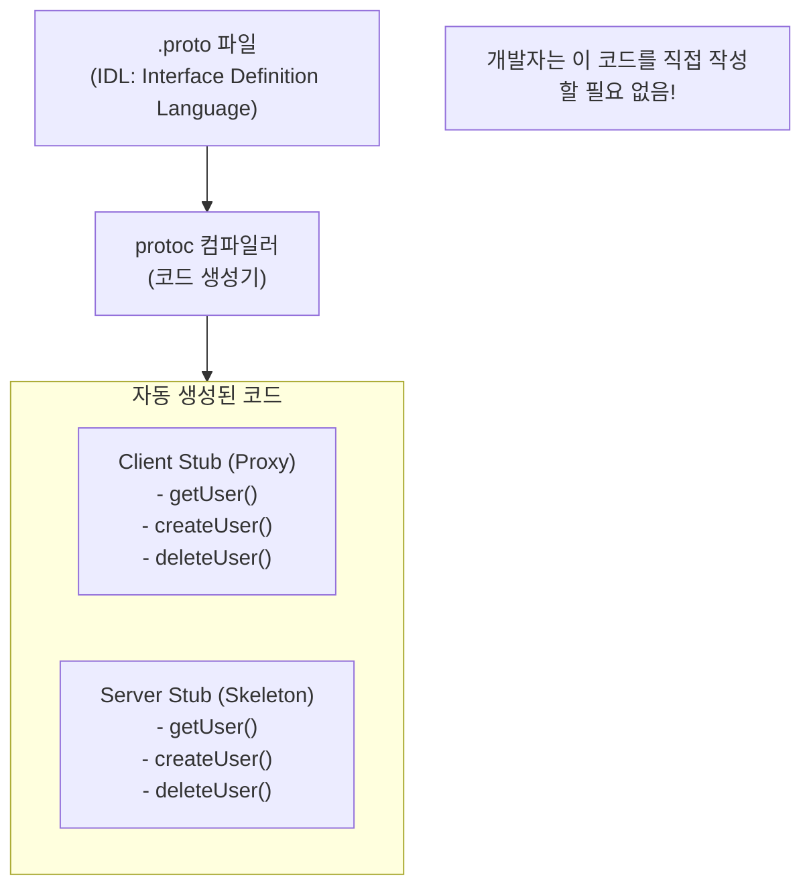
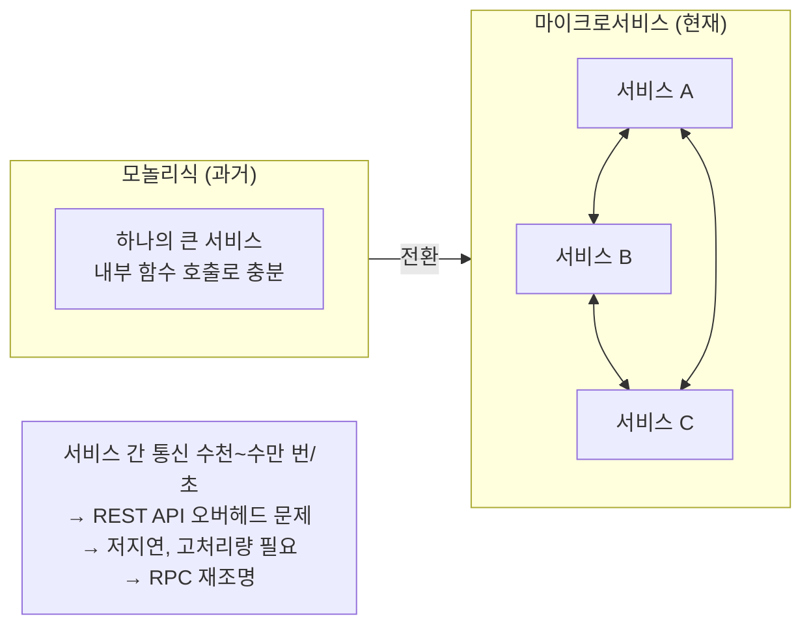
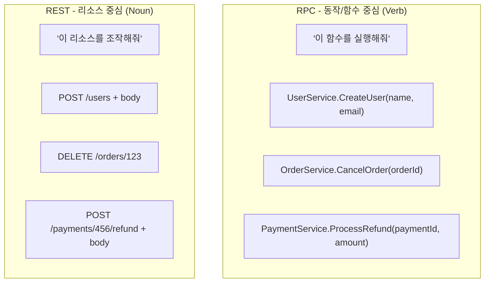
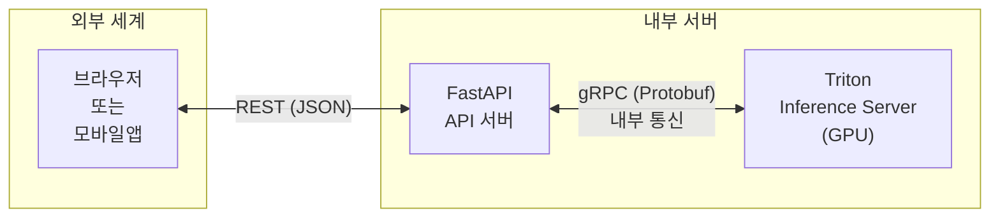

> **📚 gRPC 시리즈 - Part 1. 기반 기술**
>
> 1. RPC(Remote Procedure Call) 개념 ← 현재 글
> 2. [IDL과 직렬화/역직렬화](/posts/idl-serialization/)
> 3. [Protocol Buffers (Protobuf)](/posts/protobuf/)
> 4. [HTTP/2 프로토콜](/posts/http2/)

---

## 왜 RPC를 먼저 알아야 하는가?

gRPC의 'RPC'가 뭔지 모르면 시작 자체가 안 된다.

- "gRPC가 REST보다 빠르다는데, 왜?"
- "Triton Inference Server가 gRPC를 지원한다는데, 그게 뭐가 좋은 거지?"
- "마이크로서비스에서 gRPC를 쓴다는데, REST랑 뭐가 다르지?"

이 질문들에 답하려면 **RPC라는 패러다임 자체**를 이해해야 한다.

---

## RPC란 무엇인가

### 한 줄 정의

RPC는 **원격 프로시저 호출**이다. 쉽게 말해, **다른 컴퓨터에 있는 함수를 마치 내 컴퓨터의 함수처럼 호출**하는 것이다.

### 로컬 호출 vs 원격 호출

```python
# 로컬 함수 호출 (같은 프로세스 내)
def calculate_sum(a, b):
    return a + b

result = calculate_sum(1, 2)  # 그냥 호출하면 됨
print(result)  # 3

# RPC 호출 (네트워크 너머 다른 서버에서 실행)
# 코드는 거의 동일하게 생김!
result = remote_server.calculate_sum(1, 2)
print(result)  # 3
```

개발자 입장에서는 네트워크 통신의 복잡한 부분을 신경 쓰지 않고, 그냥 **함수 호출하듯이** 원격 서비스를 사용할 수 있다.

---

## RPC의 핵심 아이디어

### "네트워크를 숨긴다"



---

## RPC의 동작 원리

### 전체 흐름



### 핵심 구성 요소

| 구성 요소 | 위치 | 역할 |
| --- | --- | --- |
| **Stub (Client Proxy)** | 클라이언트 | 원격 호출을 로컬 호출처럼 보이게 해주는 대리자 |
| **Skeleton (Server Stub)** | 서버 | 네트워크 요청을 받아 실제 함수를 호출 |
| **Marshalling (직렬화)** | 양쪽 | 데이터를 네트워크 전송 가능한 형태로 변환 |
| **Unmarshalling (역직렬화)** | 양쪽 | 받은 데이터를 원래 형태로 복원 |

### 단계별 상세 설명



---

## Stub이란 무엇인가

### Stub의 역할

```python
# Stub이 없다면? 개발자가 직접 다 해야 함
import socket
import json

def get_user_manual(user_id):
    # 1. 소켓 연결
    sock = socket.socket(socket.AF_INET, socket.SOCK_STREAM)
    sock.connect(('server.example.com', 8080))

    # 2. 요청 데이터 직렬화
    request = json.dumps({
        'method': 'getUser',
        'args': [user_id]
    }).encode('utf-8')

    # 3. 전송
    sock.sendall(request)

    # 4. 응답 수신
    response = sock.recv(4096)

    # 5. 역직렬화
    result = json.loads(response.decode('utf-8'))

    # 6. 연결 종료
    sock.close()

    return result

# 매번 이렇게 해야 함... 끔찍!
user = get_user_manual(123)

# Stub이 있다면? 깔끔!
# Stub이 위의 모든 과정을 대신 처리
user = user_service_stub.getUser(123)
```

### Stub 코드는 어디서 오는가?



**핵심 포인트:**

- Stub 코드는 **IDL에서 자동 생성**됨
- 개발자는 비즈니스 로직에만 집중
- 네트워크 통신 코드를 직접 작성할 필요 없음

---

## RPC의 역사

### 시대별 발전

| 시대 | 기술 | 특징 | 한계 |
| --- | --- | --- | --- |
| **1980년대** | Sun RPC, DCE/RPC | 초기 분산 시스템, 바이너리 | 언어/플랫폼 종속적 |
| **1990년대** | CORBA, DCOM | 객체 지향 RPC | 복잡한 설정, 무거움 |
| **2000년대 초** | XML-RPC, SOAP | XML 기반, 표준화 | 무겁고 느림 |
| **2000년대 중반** | REST API | HTTP 기반, 단순함 | RPC가 아님 (스타일이 다름) |
| **2010년대** | gRPC, Thrift | 고성능 바이너리 RPC | 브라우저 지원 제한 |

### 왜 RPC가 다시 주목받는가?



---

## RPC vs REST: 철학의 차이

### 근본적인 설계 사상



### 같은 기능, 다른 표현

```python
# 사용자 생성

# REST 방식
import requests
response = requests.post(
    "https://api.example.com/users",
    json={"name": "Kim", "email": "kim@example.com"}
)
user = response.json()

# RPC 방식 (개념적)
user = user_service.CreateUser(name="Kim", email="kim@example.com")

# 복잡한 비즈니스 로직
# "유저의 장바구니에서 특정 상품을 다른 상품으로 교체"

# REST 방식 - 어떻게 표현하지?
response = requests.post(
    "https://api.example.com/users/123/cart/items/456/replace",
    json={"new_item_id": 789}
)
# → URL 설계가 애매함, 동사를 쓸 수밖에 없음

# RPC 방식 - 명확함
result = cart_service.ReplaceItem(
    user_id=123,
    old_item_id=456,
    new_item_id=789
)
```

### 비교 정리

| 관점 | RPC | REST |
| --- | --- | --- |
| **중심 개념** | 동작/함수 (Verb) | 리소스 (Noun) |
| **호출 방식** | `CreateUser(name, email)` | `POST /users` + body |
| **설계 사상** | "이 함수를 실행해줘" | "이 리소스를 조작해줘" |
| **인터페이스** | 함수 시그니처 (명시적) | HTTP 메서드 + URL (암묵적) |
| **결합도** | 클라이언트-서버 강결합 | 상대적으로 느슨한 결합 |
| **문서화** | IDL 자체가 문서 | OpenAPI/Swagger 별도 작성 |
| **적합한 경우** | 내부 서비스 간 통신 | 외부 공개 API |

---

## RPC의 장단점

### 장점

| 분류 | 설명 |
| --- | --- |
| **개발 생산성** | 함수 호출처럼 직관적, 네트워크 코드 작성 불필요, IDE 자동완성 지원 |
| **타입 안전성** | 컴파일 타임에 타입 체크, 런타임 에러 감소, 리팩토링 용이 |
| **성능** | 바이너리 직렬화 (작은 페이로드), 효율적인 네트워크 사용, 낮은 지연시간 |
| **코드 생성** | 서버/클라이언트 코드 자동 생성, 여러 언어 지원, 일관된 인터페이스 |

### 단점

| 분류 | 설명 |
| --- | --- |
| **강한 결합** | 클라이언트가 서버의 함수 시그니처에 의존, 인터페이스 변경 시 양쪽 수정 필요, 버전 관리가 중요 |
| **디버깅 어려움** | 바이너리 포맷은 사람이 읽기 어려움, curl로 간단히 테스트 불가, 별도 도구 필요 (grpcurl 등) |
| **브라우저 지원 제한** | HTTP/2 + 바이너리 특성상 브라우저에서 직접 호출 어려움, gRPC-Web 같은 프록시 필요 |
| **학습 곡선** | IDL 문법 학습 필요, 코드 생성 도구 이해 필요, REST 대비 초기 설정이 복잡 |

---

## 실제 사용 예시

### gRPC가 사용되는 곳

| 분야 | 사용 예시 | 이유 |
| --- | --- | --- |
| **ML 서빙** | Triton, TF Serving, KServe | 저지연 추론 요청 처리 |
| **마이크로서비스** | 쿠팡, 당근, 카카오 내부 통신 | 서비스 간 고성능 통신 |
| **모바일 백엔드** | 대용량 앱 서버 | 적은 데이터 전송, 배터리 절약 |
| **실시간 시스템** | 게임 서버, 금융 시스템 | 양방향 스트리밍, 낮은 레이턴시 |

### MLOps에서의 RPC



---

## 핵심 정리

### RPC란?

- **원격 함수 호출**을 로컬 함수 호출처럼 사용하는 패러다임
- 네트워크 복잡성을 **Stub이 추상화**
- 개발자는 비즈니스 로직에만 집중

### 핵심 구성 요소

| 요소 | 역할 |
| --- | --- |
| **Stub** | 클라이언트 측 프록시, 원격 호출을 로컬처럼 보이게 함 |
| **Skeleton** | 서버 측 스텁, 요청을 실제 함수로 연결 |
| **직렬화** | 데이터를 네트워크 전송 형태로 변환 |
| **IDL** | 서비스 인터페이스 정의, 코드 자동 생성의 기반 |

### RPC vs REST

| RPC | REST |
| --- | --- |
| 함수 중심 (Verb) | 리소스 중심 (Noun) |
| 타입 안전, 고성능 | 범용성, 접근성 |
| 내부 서비스 통신에 적합 | 외부 API에 적합 |
